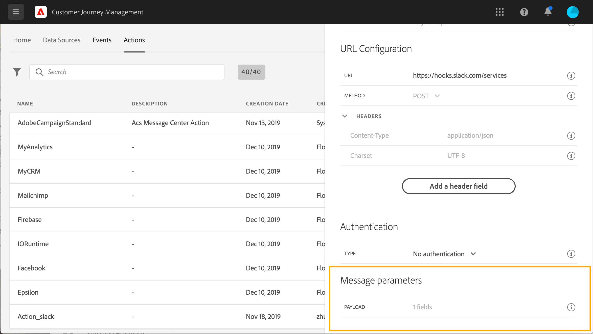

# Configurare un’azione {#configure-an-action}

Se utilizzi un sistema di terze parti per l’invio di messaggi o se desideri che i percorsi inviino chiamate API a un sistema di terze parti, puoi configurare la relativa connessione ai percorsi in questo punto. L’azione personalizzata definita dagli utenti tecnici sarà quindi disponibile nella palette a sinistra del percorso, nella categoria **[!UICONTROL Action]** (consulta [questa pagina](../building-journeys/about-journey-activities.md#action-activities). Di seguito sono riportati alcuni esempi di sistemi a cui è possibile connettersi con azioni personalizzate: Epsilon, Facebook, Adobe.io, Firebase, ecc.

Le limitazioni sono elencate in [questa pagina](../limitations.md).

Puoi passare le raccolte in modo dinamico utilizzando azioni personalizzate. Fai riferimento a questo [caso d&#39;uso](../limitations.md).

Di seguito sono riportati i passaggi principali necessari per configurare un’azione personalizzata:

1. Nella sezione del menu AMMINISTRAZIONE, selezionare **[!UICONTROL Configurations]**. Nella sezione **[!UICONTROL Actions]**, fai clic su **[!UICONTROL Manage]**. Fai clic su **[!UICONTROL Create Action]** per creare una nuova azione. Il riquadro di configurazione delle azioni si apre sul lato destro dello schermo.

   

1. Immetti un nome per l’azione.

   >[!NOTE]
   >
   >Non utilizzare spazi o caratteri speciali. Non usare più di 30 caratteri.

1. Aggiungi una descrizione all’azione. Questo passaggio è facoltativo.
1. Il numero di percorsi che utilizzano questa azione viene visualizzato nel campo **[!UICONTROL Used in]** . Fai clic sul pulsante **[!UICONTROL View journeys]** per visualizzare l’elenco dei percorsi che utilizzano questa azione.
1. Definisci i diversi parametri **[!UICONTROL URL Configuration]**. Consulta [questa pagina](../action/about-custom-action-configuration.md#url-configuration).
1. Configura la sezione **[!UICONTROL Authentication]** . Questa configurazione è la stessa delle origini dati.  Vedi [questa sezione](../datasource/external-data-sources.md#section_wjp_nl5_nhb).
1. Definisci il **[!UICONTROL Action parameters]**. Consulta [questa pagina](../action/about-custom-action-configuration.md#define-the-message-parameters).
1. Fai clic su **[!UICONTROL Save]**.

   L’azione personalizzata è ora configurata ed è pronta per essere utilizzata nei percorsi. Consulta [questa pagina](../building-journeys/about-journey-activities.md#action-activities).

   >[!NOTE]
   >
   >Quando un&#39;azione personalizzata viene utilizzata in un percorso, la maggior parte dei parametri è di sola lettura. È possibile modificare solo i campi **[!UICONTROL Name]**, **[!UICONTROL Description]**, **[!UICONTROL URL]** e la sezione **[!UICONTROL Authentication]**.

## Configurazione URL {#url-configuration}

Quando configuri un’azione personalizzata, devi definire i seguenti parametri **[!UICONTROL URL Configuration]**:

1. Nel campo **[!UICONTROL URL]** , specifica l’URL del servizio esterno:

   * Se l’URL è statico, immetti l’URL in questo campo.

   * Se l’URL include un percorso dinamico, immetti solo la parte statica dell’URL, ovvero lo schema, l’host, la porta e, facoltativamente, una parte statica del percorso.

      Esempio: `https://xxx.yyy.com/somethingstatic/`

      Quando aggiungi l’azione personalizzata a un percorso, specificerai il percorso dinamico dell’URL. [Ulteriori informazioni](../building-journeys/using-custom-actions.md).
   >[!NOTE]
   >
   >Per motivi di sicurezza, si consiglia vivamente di utilizzare lo schema HTTPS per l’URL. Non consentiamo l’uso di indirizzi di Adobe che non sono pubblici e l’uso di indirizzi IP.
   >
   >Quando definisci un’azione personalizzata sono consentite solo le porte predefinite: 80 per http e 443 per https.

1. Seleziona la chiamata **[!UICONTROL Method]**: può essere **[!UICONTROL POST]** o **[!UICONTROL PUT]**.
1. Nella sezione **[!UICONTROL Headers]** , definisci le intestazioni HTTP del messaggio di richiesta da inviare al servizio esterno:
   1. Per aggiungere un campo di intestazione, fare clic su **[!UICONTROL Add a header field]**.
   1. Immetti la chiave del campo intestazione.
   1. Per impostare un valore dinamico per la coppia chiave-valore, selezionare **[!UICONTROL Variable]**. In caso contrario, selezionare **[!UICONTROL Constant]**.

      Ad esempio, per una marca temporale, è possibile impostare un valore dinamico.

   1. Se hai selezionato **[!UICONTROL Constant]**, immetti il valore costante.

      Se hai selezionato **[!UICONTROL Variable]**, specificerai questa variabile quando aggiungi l’azione personalizzata a un percorso. [Ulteriori informazioni](../building-journeys/using-custom-actions.md).

      

   1. Per eliminare un campo di intestazione, puntare al campo di intestazione e fare clic sull&#39;icona **[!UICONTROL Delete]**.
   I campi di intestazione **[!UICONTROL Content-Type]** e **[!UICONTROL Charset]** sono impostati per impostazione predefinita. Non è possibile modificare o eliminare questi campi.

   Dopo aver aggiunto l’azione personalizzata a un percorso, puoi comunque aggiungergli dei campi di intestazione se il percorso è in stato di bozza. Se non desideri che le modifiche alla configurazione interessino il percorso, duplica l’azione personalizzata e aggiungi i campi di intestazione alla nuova azione personalizzata.

   >[!NOTE]
   >
   >Le intestazioni vengono convalidate in base alle regole di analisi dei campi. [Ulteriori informazioni](https://tools.ietf.org/html/rfc7230#section-3.2.4).

## Definire i parametri dell’azione {#define-the-message-parameters}

Nella sezione **[!UICONTROL Action parameters]** , incolla un esempio del payload JSON da inviare al servizio esterno.

>[!NOTE]
>
>I nomi di campo nel payload non possono contenere un &quot;.&quot; aggiuntivo. Non possono iniziare con un carattere &quot;$&quot;.

Puoi definire il tipo di parametro (ad esempio: (stringa, numero intero, ecc.).

Puoi anche scegliere se specificare se un parametro è una costante o una variabile:

* Costante significa che il valore del parametro è definito nel riquadro di configurazione dell&#39;azione da un utente tecnico. Il valore sarà sempre lo stesso in tutti i percorsi. Non varia e l’addetto al marketing non lo vedrà quando utilizza l’azione personalizzata nel percorso. Potrebbe trattarsi, ad esempio, di un ID previsto dal sistema di terze parti. In tal caso, il valore passato è rappresentato dal campo a destra della costante/variabile di attivazione/disattivazione.
* Variabile indica che il valore del parametro varia. Gli addetti al marketing che utilizzano questa azione personalizzata in un percorso potranno passare il valore desiderato o specificare dove recuperare il valore per questo parametro (ad esempio dall’evento, da Adobe Experience Platform, ecc.). In tal caso, il campo a destra della costante/variabile di attivazione è l’etichetta che gli addetti al marketing vedranno nel percorso per denominare questo parametro.

