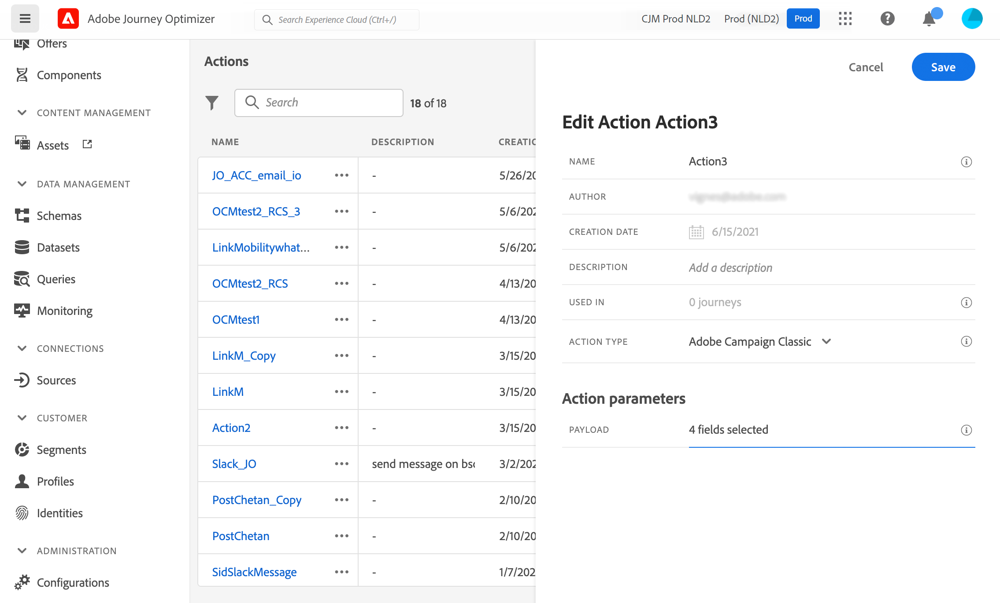

# Integrare con Adobe Campaign v7/v8 {#integrating-with-adobe-campaign-v7-v8}

>[!BEGINSHADEBOX]

**In questa pagina:** Connetti Journey Optimizer ad Adobe Campaign v7 o v8 in modo che i tuoi percorsi possano inviare e-mail, notifiche push e SMS tramite la messaggistica transazionale di Campaign.

>[!ENDSHADEBOX]

>[!CONTEXTUALHELP]
>id="ajo_journey_action_acc"
>title="Azioni Adobe Campaign v7/v8"
>abstract="Questa integrazione è disponibile per Adobe Campaign v7 e v8. Consente di inviare e-mail, notifiche push e SMS utilizzando le funzionalità di messaggistica transazionale di Adobe Campaign. La connessione tra le istanze di Journey Optimizer e Campaign viene impostata da Adobe al momento del provisioning."

Se disponi di Adobe Campaign Classic v7 o Campaign v8, nei tuoi percorsi è disponibile un’azione personalizzata specifica per integrare Adobe Journey Optimizer e Adobe Campaign. Questa integrazione ti consente di inviare e-mail, notifiche push e SMS utilizzando le funzionalità di messaggistica transazionale di Adobe Campaign. Ulteriori informazioni in questo [caso d&#39;uso end-to-end](../building-journeys/ajo-ac.md).

Per ogni azione configurata, è disponibile un&#39;attività [Azione campagna](../building-journeys/using-adobe-campaign-v7-v8.md) nella tavolozza di Progettazione percorsi.

## Activation {#access}

Quando richiesto, la connessione tra gli ambienti Journey Optimizer e Adobe Campaign viene impostata da Adobe al momento del provisioning. Se non hai richiesto la connessione al momento del provisioning, contatta il supporto Adobe Journey Optimizer per richiedere l’attivazione. È necessario fornire i seguenti dettagli:

>[!BEGINTABS]

>[!TAB Per Adobe Journey Optimizer]

* ID organizzazione (Adobe OrgID)
* Nome sandbox

>[!TAB Per Adobe Campaign]

* URL del server Campaign
* URL server in tempo reale
* Versione di Adobe Campaign

>[!ENDTABS]


## Guardrail e limitazioni {#important-notes}

* Non esiste alcuna limitazione dei messaggi. Il sistema limita a 4.000 il numero di messaggi che possono essere inviati in 5 minuti, in base al SLA di Campaign corrente. Per questo motivo, Journey Optimizer deve essere utilizzato solo in casi di utilizzo unitari (eventi singoli, non tipi di pubblico).

* Devi configurare un’azione nell’area di lavoro per modello da utilizzare. Devi configurare un’azione in Journey Optimizer per ogni modello da utilizzare da Adobe Campaign.

* Per questa integrazione è consigliabile utilizzare un’istanza dedicata del Centro messaggi ospitata o Managed Services, per evitare di influenzare eventuali altre operazioni di Campaign in corso. Il server di marketing può essere ospitato o on-premise.<!--The build required is 21.1 Release Candidate or greater. -->

* Non esiste alcuna convalida che dimostri che il payload o il messaggio di Campaign sono corretti.

* Non è possibile utilizzare un’azione Campaign con un evento di qualificazione del pubblico.

## Prerequisiti {#prerequisites}

In Adobe Campaign, devi creare e pubblicare un messaggio transazionale e il relativo evento associato. Consulta la [documentazione di Adobe Campaign](https://experienceleague.adobe.com/en/docs/campaign/campaign-v8/send/real-time/transactional){target="_blank"}.

Puoi creare il payload JSON corrispondente a ciascun messaggio seguendo il pattern indicato di seguito. Incolla quindi questo payload durante la configurazione dell’azione in Journey Optimizer (vedi di seguito).

+++ Esempio

```json
{
    "channel": "email",
    "eventType": "welcome",
    "email": "Email address",
    "ctx": {
        "firstName": "First name"
    }
}
```

* **channel**: il canale definito per il modello transazionale di Campaign
* **eventType**: nome interno dell&#39;evento Campaign
* **ctx**: variabile basata sulla personalizzazione disponibile nel messaggio

+++

## Configurare l’azione {#configure-action}

In Journey Optimizer, devi configurare un’azione per messaggio transazionale.

Per creare un’azione Campaign, effettua le seguenti operazioni:

1. Crea una nuova azione. [Scopri come creare azioni personalizzate](../action/action.md).
1. Immettere un nome e una descrizione.
1. Nel campo **[!UICONTROL Tipo azione]**, selezionare **[!UICONTROL Adobe Campaign Classic]**.
   
1. Fai clic nel campo **[!UICONTROL Payload]** e incolla un esempio del payload JSON corrispondente al messaggio di Campaign. Contatta Adobe per ottenere questo payload.
1. Impostare ogni campo come statico o variabile a seconda che si desideri mapparlo nell&#39;area di lavoro del Percorso. Ad esempio, campi come i parametri del canale e-mail e i campi di personalizzazione (`ctx`) devono in genere essere impostati come variabili in modo che possano adattarsi dinamicamente all&#39;interno del percorso.
1. Fai clic su **[!UICONTROL Salva]**.

## Aggiorna un&#39;azione esistente {#update-action}

Se devi aggiornare un’azione personalizzata esistente per Campaign v7/v8, ad esempio quando l’endpoint in tempo reale (RT) cambia dopo la configurazione iniziale, procedi come segue:

1. Dal menu **[!UICONTROL Amministrazione]**, seleziona **[!UICONTROL Configurazioni]**, quindi passa a **[!UICONTROL Azioni]**.
1. Individua e seleziona l’azione Campaign da aggiornare dall’elenco delle azioni.
1. Fai clic su **[!UICONTROL Modifica]** per aprire la configurazione dell&#39;azione.
1. Aggiorna il campo **[!UICONTROL URL]** con il nuovo URL endpoint RT. Assicurati che il formato dell’endpoint sia corretto e raggiungibile.
1. Se necessario, aggiorna la configurazione del **[!UICONTROL Payload]** in modo che corrisponda a eventuali modifiche nella struttura dei messaggi transazionali di Campaign.
1. Fai clic su **[!UICONTROL Test]** per convalidare la connessione al nuovo endpoint. Prima di procedere, verifica che il test restituisca una risposta corretta.
1. Una volta convalidate, fai clic su **[!UICONTROL Salva]** per applicare le modifiche.

>[!NOTE]
>
>Tutti i percorsi che utilizzano questa azione utilizzeranno automaticamente la configurazione aggiornata. Se disponi di percorsi live che utilizzano questa azione, monitorali attentamente dopo l’aggiornamento dell’endpoint per garantire la consegna corretta dei messaggi.

