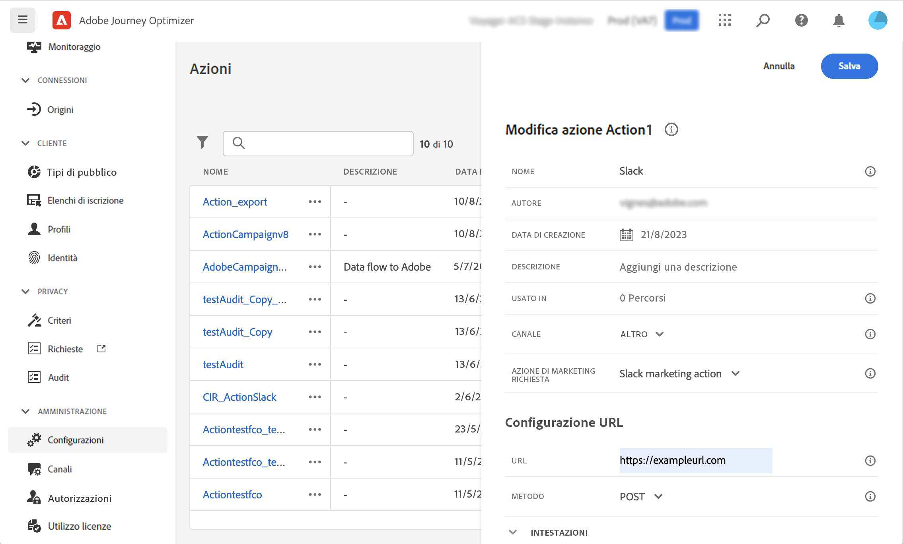

# Governance dei dati {#restrict-fields}

>[!IMPORTANT]
>
>L’utilizzo dell’etichettatura e l’applicazione dell’utilizzo dati (DULE) è attualmente limitato a clienti selezionati e verrà implementato in tutti gli ambienti in una versione futura.

Con il framework di governance per l’etichettatura e l’applicazione dell’utilizzo dati (DULE), Journey Optimizer ora può sfruttare i criteri di governance di Adobe Experience Platform per impedire che campi sensibili vengano esportati in sistemi di terze parti tramite azioni personalizzate. Se il sistema identifica un campo con restrizioni nei parametri delle azioni personalizzate, viene visualizzato un errore che impedisce la pubblicazione del percorso.

Adobe Experience Platform consente di etichettare i campi e creare azioni di marketing per ogni canale. Puoi quindi definire un criterio di governance collegato a un’etichetta e a un’azione di marketing.

In Journey Optimizer, puoi applicare questi criteri alle azioni personalizzate per impedire l’esportazione di campi specifici in sistemi di terze parti.

Per ulteriori informazioni sul framework per la governance dei dati e su come utilizzare etichette e criteri, consulta la documentazione di Adobe Experience Platform:

* [Panoramica del servizio di governance dei dati](https://experienceleague.adobe.com/docs/experience-platform/data-governance/home.html?lang=it)
* [Panoramica delle etichette di utilizzo dei dati](https://experienceleague.adobe.com/docs/experience-platform/data-governance/labels/overview.html)
* [Criteri di utilizzo dei dati](https://experienceleague.adobe.com/docs/experience-platform/data-governance/policies/overview.html?lang=it)

## Note importanti {#important-notes}

* La governance dei dati si applica solo alle azioni personalizzate nei percorsi. Le azioni di Campaign Classic e Campaign Standard non sono supportate.
* I criteri di governance si applicano solo quando un’azione di marketing (obbligatoria o aggiuntiva) è impostata a livello di azione personalizzata.

## Definire i criteri di governance {#governance-policies}

Puoi utilizzare etichette, azioni di marketing e criteri esistenti. Di seguito sono riportati i passaggi di configurazione principali per crearne di nuovi:

* Aggiungi un’etichetta e applicala ai campi che non desideri esportare in sistemi di terze parti, ad esempio il gruppo sanguigno di una persona.
* Definisci un’azione di marketing per ogni azione personalizzata di terze parti utilizzata nei tuoi percorsi.
* Crea un criterio di governance e associalo all’etichetta e all’azione di marketing.

Per ulteriori informazioni su come gestire i criteri, consulta questa [documentazione](https://experienceleague.adobe.com/docs/experience-platform/data-governance/policies/user-guide.html?lang=it#consent-policy)

Supponiamo ad esempio che vuoi etichettare il campo del gruppo sanguigno come dati sensibili per impedirne l’esportazione verso terze parti. Di seguito sono riportati i passaggi da eseguire:

1. Nel menu a sinistra, nella sezione **Privacy**, fai clic su **Criteri**.
1. Seleziona la scheda **Etichette** e fai clic su **Crea etichetta**.
   
1. Definisci un nome e un nome descrittivo per questa etichetta. Ad esempio: _ePHI1_.
1. Nel menu a sinistra, nella sezione **Gestione dati**, fai clic su **Schemi**, quindi fai clic sul pulsante **Applica etichette di accesso e governance dei dati**. Seleziona lo schema e il campo (gruppo sanguigno) e seleziona l’etichetta appena creata (nel nostro esempio: _ePHI1_).
   
1. Torna al menu **Criteri**, seleziona la scheda **Azione di marketing** e fai clic su **Crea azione di marketing**. È consigliabile creare un’azione di marketing per ogni azione personalizzata di terze parti utilizzata nei percorsi. Ad esempio, creiamo un’_Azione di marketing Slack_ che verrà utilizzata per l’azione personalizzata Slack.
   
1. Seleziona la scheda **Sfoglia**, fai clic su **Crea criterio** e seleziona **Criteri di governance dei dati**. Seleziona la tua etichetta (_ePHI1_) e azione di marketing (_Azione di marketing Slack_).
   

Quando, in un percorso, utilizzerai l’azione personalizzata Slack configurata con _Azione di marketing Slack_, verranno utilizzati i criteri relativi.

## Configurare l’azione personalizzata {#consent-custom-action}

Nel menu a sinistra, nella sezione **Amministrazione**, fai clic su **Configurazioni** e seleziona **Azioni**. Apri l’azione personalizzata Slack. Durante la configurazione di un’azione personalizzata, è possibile utilizzare due campi per la governance dei dati.

* Il campo **Canale** consente di selezionare il canale correlato a questa azione personalizzata: **E-mail**, **SMS** oppure **Notifica push**. Il campo **Azione di marketing richiesta** verrà precompilato con l’azione di marketing predefinita per il canale selezionato. Se si seleziona **Altro**, non verrà definita alcuna azione di marketing per impostazione predefinita. Nel nostro esempio, selezioniamo il canale **Altro**.

* L’**Azione di marketing richiesta** consente di definire l’azione di marketing correlata all’azione personalizzata. Ad esempio, se utilizzi l’azione personalizzata per inviare e-mail utilizzando una terza parte, puoi selezionare **Targeting e-mail**. Nel nostro esempio, selezioniamo _Azione di marketing Slack_. I criteri di governance associati a tale azione di marketing vengono recuperati e utilizzati.

Gli altri passaggi per la configurazione di un’azione personalizzata sono descritti in [questa sezione](../action/about-custom-action-configuration.md#consent-management).

## Creare il percorso {#consent-journey}

Nel menu a sinistra, nella sezione **Gestione percorsi**, fai clic su **Percorsi**. Crea il percorso e aggiungi l’azione personalizzata.  Quando si aggiunge l’azione personalizzata in un percorso, diverse opzioni consentono di gestire la governance dei dati. Fai clic sul pulsante **Mostra campi di sola lettura** per visualizzare tutti i parametri.

Nella parte superiore dello schermo sono riportati il **Canale** e l’**Azione di marketing richiesta**, definiti durante la configurazione dell’azione personalizzata. Non è possibile modificare questi campi.

Puoi definire un’**Azione di marketing aggiuntiva** per impostare il tipo di azione personalizzata. Questo consente di definire lo scopo dell’azione personalizzata in questo percorso. Oltre all’azione di marketing richiesta, solitamente specifica per un canale, puoi definire un’azione di marketing aggiuntiva specifica per l’azione personalizzata in questo particolare percorso. Ad esempio: una comunicazione di allenamento, una newsletter, una comunicazione fitness, ecc. Verranno applicate sia l’azione di marketing richiesta che quella aggiuntiva.

Nel nostro esempio, non utilizziamo un’azione di marketing aggiuntiva.

Se uno dei campi etichettati _ePHI1_ (il campo del tipo di sangue nel nostro esempio) viene rilevato nei parametri delle azioni, viene visualizzato un errore che impedisce la pubblicazione del percorso.

Gli altri passaggi per configurare un’azione personalizzata in un percorso sono descritti in [questa sezione](../building-journeys/using-custom-actions.md).
