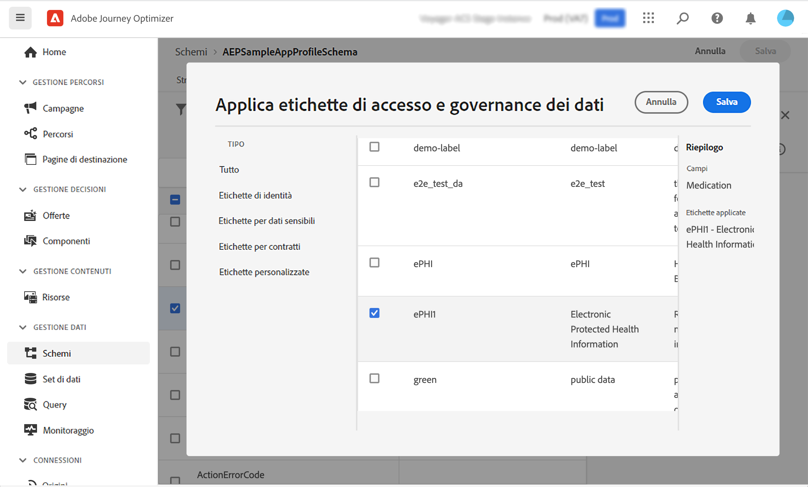
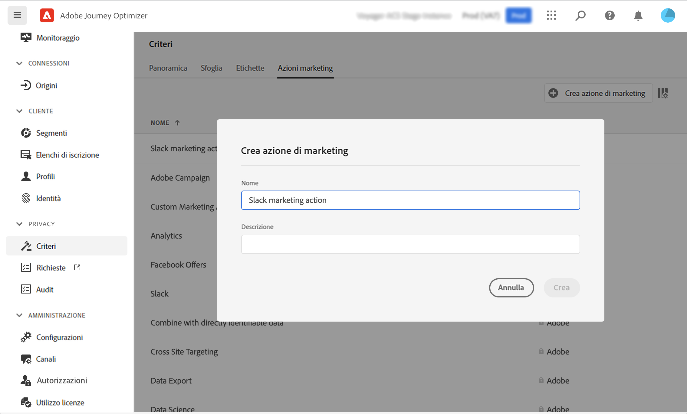
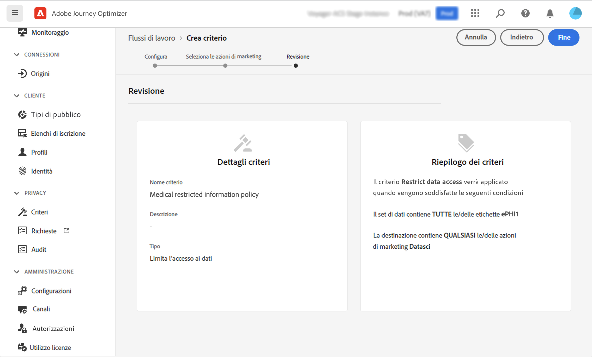
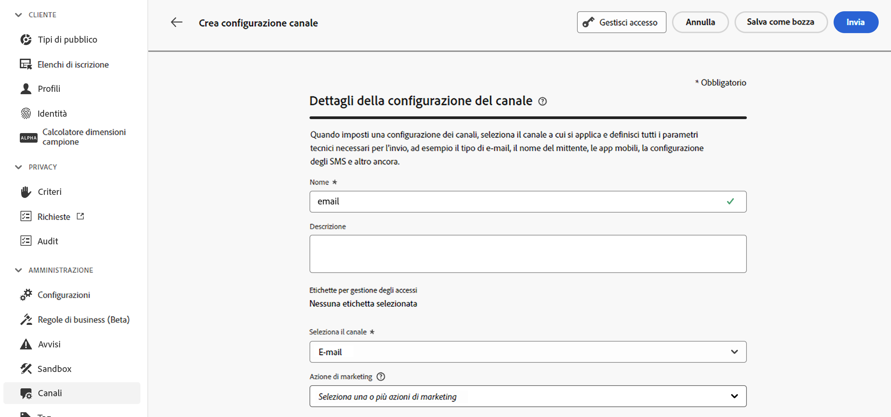
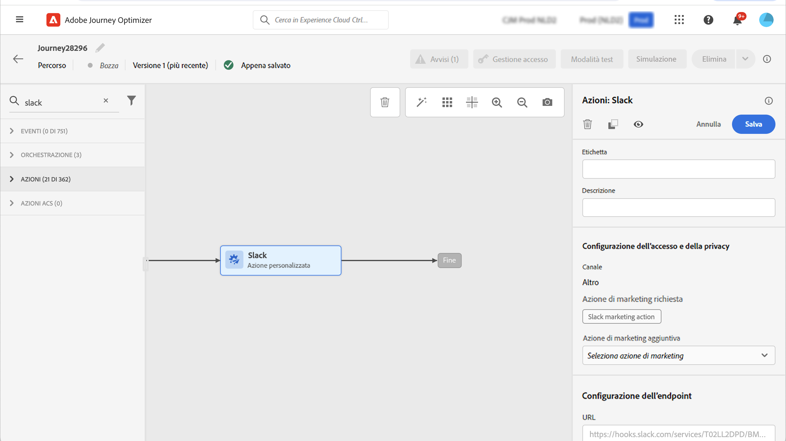
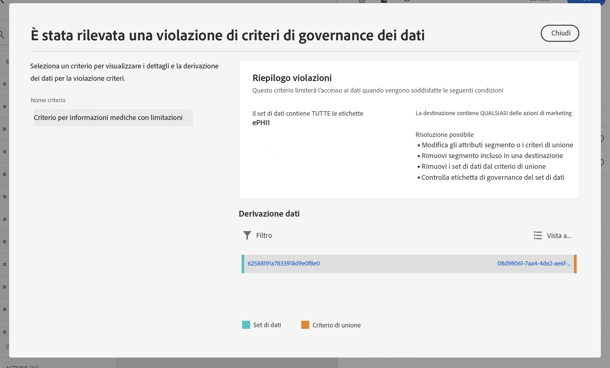

# Governance dei dati {#restrict-fields}

>[!CONTEXTUALHELP]
>id="ajo_data_governance_policy_violation"
>title="Violazione dei criteri di governance dei dati"
>abstract="Se viene identificato un campo con restrizioni in un percorso o in una campagna oppure un’azione personalizzata, viene visualizzato un errore che impedisce la pubblicazione del campo. Utilizza il diagramma di derivazione dati in questa finestra di dialogo per capire quali altre modifiche alla configurazione devono essere apportate prima di poter attivare il percorso o la campagna."

## Introduzione ai criteri di governance dei dati {#gs}

Grazie al relativo framework di [governance per l’etichettatura e l’applicazione dell’utilizzo dati (DULE)](https://experienceleague.adobe.com/docs/experience-platform/data-governance/home.html?lang=it){target="_blank"}, Adobe Experience Platform consente di gestire e applicare i criteri di governance dei dati ai canali, **etichettando i campi** e creando **azioni di marketing** per ogni canale.

Una volta definite le etichette e le azioni di marketing, puoi creare **criteri di governance dei dati** che collegano questi due elementi. Ad esempio, puoi impostare un criterio che associa un’etichetta “ePHI” a un’azione di marketing “targeting e-mail”, garantendo che i campi etichettati come “ePHI” non vengano utilizzati per personalizzare i messaggi e-mail. [Scopri come creare i criteri di governance dei dati](#policy)

Dopo aver creato i criteri di governance, puoi applicare le azioni di marketing ai relativi percorsi/campagne e le azioni personalizzate dei percorsi.
[Scopri come applicare le azioni di marketing in Journey Optimizer](#apply-marketing-actions)

Durante la creazione di un percorso o di una campagna, dopo aver selezionato una configurazione dei canali o aggiunto un’azione personalizzata, il sistema verifica se l’azione di marketing nella configurazione del canale del messaggio o l’azione personalizzata fa parte di un criterio di governance dei dati. In tal caso, il sistema controlla se eventuali campi del pubblico target o della personalizzazione del messaggio sono etichettati e limitati dal criterio. Se viene rilevata tale etichetta, la pubblicazione del percorso o della campagna viene bloccata. [Scopri come rilevare la violazione dei criteri di governance dei dati](#violation)

## Creare etichette e azioni di marketing{#labels-marketing-actions}

Il primo passaggio per applicare i criteri di governance dei dati consiste nel creare un’etichetta e allegarla ai campi per i quali si desidera limitare l’utilizzo e alle azioni di marketing per ciascuno dei canali.

1. Nel menu a sinistra, nella sezione **Privacy**, fai clic su **Criteri**.

1. Seleziona la scheda **Etichette** e fai clic su **Crea etichetta**.

1. Definisci un nome e un nome descrittivo per l’etichetta. Ad esempio: _ePHI1_.

1. Nel menu a sinistra, nella sezione **Gestione dati**, fai clic su **Schemi**, quindi fai clic sul pulsante **Applica etichette di accesso e governance dei dati**. Seleziona lo schema e il campo (per esempio, “gruppo sanguigno”) e seleziona l’etichetta creata in precedenza, nel nostro esempio, _ePHI1_.

   

1. Torna al menu **Criteri**, seleziona la scheda **Azione di marketing** e fai clic su **Crea azione di marketing**. È consigliabile creare un’azione di marketing per ogni canale e per ogni azione personalizzata di terze parti utilizzata nei percorsi. Ad esempio, creiamo un’_Azione di marketing Slack_ che verrà utilizzata per l’azione personalizzata Slack.

   

## Creare criteri di governance dei dati {#policy}

Ora che le etichette e le azioni di marketing sono state create, puoi collegarle insieme nei criteri di governance dei dati. Per farlo, seleziona la scheda **Sfoglia**, fai clic su **Crea criterio** e seleziona **Criteri di governance dei dati**. Seleziona la tua etichetta (_ePHI1_) e azione di marketing (_Azione di marketing Slack_).

Quando, in un percorso, utilizzerai l’azione personalizzata Slack configurata con _Azione di marketing Slack_, verranno utilizzati i criteri relativi.

## Applicare azioni di marketing in Journey Optimizer{#apply-marketing-actions}

Per applicare i criteri di governance dei dati in Journey Optimizer, devi applicare azioni di marketing a percorsi, campagne o azioni personalizzate.

### Applicare azioni di marketing a percorsi e campagne{#journeys-campaigns}

Dopo aver creato i criteri di governance, devi applicare le azioni di marketing pertinenti alle **configurazioni di canale** di Journey Optimizer. Per farlo, segui questi passaggi:

1. Accedi al menu **[!UICONTROL Canali]** > **[!UICONTROL Impostazioni generali]** > **[!UICONTROL Configurazioni dei canali]**.

1. Apri una configurazione dei canali esistente o creane una nuova.

1. Nel campo **[!UICONTROL Azione di marketing]**, seleziona l’azione o le azioni di marketing da associare a percorsi/campagne utilizzando questa configurazione. Tutti i criteri di consenso e governance dei dati associati all’azione di marketing vengono utilizzati in modo che rispettino le preferenze della clientela e le restrizioni impostate per i campi sensibili. [Ulteriori informazioni](../action/consent.md#surface-marketing-actions)

   

1. Completa la configurazione dei canali e salva. [Scopri come impostare la configurazione dei canali](../configuration/channel-surfaces.md).

1. Durante la creazione di un messaggio nel percorso o nella campagna, seleziona la configurazione dei canali pertinente. Completa la configurazione del percorso o della campagna e salva.

Prima di attivare il percorso o la campagna, il sistema verifica se l’azione di marketing nella configurazione dei canali selezionata fa parte di un criterio di governance dei dati. In tal caso, il sistema controlla se eventuali campi del pubblico target o della personalizzazione del messaggio sono etichettati e limitati dal criterio.

Se viene individuato un campo con restrizioni, viene visualizzato un errore che impedisce la pubblicazione del percorso o della campagna. [Scopri come rilevare violazioni dei criteri di governance](#violation)

{zoomable="yes"}

*Passaggi di analisi delle violazioni dei criteri per percorsi e campagne*

### Applicare un’azione di marketing alle azioni personalizzate {#custom-actions}

>[!NOTE]
>
>Le azioni di percorsi di Campaign v7/v8 e Campaign Standard non sono supportati.

Prendiamo ad esempio il campo del gruppo sanguigno per il quale vuoi limitare l’esportazione a terzi, mediante azioni personalizzate. A questo scopo, devi applicare l’azione di marketing all’azione personalizzata, quindi creare il percorso e aggiungervi l’azione personalizzata.

1. Nel menu a sinistra, nella sezione **Amministrazione**, fai clic su **Configurazioni** e seleziona **Azioni**.

1. Apri l’azione personalizzata Slack. Durante la configurazione di un’azione personalizzata, è possibile utilizzare due campi per la governance dei dati.

   

   * Il campo **Canale** consente di selezionare il canale correlato a questa azione personalizzata. Il campo **Azione di marketing richiesta** verrà precompilato con l’azione di marketing predefinita per il canale selezionato. Se si seleziona **Altro**, non verrà definita alcuna azione di marketing per impostazione predefinita. Nel nostro esempio, selezioniamo il canale **Altro**.

   * L’**Azione di marketing richiesta** consente di definire l’azione di marketing correlata all’azione personalizzata. Ad esempio, se utilizzi l’azione personalizzata per inviare e-mail utilizzando una terza parte, puoi selezionare **Targeting e-mail**. Nel nostro esempio, selezioniamo _Azione di marketing Slack_. I criteri di governance associati a tale azione di marketing vengono recuperati e utilizzati.

   Gli altri passaggi per la configurazione di un’azione personalizzata sono descritti in [questa sezione](../action/about-custom-action-configuration.md#consent-management).

1. Nel menu a sinistra, nella sezione **Gestione percorsi**, fai clic su **Percorsi**.

1. Crea il percorso e aggiungi l’azione personalizzata. Quando si aggiunge l’azione personalizzata in un percorso, diverse opzioni consentono di gestire la governance dei dati. Fai clic sul pulsante **Mostra campi di sola lettura** per visualizzare tutti i parametri.

   

   * Nella parte superiore della schermata sono riportati il **Canale** e l’**Azione di marketing richiesta**, definiti durante la configurazione dell’azione personalizzata. Non è possibile modificare questi campi.

   * Puoi definire un’**Azione di marketing aggiuntiva** per impostare il tipo di azione personalizzata. Questo consente di definire lo scopo dell’azione personalizzata in questo percorso. Oltre all’azione di marketing richiesta, solitamente specifica per un canale, puoi definire un’azione di marketing aggiuntiva specifica per l’azione personalizzata in questo particolare percorso. Ad esempio: una comunicazione di allenamento, una newsletter, una comunicazione fitness, ecc. Verranno applicate sia l’azione di marketing richiesta che quella aggiuntiva. Nel nostro esempio, non utilizziamo un’azione di marketing aggiuntiva.

Se uno dei campi con etichetta _ePHI1_ (campo del tipo di sangue nel nostro esempio) viene rilevato nei parametri delle azioni, viene visualizzato un errore che impedisce la pubblicazione del percorso. [Scopri come rilevare violazioni dei criteri di governance](#violation)

{zoomable="yes"}

*Passaggi di analisi delle violazioni dei criteri per le azioni personalizzate dei percorsi*

## Rilevare violazioni dei criteri {#violation}

Se il sistema individua un campo con restrizioni in un percorso o una campagna oppure in un’azione personalizzata, viene visualizzato un errore che ne impedisce la pubblicazione.

Gli errori sono visibili dal pulsante **[!UICONTROL Avvisi]**. Seleziona l’errore per visualizzare informazioni dettagliate sulla violazione dei criteri di governance dei dati che si è verificata.

Questa finestra di dialogo indica che la configurazione del percorso o della campagna corrente viola un criterio di governance dei dati esistente. Utilizza il diagramma di derivazione dati in questa finestra di dialogo per capire quali altre modifiche alla configurazione devono essere apportate prima di poter attivare il percorso o la campagna.

Informazioni dettagliate sono disponibili nella [documentazione sulla violazione dei criteri di utilizzo dei dati](https://experienceleague.adobe.com/it/docs/experience-platform/data-governance/enforcement/auto-enforcement#data-usage-violation){_blank}.
