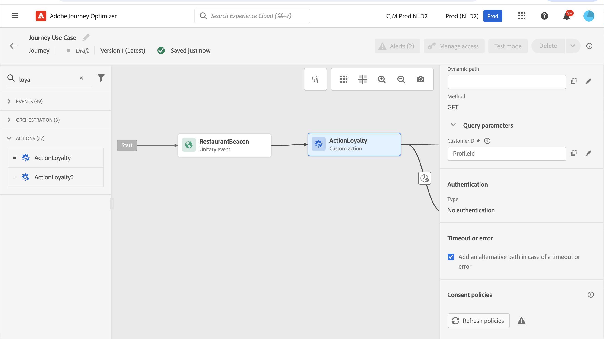

# Utilizzare le risposte alle chiamate API nelle azioni personalizzate {#custom-action-enhancements}

Puoi sfruttare le risposte alle chiamate API nelle azioni personalizzate e orchestrare i percorsi in base a tali risposte.

<!--
You can now leverage API call responses in custom actions and orchestrate your journeys based on these responses.

This capability was previously only available when using data sources. You can now use it with custom actions. 
-->

## Note importanti{#custom-action-enhancements-notes}

<!--
* Custom actions should only be used with private or internal endpoints, and used with an appropriate capping or throttling limit. See [this page](../configuration/external-systems.md). 
-->

* Gli array scalari sono supportati nel payload di risposta:

  ```
  "dummyScalarArray": [
  "val1",
  "val2"
  ]
  ```

* Gli array eterogenei non sono supportati nel payload di risposta:

  ```
  "dummyRandomArray": [
  20,
  "aafw",
  false
  ]
  ```

<!--
## Best practices{#custom-action-enhancements-best-practices}

A capping limit of 5000 calls/s is defined for all custom actions. This limit has been set based on customers usage, to protect external endpoints targeted by custom actions. You need to take this into account in your audience-based journeys by defining an appropriate reading rate (5000 profiles/s when custom actions are used). If needed, you can override this setting by defining a greater capping or throttling limit through our Capping/Throttling APIs. See [this page](../configuration/external-systems.md).

You should not target public endpoints with custom actions for various reasons:

* Without proper capping or throttling, there is a risk of sending too many calls to a public endpoint that may not support such volume.
* Profile data can be sent through custom actions, so targeting a public endpoint could lead to inadvertently sharing personal information externally.
* You have no control on the data being returned by public endpoints. If an endpoint changes its API or starts sending incorrect information, those will be made available in communications sent, with potential negative impacts.
-->

<!--
## Define the custom action {#define-custom-action}

When defining the custom action, two enhancements have been made available: the addition of the GET method and the new payload response field. The other options and parameters are unchanged. See [this page](../action/about-custom-action-configuration.md).

### Endpoint configuration {#endpoint-configuration}

The **URL configuration** section has been renamed **Endpoint configuration**.

In the **Method** drop-down, you can now select **GET**.

{width="70%" align="left"}

### Payloads {#payloads-new}

The **Action parameters** section has been renamed **Payloads**. Two fields are available:

* The **Request** field: this field is only available for POST and PUT calling methods.
* The **Response** field: this is the new capability. This field as available for all calling methods.

>[!NOTE]
> 
>Both these fields are optional.

{width="70%" align="left"}
-->

## Configurare l’azione personalizzata {#config-response}

1. Crea l’azione personalizzata. Consulta [questa pagina](../action/about-custom-action-configuration.md).

1. Fai clic all&#39;interno del campo **Risposta** (risposta di successo).

   {width="80%" align="left"}

1. Incolla un esempio del payload restituito dalla chiamata. Verifica che i tipi di campo siano corretti (stringa, numero intero, ecc.). Ecco un esempio di payload di risposta acquisito durante la chiamata. L’endpoint locale invia il numero di punti fedeltà e lo stato di un profilo.

   ```
   {
   "customerID" : "xY12hye",    
   "status":"gold",
   "points": 1290 }
   ```

   {width="80%" align="left"}

   Ogni volta che viene chiamata l’API, il sistema recupererà tutti i campi inclusi nell’esempio di payload.

1. (Facoltativo) Abilita un payload di risposta di errore per acquisire il formato restituito quando la chiamata non riesce, quindi incolla un payload di esempio. A questo scopo, seleziona **Definisci un payload di risposta all&#39;errore** nella configurazione dell&#39;azione personalizzata. Ulteriori informazioni sulla configurazione dei campi payload in [Configurare un&#39;azione personalizzata](../action/about-custom-action-configuration.md).

   ```
   {
   "errorResponse" : "customer not found"
   }
   ```

   Il payload di risposta dell’errore è disponibile solo se lo abiliti nella configurazione dell’azione personalizzata.

1. Aggiungiamo anche il customerID come parametro di query.

   {width="80%" align="left"}

1. Fai clic su **Salva**.

## Sfruttare la risposta in un percorso {#response-in-journey}

È sufficiente aggiungere l’azione personalizzata a un percorso. Puoi quindi sfruttare i campi del payload di risposta in condizioni, altre azioni e personalizzazione dei messaggi.

Se hai definito un payload di risposta di errore, questo viene esposto in **Attributi contestuali** > **Journey Orchestration** > **Azioni** > `<action name>` > **errorResponse**. Puoi utilizzarlo nel ramo di timeout ed errore per indirizzare la logica di fallback e la gestione degli errori.

Ad esempio, puoi aggiungere una condizione per verificare il numero di punti fedeltà. Quando la persona accede al ristorante, l’endpoint locale invia una chiamata con le informazioni sulla fedeltà del profilo. Puoi inviare un messaggio push se il profilo è un cliente Gold. E se nella chiamata viene rilevato un errore, invia un’azione personalizzata per informare l’amministratore di sistema.


1. Aggiungi l’evento e l’azione personalizzata Fedeltà creata in precedenza.

1. Nell’azione personalizzata Fedeltà, mappa il parametro di query dell’ID cliente con l’ID profilo. Seleziona l&#39;opzione **Aggiungi un percorso alternativo in caso di timeout o errore**.

   

1. Nel primo ramo, aggiungi una condizione e utilizza l&#39;editor avanzato per sfruttare i campi di risposta dell&#39;azione, nel nodo **Context**.

   

1. Quindi aggiungi il push e personalizza il messaggio utilizzando i campi di risposta. Nel nostro esempio, personalizziamo il contenuto utilizzando il numero di punti fedeltà e lo stato del cliente. I campi di risposta dell&#39;azione sono disponibili in **Attributi contestuali** > **Journey Orchestration** > **Azioni**.

   

   >[!NOTE]
   >
   >Ogni profilo che accede all’azione personalizzata attiva una chiamata. Anche se la risposta è sempre la stessa, il Percorso eseguirà comunque una chiamata per profilo.

1. Nel ramo timeout ed errore, aggiungi una condizione e sfrutta il campo **jo_status_code** integrato. Nel nostro esempio, utilizziamo
   Tipo di errore **http_400**. Vedi [questa sezione](#error-status).

   ```
   @action{ActionLoyalty.jo_status_code} == "http_400"
   ```

   Se è stato definito un payload di risposta di errore, puoi anche eseguire il targeting dei relativi campi, ad esempio:

   ```
   @action{ActionLoyalty.errorResponse.errorResponse} == "customer not found"
   ```

   

1. Aggiungi un’azione personalizzata che verrà inviata alla tua organizzazione.

   

## Registri della modalità di test {#test-mode-logs}

Puoi accedere ai registri di stato relativi alle risposte alle azioni personalizzate tramite la modalità di test. Se hai definito azioni personalizzate con risposte nel tuo percorso, visualizzerai una sezione **actionsHistory** in tali registri in cui viene visualizzato il payload restituito dall&#39;endpoint esterno (come risposta da tale azione personalizzata). Quando viene definito un payload di risposta di errore, questo viene incluso per le chiamate non riuscite. Questo può essere molto utile in termini di debug.


## Stato errore {#error-status}

Il campo **jo_status_code** è sempre disponibile anche quando non è definito alcun payload di risposta.

Di seguito sono riportati i possibili valori per questo campo:

* codice di stato http: http_`<HTTP API call returned code>`, ad esempio http_200 o http_400
* errore di timeout: **timeout**
* errore di limite: **limitato**
* errore interno: **internalError**

Una chiamata di azione viene considerata in errore quando il codice http restituito è maggiore di 2xx o se si verifica un errore. In questi casi, il percorso passa al ramo dedicato relativo al timeout o all’errore.

Se per l&#39;azione personalizzata è stato configurato un payload di risposta di errore, i relativi campi vengono esposti nel nodo **errorResponse** per le chiamate non riuscite. Se non è configurato alcun payload di risposta di errore, tale nodo non è disponibile.

>[!WARNING]
>
>Solo le azioni personalizzate appena create includono il campo **jo_status_code** pronto all&#39;uso. Se desideri utilizzarla con un’azione personalizzata esistente, devi aggiornare l’azione. Ad esempio, puoi aggiornare la descrizione e salvare.

## Sintassi delle espressioni {#exp-syntax}

Di seguito è riportata la sintassi:

```json
#@action{myAction.myField} 
```

Di seguito sono riportati alcuni esempi:

```json
 // action response field
 @action{<action name>.<path to the field>}
 @action{ActionLoyalty.status}
```

```json
 // action response field
 @action{<action name>.<path to the field>, defaultValue: <default value expression>}
 @action{ActionLoyalty.points, defaultValue: 0}
 @action{ActionLoyalty.points, defaultValue: @event{myEvent.newPoints}}
```

Durante la manipolazione delle raccolte in una risposta di azione personalizzata, è possibile fare affidamento su `currentActionField` per accedere all&#39;elemento corrente:

```json
count(
@action{MyAction.MyCollection.all(
currentActionField.description == "abc"
)}
)
```

### Utilizzo di risposte alle azioni personalizzate nei canali nativi {#response-in-channels}

I campi del payload di risposta da azioni personalizzate possono essere utilizzati nei canali nativi (e-mail, push, SMS) per la personalizzazione dei messaggi. Ciò include la possibilità di eseguire iterazioni su array e strutture di dati nidificate restituite da API esterne.

Per esempi dettagliati e sintassi per l&#39;iterazione dei dati di risposta delle azioni personalizzate nei messaggi, fare riferimento a [Eseguire l&#39;iterazione dei dati contestuali con Handlebars](../personalization/iterate-contextual-data.md#custom-action-responses).

## Risorse aggiuntive

Per ulteriori informazioni, consulta le seguenti pagine:

* [Riferimenti campo](../building-journeys/expression/field-references.md).
* [Funzioni di gestione delle raccolte](../building-journeys/expression/collection-management-functions.md)
