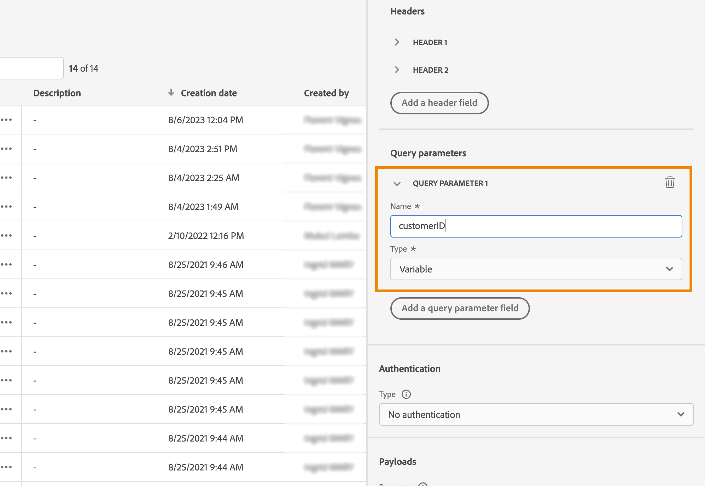

# Miglioramenti delle azioni personalizzate {#custom-action-enhancements}

Ora puoi sfruttare le risposte alle chiamate API nelle azioni personalizzate e orchestrare i percorsi in base a tali risposte.

In precedenza questa funzionalità era disponibile solo quando si utilizzavano origini dati. Ora puoi utilizzarlo con azioni personalizzate.

>[!AVAILABILITY]
>
>Questa funzione è attualmente disponibile come versione beta privata.

>[!WARNING]
>
>Le azioni personalizzate devono essere utilizzate solo con endpoint privati o interni e con un limite di limitazione o limite appropriato. Consulta [questa pagina](../configuration/external-systems.md).

## Definire l’azione personalizzata {#define-custom-action}

Durante la definizione dell’azione personalizzata, sono stati resi disponibili due miglioramenti: l’aggiunta del metodo GET e il nuovo campo di risposta del payload. Le altre opzioni e i parametri rimangono invariati. Consulta [questa pagina](../action/about-custom-action-configuration.md).

### Configurazione endpoint {#endpoint-configuration}

Il **Configurazione URL** la sezione è stata rinominata **Configurazione endpoint**.

In **Metodo** a discesa, è ora possibile selezionare **GET**.

{width="70%" align="left"}

### Payload {#payloads-new}

Il **Parametri azione** la sezione è stata rinominata **Payload**. Sono disponibili due campi:

* Il **Richiesta** campo: questo campo è disponibile solo per i metodi di chiamata POST e PUT.
* Il **Risposta** campo: questa è la nuova funzionalità. Questo campo è disponibile per tutti i metodi di chiamata.

>[!NOTE]
> 
>Entrambi questi campi sono facoltativi.

{width="70%" align="left"}

1. Fai clic all’interno del **Risposta** campo.

   {width="80%" align="left"}

1. Incolla un esempio del payload restituito dalla chiamata. Verifica che i tipi di campo siano corretti (stringa, numero intero, ecc.). Ecco un esempio di payload di risposta acquisito durante la chiamata. L’endpoint locale invia il numero di punti fedeltà e lo stato di un profilo.

   ```
   {
   "customerID" : "xY12hye",    
   "status":"gold",
   "points": 1290 }
   ```

   {width="80%" align="left"}

   Ogni volta che viene chiamata l’API, il sistema recupererà tutti i campi inclusi nell’esempio di payload.

1. Aggiungiamo anche il customerID come parametro di query.

   {width="80%" align="left"}

1. Fai clic su **Salva**.

## Sfruttare la risposta in un percorso {#response-in-journey}

È sufficiente aggiungere l’azione personalizzata a un percorso. Puoi quindi sfruttare i campi del payload di risposta in condizioni, altre azioni e personalizzazione dei messaggi.

Ad esempio, puoi aggiungere una condizione per verificare il numero di punti fedeltà. Quando la persona accede al ristorante, l’endpoint locale invia una chiamata con le informazioni sulla fedeltà del profilo. Puoi inviare un messaggio push se il profilo è un cliente Gold. E se nella chiamata viene rilevato un errore, invia un’azione personalizzata per informare l’amministratore di sistema.


1. Aggiungi l’evento e l’azione personalizzata Fedeltà creata in precedenza.

1. Nell’azione personalizzata Fedeltà, mappa il parametro di query dell’ID cliente con l’ID profilo. Seleziona l’opzione **Aggiungi un percorso alternativo in caso di timeout o errore**.

   

1. Nel primo ramo, aggiungi una condizione e utilizza l’editor avanzato per sfruttare i campi di risposta dell’azione, nella sezione **Contesto** nodo.

   

1. Quindi aggiungi il push e personalizza il messaggio utilizzando i campi di risposta. Nel nostro esempio, personalizziamo il contenuto utilizzando il numero di punti fedeltà e lo stato del cliente. I campi di risposta dell’azione sono disponibili in **Attributi contestuali** > **Journey Orchestration** > **Azioni**.

   

   >[!NOTE]
   >
   >Ogni profilo che accede all’azione personalizzata attiva una chiamata. Anche se la risposta è sempre la stessa, il Percorso eseguirà comunque una chiamata per profilo.

1. Nel ramo di timeout ed errore, aggiungi una condizione e sfrutta il **jo_status_code** campo. Nel nostro esempio, utilizziamo
   **http_400** tipo di errore. Consulta [questa sezione](#error-status).

   ```
   @action{ActionLoyalty.jo_status_code} == "http_400"
   ```

   

1. Aggiungi un’azione personalizzata che verrà inviata alla tua organizzazione.

   

## Stato errore {#error-status}

Il **jo_status_code** Questo campo è sempre disponibile anche quando non è definito alcun payload di risposta.

Di seguito sono riportati i possibili valori per questo campo:

* codice di stato http: http_`<HTTP API call returned code>`, ad esempio http_200 o http_400
* errore di timeout: **timeout**
* errore di limite: **con limite**
* errore interno: **internalError**

Una chiamata di azione viene considerata in errore quando il codice http restituito è maggiore di 2xx o se si verifica un errore. In questi casi, il percorso passa al ramo dedicato relativo al timeout o all’errore.

>[!WARNING]
>
>Solo le azioni personalizzate appena create includono **jo_status_code** preconfigurata. Se desideri utilizzarla con un’azione personalizzata esistente, devi aggiornare l’azione. Ad esempio, puoi aggiornare la descrizione e salvare.

## Sintassi delle espressioni {#exp-syntax}

Di seguito è riportata la sintassi:

```json
#@action{myAction.myField} 
```

Di seguito sono riportati alcuni esempi:

```json
 // action response field
 @action{<action name>.<path to the field>}
 @action{ActionLoyalty.status}
```

```json
 // action response field
 @action{<action name>.<path to the field>, defaultValue: <default value expression>}
 @action{ActionLoyalty.points, defaultValue: 0}
 @action{ActionLoyalty.points, defaultValue: @{myEvent.newPoints}}
```

Per ulteriori informazioni sui riferimenti di campo, consulta [questa sezione](../building-journeys/expression/field-references.md).

