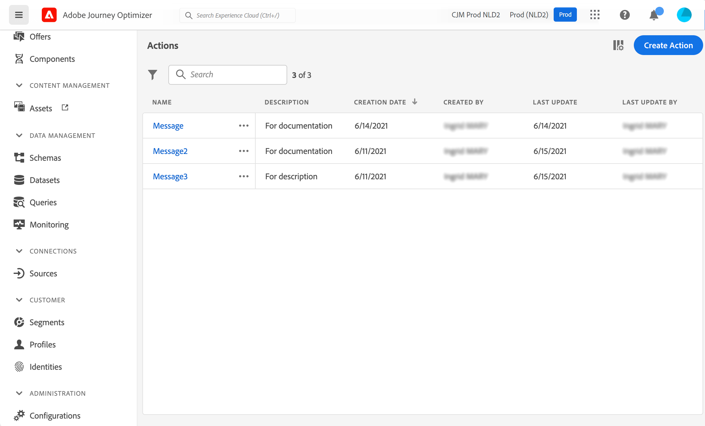

# Introduzione alle azioni personalizzate {#about_actions}

>[!CONTEXTUALHELP]
>id="ajo_journey_action_list"
>title="Azioni personalizzate"
>abstract="Le azioni rappresentano le connessioni attraverso le quali puoi offrire esperienze personalizzate in tempo reale ai clienti, ad esempio notifiche push, e-mail, SMS o qualsiasi altro strumento di coinvolgimento digitale che utilizzi nella tua azienda."

Le azioni rappresentano le connessioni attraverso le quali puoi offrire esperienze personalizzate in tempo reale ai clienti, ad esempio notifiche push, e-mail, SMS o qualsiasi altro strumento di coinvolgimento digitale che utilizzi nella tua azienda.

➡️ [Scopri questa funzione nel video](#video)

[!DNL Journey Optimizer] viene fornito con funzionalità per messaggi incorporate. Le azioni personalizzate consentono di configurare la connessione di un sistema di terze parti per consentire l’invio di messaggi o chiamate API. Per ciascun provider è possibile configurare un’azione che può essere attivata tramite un’API REST con un payload in formato JSON.

* Se utilizzi Adobe Campaign v7 o v8, su richiesta è disponibile un’integrazione. Consulta [questa pagina](../action/acc-action.md).

* Se utilizzi un sistema di terze parti per l’invio di messaggi come Epsilon, Facebook, Adobe Developer, Firebase e così via, devi creare e configurare un’azione personalizzata. Consulta [questa pagina](../action/about-custom-action-configuration.md).

>[!CAUTION]
>
>La configurazione delle azioni personalizzate deve essere eseguita da un **utente tecnico**.

Le azioni personalizzate sono azioni aggiuntive definite da utenti tecnici e rese disponibili agli esperti di marketing: una volta configurate, vengono visualizzate nella palette a sinistra del percorso, nella categoria **[!UICONTROL Azione]**. Ulteriori informazioni sono disponibili in [questa pagina](../building-journeys/about-journey-activities.md#action-activities).

Per visualizzare l&#39;elenco delle azioni o configurare una nuova azione, selezionare **[!UICONTROL Configurazioni]** nella sezione del menu AMMINISTRAZIONE. Nella sezione **[!UICONTROL Azioni]**, fai clic su **[!UICONTROL Gestisci]**. Viene visualizzato l’elenco delle azioni. Per ulteriori informazioni sull&#39;interfaccia, vedere [questa pagina](../start/user-interface.md).

Scopri come risolvere i problemi relativi a un&#39;azione personalizzata [ in questa pagina dedicata](../action/troubleshoot-custom-action.md).

## Video introduttivo {#video}

Scopri come configurare le azioni personalizzate.

>[!VIDEO](https://video.tv.adobe.com/v/3428396?quality=12)

## Risorse aggiuntive

Consulta le sezioni seguenti per ulteriori informazioni sulla configurazione e sull’utilizzo delle azioni personalizzate:

* [Configura le azioni personalizzate](../action/about-custom-action-configuration.md) - Scopri come creare e configurare un&#39;azione personalizzata
* [Usa azioni personalizzate](../building-journeys/using-custom-actions.md) - Scopri come utilizzare le azioni personalizzate nei tuoi percorsi
* [Trasmettere le raccolte nei parametri delle azioni personalizzate](../building-journeys/collections.md) - Scopri come trasmettere una raccolta nei parametri delle azioni personalizzate compilata dinamicamente in fase di esecuzione
* [Risoluzione dei problemi relativi alle azioni personalizzate](../action/troubleshoot-custom-action.md) - Scopri come risolvere i problemi relativi a un&#39;azione personalizzata

