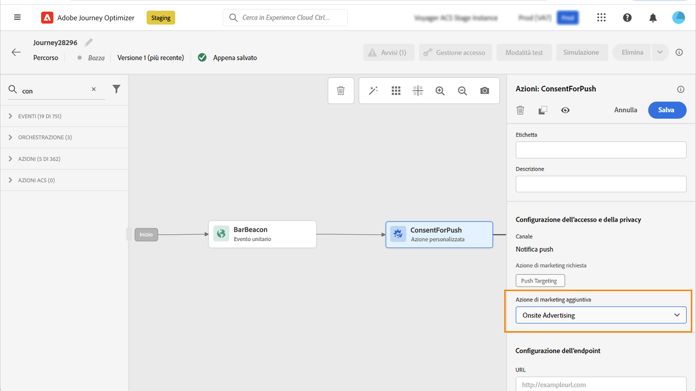

# Utilizzare i criteri di consenso {#consent-management}

Questi dati possono essere soggetti a restrizioni di utilizzo definite dalla tua organizzazione o da normative legali. È quindi importante assicurarsi che le operazioni sui dati all’interno di Journey Optimizer siano conformi con i [criteri di utilizzo dati](https://experienceleague.adobe.com/docs/experience-platform/data-governance/policies/overview.html?lang=it){target="_blank"}. These policies are Adobe Experience Platform rules defining which [marketing actions](https://experienceleague.adobe.com/docs/experience-platform/data-governance/policies/overview.html?lang=it#marketing-actions){target="_blank"} consentiti per le operazioni sui dati.

Tra i criteri di utilizzo dei dati disponibili vi sono i **criteri di consenso**. Questi consentono di adottare e applicare facilmente criteri di marketing al fine di rispettare le preferenze di consenso dei clienti. [Ulteriori informazioni sull’applicazione dei criteri](https://experienceleague.adobe.com/docs/experience-platform/data-governance/enforcement/auto-enforcement.html?lang=it){target="_blank"}

>[!IMPORTANT]
>
>I criteri di consenso sono attualmente disponibili solo per le organizzazioni che hanno acquistato le offerte aggiuntive **Healthcare Shield** e **Privacy and Security Shield**.

Ad esempio, puoi [creare i criteri di consenso](https://experienceleague.adobe.com/docs/experience-platform/data-governance/policies/user-guide.html?lang=it#consent-policy){target="_blank"} per escludere i clienti di Experience Platform che non hanno acconsentito a ricevere comunicazioni e-mail, push o SMS.

<!--* For the native outbound channels (Email, Push, SMS, Direct mail), the logic is as follows:

    * By default, if a profile has opted out from receiving communications from you, the corresponding profile is excluded from subsequent deliveries.

    * If you have the Adobe **Healthcare Shield** or **Privacy and Security Shield**, you can create a custom consent policy that overrides the default logic. For example, you can define a policy to only send email messages to all individuals who have opted in. In the absence of a custom policy, the default policy applies.
    
    To apply a custom policy, you need to define a marketing action in that policy and associate it to a channel surface. [Learn more](#marketing-actions)-->

A livello di percorso, puoi applicare i criteri di consenso alle azioni personalizzate:

* Durante la **configurazione di un’azione personalizzata**, puoi definire un canale e un’azione di marketing. [Ulteriori informazioni](#consent-custom-action)
* Durante l’aggiunta dell’**azione personalizzata in un percorso**, puoi definire un’azione di marketing aggiuntiva. [Ulteriori informazioni](#consent-journey)

<!--

## Leverage consent policies through channel surfaces {#marketing-actions}

In [!DNL Journey Optimizer], consent is handled by the Experience Platform [Consent schema](https://experienceleague.adobe.com/docs/experience-platform/xdm/field-groups/profile/consents.html){target="_blank"}. By default, the value for the consent field is empty and treated as consent to receive your communications. You can modify this default value while onboarding to one of the possible values listed [here](https://experienceleague.adobe.com/docs/experience-platform/xdm/data-types/consents.html#choice-values){target="_blank"}.

To modify the consent field value, you can create a custom consent policy in which you define a marketing action and the conditions under which that action is performed. [Learn more on marketing actions](https://experienceleague.adobe.com/docs/experience-platform/data-governance/policies/overview.html#marketing-actions){target="_blank"}

For example, if you want to create a consent policy to target only profiles who have consented to receive email communications, follow the steps below.

1. Make sure your organization has purchased the Adobe **Healthcare Shield** or **Privacy and Security Shield** add-on offerings. [Learn more](https://experienceleague.adobe.com/docs/events/customer-data-management-voices-recordings/governance/healthcare-shield.html){target="_blank"}

1. In Adobe Experience Platform, create a custom policy (from the **[!UICONTROL Privacy]** > **[!UICONTROL Policies]** menu). [Learn how](https://experienceleague.adobe.com/docs/experience-platform/data-governance/policies/user-guide.html#create-policy){target="_blank"}

    

1. Choose the **[!UICONTROL Consent policy]** type and configure a condition as follows. [Learn how to configure consent policies](https://experienceleague-review.corp.adobe.com/docs/experience-platform/data-governance/policies/user-guide.html#consent-policy){target="_blank"}

    1. Under the **[!UICONTROL If]** section, select the **[!UICONTROL Email Targeting]** default marketing action.

        

        >[!NOTE]
        >
        >The core marketing actions provided out-of-the-box by Adobe are listed in [this table](https://experienceleague.adobe.com/docs/experience-platform/data-governance/policies/overview.html?lang=en#core-actions){target="_blank"}. The steps to create a custom marketing action are listed in [this section](https://experienceleague.adobe.com/docs/experience-platform/data-governance/policies/user-guide.html#create-marketing-action){target="_blank"}.

    1. Select what happens when the marketing action applies. In this example, select **[!UICONTROL Email Marketing Consent]**.

    

1. Save and [enable](https://experienceleague.adobe.com/docs/experience-platform/data-governance/policies/user-guide.html#enable){target="_blank"} this policy.

1. In Journey Optimizer, create an email surface. [Learn how](../configuration/channel-surfaces.md#create-channel-surface)

1. In the email surface details, select the **[!UICONTROL Email Targeting]** marketing action.

    

All consent policies associated with that marketing action are automatically leveraged in order to respect the preferences of your customers.

Therefore, in this example, any [email](../email/create-email.md) using that surface in a campaign or a journey is only sent to the profiles who have consented to receive emails from you. Profiles who have not consented to receive email communications are excluded.-->

## Sfruttare i criteri di consenso tramite azioni personalizzate {#journey-custom-actions}

### Note importanti {#important-notes}

In Journey Optimizer, il consenso può <!--also -->nelle azioni personalizzate. Se desideri utilizzarlo con le funzionalità dei messaggi incorporati, è necessario utilizzare un’attività di condizione per filtrare i clienti nel percorso.

Con la gestione del consenso vengono analizzate due attività del percorso:

* Leggi pubblico: viene preso in considerazione il pubblico recuperato.
* Azione personalizzata: la gestione del consenso tiene conto degli attributi utilizzati ([parametri di azione](../action/about-custom-action-configuration.md#define-the-message-parameters)) e le azioni di marketing definite (azioni di marketing richieste e azioni di marketing aggiuntive).
* Gli attributi appartenenti a un gruppo di campi che utilizzano lo schema di unione predefinito non sono supportati. Questi attributi risulteranno nascosti nell’interfaccia. È necessario creare un altro gruppo di campi utilizzando uno schema diverso.
* I criteri di consenso si applicano solo quando un’azione di marketing (obbligatoria o aggiuntiva) è impostata a livello di azione personalizzata.

Non vengono prese in considerazione tutte le altre attività utilizzate in un percorso. Se inizi il percorso con una qualificazione del pubblico, il pubblico non viene preso in considerazione.

In un percorso, se un profilo viene escluso da un criterio di consenso in un’azione personalizzata, il messaggio non viene inviato a tale profilo, ma questo continua il percorso. Il profilo non passa al percorso di timeout ed errore quando si utilizza una condizione.

Prima di aggiornare i criteri in un’azione personalizzata posizionata in un percorso, assicurati che il percorso non presenti errori.

<!--
There are two types of latency regarding the use of consent policies:

* **User latency**: the delay from the time a profile changes a consent settings to the moment it is applied in Experience Platform. This can take up to 48h. 
* **Consent policy latency**: the delay from the time a consent policy is created or updated to the moment it is applied. This can take up to 6 hours
-->

### Configurazione dell’azione personalizzata {#consent-custom-action}

>[!CONTEXTUALHELP]
>id="ajo_consent_required_marketing_action"
>title="Definisci un’azione di marketing richiesta"
>abstract="L’Azione di marketing richiesta consente di definire l’azione di marketing correlata all’azione personalizzata. Ad esempio, se utilizzi l’azione personalizzata per inviare e-mail utilizzando una terza parte, puoi selezionare Targeting e-mail. Se utilizzato in un percorso, tutti i criteri di consenso associati a tale azione di marketing verranno recuperati e utilizzati. Questo non può essere modificato nell’area di lavoro."

Durante la configurazione di un’azione personalizzata, è possibile utilizzare due campi per la gestione del consenso.

Il campo **Canale** consente di selezionare il canale correlato a questa azione personalizzata: **E-mail**, **SMS** oppure **Notifica push**. Precompila il **Azione di marketing richiesta** con l’azione di marketing predefinita per il canale selezionato. Se si seleziona **altro**, per impostazione predefinita non è definita alcuna azione di marketing.

L’**Azione di marketing richiesta** consente di definire l’azione di marketing correlata all’azione personalizzata. Ad esempio, se utilizzi l’azione personalizzata per inviare e-mail utilizzando una terza parte, puoi selezionare **Targeting e-mail**. Quando vengono utilizzati in un percorso, tutti i criteri di consenso associati a tale azione di marketing vengono recuperati e utilizzati. È selezionata un’azione di marketing predefinita, ma puoi fare clic sulla freccia in giù per selezionare dall’elenco le azioni di marketing disponibili.

Per alcuni tipi di comunicazioni importanti, ad esempio un messaggio transazionale inviato per reimpostare la password del cliente, potrebbe non essere necessario applicare un criterio di consenso. Quindi selezionerai **Nessuno** nel campo **Azione di marketing necessaria**.

Gli altri passaggi per la configurazione di un’azione personalizzata sono descritti in [questa sezione](../action/about-custom-action-configuration.md#consent-management).

### Creazione di un percorso {#consent-journey}

>[!CONTEXTUALHELP]
>id="ajo_consent_required_marketing_action_canvas"
>title="Azione di marketing richiesta"
>abstract="Durante la creazione di un’azione di marketing personalizzata viene definita un’azione di marketing richiesta. Impossibile rimuovere o modificare l’azione di marketing richiesta."

>[!CONTEXTUALHELP]
>id="ajo_consent_additional_marketing_action_canvas"
>title="Azioni di marketing aggiuntive"
>abstract="Aggiungi un’altra azione di marketing oltre a quella richiesta. Verranno applicati i criteri di consenso relativi a entrambe le azioni di marketing."

>[!CONTEXTUALHELP]
>id="ajo_consent_refresh_policies_canvas"
>title="Visualizza i criteri di consenso applicabili in fase di runtime"
>abstract="Le azioni di marketing introducono criteri di consenso che combinano parametri di azione e valori di consenso dei singoli profili per filtrare gli utenti. Per ottenere la definizione più recente di questi criteri, fai clic sul pulsante per aggiornarli."

Quando si aggiunge l’azione personalizzata in un percorso, diverse opzioni consentono di gestire il consenso. Fai clic sul pulsante **Mostra campi di sola lettura** per visualizzare tutti i parametri.

Nella parte superiore della schermata sono riportati il **Canale** e l’**Azione di marketing richiesta**, definiti durante la configurazione dell’azione personalizzata. Non è possibile modificare questi campi.

Puoi definire un’**Azione di marketing aggiuntiva** per impostare il tipo di azione personalizzata. Questo consente di definire lo scopo dell’azione personalizzata in questo percorso. Oltre all’azione di marketing richiesta, solitamente specifica per un canale, puoi definire un’azione di marketing aggiuntiva specifica per l’azione personalizzata in questo particolare percorso. Ad esempio: una comunicazione di allenamento, una newsletter, una comunicazione fitness, ecc. Vengono applicate sia l’azione di marketing richiesta che quella aggiuntiva.

Fai clic sul pulsante **Aggiorna criteri**, nella parte inferiore della schermata, per aggiornare e controllare l’elenco dei criteri presi in considerazione per questa azione personalizzata. Questo è solo a scopo informativo, durante la creazione di un percorso. Per i percorsi live, i criteri di consenso vengono recuperati e aggiornati automaticamente ogni 6 ore.

<!--
The following data is taken into account for consent:

* marketing actions and additional marketing actions defined in the custom action
* action parameters defined in the custom action, see this [section](../action/about-custom-action-configuration.md#define-the-message-parameters) 
* attributes used as criteria in a segment when the journey starts with a Read segment, see this [section](../building-journeys/read-audience.md) 

>[!NOTE]
>
>Please note that there can be a latency when updating the list of policies applied, refer to this [this section](../action/consent.md#important-notes).
-->

Gli altri passaggi per configurare un’azione personalizzata in un percorso sono descritti in [questa sezione](../building-journeys/using-custom-actions.md).
