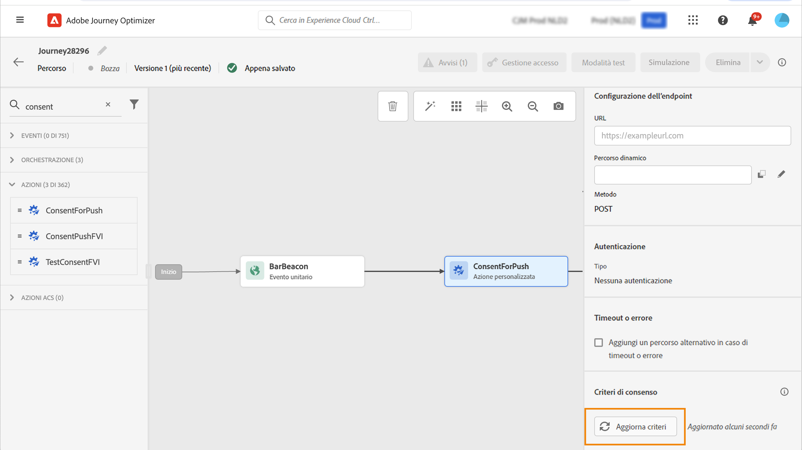

# Utilizzare i criteri di consenso {#consent-management}

Questi dati possono essere soggetti a restrizioni di utilizzo definite dalla tua organizzazione o da normative legali. È quindi importante assicurarsi che le operazioni sui dati in Journey Optimizer siano conformi ai [criteri di utilizzo dei dati](https://experienceleague.adobe.com/docs/experience-platform/data-governance/policies/overview.html?lang=it){target="_blank"}. Questi criteri sono le regole di Adobe Experience Platform che definiscono quali azioni di marketing possono essere eseguite sui dati.

Per impostazione predefinita, se un profilo ha rinunciato a ricevere comunicazioni da te, il profilo corrispondente viene escluso dalle consegne successive. Puoi creare un **criterio di consenso** che ignora questa logica predefinita. Ad esempio, puoi creare un criterio di consenso in Experience Platform per escludere i clienti che non hanno acconsentito a ricevere comunicazioni per un dato canale. In assenza di un criterio personalizzato, viene applicato il criterio predefinito.

>[!IMPORTANT]
>
>I criteri di consenso sono attualmente disponibili solo per le organizzazioni che hanno acquistato le offerte aggiuntive Adobe **Healthcare Shield** e **Privacy and Security Shield**.

I passaggi principali per applicare i criteri di consenso sono i seguenti:

1. Crea un criterio di consenso in Adobe Experience Platform con un’azione di marketing associata. [Scopri come creare un criterio di consenso](https://experienceleague.adobe.com/docs/experience-platform/data-governance/policies/user-guide.html?lang=it#consent-policy){target="_blank"}

2. Applica i criteri di consenso in Adobe Journey Optimizer utilizzando configurazioni di canale o azioni personalizzate di percorso.

   * Crea una configurazione di canale con un’azione di marketing associata. Quando crei una comunicazione utilizzando questa configurazione di canale, la comunicazione erediterà l’azione di marketing associata e verranno applicati i criteri di consenso corrispondenti definiti in Adobe Experience Platform. [Scopri come usare i criteri di consenso tramite le configurazioni dei canali](#surface-marketing-actions)

   * A livello di percorso, è possibile:

      * Associare un canale e un’azione di marketing a un’azione personalizzata durante la configurazione. [Scopri come usare i criteri di consenso nella configurazione di un’azione personalizzata](#consent-custom-action)
      * Definire un’azione di marketing aggiuntiva quando aggiungi un’azione personalizzata in un percorso. [Scopri come usare i criteri di consenso quando aggiungi un’azione personalizzata in un percorso](#consent-journey)

## Sfruttare i criteri di consenso tramite le configurazioni dei canali {#surface-marketing-actions}

In [!DNL Journey Optimizer], il consenso è gestito dallo [Schema di consenso](https://experienceleague.adobe.com/docs/experience-platform/xdm/field-groups/profile/consents.html?lang=it){target="_blank"} di Experience Platform. Per impostazione predefinita, il valore del campo di consenso è vuoto e viene trattato come consenso alla ricezione delle comunicazioni. Puoi modificare questo valore predefinito durante l&#39;onboarding in uno dei possibili valori elencati [qui](https://experienceleague.adobe.com/docs/experience-platform/xdm/data-types/consents.html?lang=it#choice-values){target="_blank"}.

Per modificare il valore del campo di consenso, puoi creare un criterio di consenso personalizzato in cui definisci un’azione di marketing e le condizioni in cui viene eseguita. [Ulteriori informazioni sulle azioni di marketing](https://experienceleague.adobe.com/docs/experience-platform/data-governance/policies/overview.html?lang=it#marketing-actions){target="_blank"}

Ad esempio, se desideri creare un criterio di consenso per eseguire il targeting solo dei profili che hanno acconsentito a ricevere comunicazioni e-mail, segui i passaggi riportati di seguito.

1. Assicurati che la tua organizzazione abbia acquistato le offerte aggiuntive **Healthcare Shield** o **Privacy and Security Shield** di Adobe. [Ulteriori informazioni](https://experienceleague.adobe.com/docs/events/customer-data-management-voices-recordings/governance/healthcare-shield.html?lang=it){target="_blank"}

1. In Adobe Experience Platform, crea un criterio personalizzato (dal menu **[!UICONTROL Privacy]** > **[!UICONTROL Criteri]**). [Scopri come](https://experienceleague.adobe.com/docs/experience-platform/data-governance/policies/user-guide.html?lang=it#create-policy){target="_blank"}

   <!---->

1. Scegli il tipo **[!UICONTROL Criterio di consenso]** e configura una condizione nel modo seguente. [Scopri come configurare i criteri di consenso](https://experienceleague.adobe.com/docs/experience-platform/data-governance/policies/user-guide.html?lang=it#consent-policy){target="_blank"}

   1. Nella sezione **[!UICONTROL Se]**, seleziona l’azione di marketing predefinita **[!UICONTROL Targeting e-mail]**.

      <!---->

      >[!NOTE]
      >
      >Le azioni di marketing di base fornite da Adobe sono elencate in [questa tabella](https://experienceleague.adobe.com/docs/experience-platform/data-governance/policies/overview.html?lang=it#core-actions){target="_blank"}. I passaggi per creare un&#39;azione di marketing personalizzata sono elencati in [questa sezione](https://experienceleague.adobe.com/docs/experience-platform/data-governance/policies/user-guide.html?lang=it#create-marketing-action){target="_blank"}.

   1. Seleziona cosa accade quando si applica l’azione di marketing. In questo esempio, seleziona **[!UICONTROL Consenso e-mail marketing]**.

   

1. Salva e [abilita](https://experienceleague.adobe.com/docs/experience-platform/data-governance/policies/user-guide.html?lang=it#enable){target="_blank"} questo criterio.

1. In Journey Optimizer, crea una configurazione del canale e-mail. [Scopri come](../configuration/channel-surfaces.md#create-channel-surface)

1. Nei dettagli della configurazione e-mail, seleziona l’azione di marketing **[!UICONTROL Targeting e-mail]**.

   

Tutti i criteri di consenso associati a tale azione di marketing vengono automaticamente usati per rispettare le preferenze della clientela.

Pertanto, in questo esempio, qualsiasi [e-mail](../email/create-email.md) che utilizza tale configurazione in una campagna o in un percorso viene inviata solo ai profili che hanno acconsentito a ricevere e-mail da te. Sono esclusi i profili che non hanno acconsentito a ricevere comunicazioni e-mail.

## Sfruttare i criteri di consenso tramite azioni personalizzate {#journey-custom-actions}

### Note importanti {#important-notes}

In Journey Optimizer, il consenso può essere utilizzato anche nelle azioni personalizzate. Se desideri utilizzarlo con le funzionalità dei messaggi incorporati, è necessario utilizzare un’attività di condizione per filtrare i clienti nel percorso.

Con la gestione del consenso vengono analizzate due attività del percorso:

* Leggi pubblico: viene preso in considerazione il pubblico recuperato.
* Azione personalizzata: la gestione del consenso tiene conto degli attributi utilizzati ([parametri di azione](../action/about-custom-action-configuration.md#define-the-message-parameters)) e le azioni di marketing definite (azioni di marketing richieste e azioni di marketing aggiuntive).
* Gli attributi appartenenti a un gruppo di campi che utilizzano lo schema di unione predefinito non sono supportati. Questi attributi risulteranno nascosti nell’interfaccia. È necessario creare un altro gruppo di campi utilizzando uno schema diverso.
* I criteri di consenso si applicano solo quando un’azione di marketing (obbligatoria o aggiuntiva) è impostata a livello di azione personalizzata.

Non vengono prese in considerazione tutte le altre attività utilizzate in un percorso. Se inizi il percorso con una qualificazione del pubblico, il pubblico non viene preso in considerazione.

In un percorso, se un profilo viene escluso da un criterio di consenso in un’azione personalizzata, il messaggio non viene inviato a tale profilo, ma questo continua il percorso. Il profilo non passa al percorso di timeout ed errore quando si utilizza una condizione.

Prima di aggiornare i criteri in un’azione personalizzata posizionata in un percorso, assicurati che il percorso non presenti errori.

<!--
There are two types of latency regarding the use of consent policies:

* **User latency**: the delay from the time a profile changes a consent settings to the moment it is applied in Experience Platform. This can take up to 48h. 
* **Consent policy latency**: the delay from the time a consent policy is created or updated to the moment it is applied. This can take up to 6 hours
-->

### Usare i criteri di consenso nella configurazione di un’azione personalizzata{#consent-custom-action}

Durante la configurazione di un’azione personalizzata, è possibile utilizzare due campi per la gestione del consenso.

Il campo **Canale** consente di selezionare il canale correlato all’azione personalizzata. Il campo **Azione di marketing richiesta** verrà precompilato con l’azione di marketing predefinita per il canale selezionato. Selezionando **Altro**, non verrà definita alcuna azione di marketing per impostazione predefinita.

L’**Azione di marketing richiesta** consente di definire l’azione di marketing correlata all’azione personalizzata. Ad esempio, se utilizzi l’azione personalizzata per inviare e-mail utilizzando una terza parte, puoi selezionare **Targeting e-mail**. Se tale azione di marketing viene utilizzata in un percorso, tutti i criteri di consenso ad essa associati verranno recuperati e utilizzati. È selezionata un’azione di marketing predefinita, ma puoi fare clic sulla freccia in giù per selezionare dall’elenco le azioni di marketing disponibili.

Per alcuni tipi di comunicazioni importanti, ad esempio un messaggio transazionale inviato per reimpostare la password del cliente, potrebbe non essere necessario applicare un criterio di consenso. Quindi selezionerai **Nessuno** nel campo **Azione di marketing necessaria**.

Gli altri passaggi per la configurazione di un’azione personalizzata sono descritti in [questa sezione](../action/about-custom-action-configuration.md#consent-management).

### Usare i criteri di consenso quando si aggiunge un’azione personalizzata in un percorso {#consent-journey}

Quando si aggiunge l’azione personalizzata in un percorso, diverse opzioni consentono di gestire il consenso. Fai clic sul pulsante **Mostra campi di sola lettura** per visualizzare tutti i parametri.

Nella parte superiore della schermata sono riportati il **Canale** e l’**Azione di marketing richiesta**, definiti durante la configurazione dell’azione personalizzata. Non è possibile modificare questi campi.

Puoi definire un’**Azione di marketing aggiuntiva** per impostare il tipo di azione personalizzata. Questo consente di definire lo scopo dell’azione personalizzata in questo percorso. Oltre all’azione di marketing richiesta, solitamente specifica per un canale, puoi definire un’azione di marketing aggiuntiva specifica per l’azione personalizzata in questo particolare percorso. Ad esempio: una comunicazione di allenamento, una newsletter, una comunicazione fitness, ecc. Verranno applicate sia l’azione di marketing richiesta che quella aggiuntiva.

Fai clic sul pulsante **Aggiorna criteri**, nella parte inferiore della schermata, per aggiornare e controllare l’elenco dei criteri presi in considerazione per questa azione personalizzata. Questo è solo a scopo informativo, durante la creazione di un percorso. Per i percorsi live, i criteri di consenso vengono recuperati e aggiornati automaticamente ogni 6 ore.

<!--
The following data is taken into account for consent:

* marketing actions and additional marketing actions defined in the custom action
* action parameters defined in the custom action, see this [section](../action/about-custom-action-configuration.md#define-the-message-parameters) 
* attributes used as criteria in a segment when the journey starts with a Read segment, see this [section](../building-journeys/read-audience.md) 

>[!NOTE]
>
>Please note that there can be a latency when updating the list of policies applied, refer to this [this section](../action/consent.md#important-notes).
-->

Gli altri passaggi per configurare un’azione personalizzata in un percorso sono descritti in [questa sezione](../building-journeys/using-custom-actions.md).
