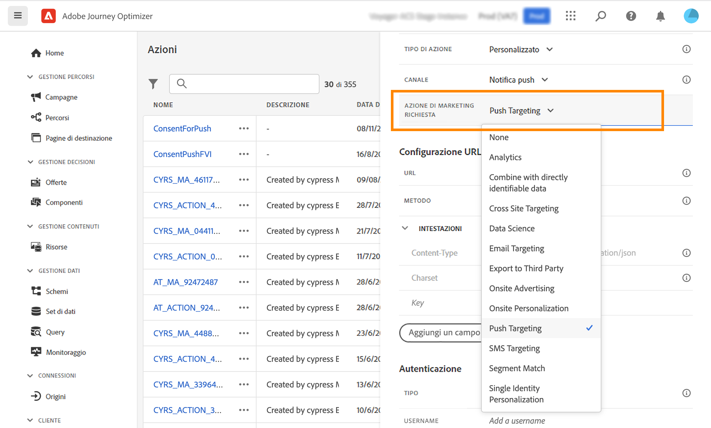
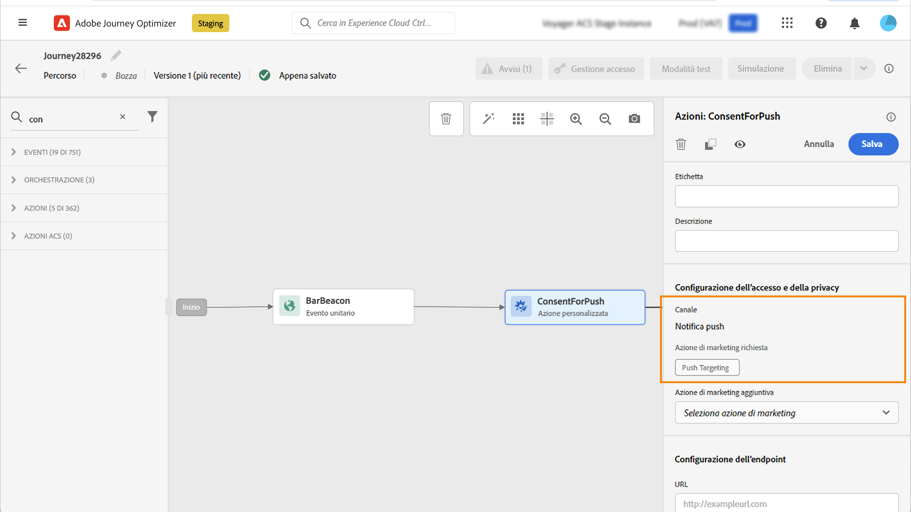

# Utilizzare i criteri di consenso {#consent-management}

Adobe Experience Platform consente di adottare e applicare facilmente i criteri di marketing per rispettare le preferenze di consenso dei clienti. I criteri di consenso sono definiti in Adobe Experience Platform. Fai riferimento a [questa documentazione](https://experienceleague.adobe.com/docs/experience-platform/data-governance/policies/user-guide.html?lang=it#consent-policy).

In Journey Optimizer puoi applicare questi criteri di consenso alle azioni personalizzate. Ad esempio, puoi definire i criteri di consenso per escludere i clienti che non hanno acconsentito a ricevere comunicazioni e-mail, push o SMS.

>[!NOTE]
>
>L’applicazione automatica del consenso è attualmente disponibile solo per le organizzazioni che hanno acquistato l’offerta aggiuntiva Healthcare Shield.

In Journey Optimizer, il consenso è definito a diversi livelli:

* Durante la **configurazione di un’azione personalizzata**, è possibile definire un canale e un’azione di marketing. Consulta questa [sezione](../action/consent.md#consent-custom-action).
* Durante l’aggiunta dell’**azione personalizzata percorso**, è possibile definire un’azione di marketing aggiuntiva. Consulta questa [sezione](../action/consent.md#consent-journey).

## Note importanti {#important-notes}

In Journey Optimizer, il consenso può essere utilizzato nelle azioni personalizzate. Se desideri utilizzarlo con le funzionalità dei messaggi incorporati, è necessario utilizzare un’attività di condizione per filtrare i clienti nel percorso.

Con la gestione del consenso vengono analizzate due attività del percorso:

* Leggi pubblico: viene preso in considerazione il pubblico recuperato.
* Azione personalizzata: la gestione del consenso tiene conto degli attributi utilizzati ([parametri di azione](../action/about-custom-action-configuration.md#define-the-message-parameters)) e le azioni di marketing definite (azioni di marketing richieste e azioni di marketing aggiuntive).
* Gli attributi appartenenti a un gruppo di campi che utilizzano lo schema di unione predefinito non sono supportati. Questi attributi risulteranno nascosti nell’interfaccia. È necessario creare un altro gruppo di campi utilizzando uno schema diverso.
* I criteri di consenso si applicano solo quando un’azione di marketing (obbligatoria o aggiuntiva) è impostata a livello di azione personalizzata.

Non vengono prese in considerazione tutte le altre attività utilizzate in un percorso. Se inizi il percorso con una qualificazione del pubblico, il pubblico non viene preso in considerazione.

In un percorso, se un profilo viene escluso da un criterio di consenso in un’azione personalizzata, il messaggio non viene inviato a tale profilo, ma questo continua il percorso. Il profilo non passa al percorso di timeout ed errore quando si utilizza una condizione.

Prima di aggiornare i criteri in un’azione personalizzata posizionata in un percorso, assicurati che il percorso non presenti errori.

<!--
There are two types of latency regarding the use of consent policies:

* **User latency**: the delay from the time a profile changes a consent settings to the moment it is applied in Experience Platform. This can take up to 48h. 
* **Consent policy latency**: the delay from the time a consent policy is created or updated to the moment it is applied. This can take up to 6 hours
-->

## Configurazione dell’azione personalizzata {#consent-custom-action}

>[!CONTEXTUALHELP]
>id="ajo_consent_required_marketing_action"
>title="Definisci un’azione di marketing richiesta"
>abstract="L’Azione di marketing richiesta consente di definire l’azione di marketing correlata all’azione personalizzata. Ad esempio, se utilizzi l’azione personalizzata per inviare e-mail utilizzando una terza parte, puoi selezionare Targeting e-mail. Se utilizzato in un percorso, tutti i criteri di consenso associati a tale azione di marketing verranno recuperati e utilizzati. Questo non può essere modificato nell’area di lavoro."

Durante la configurazione di un’azione personalizzata, è possibile utilizzare due campi per la gestione del consenso.

Il campo **Canale** consente di selezionare il canale correlato a questa azione personalizzata: **E-mail**, **SMS** oppure **Notifica push**. Il campo **Azione di marketing richiesta** verrà precompilato con l’azione di marketing predefinita per il canale selezionato. Selezionando **Altro**, non verrà definita alcuna azione di marketing per impostazione predefinita.

L’**Azione di marketing richiesta** consente di definire l’azione di marketing correlata all’azione personalizzata. Ad esempio, se utilizzi l’azione personalizzata per inviare e-mail utilizzando una terza parte, puoi selezionare **Targeting e-mail**. Se utilizzato in un percorso, tutti i criteri di consenso associati a tale azione di marketing verranno recuperati e utilizzati. È selezionata un’azione di marketing predefinita, ma puoi fare clic sulla freccia in giù per selezionare dall’elenco le azioni di marketing disponibili.

Per alcuni tipi di comunicazioni importanti, ad esempio un messaggio transazionale inviato per reimpostare la password del cliente, potrebbe non essere necessario applicare un criterio di consenso. Quindi selezionerai **Nessuno** nel campo **Azione di marketing necessaria**.

Gli altri passaggi per la configurazione di un’azione personalizzata sono descritti in [questa sezione](../action/about-custom-action-configuration.md#consent-management).

### Creazione di un percorso {#consent-journey}

>[!CONTEXTUALHELP]
>id="ajo_consent_required_marketing_action_canvas"
>title="Azione di marketing richiesta"
>abstract="Durante la creazione di un’azione di marketing personalizzata viene definita un’azione di marketing richiesta. Impossibile rimuovere o modificare l’azione di marketing richiesta."

>[!CONTEXTUALHELP]
>id="ajo_consent_additional_marketing_action_canvas"
>title="Azioni di marketing aggiuntive"
>abstract="Aggiungi un’altra azione di marketing oltre a quella richiesta. Verranno applicati i criteri di consenso relativi a entrambe le azioni di marketing."

>[!CONTEXTUALHELP]
>id="ajo_consent_refresh_policies_canvas"
>title="Visualizza i criteri di consenso applicabili in fase di runtime"
>abstract="Le azioni di marketing introducono criteri di consenso che combinano parametri di azione e valori di consenso dei singoli profili per filtrare gli utenti. Per ottenere la definizione più recente di questi criteri, fai clic sul pulsante per aggiornarli."

Quando si aggiunge l’azione personalizzata in un percorso, diverse opzioni consentono di gestire il consenso. Fai clic sul pulsante **Mostra campi di sola lettura** per visualizzare tutti i parametri.

Nella parte superiore della schermata sono riportati il **Canale** e l’**Azione di marketing richiesta**, definiti durante la configurazione dell’azione personalizzata. Non è possibile modificare questi campi.

Puoi definire un’**Azione di marketing aggiuntiva** per impostare il tipo di azione personalizzata. Questo consente di definire lo scopo dell’azione personalizzata in questo percorso. Oltre all’azione di marketing richiesta, solitamente specifica per un canale, puoi definire un’azione di marketing aggiuntiva specifica per l’azione personalizzata in questo particolare percorso. Ad esempio: una comunicazione di allenamento, una newsletter, una comunicazione fitness, ecc. Verranno applicate sia l’azione di marketing richiesta che quella aggiuntiva.

Fai clic sul pulsante **Aggiorna criteri**, nella parte inferiore della schermata, per aggiornare e controllare l’elenco dei criteri presi in considerazione per questa azione personalizzata. Questo è solo a scopo informativo, durante la creazione di un percorso. Per i percorsi live, i criteri di consenso vengono recuperati e aggiornati automaticamente ogni 6 ore.

<!--
The following data is taken into account for consent:

* marketing actions and additional marketing actions defined in the custom action
* action parameters defined in the custom action, see this [section](../action/about-custom-action-configuration.md#define-the-message-parameters) 
* attributes used as criteria in a segment when the journey starts with a Read segment, see this [section](../building-journeys/read-audience.md) 

>[!NOTE]
>
>Please note that there can be a latency when updating the list of policies applied, refer to this [this section](../action/consent.md#important-notes).
-->

Gli altri passaggi per configurare un’azione personalizzata in un percorso sono descritti in [questa sezione](../building-journeys/using-custom-actions.md).
