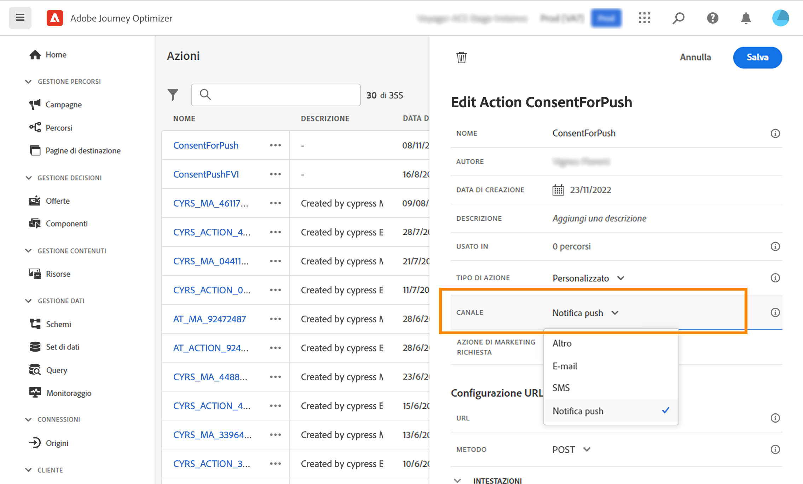

# Utilizzare i criteri di consenso {#consent-management}

Questi dati possono essere soggetti a restrizioni di utilizzo definite dalla tua organizzazione o da normative legali. È quindi importante assicurarsi che le operazioni sui dati all’interno di Journey Optimizer siano conformi con i [criteri di utilizzo dati](https://experienceleague.adobe.com/docs/experience-platform/data-governance/policies/overview.html?lang=it){target="_blank"}. These policies are Adobe Experience Platform rules defining which [marketing actions](https://experienceleague.adobe.com/docs/experience-platform/data-governance/policies/overview.html?lang=it#marketing-actions){target="_blank"} consentiti per le operazioni sui dati.

Tra i criteri di utilizzo dei dati disponibili vi sono i **criteri di consenso**. Questi consentono di adottare e applicare facilmente criteri di marketing al fine di rispettare le preferenze di consenso dei clienti. [Ulteriori informazioni sull’applicazione dei criteri](https://experienceleague.adobe.com/docs/experience-platform/data-governance/enforcement/auto-enforcement.html?lang=it){target="_blank"}

>[!IMPORTANT]
>
>I criteri di consenso sono attualmente disponibili solo per le organizzazioni che hanno acquistato le offerte aggiuntive **Healthcare Shield** e **Privacy and Security Shield**.

Ad esempio, puoi [creare i criteri di consenso](https://experienceleague.adobe.com/docs/experience-platform/data-governance/policies/user-guide.html?lang=it#consent-policy){target="_blank"} per escludere i clienti di Experience Platform che non hanno acconsentito a ricevere comunicazioni e-mail, push o SMS.

* Per i canali in uscita nativi (e-mail, push, SMS, direct mail), la logica è la seguente:

   * Per impostazione predefinita, se un profilo ha rinunciato a ricevere comunicazioni da te, il profilo corrispondente viene escluso dalle consegne successive.

   * Se hai l’Adobe **Healthcare Shield** o **Privacy e sicurezza**, puoi creare un criterio di consenso personalizzato che sovrascrive la logica predefinita. Ad esempio, puoi definire una policy per inviare messaggi e-mail solo a tutti gli utenti che hanno acconsentito. In assenza di un criterio personalizzato, viene applicato il criterio predefinito.

  Per applicare un criterio personalizzato, è necessario definire un’azione di marketing in tale criterio e associarla a una superficie di canale. [Ulteriori informazioni](#surface-marketing-actions)

A livello di percorso, puoi applicare questi criteri di consenso alle azioni personalizzate.

* Durante la **configurazione di un’azione personalizzata**, puoi definire un canale e un’azione di marketing. [Ulteriori informazioni](#consent-custom-action)
* Durante l’aggiunta dell’**azione personalizzata in un percorso**, puoi definire un’azione di marketing aggiuntiva. [Ulteriori informazioni](#consent-journey)

## Sfruttare i criteri di consenso tramite le superfici di canale {#surface-marketing-actions}

In [!DNL Journey Optimizer], il consenso è gestito dallo [Schema di consenso](https://experienceleague.adobe.com/docs/experience-platform/xdm/field-groups/profile/consents.html?lang=it){target="_blank"}. By default, the value for the consent field is empty and treated as consent to receive your communications. You can modify this default value while onboarding to one of the possible values listed [here](https://experienceleague.adobe.com/docs/experience-platform/xdm/data-types/consents.html?lang=it#choice-values){target="_blank"} di Experience Platform.

Per modificare il valore del campo di consenso, puoi creare un criterio di consenso personalizzato in cui definire un’azione di marketing e le condizioni in cui viene eseguita. [Ulteriori informazioni sulle azioni di marketing](https://experienceleague.adobe.com/docs/experience-platform/data-governance/policies/overview.html?lang=it#marketing-actions){target="_blank"}

Ad esempio, se desideri creare un criterio di consenso per eseguire il targeting solo dei profili che hanno acconsentito a ricevere comunicazioni e-mail, segui i passaggi riportati di seguito.

1. Assicurati che la tua organizzazione abbia acquistato l’Adobe **Healthcare Shield** o **Privacy e sicurezza** offerte aggiuntive. [Ulteriori informazioni](https://experienceleague.adobe.com/docs/events/customer-data-management-voices-recordings/governance/healthcare-shield.html?lang=it){target="_blank"}

1. In Adobe Experience Platform, crea un criterio personalizzato (dal **[!UICONTROL Privacy]** > **[!UICONTROL Criteri]** menu). [Scopri come](https://experienceleague.adobe.com/docs/experience-platform/data-governance/policies/user-guide.html#create-policy){target="_blank"}

   <!---->

1. Scegli la **[!UICONTROL Criterio di consenso]** digita e configura una condizione come segue. [Scopri come configurare i criteri di consenso](https://experienceleague.adobe.com/docs/experience-platform/data-governance/policies/user-guide.html?lang=it#consent-policy){target="_blank"}

   1. Sotto **[!UICONTROL Se]** , seleziona la sezione **[!UICONTROL Targeting e-mail]** azione di marketing predefinita.

      <!---->

      >[!NOTE]
      >
      >Le azioni di marketing di base fornite come predefinite per Adobe sono elencate in [questa tabella](https://experienceleague.adobe.com/docs/experience-platform/data-governance/policies/overview.html?lang=en#core-actions){target="_blank"}. The steps to create a custom marketing action are listed in [this section](https://experienceleague.adobe.com/docs/experience-platform/data-governance/policies/user-guide.html#create-marketing-action){target="_blank"}.

   1. Seleziona cosa accade quando si applica l’azione di marketing. In questo esempio, seleziona **[!UICONTROL Consenso e-mail marketing]**.

   

1. Salva e [abilita](https://experienceleague.adobe.com/docs/experience-platform/data-governance/policies/user-guide.html#enable){target="_blank"} questo criterio.

1. In Journey Optimizer, crea una superficie e-mail. [Scopri come](../configuration/channel-surfaces.md#create-channel-surface)

1. Nei dettagli della superficie e-mail, seleziona la **[!UICONTROL Targeting e-mail]** azione di marketing.

   

Tutti i criteri di consenso associati a tale azione di marketing vengono utilizzati automaticamente per rispettare le preferenze dei clienti.

Pertanto, in questo esempio, qualsiasi [email](../email/create-email.md) l’utilizzo di tale superficie in una campagna o in un percorso viene inviato solo ai profili che hanno acconsentito a ricevere e-mail da te. Sono esclusi i profili che non hanno acconsentito a ricevere comunicazioni e-mail.

## Sfruttare i criteri di consenso tramite azioni personalizzate {#journey-custom-actions}

### Note importanti {#important-notes}

In Journey Optimizer, il consenso può essere utilizzato anche nelle azioni personalizzate. Se desideri utilizzarlo con le funzionalità dei messaggi incorporati, è necessario utilizzare un’attività di condizione per filtrare i clienti nel percorso.

Con la gestione del consenso vengono analizzate due attività del percorso:

* Leggi pubblico: viene preso in considerazione il pubblico recuperato.
* Azione personalizzata: la gestione del consenso tiene conto degli attributi utilizzati ([parametri di azione](../action/about-custom-action-configuration.md#define-the-message-parameters)) e le azioni di marketing definite (azioni di marketing richieste e azioni di marketing aggiuntive).
* Gli attributi appartenenti a un gruppo di campi che utilizzano lo schema di unione predefinito non sono supportati. Questi attributi risulteranno nascosti nell’interfaccia. È necessario creare un altro gruppo di campi utilizzando uno schema diverso.
* I criteri di consenso si applicano solo quando un’azione di marketing (obbligatoria o aggiuntiva) è impostata a livello di azione personalizzata.

Non vengono prese in considerazione tutte le altre attività utilizzate in un percorso. Se inizi il percorso con una qualificazione del pubblico, il pubblico non viene preso in considerazione.

In un percorso, se un profilo viene escluso da un criterio di consenso in un’azione personalizzata, il messaggio non viene inviato a tale profilo, ma questo continua il percorso. Il profilo non passa al percorso di timeout ed errore quando si utilizza una condizione.

Prima di aggiornare i criteri in un’azione personalizzata posizionata in un percorso, assicurati che il percorso non presenti errori.

<!--
There are two types of latency regarding the use of consent policies:

* **User latency**: the delay from the time a profile changes a consent settings to the moment it is applied in Experience Platform. This can take up to 48h. 
* **Consent policy latency**: the delay from the time a consent policy is created or updated to the moment it is applied. This can take up to 6 hours
-->

### Configurazione dell’azione personalizzata {#consent-custom-action}

>[!CONTEXTUALHELP]
>id="ajo_consent_required_marketing_action"
>title="Definisci un’azione di marketing richiesta"
>abstract="L’Azione di marketing richiesta consente di definire l’azione di marketing correlata all’azione personalizzata. Ad esempio, se utilizzi l’azione personalizzata per inviare e-mail utilizzando una terza parte, puoi selezionare Targeting e-mail. Se utilizzato in un percorso, tutti i criteri di consenso associati a tale azione di marketing verranno recuperati e utilizzati. Questo non può essere modificato nell’area di lavoro."

Durante la configurazione di un’azione personalizzata, è possibile utilizzare due campi per la gestione del consenso.

Il campo **Canale** consente di selezionare il canale correlato a questa azione personalizzata: **E-mail**, **SMS** oppure **Notifica push**. Il campo **Azione di marketing richiesta** verrà precompilato con l’azione di marketing predefinita per il canale selezionato. Selezionando **Altro**, non verrà definita alcuna azione di marketing per impostazione predefinita.

L’**Azione di marketing richiesta** consente di definire l’azione di marketing correlata all’azione personalizzata. Ad esempio, se utilizzi l’azione personalizzata per inviare e-mail utilizzando una terza parte, puoi selezionare **Targeting e-mail**. Se tale azione di marketing viene utilizzata in un percorso, tutti i criteri di consenso ad essa associati verranno recuperati e utilizzati. È selezionata un’azione di marketing predefinita, ma puoi fare clic sulla freccia in giù per selezionare dall’elenco le azioni di marketing disponibili.

Per alcuni tipi di comunicazioni importanti, ad esempio un messaggio transazionale inviato per reimpostare la password del cliente, potrebbe non essere necessario applicare un criterio di consenso. Quindi selezionerai **Nessuno** nel campo **Azione di marketing necessaria**.

Gli altri passaggi per la configurazione di un’azione personalizzata sono descritti in [questa sezione](../action/about-custom-action-configuration.md#consent-management).

### Creazione di un percorso {#consent-journey}

>[!CONTEXTUALHELP]
>id="ajo_consent_required_marketing_action_canvas"
>title="Azione di marketing richiesta"
>abstract="Durante la creazione di un’azione di marketing personalizzata viene definita un’azione di marketing richiesta. Impossibile rimuovere o modificare l’azione di marketing richiesta."

>[!CONTEXTUALHELP]
>id="ajo_consent_additional_marketing_action_canvas"
>title="Azioni di marketing aggiuntive"
>abstract="Aggiungi un’altra azione di marketing oltre a quella richiesta. Verranno applicati i criteri di consenso relativi a entrambe le azioni di marketing."

>[!CONTEXTUALHELP]
>id="ajo_consent_refresh_policies_canvas"
>title="Visualizza i criteri di consenso applicabili in fase di runtime"
>abstract="Le azioni di marketing introducono criteri di consenso che combinano parametri di azione e valori di consenso dei singoli profili per filtrare gli utenti. Per ottenere la definizione più recente di questi criteri, fai clic sul pulsante per aggiornarli."

Quando si aggiunge l’azione personalizzata in un percorso, diverse opzioni consentono di gestire il consenso. Fai clic sul pulsante **Mostra campi di sola lettura** per visualizzare tutti i parametri.

Nella parte superiore della schermata sono riportati il **Canale** e l’**Azione di marketing richiesta**, definiti durante la configurazione dell’azione personalizzata. Non è possibile modificare questi campi.

Puoi definire un’**Azione di marketing aggiuntiva** per impostare il tipo di azione personalizzata. Questo consente di definire lo scopo dell’azione personalizzata in questo percorso. Oltre all’azione di marketing richiesta, solitamente specifica per un canale, puoi definire un’azione di marketing aggiuntiva specifica per l’azione personalizzata in questo particolare percorso. Ad esempio: una comunicazione di allenamento, una newsletter, una comunicazione fitness, ecc. Verranno applicate sia l’azione di marketing richiesta che quella aggiuntiva.

Fai clic sul pulsante **Aggiorna criteri**, nella parte inferiore della schermata, per aggiornare e controllare l’elenco dei criteri presi in considerazione per questa azione personalizzata. Questo è solo a scopo informativo, durante la creazione di un percorso. Per i percorsi live, i criteri di consenso vengono recuperati e aggiornati automaticamente ogni 6 ore.

<!--
The following data is taken into account for consent:

* marketing actions and additional marketing actions defined in the custom action
* action parameters defined in the custom action, see this [section](../action/about-custom-action-configuration.md#define-the-message-parameters) 
* attributes used as criteria in a segment when the journey starts with a Read segment, see this [section](../building-journeys/read-audience.md) 

>[!NOTE]
>
>Please note that there can be a latency when updating the list of policies applied, refer to this [this section](../action/consent.md#important-notes).
-->

Gli altri passaggi per configurare un’azione personalizzata in un percorso sono descritti in [questa sezione](../building-journeys/using-custom-actions.md).
