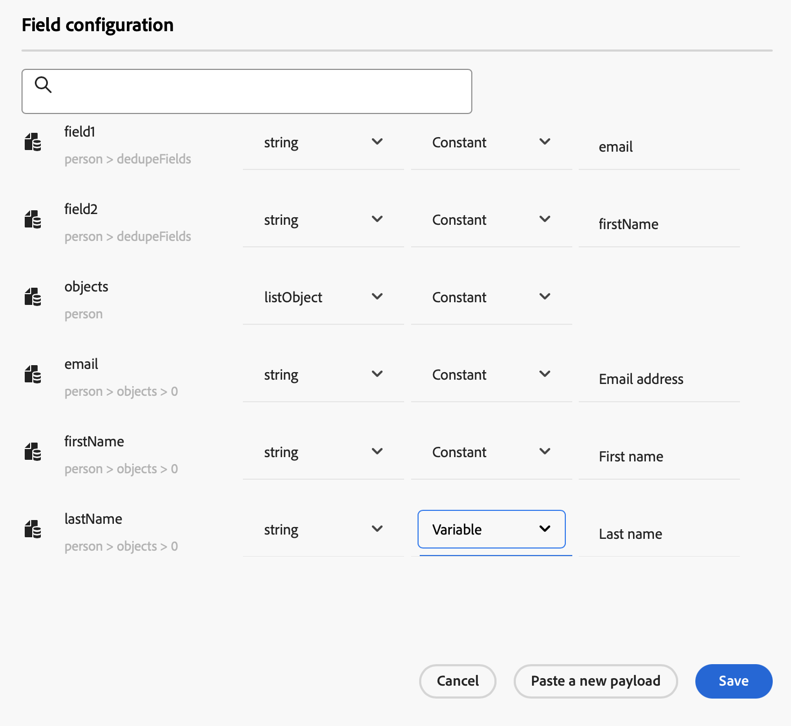
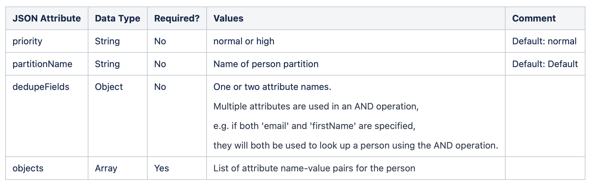

# Integrare con Marketo Engage {#integrating-with-marketo-engage}

Approfitta di un percorso di integrazione perfetta dei dati con Marketo Engage. Nei percorsi è disponibile un’azione personalizzata specifica per integrare Adobe Journey Optimizer e Marketo Engage. Questa azione personalizzata supporta l’acquisizione di due tipi di dati chiave:

* **Persone** (profili): Marketo trasforma i profili in informazioni fruibili.
* **Oggetti personalizzati**: personalizza i tuoi dati con oggetti personalizzati, come i prodotti, per un approccio di marketing personalizzato.

## Prerequisiti {#prerequisites}

A questa integrazione si applicano i seguenti prerequisiti:

* L’istanza cliente di Marketo Engage deve essere abilitata per IMS
* L’istanza di Marketo Engage e l’istanza di Adobe Experience Platform/Journey Optimizer devono trovarsi nella stessa organizzazione
* Al cliente deve essere fornito l&#39;accesso **MktoSync: servizio di acquisizione**

## Configurare l’azione {#configure-marketo-action}


In Journey Optimizer, devi configurare un’azione personalizzata per Marketo Engage. Segui questi passaggi:

1. Selezionare **[!UICONTROL Configurazioni]** nella sezione del menu AMMINISTRAZIONE.
1. Nella sezione **[!UICONTROL Azioni]**, fai clic su **[!UICONTROL Crea azione]**. Il riquadro di configurazione delle azioni si apre sul lato destro dello schermo.
1. Immetti Nome, Descrizione e seleziona **Adobe Marketo Engage** come **Tipo azione**
   {width="40%" align="left"}
1. Fai clic sull&#39;icona **Modifica payload** per i payload **Richiesta** e **Risposta**.
1. Per entrambi, componi il payload e incollalo nella finestra a comparsa dedicata.
   {width="70%" align="left"}
1. Verifica e configura i valori del payload

   Nota: per passare i valori in modo dinamico, per ogni campo cambia **Costante** in **Variabile**.

   {width="70%" align="left"}

1. Fai clic su **Salva** nella schermata di configurazione del campo, quindi **Salva** l&#39;azione personalizzata.

Ora puoi utilizzare l’azione personalizzata nell’area di lavoro del percorso.

## Sintassi del payload {#payload-syntax}

### Persona



### CustomObject


**Esempio di payload per la persona**

```json
{
   "munchkinID": "388-KKG-245",  
   "person": {
    "priority": "normal",
    "partitionName": "XYZ",
    "dedupeFields": {
      "field1": "email",
      "field2": "firstName"
    },
    "objects": [
      {
        "email": "Email address",
        "firstName": "First name",
        "lastName": "Last name"
      }
    ]
  }
}
```

**Esempio di payload per l&#39;oggetto personalizzato**

```json
{
  "munchkinID": "388-KKG-245", 
  "customObject": {
    "priority": "normal",
    "objectName": "products",
    "objects": [
      {
        "email": "Email Address",
        "productName": "Product Name",
        "productQty": "Product Quantity",
        "priceTotal": "Price Total"
      }
    ]
  }
}
```


## Utilizza l’azione {#engage-using}

Per ogni azione configurata, nella palette di Progettazione percorsi è disponibile un’attività di azione di Marketo Engage.

Per utilizzarlo, effettua le seguenti operazioni:

1. Trascina l’azione personalizzata nell’area di lavoro del percorso.

1. Immetti l’etichetta e la descrizione di questa azione.

1. Nella sezione **Parametri richiesta**, fai clic sull&#39;icona **Modifica** per ciascuno dei parametri e seleziona i valori dinamici configurati nel payload.

{width="70%" align="left"}
