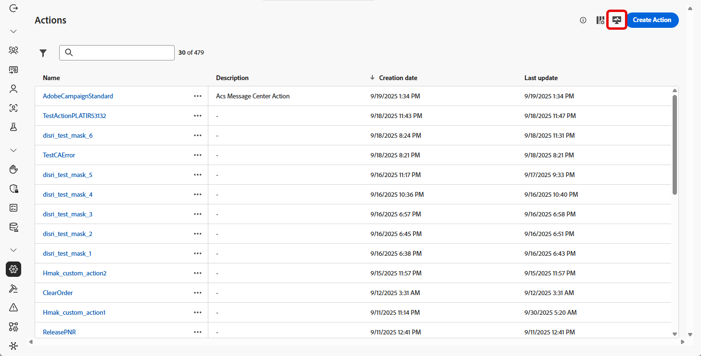
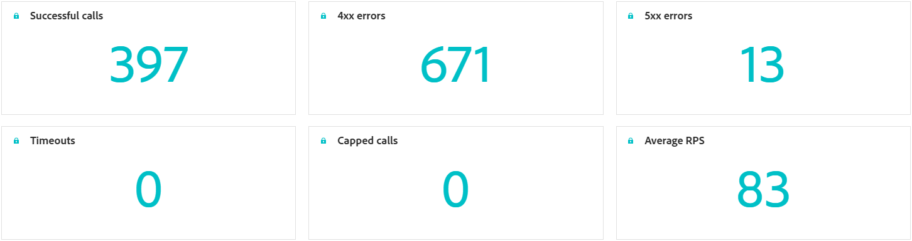
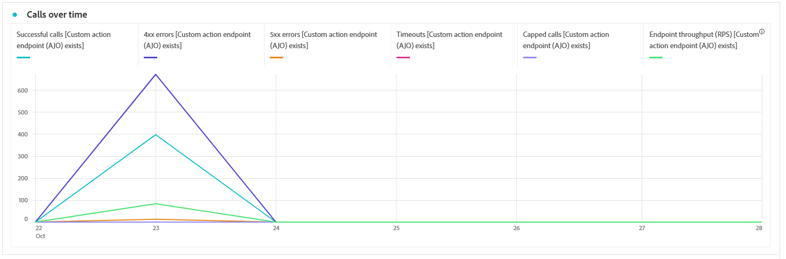
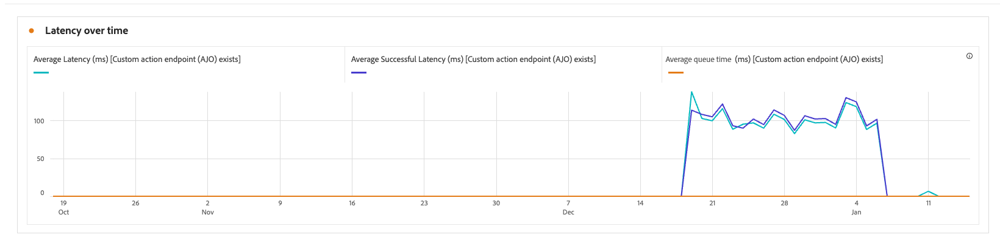
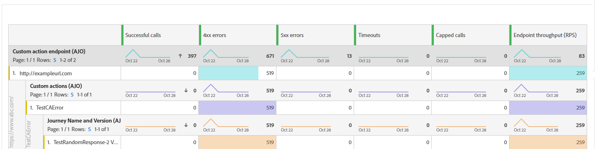
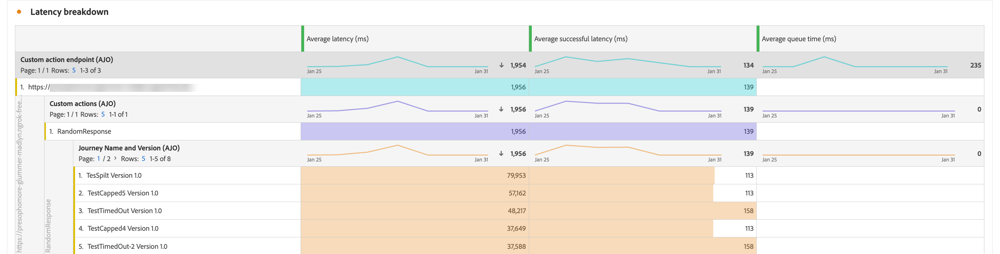

# Monitorare le azioni personalizzate {#reporting}

>[!CONTEXTUALHELP]
>id="ajo_campaigns_custom_actions_monitor"
>title="Monitorare le azioni personalizzate"
>abstract="La pagina di reporting **[!UICONTROL Azione personalizzata]** consente di monitorare le prestazioni e l&#39;affidabilità delle chiamate API effettuate dai percorsi a sistemi di terze parti."

La pagina di reporting **[!UICONTROL Azione personalizzata]** consente di monitorare l&#39;affidabilità e le prestazioni delle chiamate API effettuate dai percorsi ai sistemi di terze parti. Questi rapporti consentono di identificare rapidamente i problemi di integrazione, i colli di bottiglia della latenza o i limiti di limitazione/limite che possono influire sulla distribuzione.

La pagina per la generazione di rapporti sulle azioni personalizzate funziona come altri rapporti all-time in Journey Optimizer. Per informazioni dettagliate sulle funzionalità del dashboard, consulta [questa documentazione](../reports/report-cja-manage.md).

Per accedere alla pagina di reporting **[!UICONTROL Azione personalizzata]**, fai clic su  nella home page **[!UICONTROL Azioni]**.

➡️ [Ulteriori informazioni sulla configurazione delle azioni personalizzate](../action/about-custom-action-configuration.md)

Oltre alla pagina di reporting **[!UICONTROL Azione personalizzata]**, è possibile utilizzare **[!DNL Adobe Experience Platform Query Service]** per creare query per creare rapporti sulle metriche delle prestazioni delle azioni personalizzate. Esempi di query disponibili in [questa sezione](../reports/query-examples.md).

## KPI {#kpis}

Gli indicatori di prestazioni chiave (KPI, Key Performance Indicators) **[!UICONTROL Azione personalizzata]** fungono da dashboard centralizzato e forniscono una visualizzazione consolidata dello stato operativo e dell&#39;affidabilità delle chiamate di azione personalizzate. Queste metriche consentono di valutare le prestazioni, identificare i colli di bottiglia e garantire integrazioni stabili con i sistemi esterni.

+++ Ulteriori informazioni sui KPI per azioni personalizzate

* **[!UICONTROL Chiamate riuscite]**: numero totale di chiamate HTTP che hanno restituito una risposta valida senza errori.

* **[!UICONTROL Errori 4xx/5xx]**: numero di chiamate non riuscite a causa di errori lato client (4xx) o lato server (5xx), evidenziando problemi di configurazione o errori endpoint.

* **[!UICONTROL Timeout]**: numero di chiamate non riuscite perché hanno superato il tempo di risposta massimo. Questo aiuta a far emergere problemi di latenza o prestazioni con gli endpoint esterni.

* **[!UICONTROL Chiamate limitate]**: numero di chiamate bloccate a causa di limiti di limitazione, per evitare che i sistemi a valle vengano sovraccaricati.

* **[!UICONTROL RPS medio]**: numero di richieste al secondo elaborate dall&#39;azione personalizzata nell&#39;intervallo di tempo selezionato.

* **[!UICONTROL Latenza media]**: tempo medio di risposta end-to-end (in millisecondi) per tutte le chiamate HTTP, incluse le chiamate riuscite, gli errori e i timeout.

* **[!UICONTROL Latenza media riuscita]**: tempo medio di risposta end-to-end (in millisecondi) solo per le chiamate riuscite, escluse le richieste non riuscite e i timeout.

* **[!UICONTROL Tempo medio coda]**: tempo medio (in millisecondi) di attesa delle chiamate nella coda di esecuzione prima dell&#39;invio. Questo si applica solo agli endpoint limitati, in cui Journey Optimizer mette in coda le chiamate quando viene raggiunto il limite di velocità effettiva.

+++

## Chiamate nel tempo {#calls}

Il grafico **[!UICONTROL Chiamate nel tempo]** mostra la tendenza dell&#39;indicatore KPI della chiamata HTTP nel periodo di tempo selezionato per il rapporto. La granularità della serie temporale dipende dall’intervallo temporale selezionato. Ad esempio:

* Per un rapporto di 7 giorni, ogni punto dati mostrerà i KPI per un giorno.
* Se selezioni un intervallo di tempo di 1 giorno, il grafico mostra i KPI all’ora.
* Se selezioni un intervallo di tempo di 1 ora, il grafico mostra i KPI al minuto.

➡️[Consulta la sezione KPI per una descrizione delle metriche della chiamata HTTP](#kpis)

## Latenza nel tempo {#latency-overtime}

Il grafico **[!UICONTROL Latenza nel tempo]** visualizza la tendenza delle metriche di latenza nel periodo di tempo selezionato. Questa vista della serie temporale consente di tenere traccia dei modelli di prestazioni, identificare i periodi di latenza di picco e monitorare l’impatto delle ottimizzazioni o dei cambiamenti del sistema nel tempo.

➡️[Consulta la sezione KPI per una descrizione delle metriche di latenza](#kpis)

## Suddivisione chiamata {#breakdown}

La tabella **[!UICONTROL Analisi stratificata chiamate]** fornisce una suddivisione gerarchica delle metriche delle chiamate HTTP, dalle metriche globali per endpoint al livello superiore alle metriche per azione personalizzata che utilizzano ogni endpoint fino ai percorsi che si basano su di esse al livello inferiore.

➡️[Consulta la sezione KPI per una descrizione delle metriche della chiamata HTTP](#kpis)

## Suddivisione latenza {#latency-breakdown}

La tabella **[!UICONTROL Analisi stratificata latenza]** fornisce una suddivisione dettagliata delle metriche di latenza nelle azioni personalizzate. Questa vista consente di identificare gli endpoint o le azioni specifici che presentano problemi di prestazioni, consentendo di individuare e risolvere in modo efficace i colli di bottiglia di latenza.

➡️[Consulta la sezione KPI per una descrizione delle metriche di latenza](#kpis)

## Video dimostrativo {#video}

Il video seguente mostra come monitorare l’affidabilità e le prestazioni delle chiamate API effettuate dai tuoi percorsi a sistemi di terze parti.

+++Guarda il video

>[!VIDEO](https://video.tv.adobe.com/v/3479549?captions=ita&quality=12&learn=on)

+++
