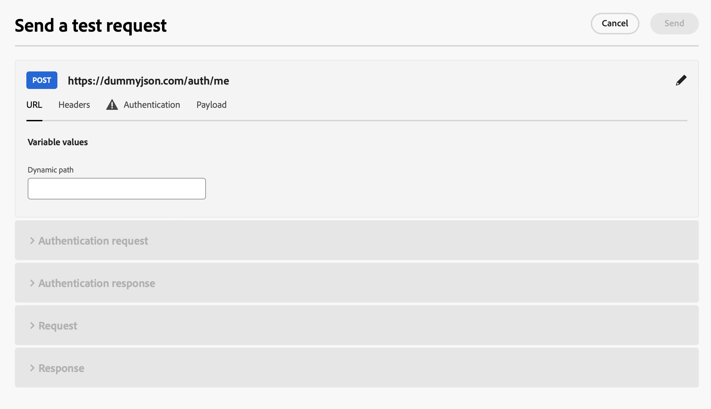
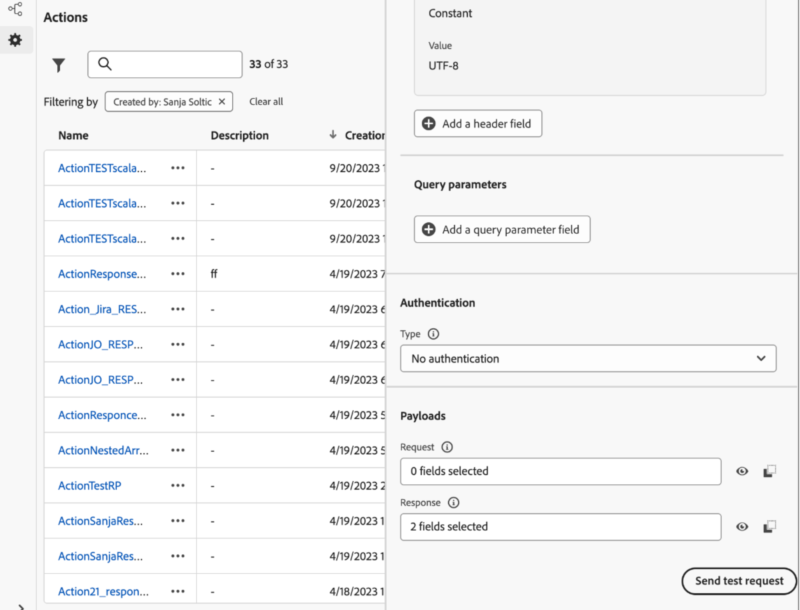

# Risolvere i problemi relativi alle azioni personalizzate {#troubleshoot-a-custom-action}

Puoi verificare le azioni personalizzate inviando chiamate API dalla sezione amministrazione dell’interfaccia utente di Journey Optimizer. Questa funzionalità consente di risolvere i problemi relativi alle azioni personalizzate prima o dopo il loro utilizzo in un percorso.

In qualità di amministratore, utilizza la funzionalità **[!UICONTROL Invia richiesta di test]** per convalidare le configurazioni delle azioni personalizzate effettuando chiamate API reali direttamente da Adobe Journey Optimizer. Questa funzione assicura che la struttura della richiesta, le intestazioni, l’autenticazione e il payload siano formattati correttamente prima di essere utilizzati in un percorso.

{width="70%" align="left"}

Utilizza questa funzionalità per semplificare il processo di test e convalida, garantendo il corretto funzionamento delle azioni personalizzate nei percorsi live.

>[!NOTE]
>
>Se nell&#39;organizzazione è abilitato il proxy IP (in uscita), la chiamata **[!UICONTROL Invia richiesta di test]** lo ignora. Per confermare il routing proxy, esegui un test o un percorso live. Ulteriori informazioni sul proxy IP (in uscita) e sull&#39;abilitazione in [Integrare con sistemi esterni](../configuration/external-systems.md#faq).

## Prerequisiti {#troubleshoot-custom-action-prereq}

Per utilizzare la funzionalità **[!UICONTROL Invia richiesta di test]**, è necessario preconfigurare un&#39;azione personalizzata **&#x200B;**&#x200B;con un URL, intestazioni e impostazioni di autenticazione.

Affinché gli amministratori possano utilizzare questa funzionalità, sono necessarie le seguenti autorizzazioni:

* Gli utenti devono disporre dell&#39;autorizzazione **[!DNL Manage journeys events, data sources and actions]**.
* Questa autorizzazione è inclusa nel ruolo *Amministratori di Percorso*.
* La sola autorizzazione **[!DNL View journeys events]** non è sufficiente.

Ulteriori informazioni sulle autorizzazioni di percorso in [questa sezione](../administration/high-low-permissions.md#journey-capability).

## Come utilizzare la funzione Send test request {#troubleshoot-custom-action-use}

Per testare un’azione personalizzata, effettua le seguenti operazioni:

1. Passa alla schermata di configurazione **Azioni** e seleziona un&#39;azione personalizzata.
1. Fai clic sul pulsante **[!UICONTROL Invia richiesta test]** nella parte inferiore della schermata di configurazione dell&#39;azione.
   {width="70%" align="left"}
1. Nella finestra pop-up, che consente di specificare i parametri della richiesta:

   * Se il metodo di azione personalizzato **è GET**, non è richiesto alcun payload.
   * Se il metodo di azione personalizzato **è POST**, è necessario fornire un payload JSON.

     >[!NOTE]
     >
     >Adobe Journey Optimizer genererà un errore se la struttura di questo JSON non è corretta, ma non lo farà in caso di mancata corrispondenza con un tipo di dati. Ad esempio, non si verifica alcun errore se si utilizza un parametro intero per quella che deve essere una stringa.

   * Se è definita l&#39;autenticazione, verrà richiesto di immettere i dettagli di autenticazione.

1. Fai clic su **Invia** per eseguire la richiesta.
1. La risposta dall’API, incluse le intestazioni e i codici di stato, verrà visualizzata nell’interfaccia.

## Gestione dell’autenticazione {#troubleshoot-custom-action-auth}

Quando un’azione personalizzata include l’autenticazione, Adobe Journey Optimizer richiede all’utente di immettere i dettagli di autenticazione per ogni richiesta di test:

* **Autenticazione di base:** L&#39;utente deve fornire la *password*.
* **Autenticazione chiave API:** L&#39;utente deve immettere la chiave API *value*.
* **Autenticazione personalizzata:** L&#39;utente deve fornire i parametri di autenticazione nella richiesta *bodyParam*. In questo caso vengono aggiunte due sezioni: **Richiesta di autenticazione** e **Risposta di autenticazione**.

## Vantaggi chiave {#troubleshoot-custom-action-benefits}

In qualità di amministratore di Journey Optimizer, puoi anche utilizzare strumenti esterni (ad esempio, Postman) per testare le azioni personalizzate. Di seguito sono elencati i principali vantaggi della funzionalità di risoluzione dei problemi interna al prodotto rispetto a un test esterno:

* La richiesta di test viene eseguita da **AJO Percorsi**, ovvero:

   * Viene utilizzata la struttura esatta della richiesta (comprese le intestazioni specifiche di Adobe Journey Optimizer).
   * L’IP sorgente e le intestazioni corrispondono a quelle utilizzate nei percorsi live.

* La funzionalità **[!UICONTROL Invia richiesta di test]** può essere utilizzata per la risoluzione dei problemi di **percorsi live**, in quanto l&#39;azione personalizzata è già distribuita.

* Questa funzionalità di test interna al prodotto elimina la necessità di copiare manualmente i dettagli di configurazione tra gli strumenti, riducendo il rischio di errori.

## Risoluzione dei problemi {#troubleshoot-custom-action-check}

Se la richiesta non riesce, puoi controllare:

* Credenziali di autenticazione immesse nel test.
* Il metodo di richiesta (GET vs. POST) e il payload corrispondente.
* L’endpoint API e le intestazioni definiti nell’azione personalizzata.
* Utilizza i dati di risposta per identificare potenziali configurazioni errate.

## Gestione degli eventi di eliminazione e dei timeout di inattività {#handling-discard-events-and-idle-timeouts}

Quando un&#39;azione personalizzata in un percorso attiva un evento che deve iniziare un **secondo percorso**, assicurati che il secondo percorso sia in uno stato valido e che l&#39;evento sia riconosciuto. Se l&#39;evento non soddisfa le condizioni di ingresso del secondo percorso, può essere **scartato** e comparire nei registri con codici come `notSuitableInitialEvent`. I timeout di inattività possono verificarsi se il secondo percorso non è pronto e causare l’eliminazione degli eventi nei registri.

**Cause comuni:**

* **Qualificazione evento non soddisfatta** - Il secondo percorso utilizza un evento basato su regole con una condizione di qualifica (ad esempio, un campo obbligatorio non deve essere vuoto, ad esempio `isNotEmpty` in un campo specifico). Se il payload dell&#39;evento non soddisfa tale condizione (ad esempio, se il campo è vuoto o mancante), l&#39;evento viene **ricevuto ma scartato** e il secondo percorso non viene attivato. Questo è il comportamento previsto; la documentazione e i registri confermano che se la condizione di qualifica non viene soddisfatta, l’evento verrà scartato e il percorso non verrà attivato per quel profilo. Verifica che il payload inviato dall’azione personalizzata includa tutti i campi e i valori richiesti dalla configurazione dell’evento del secondo percorso. Scopri come [configurare gli eventi basati su regole](../event/about-creating.md) e [risolvere i problemi di ricezione degli eventi](../building-journeys/troubleshooting-execution.md#checking-if-people-enter-the-journey) nell&#39;esecuzione del percorso.

* **Secondo percorso non pronto** - Possono verificarsi timeout di inattività se il secondo percorso non è ancora attivo (ad esempio, non in modalità di test o non è attivo) o se esiste un intervallo di tempo tra l&#39;attivazione dell&#39;azione personalizzata e il secondo percorso pronto per la ricezione. Assicurati che il percorso target sia pubblicato o in modalità di test prima di attivare l&#39;azione personalizzata.

* **Diagnostica degli eventi di eliminazione** - Se nei registri vengono visualizzati eventi di eliminazione, controllare i registri di percorso e le tracce di Splunk per verificare se l&#39;evento è stato ricevuto ma scartato a causa della qualifica (il payload non soddisfa la regola) o della tempistica. Verificare che la data di inizio e la configurazione del secondo percorso siano corrette e che il percorso si trovi all&#39;interno della relativa finestra di date attiva.

Per evitare di ignorare gli eventi durante il concatenamento dei percorsi tramite azioni personalizzate, convalida il payload dell’evento in base alla regola dell’evento del secondo percorso e conferma che il percorso di destinazione sia attivo o in test e all’interno della relativa finestra di data attiva.

## Risorse aggiuntive

Consulta le sezioni seguenti per ulteriori informazioni sulla configurazione e sull’utilizzo delle azioni personalizzate:

* [Introduzione alle azioni personalizzate](../action/action.md): scopri cos&#39;è un&#39;azione personalizzata e come ti aiuta a connetterti ai sistemi di terze parti
* [Configura le azioni personalizzate](../action/about-custom-action-configuration.md) - Scopri come creare e configurare un&#39;azione personalizzata
* [Usa azioni personalizzate](../building-journeys/using-custom-actions.md) - Scopri come utilizzare le azioni personalizzate nei tuoi percorsi
* [Trasmettere le raccolte nei parametri delle azioni personalizzate](../building-journeys/collections.md) - Scopri come trasmettere una raccolta nei parametri delle azioni personalizzate compilata dinamicamente in fase di esecuzione

