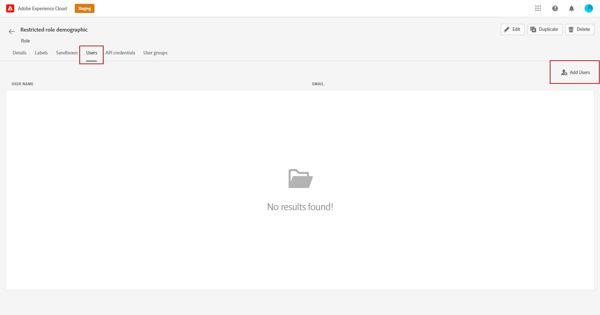
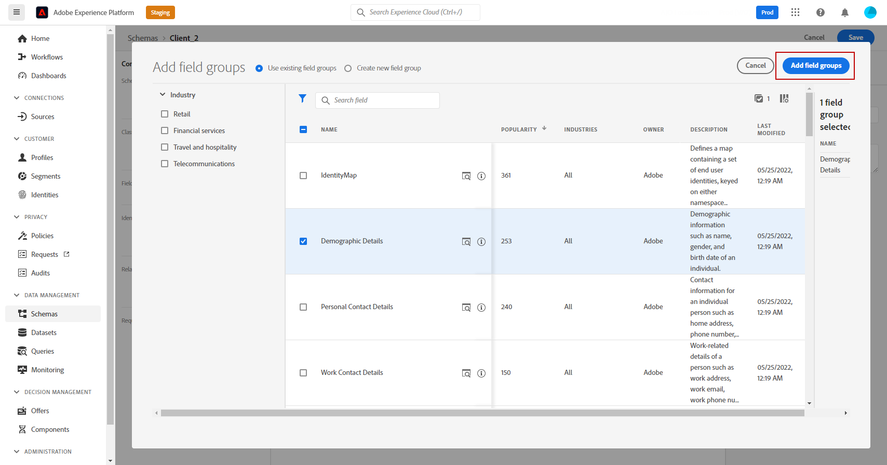
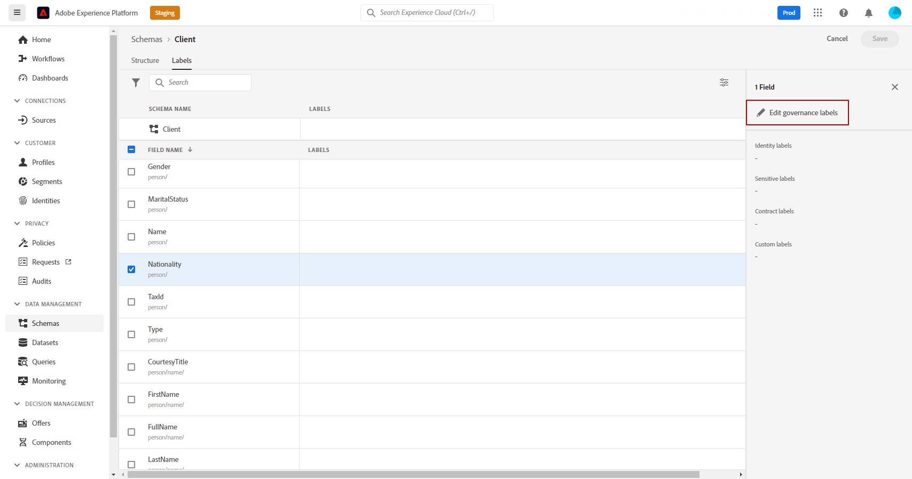

# Controllo degli accessi basato su attributi {#attribute-based-access}

>[!BEGINSHADEBOX]

**In questa pagina:** utilizza il controllo degli accessi basato su attributi in Adobe Journey Optimizer per limitare i campi schema sensibili, gli attributi di profilo e i tipi di pubblico ai ruoli autorizzati, in modo da proteggere i dati personali e impedire agli utenti non autorizzati di agire su di essi.

>[!ENDSHADEBOX]

La funzionalità di controllo dell’accesso basato su attributi consente di definire autorizzazioni per gestire l’accesso ai dati per team o gruppi di utenti specifici. Il suo scopo è proteggere le risorse digitali sensibili da utenti non autorizzati, fornendo un&#39;ulteriore protezione dei dati personali.

Utilizza il controllo dell’accesso basato su attributi in Adobe Journey Optimizer per proteggere i dati e concedere un accesso specifico a elementi di campo specifici, inclusi gli schemi Experience Data Model (XDM), gli attributi del profilo e i tipi di pubblico.

Per un elenco più dettagliato della terminologia utilizzata con il controllo degli accessi basato su attributi, consulta la [documentazione di Adobe Experience Platform](https://experienceleague.adobe.com/docs/experience-platform/access-control/abac/overview.html?lang=it){target="_blank"}.

In questo esempio, viene aggiunta un&#39;etichetta al campo schema **Nazionalità** per impedire agli utenti non autorizzati di utilizzarla. Affinché ciò funzioni, effettua le seguenti operazioni:

1. Crea un nuovo **[!UICONTROL Ruolo]** e assegnalo con la **[!UICONTROL Etichetta]** corrispondente affinché gli utenti possano accedere e utilizzare il campo schema.

1. Assegna un&#39;etichetta **[!UICONTROL 1&rbrace; al campo schema** Nazionalità&#x200B;**in Adobe Experience Platform.]**

1. Utilizza il campo **[!UICONTROL Schema]** in Adobe Journey Optimizer.

Tieni presente che è possibile accedere a **[!UICONTROL Ruoli]**, **[!UICONTROL Criteri]** e **[!UICONTROL Prodotti]** anche con l&#39;API di controllo degli accessi basata su attributi. Per ulteriori informazioni, consulta questa [documentazione](https://experienceleague.adobe.com/docs/experience-platform/access-control/abac/abac-api/overview.html?lang=it){target="_blank"}.

## Creare un ruolo e assegnare etichette {#assign-role}

>[!IMPORTANT]
>
>&#x200B;>Prima di gestire le autorizzazioni per un ruolo, crea un criterio. Per ulteriori informazioni, consulta la [documentazione di Adobe Experience Platform](https://experienceleague.adobe.com/docs/experience-platform/access-control/abac/permissions-ui/policies.html?lang=it){target="_blank"}.

**[!UICONTROL I ruoli]** sono un insieme di utenti che condividono le stesse autorizzazioni, etichette e sandbox all&#39;interno dell&#39;organizzazione. Ogni utente appartenente a un **[!UICONTROL Ruolo]** ha diritto alle app e ai servizi Adobe contenuti nel prodotto. Puoi anche creare **[!UICONTROL Ruoli]** personalizzati per ottimizzare l&#39;accesso degli utenti a determinate funzionalità o oggetti nell&#39;interfaccia.

Per concedere agli utenti selezionati l&#39;accesso al campo **Nazionalità** etichettato C2, creare un nuovo **[!UICONTROL Ruolo]** con un gruppo specifico di utenti e concedere loro l&#39;etichetta C2, consentendo loro di utilizzare i dettagli **Nazionalità** in un **[!UICONTROL Percorso]**.

1. Dal prodotto [!DNL Permissions], seleziona **[!UICONTROL Ruolo]** dal menu del riquadro a sinistra e fai clic su **[!UICONTROL Crea ruolo]**. Puoi anche aggiungere **[!UICONTROL Label]** ai ruoli incorporati.

   

1. Aggiungi un **[!UICONTROL Nome]** e una **[!UICONTROL Descrizione]** al nuovo **[!UICONTROL Ruolo]**, qui: Ruolo demografico limitato.

1. Dall&#39;elenco a discesa, seleziona la tua **[!UICONTROL Sandbox]**.

   

1. Dal menu **[!UICONTROL Risorse]**, fai clic su **[!UICONTROL Adobe Experience Platform]** per aprire le diverse funzionalità. In questo caso, vengono selezionati **[!UICONTROL Percorsi]**.

   

1. Dall&#39;elenco a discesa, selezionare le **[!UICONTROL Autorizzazioni]** collegate alla funzionalità selezionata, ad esempio **[!UICONTROL Visualizza percorsi]** o **[!UICONTROL Pubblica percorsi]**.

   

1. Dopo aver salvato il **[!UICONTROL Ruolo]** appena creato, fai clic su **[!UICONTROL Proprietà]** per configurare ulteriormente l&#39;accesso al tuo ruolo.

   

1. Dalla scheda **[!UICONTROL Utenti]**, fai clic su **[!UICONTROL Aggiungi utenti]**.

   

1. Dalla scheda **[!UICONTROL Etichette]**, seleziona **[!UICONTROL Aggiungi etichetta]**.

   

1. Seleziona le **[!UICONTROL etichette]** da aggiungere al tuo ruolo e fai clic su **[!UICONTROL Salva]**. Per questo esempio, concedi l’etichetta C2 per consentire agli utenti di accedere al campo dello schema con restrizioni precedenti.

   

Gli utenti con il ruolo **Dati demografici limitati** ora hanno accesso agli oggetti con etichetta C2.

## Assegnare etichette a un oggetto in Adobe Experience Platform {#assign-label}

>[!WARNING]
>
>Un utilizzo non corretto delle etichette può interrompere l’accesso delle persone e attivare violazioni dei criteri.

**[!UICONTROL Le etichette]** possono essere utilizzate per assegnare aree di caratteristiche specifiche utilizzando il controllo degli accessi basato su attributi. In questo esempio, l&#39;accesso al campo **Nazionalità** è limitato. Questo campo sarà accessibile solo agli utenti con l&#39;**[!UICONTROL Etichetta]** corrispondente assegnata al loro **[!UICONTROL Ruolo]**.

Puoi anche aggiungere **[!UICONTROL Label]** a **[!UICONTROL Schema]**, **[!UICONTROL Set di dati]** e **[!UICONTROL Tipi di pubblico]**.

1. Crea il tuo **[!UICONTROL schema]**. Per ulteriori informazioni, consulta [questa documentazione](https://experienceleague.adobe.com/docs/experience-platform/xdm/schema/composition.html?lang=it){target="_blank"}.

   

1. Nel **[!UICONTROL Schema]** appena creato, viene innanzitutto aggiunto il gruppo di campi **[!UICONTROL Dettagli demografici]** contenente il campo **Nazionalità**.

   

1. Dalla scheda **[!UICONTROL Etichette]**, controlla il nome del campo con restrizioni, qui **Nazionalità**. Dal menu del riquadro di destra, selezionare **[!UICONTROL Modifica etichette di governance]**.

   

1. Selezionare l&#39;**[!UICONTROL etichetta]** corrispondente. In questo caso, i dati C2 - non possono essere esportati a terze parti. Per l&#39;elenco dettagliato delle etichette disponibili, consultare [questa pagina](https://experienceleague.adobe.com/docs/experience-platform/data-governance/labels/reference.html?lang=it#contract-labels){target="_blank"}.

   

1. Se necessario, personalizza ulteriormente lo schema, quindi attivalo. Per i passaggi dettagliati su come abilitare lo schema, consulta questa [pagina](https://experienceleague.adobe.com/docs/experience-platform/xdm/ui/resources/schemas.html?lang=it#profile){target="_blank"}.

Il campo dello schema ora sarà visibile e utilizzabile solo dagli utenti che fanno parte di un set di ruoli con l’etichetta C2. Applicando una **[!UICONTROL Etichetta]** al **[!UICONTROL Nome campo]**, la **[!UICONTROL Etichetta]** verrà automaticamente applicata al campo **Nazionalità** in ogni schema creato.

## Accedere agli oggetti con etichetta in Adobe Journey Optimizer {#attribute-access-ajo}

Dopo aver etichettato il nome del campo **Nazionalità** in un nuovo schema e ruolo, l&#39;impatto di questa restrizione può essere osservato in Adobe Journey Optimizer. Per questo esempio:

* L&#39;utente X, con accesso agli oggetti etichettati C2, crea un percorso con una condizione che ha come destinazione il **[!UICONTROL nome campo]** con restrizioni.
* L&#39;utente Y, senza accesso agli oggetti etichettati C2, tenta di pubblicare il percorso.

1. Da Adobe Journey Optimizer, configura l&#39;**[!UICONTROL origine dati]** con il nuovo schema.

   

1. Aggiungi un nuovo **[!UICONTROL Gruppo di campi]** del **[!UICONTROL Schema]** appena creato all&#39;**[!UICONTROL Origine dati]** integrata. È inoltre possibile creare una nuova **[!UICONTROL origine dati]** esterna e **[!UICONTROL gruppi di campi]** associati.

   

1. Dopo aver selezionato lo **[!UICONTROL Schema]** creato in precedenza, fai clic su **[!UICONTROL Modifica]** dalla categoria **[!UICONTROL Campi]**.

   

1. Selezionare il **[!UICONTROL Nome campo]** di cui si desidera eseguire la destinazione. In questo punto viene selezionato il campo **Nazionalità** limitata.

   

1. Crea un percorso che invia un’e-mail agli utenti con una nazionalità specifica. Aggiungi un **[!UICONTROL evento]** e una **[!UICONTROL condizione]**.

   

1. Seleziona il campo **Nazionalità** limitata per iniziare a creare l&#39;espressione.

   

1. Modifica la **[!UICONTROL Condizione]** per eseguire il targeting di una popolazione specifica con il campo **Nazionalità** limitata.

   

1. Personalizza il tuo percorso in base alle esigenze. Qui aggiungiamo un&#39;azione **[!UICONTROL E-mail]**.

   

Se l&#39;utente Y non ha accesso all&#39;etichetta di oggetti C2, deve accedere a questo percorso con il campo con restrizioni:

* L&#39;utente Y non potrà utilizzare il nome del campo con restrizioni poiché non sarà visibile.
* L’utente Y non potrà modificare l’espressione con il nome del campo con restrizioni in modalità avanzata. Verrà visualizzato il seguente errore: `The expression is invalid. Field is no longer available or you do not have enough permission to see it`.
* L&#39;utente Y può eliminare l&#39;espressione.
* L&#39;utente Y non potrà testare il percorso.
* L&#39;utente Y non potrà pubblicare il percorso.

+++ Guida di riferimento della Knowledge Base di AI

Questa sezione contiene informazioni strutturate che supportano l&#39;interpretazione, il recupero e la risposta alle domande relative a questo argomento.

Per una comprensione completa, queste informazioni devono essere unite alla documentazione su questa pagina. Nessuna delle due origini è progettata per essere indipendente; la pagina descrive la funzione, mentre questa sezione fornisce un contesto aggiuntivo che aiuta a non ambiguare la terminologia, le finalità, l’applicabilità e i vincoli.

* **TL;DR:** Proteggere i campi dati sensibili in Journey Optimizer applicando etichette di governance ai campi dello schema e assegnando etichette corrispondenti ai ruoli, in modo che gli utenti non autorizzati non possano visualizzare, modificare, testare o pubblicare percorsi che utilizzano tali campi con restrizioni.

**Intenti:**

* Crea un ruolo e assegna un’etichetta di governance per limitare l’accesso a campi schema specifici
* Applicare un’etichetta a un campo schema in Adobe Experience Platform per applicare le restrizioni di accesso
* Utilizzare un campo schema con etichetta in un percorso Journey Optimizer
* Scopri in che modo gli utenti che non dispongono delle restrizioni di accesso all’esperienza delle etichette necessarie nei percorsi
* Gestire ruoli, criteri e prodotti tramite l’API di controllo degli accessi basata su attributi

**Glossario:**

* **ABAC (Attribute-based Access Control)**: funzionalità per definire le autorizzazioni per gestire l&#39;accesso ai dati per team o gruppi di utenti specifici in base ad attributi quali le etichette *(product-specific)*
* **Ruolo**: un insieme di utenti che condividono le stesse autorizzazioni, etichette e sandbox all&#39;interno di un&#39;organizzazione *(specifico per prodotto)*
* **Etichetta**: un marcatore di governance (ad esempio, C2) applicato a campi di schema, set di dati o tipi di pubblico per controllare quali ruoli possono accedervi *(specifico per prodotto)*
* **Criterio**: configurazione che deve essere creata prima di gestire le autorizzazioni per un ruolo — prerequisito per ABAC *(specifico per prodotto)*
* **Schema XDM**: schema Experience Data Model utilizzato per definire la struttura dati in Adobe Experience Platform *(specifico per prodotto)*

**Guardrail:**

* È necessario creare un criterio prima di gestire le autorizzazioni per un ruolo (prerequisito, come indicato nella nota importante sulla pagina)
* Un utilizzo errato delle etichette può interrompere l’accesso delle persone e attivare violazioni dei criteri (come indicato nell’Avvertenza sulla pagina)
* Gli utenti senza un’etichetta corrispondente a un campo con restrizioni non possono: visualizzare il nome del campo con restrizioni, modificare le espressioni che vi fanno riferimento in modalità avanzata, testare il percorso o pubblicare il percorso

**Terminologia:**

* Nome canonico: Attribute-based access control — Acronimo: ABAC — varianti: attribute-based access management
* Nome canonico: Experience Data Model — Acronimo: XDM — varianti: schema XDM, schemi XDM
* Sinonimi: &quot;Label&quot; = &quot;governance label&quot; = &quot;data governance label&quot;
* Da non confondere: &quot;Role&quot; (un gruppo di utenti con autorizzazioni ed etichette condivise) ≠ &quot;Policy&quot; (regole che disciplinano l’applicazione dell’accesso ai dati basato su etichette)
* Non confondere: ABAC (controlla l’accesso a campi di schema, set di dati e tipi di pubblico tramite criteri di etichette a livello di piattaforma) ≠ OLAC (controlla l’accesso a oggetti Journey Optimizer specifici come percorsi e campagne)

**Domande frequenti:**

* **Q: è possibile aggiungere etichette ai ruoli incorporati?** — Sì, è possibile aggiungere etichette ai ruoli personalizzati e incorporati.
* **D: cosa succede a un utente a cui manca l&#39;etichetta per un campo con restrizioni in un percorso?** — Il campo non è visibile, non è possibile modificare le espressioni che vi fanno riferimento, testare il percorso o pubblicare il percorso.
* **Q: è possibile applicare etichette a oggetti diversi dai campi dello schema?** — Sì; le etichette possono essere applicate anche a schemi, set di dati e tipi di pubblico.
* **D: esiste un&#39;API per la gestione di ruoli, criteri e prodotti con ABAC?** — Sì; è possibile accedere a ruoli, criteri e prodotti tramite l&#39;API di controllo dell&#39;accesso basata su attributi.

+++
<!-- ai-accordion-version: 1 | source-hash: aa94c226 -->