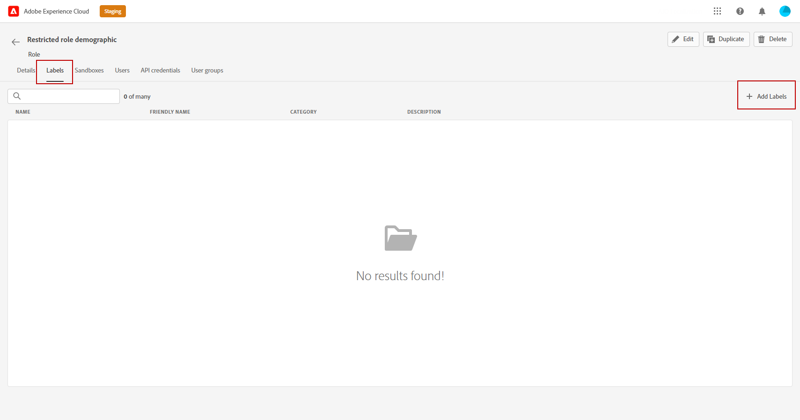
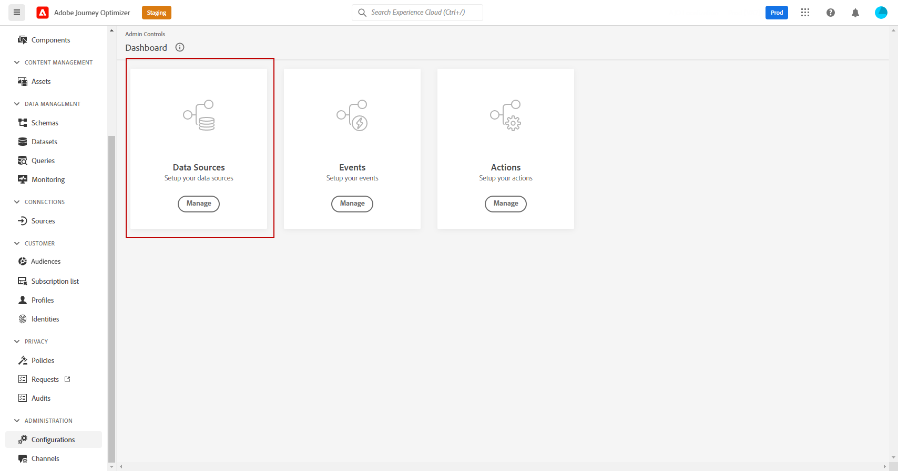

# Controllo degli accessi basato su attributi {#attribute-based-access}

La funzionalità di controllo dell’accesso basato su attributi consente di definire autorizzazioni per gestire l’accesso ai dati per team o gruppi di utenti specifici. Il suo scopo è proteggere le risorse digitali sensibili da utenti non autorizzati, consentendo un&#39;ulteriore protezione dei dati personali.

Utilizza il controllo dell’accesso basato su attributi in Adobe Journey Optimizer per proteggere i dati e concedere un accesso specifico a elementi di campo specifici, inclusi gli schemi Experience Data Model (XDM), gli attributi del profilo e i tipi di pubblico.

Per un elenco più dettagliato della terminologia utilizzata con il controllo degli accessi basato su attributi, fare riferimento alla [documentazione di Adobe Experience Platform](https://experienceleague.adobe.com/docs/experience-platform/access-control/abac/overview.html?lang=it){target="_blank"}.

In questo esempio, si desidera aggiungere un&#39;etichetta al campo schema **Nazionalità** per impedire agli utenti non autorizzati di utilizzarla. Affinché ciò funzioni, devi eseguire i seguenti passaggi:

1. Crea un nuovo **[!UICONTROL Ruolo]** e assegnalo con la **[!UICONTROL Etichetta]** corrispondente affinché gli utenti possano accedere e utilizzare il campo schema.

1. Assegna un&#39;etichetta **[!UICONTROL 1&rbrace; al campo schema** Nazionalità&#x200B;**in Adobe Experience Platform.]**

1. Utilizza il campo **[!UICONTROL Schema]** in Adobe Journey Optimizer.

Tieni presente che è possibile accedere a **[!UICONTROL Ruoli]**, **[!UICONTROL Criteri]** e **[!UICONTROL Prodotti]** anche con l&#39;API di controllo degli accessi basata su attributi. Per ulteriori informazioni, consulta questa [documentazione](https://experienceleague.adobe.com/docs/experience-platform/access-control/abac/abac-api/overview.html){target="_blank"}.

## Creare un ruolo e assegnare etichette {#assign-role}

>[!IMPORTANT]
>
>Prima di gestire le autorizzazioni per un ruolo, è necessario creare un criterio. Per ulteriori informazioni, consulta la [documentazione di Adobe Experience Platform](https://experienceleague.adobe.com/docs/experience-platform/access-control/abac/permissions-ui/policies.html?lang=it){target="_blank"}.

**[!UICONTROL I ruoli]** sono un insieme di utenti che condividono le stesse autorizzazioni, etichette e sandbox all&#39;interno dell&#39;organizzazione. Ogni utente appartenente a un **[!UICONTROL Ruolo]** ha diritto alle app e ai servizi Adobe contenuti nel prodotto.
Puoi anche creare **[!UICONTROL Ruoli]** personalizzati se desideri ottimizzare l&#39;accesso degli utenti a determinate funzionalità o oggetti nell&#39;interfaccia.

Si desidera ora concedere agli utenti selezionati l&#39;accesso al campo **Nazionalità**, etichettato C2. Per farlo, è necessario creare un nuovo **[!UICONTROL Ruolo]** con un gruppo specifico di utenti e concedere loro l&#39;etichetta C2 che consente di utilizzare i dettagli **Nazionalità** in un **[!UICONTROL Percorso]**.

1. Dal prodotto [!DNL Permissions], seleziona **[!UICONTROL Ruolo]** dal menu del riquadro a sinistra e fai clic su **[!UICONTROL Crea ruolo]**. Puoi anche aggiungere **[!UICONTROL Label]** ai ruoli incorporati.

   

1. Aggiungi un **[!UICONTROL Nome]** e una **[!UICONTROL Descrizione]** al nuovo **[!UICONTROL Ruolo]**, qui: Ruolo demografico limitato.

1. Dall&#39;elenco a discesa, seleziona la tua **[!UICONTROL Sandbox]**.

   

1. Dal menu **[!UICONTROL Risorse]**, fai clic su **[!UICONTROL Adobe Experience Platform]** per aprire le diverse funzionalità. In questo caso, vengono selezionati **[!UICONTROL Percorsi]**.

   

1. Dall&#39;elenco a discesa, selezionare le **[!UICONTROL Autorizzazioni]** collegate alla funzionalità selezionata, ad esempio **[!UICONTROL Visualizza percorsi]** o **[!UICONTROL Pubblica percorsi]**.

   

1. Dopo aver salvato il **[!UICONTROL Ruolo]** appena creato, fai clic su **[!UICONTROL Proprietà]** per configurare ulteriormente l&#39;accesso al tuo ruolo.

   

1. Dalla scheda **[!UICONTROL Utenti]**, fai clic su **[!UICONTROL Aggiungi utenti]**.

   

1. Dalla scheda **[!UICONTROL Etichette]**, seleziona **[!UICONTROL Aggiungi etichetta]**.

   

1. Seleziona le **[!UICONTROL etichette]** da aggiungere al tuo ruolo e fai clic su **[!UICONTROL Salva]**. Per questo esempio, viene concessa l’etichetta C2 agli utenti per poter accedere al campo dello schema con restrizioni precedenti.

   

Gli utenti con il ruolo **Dati demografici per ruolo con restrizioni** ora hanno accesso agli oggetti con etichetta C2.

## Assegnare etichette a un oggetto in Adobe Experience Platform {#assign-label}

>[!WARNING]
>
>Un utilizzo non corretto delle etichette può interrompere l’accesso alle persone e attivare violazioni dei criteri.

**[!UICONTROL Le etichette]** possono essere utilizzate per assegnare aree di caratteristiche specifiche utilizzando il controllo degli accessi basato su attributi.
In questo esempio, si desidera limitare l&#39;accesso al campo **Nazionalità**. Questo campo sarà accessibile solo agli utenti con l&#39;**[!UICONTROL etichetta]** corrispondente al loro **[!UICONTROL ruolo]**.

Puoi anche aggiungere **[!UICONTROL Label]** a **[!UICONTROL Schema]**, **[!UICONTROL Set di dati]** e **[!UICONTROL Tipi di pubblico]**.

1. Crea il tuo **[!UICONTROL schema]**. Per ulteriori informazioni, consulta [questa documentazione](https://experienceleague.adobe.com/docs/experience-platform/xdm/schema/composition.html?lang=it){target="_blank"}.

   

1. Nel **[!UICONTROL Schema]** appena creato, viene innanzitutto aggiunto il gruppo di campi **[!UICONTROL Dettagli demografici]** contenente il campo **Nazionalità**.

   

1. Dalla scheda **[!UICONTROL Etichette]**, controlla il nome del campo con restrizioni, qui **Nazionalità**. Dal menu del riquadro di destra, selezionare **[!UICONTROL Modifica etichette di governance]**.

   

1. Selezionare l&#39;**[!UICONTROL etichetta]** corrispondente. In questo caso, i dati C2 - non possono essere esportati a terze parti. Per l&#39;elenco dettagliato delle etichette disponibili, consultare [questa pagina](https://experienceleague.adobe.com/docs/experience-platform/data-governance/labels/reference.html#contract-labels){target="_blank"}.

   

1. Se necessario, personalizza ulteriormente lo schema, quindi attivalo. Per i passaggi dettagliati su come abilitare lo schema, fai riferimento a questa [pagina](https://experienceleague.adobe.com/docs/experience-platform/xdm/ui/resources/schemas.html#profile){target="_blank"}.

Il campo dello schema ora è visibile e può essere utilizzato solo dagli utenti che fanno parte di un set di ruoli con l’etichetta C2.
Applicando una **[!UICONTROL Etichetta]** al **[!UICONTROL Nome campo]**, tieni presente che **[!UICONTROL Etichetta]** verrà automaticamente applicata al campo **Nazionalità** in ogni schema creato.

## Accedere agli oggetti con etichetta in Adobe Journey Optimizer {#attribute-access-ajo}

Dopo aver assegnato al campo **Nazionalità** il nome in un nuovo schema e il nuovo ruolo, ora possiamo vedere l&#39;impatto di questa restrizione in Adobe Journey Optimizer.
Ad esempio, un primo utente X con accesso agli oggetti etichettati C2 creerà un Percorso con una condizione destinata al **[!UICONTROL Nome campo]** con restrizioni. Un secondo utente Y senza accesso agli oggetti etichettati C2 dovrà quindi pubblicare il Percorso.

1. Da Adobe Journey Optimizer, devi innanzitutto configurare **[!UICONTROL Origine dati]** con il nuovo schema.

   

1. Aggiungi un nuovo **[!UICONTROL Gruppo di campi]** del **[!UICONTROL Schema]** appena creato all&#39;**[!UICONTROL Origine dati]** integrata. È inoltre possibile creare una nuova **[!UICONTROL origine dati]** esterna e **[!UICONTROL gruppi di campi]** associati.

   

1. Dopo aver selezionato lo **[!UICONTROL Schema]** creato in precedenza, fai clic su **[!UICONTROL Modifica]** dalla categoria **[!UICONTROL Campi]**.

   

1. Selezionare il **[!UICONTROL Nome campo]** di cui si desidera eseguire la destinazione. In questo punto viene selezionato il campo **Nazionalità** limitata.

   

1. Quindi, crea un Percorso che invierà un’e-mail agli utenti con una nazionalità specifica. Aggiungi un **[!UICONTROL evento]** e quindi una **[!UICONTROL condizione]**.

   

1. Seleziona il campo **Nazionalità** limitata per iniziare a creare l&#39;espressione.

   

1. Modifica la **[!UICONTROL Condizione]** per eseguire il targeting di una popolazione specifica con il campo **Nazionalità** limitata.

   

1. Personalizza il tuo percorso in base alle esigenze. Qui aggiungiamo un&#39;azione **[!UICONTROL E-mail]**.

   

Se l&#39;utente Y senza accesso all&#39;etichetta degli oggetti C2 deve accedere a questo percorso con questo campo limitato:

* L&#39;utente Y non potrà utilizzare il nome del campo con restrizioni poiché non sarà visibile.

* L’utente Y non potrà modificare l’espressione con il nome di campo con restrizioni in modalità avanzata. Il seguente errore verrà visualizzato `The expression is invalid. Field is no longer available or you don't have enough permission to see it`.

* L&#39;utente Y può eliminare l&#39;espressione.

* L&#39;utente Y non potrà testare il Percorso.

* L&#39;utente Y non potrà pubblicare il Percorso.
