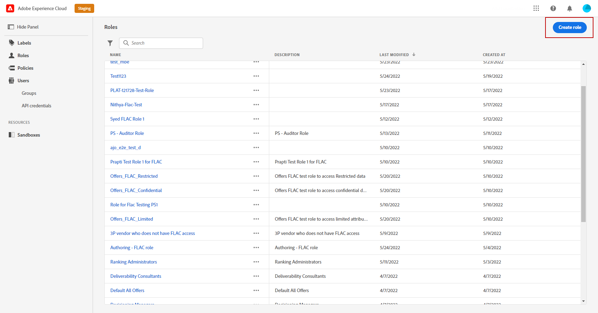
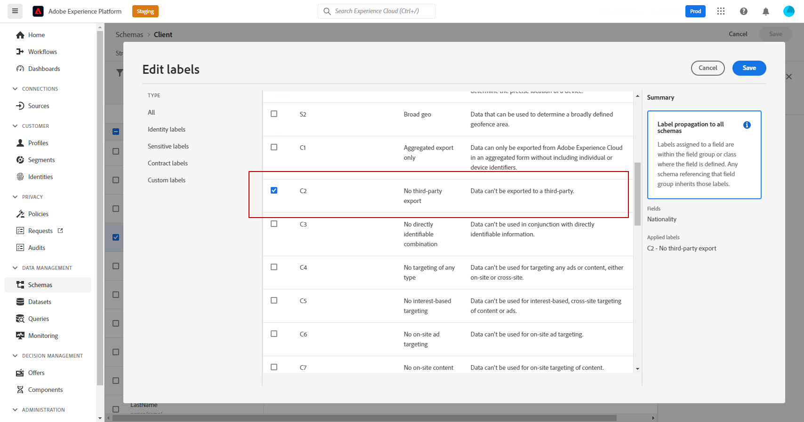

# Controllo degli accessi basato su attributi {#attribute-based-access}

Il controllo degli accessi basato su attributi (Attribute-Based Access Control - ABAC) consente di definire le autorizzazioni per gestire l&#39;accesso ai dati per team o gruppi di utenti specifici. Il suo scopo è proteggere le risorse digitali sensibili da utenti non autorizzati, consentendo un&#39;ulteriore protezione dei dati personali.

In Adobe Journey Optimizer, ABAC consente di proteggere i dati e concedere un accesso specifico a elementi di campo specifici, inclusi schemi Experience Data Model (XDM), attributi di profilo e tipi di pubblico.

Per un elenco più dettagliato della terminologia utilizzata con ABAC, fare riferimento a [Documentazione di Adobe Experience Platform](https://experienceleague.adobe.com/docs/experience-platform/access-control/abac/overview.html).

In questo esempio, desideri aggiungere un’etichetta al file **Nazionalità** per impedire agli utenti non autorizzati di utilizzarlo. Affinché ciò funzioni, devi eseguire i seguenti passaggi:

1. Crea un nuovo  **[!UICONTROL Ruolo]** e assegnarlo con il corrispondente  **[!UICONTROL Etichetta]** affinché gli utenti possano accedere e utilizzare il campo schema.

1. Assegna un  **[!UICONTROL Etichetta]** al **Nazionalità** campo schema in Adobe Experience Platform.

1. Utilizza il  **[!UICONTROL Campo schema]** in Adobe Journey Optimizer.

Tieni presente che **[!UICONTROL Ruoli]**, **[!UICONTROL Criteri]** e **[!UICONTROL Prodotti]** È inoltre possibile accedervi con l’API di controllo degli accessi basata su attributi. Per ulteriori informazioni, consulta questa [documentazione](https://experienceleague.adobe.com/docs/experience-platform/access-control/abac/abac-api/overview.html).

## Creare un ruolo e assegnare etichette {#assign-role}

>[!IMPORTANT]
>
>Prima di gestire le autorizzazioni per un ruolo, è necessario creare un criterio. Per ulteriori informazioni, consulta [Documentazione di Adobe Experience Platform](https://experienceleague.adobe.com/docs/experience-platform/access-control/abac/permissions-ui/policies.html).

**[!UICONTROL Ruoli]** sono un set di utenti che condividono le stesse autorizzazioni, etichette e sandbox all’interno dell’organizzazione. Ogni utente appartenente a un **[!UICONTROL Ruolo]** ha diritto alle app e ai servizi di Adobe contenuti nel prodotto.
Puoi anche creare **[!UICONTROL Ruoli]** se desideri ottimizzare l’accesso degli utenti a determinate funzionalità o oggetti nell’interfaccia.

Ora vogliamo concedere agli utenti selezionati l’accesso al **Nazionalità** campo, etichettato C2. Per farlo, è necessario creare un nuovo **[!UICONTROL Ruolo]** con un gruppo specifico di utenti e concedono loro l’etichetta C2 che consente loro di utilizzare **Nazionalità** dettagli in una **[!UICONTROL Percorso]**.

1. Dalla sezione [!DNL Permissions] product, select **[!UICONTROL Ruolo]** dal menu del riquadro sinistro e fare clic su **[!UICONTROL Crea ruolo]**. Puoi anche aggiungere **[!UICONTROL Etichetta]** ai ruoli incorporati.

   

1. Aggiungi un **[!UICONTROL Nome]** e **[!UICONTROL Descrizione]** al tuo nuovo **[!UICONTROL Ruolo]**, qui: Ruolo demografico limitato.

1. Dall’elenco a discesa, seleziona la tua **[!UICONTROL Sandbox]**.

   

1. Dalla sezione **[!UICONTROL Risorse]** menu, fai clic su **[!UICONTROL Adobe Experience Platform]** per aprire le diverse funzionalità. In questo caso, selezioniamo **[!UICONTROL Percorsi]**.

   

1. Dall’elenco a discesa, seleziona la **[!UICONTROL Autorizzazioni]** collegato alla feature selezionata, ad esempio **[!UICONTROL Visualizza percorsi]** o **[!UICONTROL Pubblica percorsi]**.

   

1. Dopo aver salvato la nuova **[!UICONTROL Ruolo]**, fai clic su **[!UICONTROL Proprietà]** per configurare ulteriormente l’accesso al tuo ruolo.

   

1. Dalla sezione **[!UICONTROL Utenti]** , fare clic su **[!UICONTROL Aggiungi utenti]**.

   

1. Dalla sezione **[!UICONTROL Etichette]** , seleziona **[!UICONTROL Aggiungi etichetta]**.

   

1. Seleziona la **[!UICONTROL Etichette]** desideri aggiungere al tuo ruolo e fai clic su **[!UICONTROL Salva]**. Per questo esempio, viene concessa l’etichetta C2 agli utenti per poter accedere al campo dello schema con restrizioni precedenti.

   

Gli utenti in **Ruolo demografico limitato** hanno ora accesso agli oggetti con etichetta C2.

## Assegnare etichette a un oggetto in Adobe Experience Platform {#assign-label}

>[!WARNING]
>
>Un utilizzo non corretto delle etichette può interrompere l’accesso alle persone e attivare violazioni dei criteri.

**[!UICONTROL Etichette]** può essere utilizzato per assegnare specifiche aree funzionali utilizzando il controllo degli accessi basato su attributi.
In questo esempio, vogliamo limitare l’accesso a **Nazionalità** campo. Questo campo sarà accessibile solo agli utenti con il **[!UICONTROL Etichetta]** alla loro  **[!UICONTROL Ruolo]**.

Puoi anche aggiungere  **[!UICONTROL Etichetta]** a  **[!UICONTROL Schema]**,  **[!UICONTROL Set di dati]** e  **[!UICONTROL Tipi di pubblico]**.

1. Crea **[!UICONTROL Schema]**. Per ulteriori informazioni, consulta [questa documentazione](https://experienceleague.adobe.com/docs/experience-platform/xdm/schema/composition.html?lang=it).

   

1. Nella nuova **[!UICONTROL Schema]**, aggiungiamo prima il **[!UICONTROL Dettagli demografici]** gruppo di campi contenente **Nazionalità** campo.

   

1. Dalla sezione **[!UICONTROL Etichette]** , controlla il nome del campo con restrizioni, qui **Nazionalità**. Quindi, dal menu del riquadro di destra, seleziona **[!UICONTROL Modifica etichette di governance]**.

   

1. Seleziona il corrispondente **[!UICONTROL Etichetta]**, in questo caso, i dati C2 - non possono essere esportati a terzi. Per un elenco dettagliato delle etichette disponibili, fare riferimento a [questa pagina](https://experienceleague.adobe.com/docs/experience-platform/data-governance/labels/reference.html#contract-labels).

   

1. Se necessario, personalizza ulteriormente lo schema, quindi attivalo. Per i passaggi dettagliati su come abilitare lo schema, consulta questa [pagina](https://experienceleague.adobe.com/docs/experience-platform/xdm/ui/resources/schemas.html#profile).

Il campo dello schema ora è visibile e può essere utilizzato solo dagli utenti che fanno parte di un set di ruoli con l’etichetta C2.
Applicando un **[!UICONTROL Etichetta]** al tuo **[!UICONTROL Nome campo]**, tieni presente che **[!UICONTROL Etichetta]** verrà automaticamente applicato al **Nazionalità** in ogni schema creato.

## Accedere agli oggetti con etichetta in Adobe Journey Optimizer {#attribute-access-ajo}

Dopo aver etichettato il nostro **Nazionalità** in un nuovo schema e nel nuovo ruolo, ora possiamo vedere l’impatto di questa restrizione in Adobe Journey Optimizer.
Ad esempio, un primo utente X con accesso agli oggetti etichettati C2 creerà un Percorso con una condizione indirizzata al **[!UICONTROL Nome campo]**. Un secondo utente Y senza accesso agli oggetti etichettati C2 dovrà quindi pubblicare il Percorso.

1. Da Adobe Journey Optimizer, devi prima configurare il **[!UICONTROL Origine dati]** con il nuovo schema.

   

1. Aggiungi un nuovo **[!UICONTROL Gruppo di campi]** della nuova **[!UICONTROL Schema]** all&#39;interno **[!UICONTROL Origine dati]**. È inoltre possibile creare una nuova **[!UICONTROL origine dati]** e associati **[!UICONTROL Gruppi di campi]**.

   

1. Dopo aver selezionato il **[!UICONTROL Schema]**, fai clic su **[!UICONTROL Modifica]** dal **[!UICONTROL Campi]** categoria.

   

1. Seleziona la **[!UICONTROL Nome campo]** vuoi mirare. In questo caso, selezioniamo la **Nazionalità** campo.

   

1. Quindi, crea un Percorso che invierà un’e-mail agli utenti con una nazionalità specifica. Aggiungi un **[!UICONTROL Evento]** allora un **[!UICONTROL Condizione]**.

   

1. Seleziona la **Nazionalità** per iniziare a creare l’espressione.

   

1. Modifica il **[!UICONTROL Condizione]** per eseguire il targeting di una popolazione specifica con restrizioni **Nazionalità** campo.

   

1. Personalizza il tuo percorso in base alle esigenze, qui aggiungiamo un **[!UICONTROL E-mail]** azione.

   

Se l&#39;utente Y senza accesso all&#39;etichetta degli oggetti C2 deve accedere a questo percorso con questo campo limitato:

* L&#39;utente Y non potrà utilizzare il nome del campo con restrizioni poiché non sarà visibile.

* L’utente Y non potrà modificare l’espressione con il nome di campo con restrizioni in modalità avanzata. Verrà visualizzato il seguente errore `The expression is invalid. Field is no longer available or you don't have enough permission to see it`.

* L&#39;utente Y può eliminare l&#39;espressione.

* L&#39;utente Y non potrà testare il Percorso.

* L&#39;utente Y non potrà pubblicare il Percorso.
