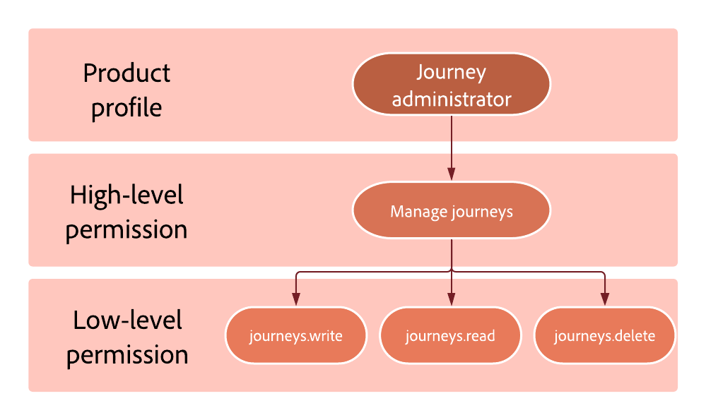

# Livelli di autorizzazione {#high-low-permissions}

>[!BEGINSHADEBOX]

**In questa pagina:** Scopri in che modo le autorizzazioni di alto livello raggruppano le autorizzazioni di basso livello sottostanti per ogni risorsa, in modo da poter concedere ai ruoli esattamente l&#39;accesso alla funzione necessario per gli utenti.

>[!ENDSHADEBOX]

Ogni ruolo è composto da autorizzazioni che consentono agli utenti di accedere alle diverse funzioni.

Possono essere divisi in due tipi:

* **Autorizzazione di alto livello**: rappresenta le diverse autorizzazioni che possono essere assegnate a **[!UICONTROL Ruolo]**, ad esempio **[!DNL Publish journeys]** e **[!DNL Manage subdomains delegation]**. Le autorizzazioni di alto livello comprendono le autorizzazioni di basso livello. Le autorizzazioni di alto livello sono dettagliate in [questa pagina](ootb-permissions.md).

* **Autorizzazione di basso livello**: rappresenta le diverse autorizzazioni provenienti dall&#39;autorizzazione di alto livello.

Ad esempio, al ruolo **[!DNL Journey administrator]** viene assegnata l&#39;autorizzazione **[!DNL Manage journeys]**. Da questa autorizzazione derivano le autorizzazioni di basso livello che consentiranno all&#39;amministratore di Percorso di scrivere, leggere ed eliminare percorsi.

{width="70%"}

## risorsa percorso {#journey-capability}

* L&#39;autorizzazione di alto livello **[!DNL Manage journeys]** consente agli utenti di creare nuovi Percorsi e di modificare, eliminare, arrestare e mettere in pausa quelli esistenti, nonché di accedere agli oggetti utilizzati nell&#39;area di lavoro del percorso per generare il flusso del percorso.

  +++ Questa autorizzazione include le seguenti autorizzazioni di basso livello:  

   * Specifico di Journey Optimizer:

      * percorsi.leggi
      * percorsi.scrittura
      * percorsi.elimina
      * messages.read

   * Specifico di Adobe Experience Platform:

      * segments.read
      * profiles.read
      * datasets.read
      * schemas.read

  +++

* **[!DNL Publish journeys]** autorizzazione di alto livello consente agli utenti di pubblicare percorsi.

  +++ Questa autorizzazione include le seguenti autorizzazioni di basso livello:  
   * Specifico di Journey Optimizer:
      * percorsi.publish
      * percorsi.leggi

  +++

* L&#39;autorizzazione di alto livello **[!DNL View journeys]** consente agli utenti di visualizzare e sfogliare i percorsi.

  +++ Questa autorizzazione include le seguenti autorizzazioni di basso livello:  

   * Specifico di Journey Optimizer:
      * percorsi.leggi

   * Specifico di Adobe Experience Platform:
      * segments.read
      * profiles.read

  +++

* L&#39;autorizzazione di alto livello **[!DNL Manage journeys events, data sources and actions]** consente agli utenti di configurare le configurazioni di eventi e dati.

  +++ Questa autorizzazione include le seguenti autorizzazioni di basso livello:  

   * Specifico di Journey Optimizer:
      * percorsi_events.read
      * percorsi_events.write
      * percorsi_events.delete
      * percorsi_data_sources.read
      * percorsi_data_sources.write
      * percorsi_data_sources.delete
      * percorsi_actions.read
      * percorsi_actions.write
      * percorsi_actions.delete

   * Specifico di Adobe Experience Platform:
      * schemas.read
      * datasets.read
      * identity_namespace.read

  +++

* L&#39;autorizzazione di alto livello **[!DNL View journeys events, data sources and actions]** consente agli utenti di utilizzare eventi e dati nel flusso di percorso.

  +++ Questa autorizzazione include le seguenti autorizzazioni di basso livello:  

   * Specifico di Journey Optimizer:
      * percorsi_events.read
      * percorsi_data_sources.read
      * percorsi_actions.read

   * Specifico di Adobe Experience Platform:
      * schemas.read
      * datasets.read
      * identity_namespace.read

  +++

* L&#39;autorizzazione di alto livello **[!DNL View journeys report]** consente agli utenti di visualizzare un report del percorso di sola lettura.

  +++ Questa autorizzazione include le seguenti autorizzazioni di basso livello:  

   * Specifico di Journey Optimizer:
      * percorsi_report.read
      * messages_report.read

   * Specifico di Adobe Experience Platform:
      * datasets.read
      * query.read
      * query.scrittura
      * queries.delete

  +++

## risorsa regole Journey Optimizer {#journey-rules-capability}

* L&#39;autorizzazione di alto livello **[!DNL Manage frequency rules]** consente agli utenti di leggere, creare, modificare, eliminare e attivare/disattivare le regole di frequenza.

  +++ Questa autorizzazione include le seguenti autorizzazioni di basso livello:  

   * Specifico di Journey Optimizer:
      * frequency_rules.read
      * frequency_rules.write
      * frequency_rules.delete

  +++

* **[!DNL View frequency rules]** autorizzazione di alto livello consente agli utenti di visualizzare le regole di frequenza.

  +++ Questa autorizzazione include le seguenti autorizzazioni di basso livello:  

   * Specifico di Journey Optimizer:
      * frequency_rules.read

  +++

## Risorsa della campagna {#campaign-capability}

* L&#39;autorizzazione di alto livello **[!DNL Export suppression list]** consente agli utenti di scaricare l&#39;elenco di soppressione come file CSV.

  +++ Questa autorizzazione include le seguenti autorizzazioni di basso livello: 

   * Specifico di Journey Optimizer:
      * suppression_list.export

   * Specifico di Adobe Experience Platform:
      * profiles.read
      * datasets.read

  +++

* L&#39;autorizzazione di alto livello **[!DNL Manage campaigns]** consente agli utenti di creare nuove campagne e di modificarle o eliminarle

  +++ Questa autorizzazione include le seguenti autorizzazioni di basso livello:  

   * Specifico di Journey Optimizer:

      * campaign.read
      * campaign.write
      * campaign.delete
     <!--
      * experiments.read
      * experiments.write
      * experiments.delete
-->

+++

* L&#39;autorizzazione di alto livello **[!DNL Publish campaigns]** consente agli utenti di pubblicare campagne.

  +++ Questa autorizzazione include le seguenti autorizzazioni di basso livello:

   * Specifico di Journey Optimizer:

      * campaign-read
      * campaign-publish
     <!--
      * experiments.activate    
      -->

  +++

* L&#39;autorizzazione di alto livello **[!DNL View campaigns report]** consente agli utenti di leggere e modificare il report delle campagne.

  +++ Questa autorizzazione include le seguenti autorizzazioni di basso livello:  

   * Specifico di Journey Optimizer:
      * campaign.read
      * campaign-report.read
     <!--
      * experiments.read
      * experiments_report.read
      -->

  +++

## Risorsa di gestione decisioni {#decisions-permissions}

* L&#39;autorizzazione di alto livello **[!DNL Manage decisions]** consente agli utenti di creare, modificare o eliminare **[!DNL Activity entities]** esistente e di gestire gli oggetti utilizzati in tali attività per prendere le decisioni.

  +++ Questa autorizzazione include le seguenti autorizzazioni di basso livello:  

   * Gestione delle decisioni specifica:
      * activities.read
      * activities.write
      * activities.delete
      * offers.read
      * offers.write
      * offers.delete
      * placements.read
      * placements.write
      * placements.delete
      * ranking_strategy.read

   * Specifico di Adobe Experience Platform:
      * datasets.read
      * datasets.write
      * datasets.delete
      * schemas.read
      * profile.read
      * segments.read

  +++

* L&#39;autorizzazione di alto livello **[!DNL View decisions]** consente agli utenti di utilizzare un&#39;attività esistente e oggetti business correlati per prendere le decisioni.

  +++ Questa autorizzazione include le seguenti autorizzazioni di basso livello:  

   * Gestione delle decisioni specifica:
      * activities.read
      * offers.read
      * placements.read
      * ranking_strategy.read

   * Specifico di Adobe Experience Platform:
      * schemas.read
      * segment.read
      * datasets.read

  +++

* L&#39;autorizzazione di alto livello **[!DNL Manage offers]** consente agli utenti di creare, modificare ed eliminare tutte le offerte, i componenti, le decisioni di lettura e le raccolte.

  +++ Questa autorizzazione include le seguenti autorizzazioni di basso livello:  

   * Gestione delle decisioni specifica:
      * offers_activity.read
      * offers.read
      * offers.Write
      * offers.Delete
      * posizionamenti.Leggi
      * placements.Write
      * placements.Delete
      * ranking_strategy.read

   * Specifico di Adobe Experience Platform:
      * schemas.read
      * segment.read
      * datasets.read
      * profiles.read

  +++

* L&#39;autorizzazione di alto livello **[!DNL Manage ranking strategies]** consente agli utenti di leggere, creare, modificare ed eliminare strategie di classificazione.

  +++ Questa autorizzazione include le seguenti autorizzazioni di basso livello:  

   * Gestione delle decisioni specifica:
      * ranking_strategy.read
      * ranking_strategy.write
      * ranking_strategy.delete
      * activities.read
      * offers.read
      * placements.read

  +++

## Risorsa configurazioni canale {#administration-permissions}

<!--
* **[!DNL Manage Experience decisions]** high-level permission allows users to read, create, edit, and delete Decisioning entities.

  +++ This permission includes the following low-level permissions:  

  * Experience decisions specific:
    * ranking_strategy.read
    * offeritem.read
    * offeritem.write
    * offeritem.delete
    * itemCollection.read
    * itemCollection.write
    * itemCollection.delete
    * SelectionStrategy.read
    * SelectionStrategy.write
    * SelectionStrategy.delete
    * Decisionpolicy.read
    * Decisionpolicy.write
    * Decisionpolicy.delete
  +++
-->

* L&#39;autorizzazione di alto livello **[!DNL Manage file routing]** consente agli utenti di creare, modificare ed eliminare configurazioni di indirizzamento dei file.

  +++ Questa autorizzazione include le seguenti autorizzazioni di basso livello:  
   * Specifico di Journey Optimizer:

      * file_routing.read
      * file_routing.write
      * file_routing.delete

  +++

* L&#39;autorizzazione di alto livello **[!DNL Manage IP pools]** consente agli utenti di creare, modificare ed eliminare la definizione di affinità.

  +++ Questa autorizzazione include le seguenti autorizzazioni di basso livello:  
   * Specifico di Journey Optimizer:
      * IP_pools.read
      * IP_pools.write
      * IP_pools.delete

  +++

* L&#39;autorizzazione di alto livello **[!DNL Manage key registry]** consente agli utenti di visualizzare, creare, ruotare e revocare le chiavi nel registro chiavi.

  +++ Questa autorizzazione include le seguenti autorizzazioni di basso livello:  

   * Specifico di Journey Optimizer:
      * key-registry.read
      * key-registry.write

  +++

* L&#39;autorizzazione di alto livello **[!DNL Manage landing page settings]** consente agli utenti di leggere, creare e modificare i sottodomini della pagina di destinazione e le impostazioni predefinite.

  +++ Questa autorizzazione include le seguenti autorizzazioni di basso livello: 

   * Specifico di Journey Optimizer:

      * landing_page_subdomain.read
      * landing_page_subdomain.write
      * landing_page_subdomain.delete
      * landing_page_preset.read
      * landing_page_preset.write
      * landing_page_preset.delete

  +++

* L&#39;autorizzazione di alto livello **[!DNL Manage messages general settings]** consente agli utenti di creare, modificare ed eliminare le impostazioni globali a livello di sandbox.

  +++ Questa autorizzazione include le seguenti autorizzazioni di basso livello:  

   * Specifico di Journey Optimizer:
      * messages_general_settings.read
      * messages_general_settings.write
      * messages_general_settings.delete

   * Specifico di Adobe Experience Platform:
      * schemas.read

  +++

* L&#39;autorizzazione di alto livello **[!DNL Manage messages presets]** consente agli utenti di leggere, creare, modificare ed eliminare configurazioni di canale tra canali a livello di sandbox.

  +++ Questa autorizzazione include le seguenti autorizzazioni di basso livello: 

   * Specifico di Journey Optimizer:
      * messages_preets.read
      * messages_preets.write
      * messages_preets.delete
      * subdomains_delegation.read
      * IP_pools.read

   * Specifico per raccolta dati:
      * Mobile_setting.read <!--(from Adobe Experience Platform Launch)-->

  +++

* L&#39;autorizzazione di alto livello **[!DNL Manage PTR records]** consente agli utenti di leggere e modificare i record PTR configurati in base al sottodominio.

  +++ Questa autorizzazione include le seguenti autorizzazioni di basso livello: 

   * Specifico di Journey Optimizer:
      * PTR_records.read
      * PTR_records.write
      * subdomains_delegation.read

  +++

* L&#39;autorizzazione di alto livello **[!DNL Manage seed lists]** consente agli utenti di leggere, creare, modificare ed eliminare elenchi di seed.

  +++ Questa autorizzazione include le seguenti autorizzazioni di basso livello: 

   * Specifico di Journey Optimizer:
      * seedlist.read
      * seedlist.write
      * seedlist.delete

  +++

* L&#39;autorizzazione di alto livello **[!DNL Manage SMS subdomains]** consente agli utenti di leggere, creare, modificare ed eliminare i sottodomini SMS.

  +++ Questa autorizzazione include le seguenti autorizzazioni di basso livello: 

   * Specifico di Journey Optimizer:
      * sms_subdomains.read
      * sms_subdomains.write
      * sms_subdomains.delete

  +++

* L&#39;autorizzazione di alto livello **[!DNL Manage subdomains delegations]** consente agli utenti di creare, modificare ed eliminare deleghe di sottodomini (incluso il pool IP).

  +++ Questa autorizzazione include le seguenti autorizzazioni di basso livello:  
   * Specifico di Journey Optimizer:

      * subdomains_delegation.read
      * subdomains_delegation.write
      * subdomains_delegation.delete

  +++

* L&#39;autorizzazione di alto livello **[!DNL Manage suppression]** consente agli utenti di definire il numero di mancati recapiti prima che un indirizzo e-mail venga aggiunto all&#39;elenco di soppressione, nonché di aggiungere ed eliminare voci dall&#39;elenco di soppressione.

  +++ Questa autorizzazione include le seguenti autorizzazioni di basso livello:  
   * Specifico di Journey Optimizer:
      * suppression_rules.read
      * suppression_rules.write
      * suppression_rules.delete
      * suppression_list.write
      * suppression_list.delete

  +++

* **[!DNL View file routing]** autorizzazione di alto livello consente agli utenti di visualizzare le configurazioni di indirizzamento dei file.

  +++ Questa autorizzazione include le seguenti autorizzazioni di basso livello:  
   * Specifico di Journey Optimizer:

      * file_routing.read

  +++

* L&#39;autorizzazione di alto livello **[!DNL View key registry]** consente agli utenti di visualizzare l&#39;elenco delle chiavi del Registro di sistema e i relativi dettagli.

  +++ Questa autorizzazione include le seguenti autorizzazioni di basso livello:  

   * Specifico di Journey Optimizer:
      * key-registry.read

  +++

* L&#39;autorizzazione di alto livello **[!DNL View messages general settings]** consente agli utenti di visualizzare le impostazioni generali dei messaggi, ad esempio l&#39;indirizzo di esecuzione.

  +++ Questa autorizzazione include le seguenti autorizzazioni di basso livello: 

   * Specifico di Journey Optimizer:
      * messages_general_settings.read

   * Specifico di Adobe Experience Platform:
      * schemas.read

  +++

* L&#39;autorizzazione di alto livello **[!DNL View messages presets]** consente agli utenti di visualizzare i predefiniti per i messaggi.

  +++ Questa autorizzazione include le seguenti autorizzazioni di basso livello: 

   * Specifico di Journey Optimizer:
      * messages_preets.read
      * subdomains_delegation.read
      * IP_pools.read

   * Specifico per raccolta dati:
      * Mobile_setting.read

  +++

* L&#39;autorizzazione di alto livello **[!DNL View PTR records]** consente agli utenti di visualizzare i record PTR configurati in base al sottodominio.

  +++ Questa autorizzazione include le seguenti autorizzazioni di basso livello: 
   * Specifico di Journey Optimizer:

      * PTR_records.read
      * subdomains_delegation.read

  +++

<!--
### [!DNL View channel configuration] permission {#view-channel-surface}

The **[!DNL View channel configuration]** high-level permission allows users to view channel configurations in order to know which channel configurations to use. 
  +++ This permission includes the following low-level permissions:  

* messages_presets.read
* subdomains_delegation.read
* IP_pools.read
* mobile_setting.read (from Adobe Experience Platform Data Collection)
-->

* L&#39;autorizzazione di alto livello **[!DNL View suppression list]** consente agli utenti di visualizzare il contenuto e le impostazioni dell&#39;elenco di soppressione.

  +++ Questa autorizzazione include le seguenti autorizzazioni di basso livello:  

   * Specifico di Journey Optimizer:
      * suppression_list.view

   * Specifico di Adobe Experience Platform:
      * profiles.read
      * datasets.read

  +++

<!--
### Manage web subdomain permission {#web-subdomain}

The **[!DNL Manage web subdomain]** high-level permission allows users to read, create, edit, and delete web subdomains.

  +++ This permission includes the following low-level permissions: 
-->

## Risorsa di assistenza IA {#ai-permissions}

* L&#39;autorizzazione di alto livello **[!DNL Generate content]** consente agli utenti di accedere all&#39;Assistente all&#39;intelligenza artificiale in Journey Optimizer.

  +++ Include le seguenti autorizzazioni di basso livello:  

   * Specifico di Journey Optimizer:
      * ai-assistant-generated-content.generate

  +++

## Risorsa della campagna orchestrata {#ai-orchestrated-campaign}

* L&#39;autorizzazione di alto livello **[!DNL Manage orchestrated campaigns]** consente agli utenti di creare nuove campagne orchestrate e di modificarle o eliminarle.

  +++ Questa autorizzazione include le seguenti autorizzazioni di basso livello:  

   * Specifico di Journey Optimizer:

      * orchestrated_campaigns.read
      * orchestrated_campaigns.write
      * orchestrated_campaigns.delete
      * cjm-web-subdomain.read
      * cjm-message.read
      * cjm-message.write
      * cjm-message.delete
      * cjm-library-item.read
      * cjm-message-general-setting.read
      * cjm-message-preset.read
      * cjm-message-preview-test.write
      * experiment.read
      * experiment.write
      * experiment.delete

   * Specifico di Adobe Experience Platform:

      * identity-graph.read
      * segments.read
      * profiles.read
      * datasets.read
      * schemas.read
      * sandboxes.view

  +++

* L&#39;autorizzazione di alto livello **[!DNL Manage orchestrated campaigns admin]** consente agli utenti di creare nuovi collegamenti e riconciliazioni, nonché di modificarli o eliminarli, tra i profili di Adobe Experience Platform e le entità dell&#39;archivio relazionale.

  +++ Questa autorizzazione include le seguenti autorizzazioni di basso livello:  

   * Specifico di Journey Optimizer:

      * cjm-orchestrated-campaign-admin.read
      * cjm-orchestrated-campaign-admin.write
      * cjm-orchestrated-campaign-admin.delete

  +++

* L&#39;autorizzazione di alto livello **[!DNL Publish orchestrated campaigns]** consente agli utenti di pubblicare campagne orchestrate.

  +++ Questa autorizzazione include le seguenti autorizzazioni di basso livello:

   * Specifico di Journey Optimizer:

      * cjm-orchestrated-campaign.read
      * cjm-orchestrated-campaign.publish
      * cjm-web-subdomain.read
      * cjm-message.read
      * cjm-message.publish
      * cjm-library-item.read

   * Specifico di Adobe Experience Platform:

      * sandboxes.view

  +++

* L&#39;autorizzazione di alto livello **[!DNL View orchestrated campaigns]** consente agli utenti di visualizzare la campagna orchestrata e il relativo contenuto.

  +++ Questa autorizzazione include le seguenti autorizzazioni di basso livello:  

   * Specifico di Journey Optimizer:

      * cjm-orchestrated-campaign.read
      * cjm-message.read
      * cjm-library-item.read
      * cjm-message-general-setting.read
      * cjm-message-preset.read
      * experiment.read

   * Specifico di Adobe Experience Platform:

      * sandboxes.view
      * segments.read
      * profiles.read

  +++

* L&#39;autorizzazione di alto livello **[!DNL View orchestrated campaigns admin]** consente agli utenti di visualizzare le impostazioni di amministrazione ma non di modificarle.

  +++ Questa autorizzazione include le seguenti autorizzazioni di basso livello:  

   * Specifico di Journey Optimizer:

      * cjm-orchestrated-campaign-admin.read

  +++

* L&#39;autorizzazione di alto livello **[!DNL View orchestrated campaigns report]** consente agli utenti di visualizzare le prestazioni delle campagne orchestrate nei report live e aziendali.

  +++ Questa autorizzazione include le seguenti autorizzazioni di basso livello:  

   * Specifico di Journey Optimizer:

      * cjm-orchestrated-campaign-reports.read
      * cjm-message-report.read
      * cjm-channel-report.read
      * cjm-orchestrated-campaign.read
      * cjm-message.read
      * cjm-library-item.read
      * experiment.read
      * experiment-report.read

   * Specifico di Adobe Experience Platform:

      * sandboxes.view
      * datasets.read
      * query.read
      * query.scrittura
      * queries.delete

  +++

+++ Guida di riferimento della Knowledge Base di AI

Questa sezione contiene informazioni strutturate che supportano l&#39;interpretazione, il recupero e la risposta alle domande relative a questo argomento.

Per una comprensione completa, queste informazioni devono essere unite alla documentazione su questa pagina. Nessuna delle due origini è progettata per essere indipendente; la pagina descrive la funzione, mentre questa sezione fornisce un contesto aggiuntivo che aiuta a non ambiguare la terminologia, le finalità, l’applicabilità e i vincoli.

* **TL;DR:** i ruoli Journey Optimizer sono generati da autorizzazioni di alto livello, ognuna delle quali racchiude i diritti API di basso livello specifici necessari agli utenti per leggere, scrivere, pubblicare o eliminare risorse tra percorsi, campagne, decisioni, configurazioni di canale e altro ancora.

**Intenti:**

* Distinzione tra autorizzazioni di livello superiore e autorizzazioni di livello inferiore
* Identifica le autorizzazioni di basso livello concesse da ogni autorizzazione di alto livello
* Configura i ruoli precisamente per percorsi, campagne, gestione delle decisioni, configurazioni dei canali e campagne orchestrate
* Concedere l’accesso all’Assistente AI per la generazione di contenuti
* Comprendere cosa consente l’autorizzazione Pubblica percorsi rispetto a Gestisci percorsi

**Glossario:**

* **Autorizzazione di alto livello**: un&#39;autorizzazione denominata assegnata a un ruolo (ad esempio, Gestisci percorsi, Pubblica percorsi) che include una o più autorizzazioni di basso livello *(specifiche per prodotto)*
* **Autorizzazione di basso livello**: un diritto granulare a livello di API (ad esempio, percorsi.read, percorsi.write) derivato da e incluso in un&#39;autorizzazione di alto livello *(specifica per prodotto)*
* **Ruolo**: raccolta di utenti che condividono le stesse autorizzazioni e sandbox all&#39;interno dell&#39;organizzazione *(specifico per prodotto)*

**Terminologia:**

* Non confondere: &quot;Autorizzazione di alto livello&quot; (diritto denominato assegnabile a un ruolo) ≠ &quot;Autorizzazione di basso livello&quot; (diritto API granulare sottostante, non direttamente assegnabile)
* Non confondere: &quot;Gestisci percorsi&quot; (consente di creare, modificare, eliminare, interrompere, incluse le esecuzioni live, in modalità di test e in modalità di prova) ≠ &quot;Pubblica percorsi&quot; (consente di pubblicare, avviare la modalità di prova, avviare le esecuzioni in prova, mettere in pausa e riprendere i percorsi)
* Non confondere: &quot;Gestisci eventi, origini dati e azioni di percorsi&quot; (CRUD completo su eventi, origini, azioni) ≠ &quot;Visualizza eventi, origini dati e azioni di percorsi&quot; (accesso in sola lettura a tali oggetti)
* Non confondere: &quot;Generate content&quot; (accesso all’Assistente AI in Journey Optimizer) ≠ le autorizzazioni di altri percorsi o campagne
* Da non confondere: &quot;Modalità di test&quot; (a cui si fa riferimento in Pubblica percorsi e Gestisci percorsi come modalità di esecuzione del percorso che può essere avviata o arrestata) ≠ &quot;Esecuzione in prova&quot; (a cui si fa riferimento anche in una modalità di esecuzione del percorso separata nelle stesse autorizzazioni)

**Domande frequenti:**

* **D: l&#39;autorizzazione Gestione percorsi consente a un utente di pubblicare percorsi?** — No; i percorsi di pubblicazione richiedono l&#39;autorizzazione di alto livello percorsi di pubblicazione separati.
* **D: cosa concede l&#39;autorizzazione Generate content?** — Accedere all&#39;Assistente AI in Journey Optimizer.
* **D: un utente può configurare eventi di percorso senza l&#39;autorizzazione Gestione percorsi?** — Sì; Gestisci eventi di percorso, origini dati e azioni è un&#39;autorizzazione separata di alto livello che copre la configurazione di eventi, origini dati e azioni.
* **D: quali autorizzazioni di basso livello sono incluse nel report Visualizza percorsi?** — percorsi_report.read e messages_report.read, più datasets.read, queries.read, queries.write e queries.delete da Adobe Experience Platform.

+++
<!-- ai-accordion-version: 1 | source-hash: d1d9ebf9 -->
