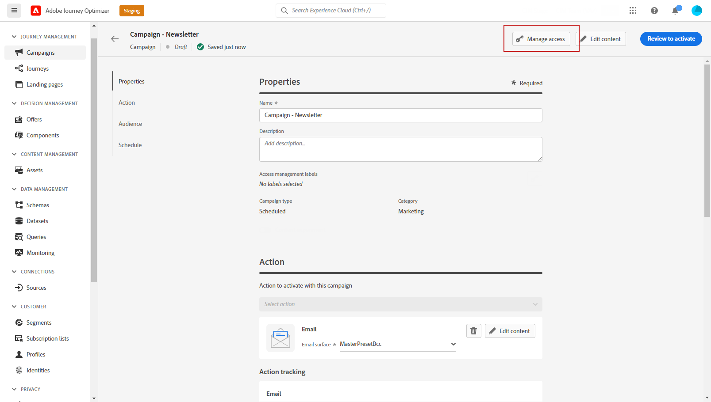

# Controllo dell’accesso a livello di oggetto {#object-level-access}

>[!CONTEXTUALHELP]
>id="ajo_olac_manage_access"
>title="Etichette per la gestione degli accessi"
>abstract="Puoi limitare l’accesso a un oggetto in base alle etichette di accesso. Questo approccio protegge le risorse digitali sensibili da utenti non autorizzati e garantisce un’ulteriore protezione dei dati personali. **Assicurati di selezionare solo le etichette per le quali disponi dell’autorizzazione.**"

Puoi limitare l’accesso a un oggetto in base alle etichette di accesso. Questo approccio protegge le risorse digitali sensibili da utenti non autorizzati e garantisce un&#39;ulteriore protezione dei dati personali.

La funzionalità Object Level Access Control (OLAC) consente di definire le autorizzazioni per gestire l&#39;accesso ai dati per una selezione di oggetti:

* Percorso
* Campaign
* Modello
* Frammento
* Pagina di destinazione
* Nome
* Raccolta di offerte statiche
* Decisione sull’offerta
* Configurazione dei canali
* Piano di riscaldamento IP

## Prerequisiti {#prereq-labels}

Per poter [creare etichette](#create-labels), devi appartenere a un ruolo con l&#39;autorizzazione **[!UICONTROL Gestione etichette di utilizzo]**.

Per poter [assegnare etichette](#assign-labels), devi appartenere a un ruolo con autorizzazione **Gestisci**, ovvero [!DNL Manage journeys], [!DNL Manage Campaigns] o [!DNL Manage decisions]. Senza questa autorizzazione, il pulsante **[!UICONTROL Gestisci accesso]** è disattivato.

Ulteriori informazioni sulle autorizzazioni sono disponibili in [questa sezione](../administration/permissions.md).

## Create labels (Creare etichette) {#create-labels}

**[!UICONTROL Etichette]** ti consentono di categorizzare set di dati e campi in base ai criteri di utilizzo applicabili a tali dati. **[!UICONTROL Le etichette]** possono essere applicate in qualsiasi momento, fornendo flessibilità nel modo in cui gestisci i dati.

Utilizza le etichette per fornire accesso agli utenti e applicare la governance dei dati e i criteri di consenso. Queste etichette di governance possono influire sul consumo a valle.

È possibile creare etichette nel prodotto [!DNL Permissions]. Per ulteriori dettagli, consulta [Documentazione di Adobe Experience Platform](https://experienceleague.adobe.com/docs/experience-platform/access-control/abac/permissions-ui/labels.html?lang=it){target="_blank"}.

Puoi anche creare **[!UICONTROL etichette]** direttamente in Journey Optimizer. Per creare un’etichetta, effettua le seguenti operazioni:

1. Da un oggetto Adobe Journey Optimizer, ad esempio una **[!UICONTROL Campaign]** appena creata, fare clic sul pulsante **[!UICONTROL Gestisci accesso]**.

   

1. Dalla finestra **[!UICONTROL Gestisci accesso]**, fai clic su **[!UICONTROL Crea etichetta]**.

   

1. Configura l’etichetta. È necessario specificare:

   * **[!UICONTROL Nome]**
   * **[!UICONTROL Nome descrittivo]**
   * **[!UICONTROL Descrizione]**

   

1. Fai clic su **[!UICONTROL Crea]** per salvare la **[!UICONTROL Etichetta]**.

La **[!UICONTROL etichetta]** appena creata è ora disponibile nell&#39;elenco. Se necessario, è possibile modificarlo nel prodotto [!DNL Permissions].

## Assegna etichette {#assign-labels}

Per assegnare etichette di utilizzo dei dati personalizzate o di base agli oggetti Journey Optimizer:

1. Da un oggetto Adobe Journey Optimizer, ad esempio una **[!UICONTROL Campaign]** appena creata, fare clic sul pulsante **[!UICONTROL Gestisci accesso]**.

   

1. Dalla finestra **[!UICONTROL Gestisci accesso]**, seleziona le etichette di utilizzo dei dati personalizzate o di base per gestire l&#39;accesso a questo oggetto.

   Per ulteriori informazioni sulle etichette di utilizzo dei dati di base, consulta [questa pagina](https://experienceleague.adobe.com/docs/experience-platform/data-governance/labels/reference.html?lang=it){target="_blank"}.

   

1. Fai clic su **[!UICONTROL Salva]** per applicare questa restrizione dell&#39;etichetta.

Per accedere a questo oggetto, gli utenti devono avere l&#39;**[!UICONTROL Etichetta]** specifica inclusa nei loro **[!UICONTROL Ruoli]**. Ad esempio, un utente con l’etichetta C1 avrà accesso solo a oggetti con etichetta C1 o senza etichetta.

Per ulteriori dettagli su come assegnare un&#39;etichetta **[!UICONTROL Label]** a un **[!UICONTROL Role]**, vedere [questa pagina](https://experienceleague.adobe.com/docs/experience-platform/access-control/abac/permissions-ui/permissions.html?lang=it#manage-labels-for-a-role){target="_blank"}.
