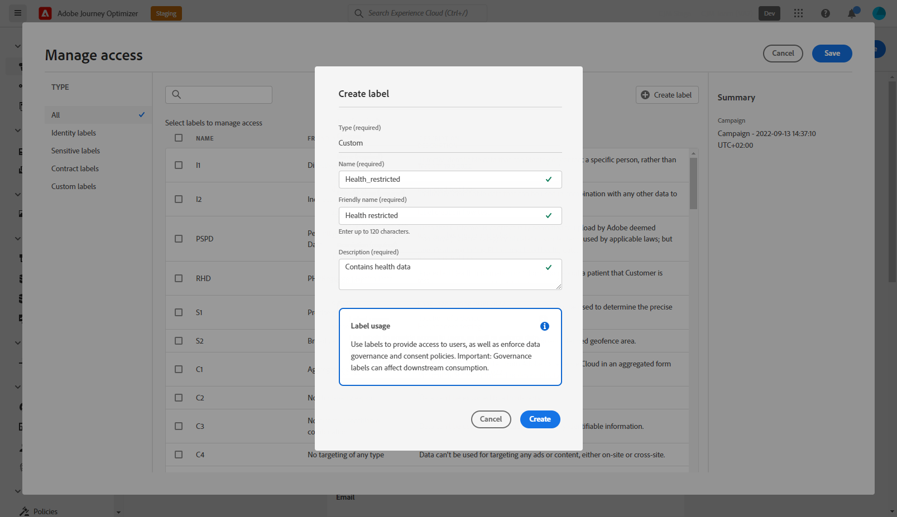
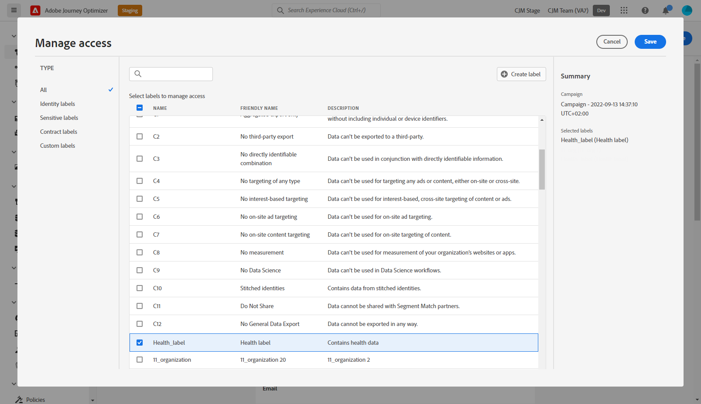

# Controllo dell’accesso a livello di oggetto {#object-level-access}

>[!BEGINSHADEBOX]

**In questa pagina:** utilizza il controllo dell&#39;accesso a livello di oggetto per limitare singoli oggetti, ad esempio percorsi, campagne e offerte, con etichette di accesso, in modo da poter limitare il contenuto riservato e i dati personali agli utenti autorizzati.

>[!ENDSHADEBOX]

>[!CONTEXTUALHELP]
>id="ajo_olac_manage_access"
>title="Etichette per la gestione degli accessi"
>abstract="Puoi limitare l’accesso a un oggetto in base alle etichette di accesso. Questo approccio protegge le risorse digitali sensibili da utenti non autorizzati e garantisce un’ulteriore protezione dei dati personali. **Assicurati di selezionare solo le etichette per le quali disponi dell’autorizzazione.**"

Puoi limitare l’accesso a un oggetto in base alle etichette di accesso. Questo approccio protegge le risorse digitali sensibili da utenti non autorizzati e garantisce un’ulteriore protezione dei dati personali.

La funzionalità Object Level Access Control (OLAC) consente di definire le autorizzazioni per gestire l&#39;accesso ai dati per una selezione di oggetti:

* Percorso
* Campaign
* Modello
* Frammento
* Pagina di destinazione
* Nome
* Raccolta di offerte statiche
* Decisione sull’offerta
* Configurazione dei canali
* Piano di riscaldamento IP

## Prerequisiti {#prereq-labels}

Per poter [creare etichette](#create-labels), devi appartenere a un ruolo con l&#39;autorizzazione **[!UICONTROL Gestione etichette di utilizzo]**.

Per poter [assegnare etichette](#assign-labels), devi appartenere a un ruolo con autorizzazione **Gestisci**, ovvero [!DNL Manage journeys], [!DNL Manage Campaigns] o [!DNL Manage decisions]. Senza questa autorizzazione, il pulsante **[!UICONTROL Gestisci accesso]** è disattivato.

Ulteriori informazioni sulle autorizzazioni sono disponibili in [questa sezione](../administration/permissions.md).

## Create labels (Creare etichette) {#create-labels}

**[!UICONTROL Etichette]** ti consentono di categorizzare set di dati e campi in base ai criteri di utilizzo applicabili a tali dati. **[!UICONTROL Le etichette]** possono essere applicate in qualsiasi momento, fornendo flessibilità nel modo in cui gestisci i dati.

Utilizza le etichette per fornire accesso agli utenti e applicare la governance dei dati e i criteri di consenso. Queste etichette di governance possono influire sul consumo a valle.

È possibile creare etichette nel prodotto [!DNL Permissions]. Per ulteriori dettagli, consulta [Documentazione di Adobe Experience Platform](https://experienceleague.adobe.com/docs/experience-platform/access-control/abac/permissions-ui/labels.html){target="_blank"}.

Puoi anche creare **[!UICONTROL etichette]** direttamente in Journey Optimizer. Per creare un’etichetta, effettua le seguenti operazioni:

1. Da un oggetto Adobe Journey Optimizer, ad esempio una **[!UICONTROL Campaign]** appena creata, fare clic sul pulsante **[!UICONTROL Gestisci accesso]**.

   

1. Dalla finestra **[!UICONTROL Gestisci accesso]**, fai clic su **[!UICONTROL Crea etichetta]**.

   

1. Configura l’etichetta. È necessario specificare:

   * **[!UICONTROL Nome]**
   * **[!UICONTROL Nome descrittivo]**
   * **[!UICONTROL Descrizione]**

   

1. Fai clic su **[!UICONTROL Crea]** per salvare la **[!UICONTROL Etichetta]**.

La **[!UICONTROL etichetta]** appena creata è ora disponibile nell&#39;elenco. Se necessario, è possibile modificarlo nel prodotto [!DNL Permissions].

## Assegna etichette {#assign-labels}

Per assegnare etichette di utilizzo dei dati personalizzate o di base agli oggetti Journey Optimizer:

1. Da un oggetto Adobe Journey Optimizer, ad esempio una **[!UICONTROL Campaign]** appena creata, fare clic sul pulsante **[!UICONTROL Gestisci accesso]**.

   

1. Dalla finestra **[!UICONTROL Gestisci accesso]**, seleziona le etichette di utilizzo dei dati personalizzate o di base per gestire l&#39;accesso a questo oggetto.

   Per ulteriori informazioni sulle etichette di utilizzo dei dati di base, consulta [questa pagina](https://experienceleague.adobe.com/docs/experience-platform/data-governance/labels/reference.html?lang=it){target="_blank"}.

   

1. Fai clic su **[!UICONTROL Salva]** per applicare questa restrizione dell&#39;etichetta.

Per accedere a questo oggetto, gli utenti devono avere l&#39;**[!UICONTROL Etichetta]** specifica inclusa nei loro **[!UICONTROL Ruoli]**. Ad esempio, un utente con l’etichetta C1 avrà accesso solo a oggetti con etichetta C1 o senza etichetta.

Per ulteriori dettagli su come assegnare un&#39;etichetta **[!UICONTROL Label]** a un **[!UICONTROL Role]**, vedere [questa pagina](https://experienceleague.adobe.com/docs/experience-platform/access-control/abac/permissions-ui/permissions.html#manage-labels-for-a-role){target="_blank"}.

+++ Guida di riferimento della Knowledge Base di AI

Questa sezione contiene informazioni strutturate che supportano l&#39;interpretazione, il recupero e la risposta alle domande relative a questo argomento.

Per una comprensione completa, queste informazioni devono essere unite alla documentazione su questa pagina. Nessuna delle due origini è progettata per essere indipendente; la pagina descrive la funzione, mentre questa sezione fornisce un contesto aggiuntivo che aiuta a non ambiguare la terminologia, le finalità, l’applicabilità e i vincoli.

* **TL;DR:** Il controllo dell&#39;accesso a livello di oggetto (OLAC) consente di applicare etichette di accesso a oggetti Journey Optimizer specifici, ad esempio percorsi, campagne e offerte, in modo che solo gli utenti il cui ruolo include l&#39;etichetta corrispondente possano visualizzare o interagire con tali oggetti.

**Intenti:**

* Creare un’etichetta di accesso personalizzata direttamente in Journey Optimizer o tramite il prodotto Autorizzazioni
* Assegna etichette di accesso agli oggetti di Journey Optimizer (percorsi, campagne, offerte, ecc.)
* Limita i contenuti sensibili solo agli utenti autorizzati
* Scopri quali autorizzazioni sono necessarie per creare e assegnare le etichette

**Glossario:**

* **OLAC (Object Level Access Control)**: funzionalità per definire le autorizzazioni di gestione dell&#39;accesso ai dati per una selezione di oggetti Journey Optimizer specifici *(product-specific)*
* **Etichetta**: tag applicato a un oggetto per suddividerlo in categorie in base ai criteri di utilizzo e limitare l&#39;accesso in base all&#39;appartenenza al ruolo *(specifico per prodotto)*
* **Gestisci accesso**: pulsante o interfaccia disponibile negli oggetti Journey Optimizer supportati per la creazione e l&#39;assegnazione delle etichette di accesso *(specifiche per prodotto)*
* **Etichette di utilizzo dei dati di base**: etichette predefinite fornite da Adobe Experience Platform, anziché etichette personalizzate create dall&#39;organizzazione *(specifiche del prodotto)*

**Guardrail:**

* La creazione delle etichette richiede l&#39;autorizzazione **Gestisci etichette di utilizzo** (prerequisito)
* L&#39;assegnazione delle etichette richiede un&#39;autorizzazione **Gestisci** per il tipo di oggetto (ad esempio, Gestisci percorsi, Gestisci campagne o Gestisci decisioni); senza di essa, il pulsante **Gestisci accesso** è disattivato (prerequisito)
* Oggetti supportati per le etichette OLAC: Percorso, Campagna, Modello, Frammento, Pagina di destinazione, Offerta, Raccolta offerte statica, Decisione offerta, Configurazione canale, Piano di riscaldamento IP

**Terminologia:**

* Nome canonico: Object Level Access Control — Acronimo: OLAC — varianti: object-based access control, object-based access management
* Non confondere: OLAC (limita l’accesso a oggetti AJO specifici come percorsi e campagne utilizzando le etichette) ≠ ABAC (basato su attributi, applica criteri di etichetta a campi di schema, set di dati e tipi di pubblico a livello di piattaforma)
* Da non confondere: &quot;etichette di utilizzo dei dati di base&quot; (etichette predefinite di Adobe Experience Platform) ≠ &quot;etichette personalizzate&quot; (etichette create dall’organizzazione)

**Domande frequenti:**

* **D: è possibile creare un&#39;etichetta direttamente in Journey Optimizer senza passare al prodotto Autorizzazioni?** — Sì; utilizzare la finestra Gestisci accesso su qualsiasi oggetto supportato e fare clic su Crea etichetta.
* **Q: quali tipi di oggetto supportano le etichette OLAC?** percorso, campagna, modello, frammento, pagina di destinazione, offerta, raccolta di offerte statiche, decisione di offerta, configurazione del canale e piano di riscaldamento IP.
* **D: quale autorizzazione è necessaria per assegnare un&#39;etichetta a un percorso?** — Autorizzazione Gestisci percorsi; senza autorizzazione Gestisci, il pulsante di accesso Gestisci è disattivato.
* **Q: se un utente ha solo l&#39;etichetta C1 nel proprio ruolo, a quali oggetti può accedere?** — Solo oggetti con etichetta C1 o senza etichetta.

+++
<!-- ai-accordion-version: 1 | source-hash: 4e9b2577 -->
