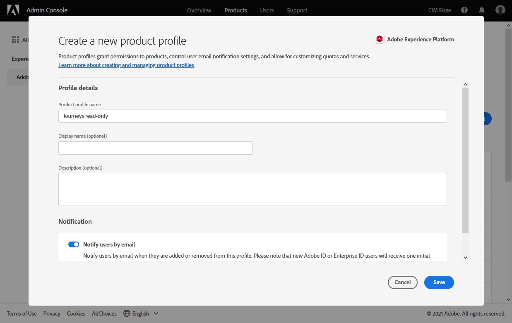

# Gestione di utenti e profili di prodotto {#manage-permissions}

>[!IMPORTANT]
>
> Ciascuna delle procedure descritte di seguito può essere eseguita solo da un amministratore **[!UICONTROL Product]** o **[!UICONTROL System]**. Per ulteriori informazioni, consulta la [documentazione di Admin Console](https://helpx.adobe.com/enterprise/admin-guide.html/enterprise/using/admin-roles.ug.html).

**[!UICONTROL Product profiles]** sono set di utenti che condividono le stesse autorizzazioni e sandbox all’interno della tua organizzazione.

Il prodotto [!DNL Journey Optimizer] ti consente di scegliere tra diversi predefiniti **[!UICONTROL Product profiles]** con diversi livelli di autorizzazioni da assegnare agli utenti. Per ulteriori informazioni sulle **[!UICONTROL Product profiles]** disponibili, consulta questa [pagina](ootb-product-profiles.md).

Ogni utente appartenente a **[!UICONTROL Product profiles]** ha diritto alle app e ai servizi di Adobe contenuti nel prodotto.

Puoi anche creare un tuo **[!UICONTROL Product profiles]** se desideri ottimizzare l’accesso degli utenti a determinate funzionalità o oggetti nell’interfaccia.

## Assegnazione di un profilo di prodotto {#assigning-product-profile}

Puoi scegliere di assegnare un **[!UICONTROL Product profile]** predefinito o personalizzato agli utenti.

L’elenco di tutti i profili di prodotto predefiniti con autorizzazioni assegnate si trova nella sezione [Profili di prodotto incorporati](ootb-product-profiles.md) .

Per assegnare un **[!UICONTROL Product profile]**:

1. Nella scheda [!DNL Admin Console] , seleziona il prodotto **[!UICONTROL Experience Cloud - Platform powered applications]** dalla scheda **[!UICONTROL Products]** .

1. Seleziona un **[!UICONTROL Product profile]**.

   

1. Dalla scheda **[!UICONTROL Users]**, fai clic su **[!UICONTROL Add user]**.

   

1. Digita il nome o l’indirizzo e-mail dell’utente e seleziona l’utente.

   Se l&#39;utente non è stato creato in precedenza in [!DNL Admin Console], consulta la [documentazione Aggiungere utenti](https://helpx.adobe.com/enterprise/admin-guide.html/enterprise/using/manage-users-individually.ug.html#add-users).

   

1. Esegui gli stessi passaggi indicati sopra per aggiungere altri utenti al tuo **[!UICONTROL Product profile]**. Quindi, fai clic su **[!UICONTROL Save]**.

L’utente dovrebbe quindi ricevere un messaggio e-mail di reindirizzamento all’istanza .

Per ulteriori informazioni sulla gestione degli utenti, consulta la [documentazione di Admin Console](https://helpx.adobe.com/enterprise/admin-guide.html/enterprise/using/manage-users-individually.ug.html).

Quando accedi all&#39;istanza, l&#39;utente visualizzerà una visualizzazione specifica a seconda delle autorizzazioni assegnate in **[!UICONTROL Product profile]**. Se l’utente non ha il diritto di accesso a una funzione, verrà visualizzata la seguente schermata.

## Modifica di un profilo di prodotto esistente {#edit-product-profile}

Per le autorizzazioni predefinite o personalizzate **[!UICONTROL Product profiles]**, puoi decidere in qualsiasi momento di aggiungere o eliminare autorizzazioni.

In questo esempio, vogliamo aggiungere **[!UICONTROL Permissions]** correlato alla funzionalità **[!UICONTROL Message]** per gli utenti assegnati al visualizzatore di Percorsi **[!UICONTROL Product profile]**. Gli utenti potranno quindi pubblicare i messaggi.

Nota che se modifichi un **[!UICONTROL Product profile]** predefinito o personalizzato, questo avrà un impatto su ogni utente assegnato a questo **[!UICONTROL Product profile]**.

1. Nella scheda [!DNL Admin Console] , seleziona il prodotto **[!UICONTROL Experience Cloud - Platform powered applications]** dalla scheda **[!UICONTROL Products]** .

1. Seleziona il visualizzatore di Percorsi **[!UICONTROL Product profile]**.

1. Seleziona la scheda **[!UICONTROL Permissions]**.

   La scheda **[!UICONTROL Permissions]** visualizza l&#39;elenco delle funzionalità applicabili al prodotto ***[!UICONTROL Experience Cloud - Platform powered applications]**.

   

1. Seleziona la funzionalità **[!UICONTROL Messages]** .

   

1. Dall&#39;elenco **[!UICONTROL Available Permission Items]**, seleziona le autorizzazioni da assegnare al **[!UICONTROL Product profile]** facendo clic sull&#39;icona più (+).

   In questo caso, aggiungiamo l’autorizzazione **[!UICONTROL Publish messages]** .

   

1. Se necessario, in **[!UICONTROL Included Permission Items]**, fai clic sull’icona X adiacente alla rimozione delle autorizzazioni dal tuo profilo di prodotto.

1. Al termine, fai clic su **[!UICONTROL Save]**.

   

Se necessario, puoi anche creare un nuovo profilo di prodotto con autorizzazioni specifiche. Per ulteriori informazioni, consulta [Creazione di un profilo di prodotto](#create-product-profile).

## Creazione di un profilo di prodotto {#create-product-profile}

[!DNL Journey Optimizer] consente di creare un set personalizzato  **[!UICONTROL Product profiles]** e di assegnare agli utenti un set di autorizzazioni e sandbox. Con **[!UICONTROL Product profiles]** puoi autorizzare o negare l’accesso a determinate funzionalità o oggetti nell’interfaccia.

Per ulteriori informazioni sulla modalità di creazione e di gestione delle sandbox, consulta la [documentazione di Adobe Experience Platform](https://experienceleague.adobe.com/docs/experience-platform/sandbox/ui/user-guide.html).

In questo esempio, creeremo un profilo di prodotto denominato **Percorsi in sola lettura** in cui concederemo diritti di sola lettura alla funzione Percorso. Gli utenti potranno accedere e visualizzare solo i percorsi e non potranno accedere ad altre funzioni quali **[!UICONTROL Decision management]** o **[!UICONTROL Messages]** in [!DNL Journey Optimizer].

Per creare i nostri **Percorsi di sola lettura** **[!UICONTROL product profiles]**:

1. Accedi a [!DNL Admin Console].

1. Dalla scheda **[!UICONTROL Products]** , seleziona il prodotto **[!UICONTROL Experience Cloud - Platform powered applications]** .

1. Fai clic su **[!UICONTROL New Profile]**.

   

1. Aggiungi un **[!UICONTROL Product Profile Name]**, **[!UICONTROL Display Name]** e **[!UICONTROL Description]** per il nuovo **[!UICONTROL product profiles]**.

   

1. Nella categoria **[!UICONTROL Notifications]**, scegli di informare gli utenti via e-mail, quando verranno aggiunti o rimossi da questo profilo di prodotto.

1. Al termine, fai clic su **[!UICONTROL Save]** e seleziona il nuovo **[!UICONTROL product profiles]** creato.

1. Per aggiungere le autorizzazioni per consentire agli utenti di accedere a funzioni diverse, seleziona la scheda **[!UICONTROL Permissions]** .

1. Seleziona tra le diverse funzionalità disponibili in **[!UICONTROL Messages]**, **[!UICONTROL Segments]** o **[!UICONTROL Decision management]** elencate nel menu a sinistra.[!DNL Journey Optimizer]

   Qui selezioniamo la funzionalità **[!UICONTROL Journeys]** .

   

1. Dall&#39;elenco **[!UICONTROL Available Permission Items]**, seleziona le autorizzazioni da assegnare al **[!UICONTROL Product profile]** facendo clic sull&#39;icona più (+).

   Qui selezioniamo **[!UICONTROL View journeys]** e **[!UICONTROL View journeys event, data sources, actions]**.

   

1. Seleziona la funzionalità **[!UICONTROL Sandbox access]** per scegliere le sandbox da assegnare al **[!UICONTROL Product profile]**.

   

1. Nella sezione **[!UICONTROL Available Permissions Items]**, fai clic sull’icona più (+) per assegnare le sandbox al profilo. [Ulteriori informazioni sulle sandbox](https://experienceleague.adobe.com/docs/experience-platform/sandbox/home.html).

1. Al termine, fai clic su **[!UICONTROL Save]**.

Il **[!UICONTROL Product profile]** viene ora creato e configurato. Ora devi assegnarlo agli utenti.

Per ulteriori informazioni sulla creazione e la gestione del profilo di prodotto, consulta la [documentazione di Admin Console](https://helpx.adobe.com/enterprise/admin-guide.html/enterprise/using/manage-product-profiles.ug.html).
