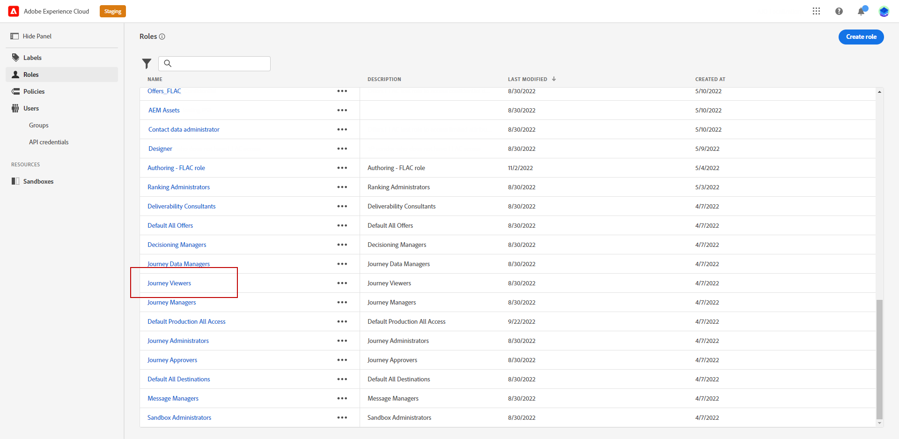

# Gestione di utenti e profili di prodotto {#manage-permissions}

>[!IMPORTANT]
>
> Ognuna delle procedure descritte qui di seguito può essere eseguita solo da un **[!UICONTROL Prodotto]** o **[!UICONTROL Sistema]** amministratore. Per ulteriori informazioni, consulta la [Documentazione di Admin Console](https://helpx.adobe.com/enterprise/admin-guide.html/enterprise/using/admin-roles.ug.html).

**[!UICONTROL Profili di prodotto]** sono set di utenti che condividono le stesse autorizzazioni e sandbox all’interno della tua organizzazione.

La [!DNL Journey Optimizer] product ti consente di scegliere tra diverse opzioni predefinite **[!UICONTROL Profili di prodotto]** con diversi livelli di autorizzazioni da assegnare agli utenti. Per ulteriori informazioni sui **[!UICONTROL Profili di prodotto]**, fai riferimento a [page](ootb-product-profiles.md).

Ogni utente appartenente a un **[!UICONTROL Profili di prodotto]** ha diritto alle app e ai servizi di Adobe contenuti nel prodotto.

Puoi anche creare un tuo **[!UICONTROL Profili di prodotto]** per ottimizzare l’accesso degli utenti a determinate funzionalità o oggetti dell’interfaccia.

## Assegnazione di un profilo di prodotto {#assigning-product-profile}

Puoi scegliere di assegnare un predefinito o personalizzato **[!UICONTROL Profilo di prodotto]** agli utenti.

L’elenco di tutti i profili di prodotto predefiniti con autorizzazioni assegnate è disponibile nella sezione [Profili di prodotto incorporati](ootb-product-profiles.md) sezione .

Per assegnare un **[!UICONTROL Profilo di prodotto]**:

1. In [!DNL Admin Console], dal **[!UICONTROL Prodotti]** seleziona la scheda **[!UICONTROL Experience Cloud - Applicazioni basate su piattaforma]** prodotto.

1. Seleziona una **[!UICONTROL Profilo di prodotto]**.

   

1. Da **[!UICONTROL Utenti]** scheda , fai clic su **[!UICONTROL Aggiungi utente]**.

   

1. Digita il nome o l’indirizzo e-mail dell’utente e seleziona l’utente.

   Se l&#39;utente non è stato creato in precedenza nel [!DNL Admin Console], fare riferimento alla [Aggiungere la documentazione degli utenti](https://helpx.adobe.com/enterprise/admin-guide.html/enterprise/using/manage-users-individually.ug.html#add-users).

   

1. Esegui gli stessi passaggi di cui sopra per aggiungere altri utenti al tuo **[!UICONTROL Profilo di prodotto]**. Quindi, fai clic su **[!UICONTROL Salva]**.

L’utente dovrebbe quindi ricevere un messaggio e-mail di reindirizzamento all’istanza.

Per ulteriori informazioni sulla gestione degli utenti, consulta [Documentazione di Admin Console](https://helpx.adobe.com/enterprise/admin-guide.html/enterprise/using/manage-users-individually.ug.html).

Quando si accede all’istanza, l’utente visualizza una visualizzazione specifica a seconda delle autorizzazioni assegnate nel **[!UICONTROL Profilo di prodotto]**. Se l’utente non ha il diritto di accesso a una funzione, verrà visualizzato il seguente messaggio:

`You don't have permission to access this feature. Permission needed: XX.`

## Modifica di un profilo di prodotto esistente {#edit-product-profile}

Per predefiniti o personalizzati **[!UICONTROL Profili di prodotto]**, puoi decidere in qualsiasi momento di aggiungere o eliminare autorizzazioni.

In questo esempio, vogliamo aggiungere **[!UICONTROL Autorizzazioni]** relativa al **[!UICONTROL Percorsi]** funzionalità per gli utenti assegnati al visualizzatore di Percorsi **[!UICONTROL Profilo di prodotto]**. Gli utenti potranno quindi pubblicare percorsi.

Tieni presente che se modifichi un predefinito o personalizzato **[!UICONTROL Profilo di prodotto]**, interesserà ogni utente assegnato a questo **[!UICONTROL Profilo di prodotto]**.

1. In [!DNL Admin Console], dal **[!UICONTROL Prodotti]** seleziona la scheda **[!UICONTROL Experience Cloud - Applicazioni basate su piattaforma]** prodotto.

1. Selezionare il visualizzatore Percorso **[!UICONTROL Profilo di prodotto]**.

1. Fai clic sulla scheda **[!UICONTROL Autorizzazioni.]**

   La **[!UICONTROL Autorizzazioni]** visualizza l’elenco delle funzionalità applicabili al **[!UICONTROL Experience Cloud - Applicazioni basate su piattaforma]** prodotto.

   

1. Seleziona la **[!UICONTROL Percorsi]** funzionalità.

   

1. Da **[!UICONTROL Voci di autorizzazione disponibili]** selezionare le autorizzazioni da assegnare al **[!UICONTROL Profilo di prodotto]** facendo clic sull’icona più (+).

   Qui, aggiungiamo la **[!UICONTROL Pubblicare Percorsi]** autorizzazione.

1. Se necessario, in **[!UICONTROL Elementi delle autorizzazioni inclusi]**, fai clic sull’icona X accanto a rimuovere le autorizzazioni dal profilo di prodotto.

1. Al termine, fai clic su **[!UICONTROL Salva]**.

Se necessario, puoi anche creare un nuovo profilo di prodotto con autorizzazioni specifiche. Per ulteriori informazioni, consulta [Creazione di un profilo di prodotto](#create-product-profile).

## Creazione di un profilo di prodotto {#create-product-profile}

[!DNL Journey Optimizer] consente di creare **[!UICONTROL Profili di prodotto]** e assegna agli utenti un set di autorizzazioni e sandbox. Con **[!UICONTROL Profili di prodotto]**, puoi autorizzare o negare l’accesso a determinate funzionalità o oggetti nell’interfaccia.

Per ulteriori informazioni sulla modalità di creazione e di gestione delle sandbox, consulta la [documentazione di Adobe Experience Platform](https://experienceleague.adobe.com/docs/experience-platform/sandbox/ui/user-guide.html?lang=it){target="_blank"}.

In questo esempio, creeremo un profilo di prodotto denominato **Percorsi in sola lettura** in cui concederemo diritti di sola lettura alla funzione Percorso. Gli utenti potranno accedere e visualizzare solo i percorsi e non potranno accedere ad altre funzioni quali **[!DNL  Decision management]** in [!DNL Journey Optimizer].

Per creare la nostra **Percorsi in sola lettura** **[!UICONTROL profili di prodotto]**:

1. Accedere al [!DNL Admin Console].

1. Da **[!UICONTROL Prodotti]** seleziona la scheda **[!UICONTROL Experience Cloud - Applicazioni basate su piattaforma]** prodotto.

1. Fai clic su **[!UICONTROL Nuovo profilo]**.

   

1. Aggiungi un **[!UICONTROL Nome del profilo di prodotto]**, **[!UICONTROL Nome visualizzato]** e **[!UICONTROL Descrizione]** per il tuo nuovo **[!UICONTROL profili di prodotto]**.

   

1. In **[!UICONTROL Notifiche]** categoria , scegli se gli utenti verranno informati via e-mail quando verranno aggiunti o rimossi da questo profilo di prodotto.

1. Al termine, fai clic su **[!UICONTROL Salva]** e seleziona la nuova **[!UICONTROL profili di prodotto]**.

1. Per aggiungere le autorizzazioni per gli utenti per accedere a funzioni diverse, seleziona la **[!UICONTROL Autorizzazioni]** scheda .

1. Selezionare tra le diverse funzionalità, ad esempio **[!DNL Journeys]**, **[!DNL Segments]** o **[!DNL Decision management]** disponibile in [!DNL Journey Optimizer] elencati nel menu a sinistra.

   Qui selezioniamo il **[!UICONTROL Percorsi]** funzionalità.

   

1. Da **[!UICONTROL Voci di autorizzazione disponibili]** selezionare le autorizzazioni da assegnare al **[!UICONTROL Profilo di prodotto]** facendo clic sull’icona più (+).

   Qui selezioniamo **[!DNL View journeys]** e **[!DNL View journeys event, data sources, actions]**.

   

1. Seleziona la **[!UICONTROL Accesso sandbox]** capacità di scegliere quali sandbox assegnare al **[!UICONTROL Profilo di prodotto]**.

   

1. Sotto **[!UICONTROL Elementi delle autorizzazioni disponibili]**, fai clic sull’icona più (+) per assegnare le sandbox al tuo profilo. [Ulteriori informazioni sulle sandbox](sandboxes.md).

1. Al termine, fai clic su **[!UICONTROL Salva]**.

Le **[!UICONTROL Profilo di prodotto]** viene ora creato e configurato. Ora devi assegnarlo agli utenti.

Per ulteriori informazioni sulla creazione e la gestione del profilo di prodotto, consulta [Documentazione di Admin Console](https://helpx.adobe.com/enterprise/admin-guide.html/enterprise/using/manage-product-profiles.ug.html).
