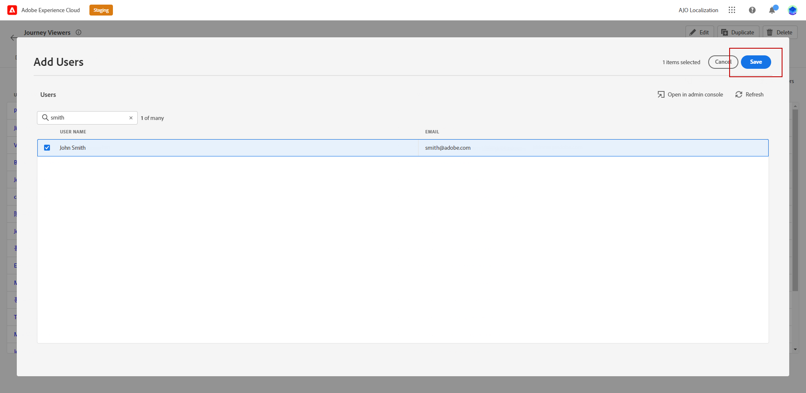

# Gestire utenti e ruoli {#manage-permissions}

**[!UICONTROL I ruoli]** fanno riferimento a una raccolta di utenti che condividono le stesse autorizzazioni e sandbox. Questi ruoli consentono di gestire facilmente l’accesso e le autorizzazioni per diversi gruppi di utenti all’interno dell’organizzazione.

Con il prodotto [!DNL Journey Optimizer], puoi scegliere tra una serie di **[!UICONTROL Ruoli]** preesistenti, ciascuno con diversi livelli di autorizzazioni, da assegnare agli utenti. Per ulteriori informazioni sui **[!UICONTROL Ruoli]** disponibili, consulta questa [pagina](ootb-product-profiles.md).

Quando un utente appartiene a un **[!UICONTROL Ruolo]**, ha accesso alle app e ai servizi Adobe contenuti nel prodotto.

Se i ruoli preesistenti non soddisfano le esigenze specifiche della tua organizzazione, puoi anche creare **[!UICONTROL Ruoli]** personalizzati per ottimizzare l&#39;accesso a determinate funzionalità o oggetti nell&#39;interfaccia. In questo modo, ogni utente avrà accesso solo alle risorse e agli strumenti necessari per eseguire le proprie attività in modo efficiente.

>[!IMPORTANT]
>
>I passaggi e le procedure descritti di seguito possono essere eseguiti solo da un amministratore **[!UICONTROL Product]** o **[!UICONTROL System]**.

## Assegna un ruolo {#assigning-role}

Puoi assegnare agli utenti un **[!UICONTROL Ruolo]** predefinito o personalizzato.

L&#39;elenco di tutti i ruoli predefiniti con autorizzazioni assegnate è disponibile nella sezione [Ruoli incorporati](ootb-product-profiles.md).

Per assegnare un **[!UICONTROL ruolo]**:

1. Per assegnare un ruolo a un utente nel prodotto [!DNL Permissions], passare alla scheda **[!UICONTROL Ruoli]** e selezionare il ruolo desiderato.

   

1. Dalla scheda **[!UICONTROL Utenti]**, fai clic su **[!UICONTROL Aggiungi utente]**.

   

1. Digita il nome o l&#39;indirizzo e-mail dell&#39;utente o selezionalo dall&#39;elenco, quindi fai clic su **[!UICONTROL Salva]**.

   Se l&#39;utente non è stato creato in precedenza in [!DNL Admin Console], consulta la [documentazione sull&#39;aggiunta di utenti](https://experienceleague.adobe.com/docs/experience-platform/access-control/ui/users.html){target="_blank"}.

   

L’utente riceve un messaggio e-mail di reindirizzamento all’istanza.

Per ulteriori informazioni sulla gestione degli utenti, consulta la [documentazione sul controllo degli accessi](https://experienceleague.adobe.com/docs/experience-platform/access-control/home.html?lang=it){target="_blank"}.

Quando accedi all&#39;istanza, l&#39;utente visualizza una visualizzazione specifica in base alle autorizzazioni assegnate nel **[!UICONTROL Ruolo]**. Se l’utente non dispone del diritto di accesso a una funzione, viene visualizzato il seguente messaggio:

`You do not have permission to access this feature. Permission needed: XX.`

## Modifica un ruolo esistente {#edit-product-profile}

Per i **[!UICONTROL Ruoli]** predefiniti o personalizzati, puoi decidere in qualsiasi momento di aggiungere o eliminare le autorizzazioni.

Nell&#39;esempio seguente, si desidera aggiungere **[!UICONTROL Autorizzazioni]** relative alla risorsa **[!UICONTROL Percorsi]** per gli utenti assegnati al visualizzatore di Percorso **[!UICONTROL Ruolo]**. Gli utenti potranno quindi pubblicare i percorsi.

>[!IMPORTANT]
>
>Le modifiche apportate a un ruolo predefinito o personalizzato avranno effetto su tutti gli utenti assegnati a tale ruolo.

1. Per modificare un ruolo nel prodotto [!DNL Permissions], passare alla scheda **[!UICONTROL Ruoli]** e selezionare il ruolo desiderato, in questo caso il visualizzatore di Percorso **[!UICONTROL Ruolo]**.
   

1. Dal dashboard **[!UICONTROL Ruolo]**, fai clic su **[!UICONTROL Modifica]**.

   

1. Il menu **[!UICONTROL Risorse]** visualizza l&#39;elenco delle risorse applicabili al prodotto **[!UICONTROL Experience Cloud - Applicazioni basate su piattaforma]**. Trascina le risorse per assegnare le autorizzazioni.

   Dal menu a discesa delle risorse **[!UICONTROL Percorsi]**, scegliamo qui l&#39;autorizzazione **[!UICONTROL percorso di pubblicazione]**.

   

1. Se necessario, in **[!UICONTROL Elementi di autorizzazione inclusi]**, fare clic sull&#39;icona X per rimuovere le autorizzazioni o le risorse dal ruolo.

1. Al termine, fare clic su **[!UICONTROL Salva]**.

Se necessario, puoi anche creare un nuovo ruolo con autorizzazioni specifiche.

## Creare un nuovo ruolo {#create-product-profile}

[!DNL Journey Optimizer] ti consente di creare **[!UICONTROL Ruoli]** e di assegnare agli utenti un set di autorizzazioni e sandbox. Con **[!UICONTROL Ruoli]**, puoi autorizzare o negare l&#39;accesso a determinate funzionalità o oggetti nell&#39;interfaccia.

Per ulteriori informazioni sulla modalità di creazione e di gestione delle sandbox, consulta la [documentazione di Adobe Experience Platform](https://experienceleague.adobe.com/docs/experience-platform/sandbox/ui/user-guide.html?lang=it){target="_blank"}.

In questo esempio viene creato un ruolo denominato **Percorsi di sola lettura**, in cui vengono concessi diritti di sola lettura per la funzionalità di Percorso. Gli utenti potranno solo accedere ai percorsi e visualizzarli e non potranno accedere ad altre funzionalità come **[!DNL Decision management]** in [!DNL Journey Optimizer].

Per creare i **Percorsi di sola lettura** **[!UICONTROL Ruolo]**:

1. Per assegnare un ruolo a un utente nel prodotto [!DNL Permissions], passare alla scheda **[!UICONTROL Ruoli]** e fare clic su **[!UICONTROL Crea ruolo]**.

   

1. Aggiungi **[!UICONTROL Nome]** e **[!UICONTROL Descrizione]** per il nuovo **[!UICONTROL Ruolo]**. Quindi fare clic su **[!UICONTROL Conferma]**.

   

1. Dall&#39;elenco a discesa delle risorse **[!UICONTROL Sandbox]**, scegli le sandbox da assegnare al tuo **[!UICONTROL Ruolo]**. [Ulteriori informazioni sulle sandbox](sandboxes.md).

   

1. Selezionare tra le diverse risorse, ad esempio **[!DNL Journeys]**, **[!DNL Segments]** o **[!DNL Decision management]** disponibili in [!DNL Journey Optimizer] elencate nel menu a sinistra.

   In questo caso, selezioniamo la risorsa **[!UICONTROL Percorsi]**.

   

1. Dal menu a discesa **[!UICONTROL Percorsi]**, seleziona le autorizzazioni da assegnare al tuo **[!UICONTROL Ruolo]**.

   Qui si selezionano **[!DNL View journeys]**, **[!DNL View journeys report]** e **[!DNL View journeys event, data sources, actions]**.

   

1. Al termine, fare clic su **[!UICONTROL Salva]**.

Il tuo **[!UICONTROL Ruolo]** è stato creato e configurato. Ora devi assegnarla agli utenti.

Per ulteriori informazioni sulla creazione e la gestione dei ruoli, consulta la [documentazione di Adobe Admin Console](https://experienceleague.adobe.com/docs/experience-platform/access-control/abac/permissions-ui/roles.html?lang=it){target="_blank"}.
