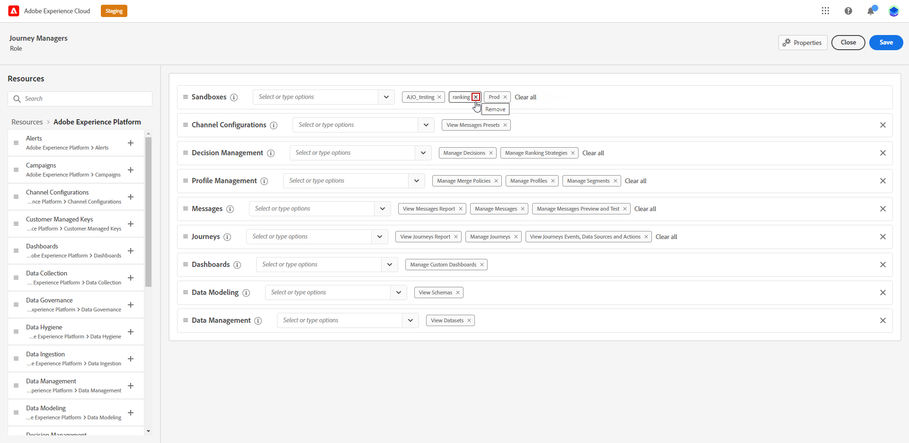

# Utilizzare e assegnare sandbox {#sandboxes}

## Utilizzare le sandbox {#using-sandbox}

[!DNL Journey Optimizer] consente di suddividere l&#39;istanza in ambienti virtuali separati denominati sandbox. Le sandbox vengono assegnate tramite i ruoli in Autorizzazioni. [Scopri come assegnare le sandbox](permissions.md#create-product-profile).

[!DNL Journey Optimizer] riflette le sandbox di Adobe Experience Platform create per una determinata organizzazione. Le sandbox di Adobe Experience Platform possono essere create o reimpostate dall’istanza di Adobe Experience Platform. [Ulteriori informazioni sono disponibili nella guida utente sulle sandbox](https://experienceleague.adobe.com/docs/experience-platform/sandbox/ui/user-guide.html?lang=it){target="_blank"}.

Puoi trovare il controllo del commutatore sandbox in alto a destra dello schermo, accanto al nome della tua organizzazione. Per passare da una sandbox all’altra, fai clic sulla sandbox attualmente attiva nel commutatore e selezionane un’altra dall’elenco a discesa.

➡️ [Ulteriori informazioni sulle sandbox in questo video](#video)

## Assegna sandbox {#assign-sandboxes}

>[!IMPORTANT]
>
> La gestione delle sandbox può essere eseguita solo da un amministratore **[!UICONTROL Product]** o **[!UICONTROL System]**.

Puoi scegliere di assegnare sandbox diverse a **[!UICONTROL Ruoli]** predefiniti o personalizzati.

Per assegnare le sandbox:

1. In [!DNL Permissions], dalla scheda **[!UICONTROL Ruoli]**, selezionare un **[!UICONTROL Ruolo]**.

   

1. Fai clic su **[!UICONTROL Modifica]**.

1. Dall&#39;elenco a discesa delle risorse **[!UICONTROL Sandbox]**, seleziona la sandbox che verrà assegnata al tuo ruolo.

   

1. Se necessario, fai clic sull&#39;icona X accanto ad essa per rimuovere l&#39;accesso alla sandbox dal tuo **[!UICONTROL Ruolo]**.

   

1. Fai clic su **[!UICONTROL Salva]**.

## Accesso al contenuto {#content-access}

Per configurare l’accessibilità dei contenuti, assegna una cartella condivisa di contenuto a ciascuna sandbox. Puoi creare e configurare le cartelle condivise nella scheda **[!UICONTROL Archiviazione]** visualizzata in [!DNL Admin Console] per gli amministratori. Se hai accesso a [!DNL Admin Console] come amministratore di sistema, puoi creare cartelle condivise e aggiungere delegati con diversi livelli di accesso alle cartelle condivise.

Per sincronizzare i contenuti con la sandbox corretta, è necessario seguire la stessa sintassi della sandbox. Ad esempio, se la sandbox è denominata &quot;sviluppo&quot;, la cartella condivisa deve avere lo stesso nome.

[Scopri come gestire le cartelle condivise](https://helpx.adobe.com/it/enterprise/admin-guide.html/enterprise/using/manage-adobe-storage.ug.html){target="_blank"}.

## Video dimostrativo{#video}

Scopri cosa sono le sandbox e come distinguere le sandbox di sviluppo da quelle di produzione. Scopri come creare, reimpostare ed eliminare le sandbox.

>[!VIDEO](https://video.tv.adobe.com/v/3416654?captions=ita&quality=12)