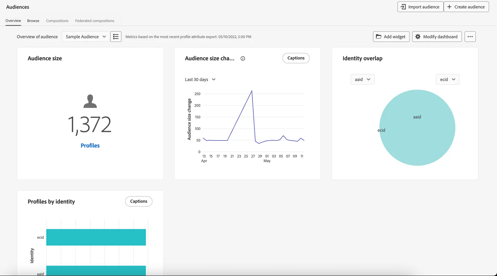

# Introduzione ai tipi di pubblico {#about-segments}

>[!CONTEXTUALHELP]
>id="ajo_campaigns_content_experiment_segment"
>title="Pubblico"
>abstract="Sfruttando i dati del servizio profilo cliente in tempo reale, Adobe Experience Platform consente di generare facilmente definizioni di segmento per creare tipi di pubblico mirati, che acquisiscono preferenze e comportamenti univoci dei clienti."

>[!CONTEXTUALHELP]
>id="ajo_campaigns_audience"
>title="Selezionare il pubblico della campagna"
>abstract="Questo elenco mostra tutti i tipi di pubblico di Adobe Experience Platform disponibili. Seleziona il pubblico a cui destinare la campagna. Il messaggio configurato nella campagna verrà inviato a tutti i singoli utenti appartenenti al pubblico selezionato. [Ulteriori informazioni sui tipi di pubblico](../audience/about-audiences.md)"

I tipi di pubblico sono raccolte di persone che condividono comportamenti e/o caratteristiche simili. Sono configurate e gestite centralmente su Adobe Experience Platform utilizzando il servizio di segmentazione di Adobe Experience Platform e sono facilmente accessibili all’interno di Journey Optimizer per essere attivate nei percorsi e nelle campagne.

Adobe Journey Optimizer fornisce solidi strumenti per la creazione, la gestione e l’arricchimento dei tipi di pubblico al fine di migliorare le attività di marketing. In combinazione con Adobe Real-Time Customer Data Platform, Journey Optimizer consente di creare livelli di pubblico più complessi e di condividere i tipi di pubblico in modo bidirezionale con altre soluzioni Adobe Experience Cloud.

Man mano che si verificano flussi di dati in tempo reale o caricamenti in batch, i set di dati vengono aggiornati e Journey Optimizer sposta dinamicamente gli individui da e verso i tipi di pubblico e i percorsi in tempo reale.

>[!BEGINSHADEBOX]

Questa documentazione fornisce informazioni su come lavorare con i tipi di pubblico in [!DNL Adobe Journey Optimizer]. Informazioni dettagliate sul portale del pubblico e sui tipi di pubblico sono disponibili nella documentazione del servizio di segmentazione di Adobe Experience Platform. Per ulteriori informazioni, consulta queste sezioni:

* [Guida dell’interfaccia utente di Segmentation Service](https://experienceleague.adobe.com/en/docs/experience-platform/segmentation/ui/overview){target="_blank"}

* [Servizio di segmentazione - Domande frequenti](https://experienceleague.adobe.com/it/docs/experience-platform/segmentation/faq){target="_blank"}

>[!ENDSHADEBOX]

## Sfoglia tipi di pubblico {#browse}

I tipi di pubblico sono disponibili dal menu **[!UICONTROL Cliente]** > **[!UICONTROL Tipi di pubblico]**.

Una dashboard mostra visivamente le sovrapposizioni tra tipi di pubblico importanti e supporta l’esplorazione di tendenze di pubblico importanti. Ad esempio, le modifiche nelle dimensioni del pubblico in un dato periodo di tempo o picchi improvvisi di pubblico possono evidenziare eventi o azioni che hanno causato una contrazione o un aumento del pubblico, come un’offerta di successo.

Dal Portale dell’audience, puoi gestire, trovare ed esplorare facilmente i tipi di pubblico con etichette, controlli di governance, cartelle ricercabili e tag standardizzati.

Per ulteriori informazioni su come lavorare con i tipi di pubblico nel Portale pubblico, consulta la [documentazione del servizio di segmentazione di Adobe Experience Platform](https://experienceleague.adobe.com/docs/experience-platform/segmentation/home.html?lang=it){target="_blank"}.

## Tipi di pubblico {#types}

I tipi di pubblico possono essere generati utilizzando diversi metodi:

* **Definizioni dei segmenti**: crea una nuova definizione del pubblico utilizzando il servizio di segmentazione di Adobe Experience Platform. I tipi di pubblico vengono generati dalle definizioni dei segmenti e aggiornati in momenti diversi a seconda del tipo di valutazione:

   * Segmentazione in streaming: i tipi di pubblico vengono aggiornati in tempo reale man mano che nuovi dati fluiscono in, garantendo una rilevanza continua in base all’attività dell’utente.
   * Segmentazione in batch: i tipi di pubblico vengono aggiornati ogni 24 ore, acquisendo un’istantanea dei profili a un intervallo fisso. Se utilizzati nei percorsi, i membri del segmento appena qualificati potrebbero non essere visualizzati fino allo snapshot successivo. [Ulteriori informazioni sui tempi](../building-journeys/audience-qualification-events.md#timing-segment-membership).
   * Segmentazione di Edge: i tipi di pubblico vengono valutati istantaneamente al limite, consentendo una personalizzazione in tempo reale.

  [Scopri come creare le definizioni dei segmenti](creating-a-segment-definition.md)

* **Caricamento personalizzato**: importa un pubblico utilizzando un file CSV. [Scopri come creare tipi di pubblico per il caricamento personalizzati](custom-upload.md)

* **Composizione pubblico**: crea un flusso di lavoro di composizione per combinare i tipi di pubblico esistenti in un&#39;area di lavoro visiva e applicare azioni quali classificazione, suddivisione e unione per creare nuovi tipi di pubblico. [Scopri come utilizzare la composizione del pubblico](get-started-audience-orchestration.md)

* **Composizione pubblico federato**: unisci i set di dati direttamente dal data warehouse esistente per creare e arricchire tipi di pubblico e attributi di Adobe Experience Platform in un unico sistema. [Scopri come utilizzare Federated Audience Composition](federated-audience-composition.md).

## Targeting dei tipi di pubblico in percorsi e campagne {#target-audiences}

Una volta che i tipi di pubblico sono pronti, puoi selezionarli durante la creazione di percorsi o campagne, per raggiungere le persone giuste al momento giusto con messaggi pertinenti. [Ulteriori informazioni su Audience Activation in Journey Optimizer](target-audiences.md).

## Video introduttivo {#video}

Scopri i profili cliente unificati e i tipi di pubblico in Journey Optimizer.

>[!VIDEO](https://video.tv.adobe.com/v/3432671?quality=12)
