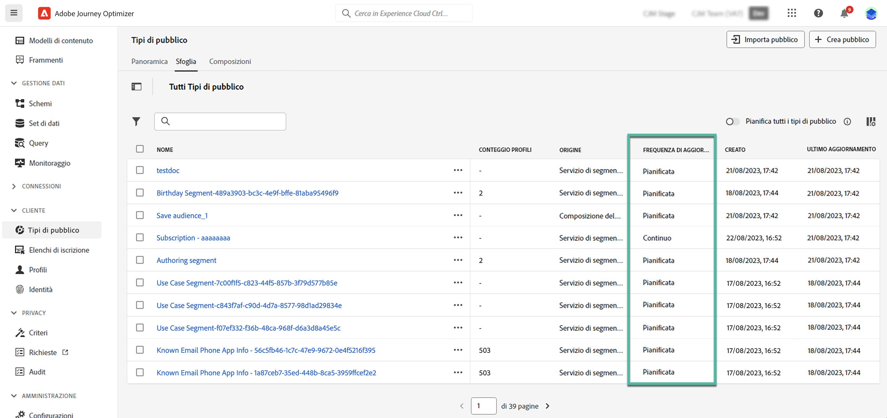

# Introduzione ai tipi di pubblico di Adobe Experience Platform {#about-segments}

>[!CONTEXTUALHELP]
>id="ajo_campaigns_content_experiment_segment"
>title="Pubblico"
>abstract="Sfruttando i dati del servizio profilo cliente in tempo reale, Adobe Experience Platform consente di generare facilmente definizioni di segmento per creare tipi di pubblico mirati, che acquisiscono preferenze e comportamenti univoci dei clienti."

>[!CONTEXTUALHELP]
>id="ajo_campaigns_audience"
>title="Selezionare il pubblico della campagna"
>abstract="Questo elenco mostra tutti i tipi di pubblico di Adobe Experience Platform disponibili. Seleziona il pubblico a cui destinare la campagna. Il messaggio configurato nella campagna verrà inviato a tutti i singoli utenti appartenenti al pubblico selezionato. [Ulteriori informazioni sul pubblico](../audience/about-audiences.md)"

[!DNL Journey Optimizer] consente di generare e sfruttare tipi di pubblico di Adobe Experience Platform utilizzando i dati del profilo cliente in tempo reale direttamente dal menu **[!UICONTROL Tipi di pubblico]** e utilizzarli nei percorsi o nelle campagne.

Ulteriori informazioni nella [documentazione del servizio di segmentazione di Adobe Experience Platform](https://experienceleague.adobe.com/docs/experience-platform/segmentation/home.html?lang=it).

## Utilizzare tipi di pubblico in [!DNL Journey Optimizer] {#segments-in-journey-optimizer}

Puoi sfruttare i tipi di pubblico in **[!DNL Journey Optimizer]** in modi diversi:

* Scegli un pubblico per una **campagna**: il messaggio viene inviato a tutti i singoli utenti appartenenti al pubblico selezionato. [Scopri come definire il pubblico di una campagna](../campaigns/create-campaign.md#define-the-audience-audience).

* Utilizza un’attività di orchestrazione **Leggi pubblico** in un percorso per fare in modo che tutti i singoli utenti del pubblico entrino nel percorso e ricevano i messaggi inclusi nel percorso.

  Supponiamo che tu abbia un pubblico di tipo “cliente silver”. Con questa attività, puoi fare in modo che tutti i clienti silver entrino in un percorso e inviare loro una serie di messaggi personalizzati. [Scopri come configurare un’attività Leggi pubblico](../building-journeys/read-audience.md#configuring-segment-trigger-activity).

* Utilizza l’attività di evento **Qualificazione del pubblico** in un percorso per consentire a singoli utenti di entrare o proseguire nel percorso, sulla base degli ingressi e delle uscite del pubblico di Adobe Experience Platform.

  Ad esempio, puoi fare in modo che tutti i nuovi clienti silver entrino in un percorso e inviare loro messaggi. Per ulteriori informazioni su come utilizzare questa attività, fai riferimento a [Scopri come configurare un’attività di qualificazione del pubblico](../building-journeys/audience-qualification-events.md).

* Utilizza l’attività **Condizione** in un percorso per generare condizioni basate sull’iscrizione al pubblico. [Scopri come utilizzare i tipi di pubblico nelle condizioni](../building-journeys/condition-activity.md#using-a-segment).

## Metodi di valutazione del pubblico{#evaluation-method-in-journey-optimizer}

In Adobe Journey Optimizer, i tipi di pubblico vengono generati dalle definizioni dei segmenti utilizzando uno dei due metodi di valutazione seguenti:

* **Segmentazione in streaming**: l’elenco dei profili per il pubblico viene tenuto aggiornato in tempo reale man mano che nuovi dati fluiscono nel sistema.

  La segmentazione in streaming è un processo continuo di selezione di dati che aggiorna i tipi di pubblico in risposta all’attività dell’utente. Una volta generata la definizione di un segmento e salvato il pubblico risultante, la definizione del segmento viene applicata ai dati in entrata in Journey Optimizer. Ciò significa che i singoli utenti vengono aggiunti o rimossi dal pubblico con la modifica dei dati del loro profilo, garantendo che il pubblico target sia sempre rilevante.

* **Segmentazione in batch**: l’elenco dei profili per il pubblico viene valutato ogni 24 ore.

  La segmentazione in batch è un’alternativa alla segmentazione in streaming che elabora tutti i dati di profilo contemporaneamente tramite le definizioni dei segmenti. In questo modo viene creata un’istantanea del pubblico, che è possibile salvare ed esportare per l’utilizzo. Tuttavia, a differenza della segmentazione in streaming, la segmentazione in batch non aggiorna continuamente l’elenco del pubblico in tempo reale e i nuovi dati che arrivano dopo il processo batch non si riflettono nel pubblico fino al successivo processo batch.&quot;

La determinazione tra segmentazione in batch e segmentazione in streaming viene effettuata dal sistema per ogni pubblico, in base alla complessità e al costo di valutazione della regola di definizione del segmento. Puoi visualizzare il metodo di valutazione per ogni pubblico nella colonna **[!UICONTROL Metodo di valutazione]** dell’elenco di pubblico.

>[!NOTE]
>
>Se la colonna **[!UICONTROL Metodo di valutazione]** non viene visualizzata, è necessario aggiungerla tramite il pulsante di configurazione in alto a destra nell’elenco.

Dopo aver definito per la prima volta un pubblico, vengono aggiunti i profili quando idonei.

Il recupero del pubblico dai dati precedenti può richiedere fino a 24 ore. Dopo il recupero, il pubblico viene aggionato costantemente ed è sempre pronto per il targeting.
