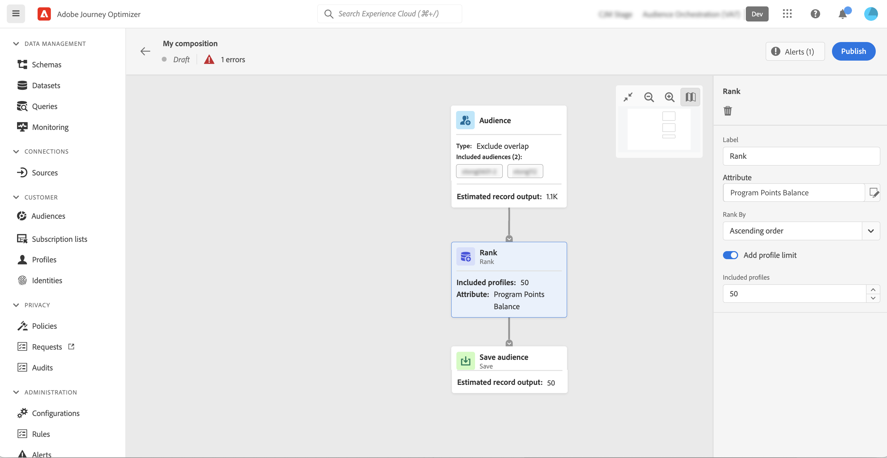

# Lavorare nell’area di lavoro per la composizione {#composition-canvas}

>[!BEGINSHADEBOX]

Questa documentazione fornisce informazioni dettagliate su come lavorare con la composizione del pubblico in Adobe Journey Optimizer. Se non utilizzi Adobe Journey Optimizer, [fai clic qui](https://experienceleague.adobe.com/docs/experience-platform/segmentation/ui/audience-composition.html)

>[!ENDSHADEBOX]

La composizione del pubblico fornisce un’area di lavoro visiva che consente di creare tipi di pubblico e utilizzare varie attività (suddivisione, arricchimento, ecc.).

I passaggi per comporre un pubblico nell’area di lavoro sono i seguenti:

1. [Definisci i tipi di pubblico iniziali](#starting-audience)
1. [Aggiungi una o più attività](#action-activities)
1. [Salvare i risultati in un nuovo pubblico](#save)

## Selezionare il pubblico iniziale {#starting-audience}

Il primo passaggio per creare una composizione consiste nel selezionare uno o più tipi di pubblico esistenti come base della composizione.

1. Seleziona la **[!UICONTROL Pubblico]** quindi fornire un’etichetta per l’attività.

1. Scegli il pubblico di destinazione:

   * Fai clic su **[!UICONTROL Aggiungi pubblico]** per selezionare uno o più tipi di pubblico esistenti,
   * Fai clic su **[!UICONTROL Genera regola]** per creare una nuova definizione di pubblico utilizzando [Servizio di segmentazione](https://experienceleague.adobe.com/docs/experience-platform/segmentation/ui/overview.html).

   

1. Se sono selezionati più tipi di pubblico, specifica come unire i profili di tali tipi di pubblico:

* **[!UICONTROL Union]**: include tutti i profili dei tipi di pubblico selezionati,
* **[!UICONTROL Intersezione]**: include profili comuni a tutti i tipi di pubblico selezionati,
* **[!UICONTROL Escludi sovrapposizione]**: includi i profili che appartengono a uno solo dei tipi di pubblico. I profili appartenenti a più di un pubblico non verranno inclusi.

In questo esempio, vogliamo eseguire il targeting di tutti i profili appartenenti ai tipi di pubblico gold e silver.

Una volta selezionati i tipi di pubblico, il numero stimato di profili viene visualizzato nella parte inferiore dell’attività.

## Aggiungi attività {#action-activities}

Per perfezionare la selezione, aggiungi attività dopo aver selezionato il pubblico iniziale.

A questo scopo, fai clic sul pulsante + sul percorso della composizione, quindi seleziona l’attività desiderata. Si apre il riquadro a destra, che consente di configurare la nuova attività aggiunta.

Le attività disponibili sono:

* [Pubblico](#audience): includere profili aggiuntivi appartenenti a uno o più tipi di pubblico esistenti,
* [Escludi](#exclude): escludi profili appartenenti a un pubblico esistente o escludi profili basati su attributi specifici,
* [Arricchire](#enrich): arricchisci il pubblico con attributi aggiuntivi provenienti dai set di dati di Adobe Experience Platform,
* [Classifica](#rank): classifica i profili in base a un attributo specifico, specifica il numero di profili da mantenere e includerli nella composizione,
* [Dividi](#split): divide la composizione in più percorsi in base a percentuali casuali o ad attributi.

Puoi aggiungerne altrettanti **[!UICONTROL Pubblico]** e **[!UICONTROL Escludi]** attività necessarie nella composizione. Tuttavia, non è possibile aggiungere alcuna attività dopo **[!UICONTROL Classifica]** e **[!UICONTROL Dividi]** attività.

Puoi rimuovere un’attività dall’area di lavoro in qualsiasi momento facendo clic sul pulsante Elimina nel riquadro a destra.  Se l’attività che desideri eliminare è padre di altre attività nella composizione, viene visualizzato un messaggio che ti consente di specificare se desideri eliminare solo l’attività selezionata o tutte le relative attività figlio.

### Attività Pubblico {#audience}

>[!CONTEXTUALHELP]
>id="ajo_ao_audience"
>title="Attività Pubblico"
>abstract="L’attività Pubblico consente di includere nella composizione profili aggiuntivi appartenenti a un pubblico esistente."

>[!CONTEXTUALHELP]
>id="ajo_ao_merge_types"
>title="Tipi di unione"
>abstract="Specifica come devono essere uniti i profili dei tipi di pubblico selezionati."

Il **[!UICONTROL Pubblico]** attività ti consente di includere nella composizione ulteriori profili appartenenti a un pubblico esistente.

La configurazione di questa attività è identica a quella iniziale [Attività del pubblico](#starting-audience).

### Attività di esclusione {#exclude}

>[!CONTEXTUALHELP]
>id="ajo_ao_exclude_type"
>title="Tipo di esclusione"
>abstract="Utilizza il tipo Escludi pubblico per escludere i profili appartenenti a un pubblico esistente. Il tipo Escludi con attributo consente di escludere i profili in base a un attributo specifico."

>[!CONTEXTUALHELP]
>id="ajo_ao_exclude"
>title="Attività di esclusione"
>abstract="L’attività di esclusione consente di escludere i profili dalla composizione selezionando un pubblico esistente o utilizzando una regola."

Il **[!UICONTROL Escludi]** attività ti consente di escludere profili dalla composizione. Sono disponibili due tipi di esclusione:

* **[!UICONTROL Escludi pubblico]**: escludi i profili appartenenti a un pubblico esistente.

  Fai clic su **[!UICONTROL Aggiungi pubblico]** quindi selezionare il pubblico da escludere.

  

* **[!UICONTROL Escludi con attributo]**: escludi i profili basati su un attributo specifico.

  Seleziona l’attributo da cercare, quindi specifica il valore da escludere. In questo esempio, escludiamo dai profili di composizione il cui indirizzo principale è in Giappone.

  

### Arricchire {#enrich}

>[!CONTEXTUALHELP]
>id="ajo_ao_enrich"
>title="Attività Arricchisci"
>abstract="Utilizza l’attività Enrich per arricchire il pubblico con attributi aggiuntivi provenienti dai set di dati di Adobe Experience Platform. Ad esempio, puoi aggiungere informazioni relative al prodotto acquistato come nome, prezzo o ID produttore e sfruttarle per personalizzare le consegne inviate al pubblico."

>[!CONTEXTUALHELP]
>id="ajo_ao_enrich_dataset"
>title="Set di dati di arricchimento"
>abstract="Seleziona il set di dati di arricchimento contenente i dati che desideri associare al pubblico."

>[!CONTEXTUALHELP]
>id="ajo_ao_enrich_criteria"
>title="Criteri di arricchimento"
>abstract="Seleziona i campi da utilizzare come chiave di riconciliazione tra il set di dati di origine, ovvero il pubblico, e il set di dati di arricchimento."

>[!CONTEXTUALHELP]
>id="ajo_ao_enrich_attributes"
>title="Attributi di arricchimento"
>abstract="Seleziona uno o più attributi dal set di dati di arricchimento da associare al pubblico. Una volta pubblicata la composizione, questi attributi sono associati al pubblico e possono essere utilizzati nelle campagne Journey Optimizer per personalizzare le consegne."

Il **[!UICONTROL Arricchire]** attività ti consente di arricchire il pubblico con attributi aggiuntivi provenienti dai set di dati di Adobe Experience Platform. Ad esempio, puoi aggiungere informazioni relative al prodotto acquistato come nome, prezzo o ID produttore e sfruttarle per personalizzare le consegne inviate al pubblico.

Tieni presente le seguenti limitazioni quando lavori con **[!UICONTROL Arricchire]** attività:

* **Set di dati** per l’arricchimento deve essere di tipo record (anziché di tipo evento) e non può essere un set di dati di sistema né essere contrassegnato per il profilo. Devono essere inferiori a 1 GB.
* **L’arricchimento supporta un join 1:1**. Ciò significa che se le chiavi di join hanno più di una corrispondenza nel set di dati di arricchimento, il sistema seleziona una delle corrispondenze e la utilizza per il join 1:1.
* **I tipi di pubblico possono essere attivati nelle destinazioni RTCDP**, ma gli eventuali attributi di arricchimento non possono.

Per configurare l’attività, effettua le seguenti operazioni:

1. Seleziona la **[!UICONTROL Set di dati di arricchimento]** contenente i dati che desideri associare al pubblico.

1. In **[!UICONTROL Criteri di arricchimento]** , seleziona i campi da utilizzare come chiave di riconciliazione tra il set di dati di origine, ovvero il pubblico, e il set di dati di arricchimento. In questo esempio, utilizziamo l’ID del prodotto acquistato come chiave di riconciliazione.

1. Fai clic su **[!UICONTROL Aggiungi attributi]** quindi seleziona uno o più attributi dal set di dati di arricchimento da associare al pubblico.

   

Una volta pubblicata la composizione, gli attributi selezionati vengono associati al pubblico e possono essere utilizzati nelle campagne per personalizzare le consegne.

### Attività Classificazione {#rank}

>[!CONTEXTUALHELP]
>id="ajo_ao_ranking"
>title="Attività Classificazione"
>abstract="L’attività Classificazione consente di classificare i profili in base a un attributo specifico e di includerli nella composizione. Ad esempio, puoi includere i 50 profili con la maggiore quantità di punti fedeltà."

>[!CONTEXTUALHELP]
>id="ajo_ao_rank_profilelimit_text"
>title="Aggiungere un limite di profili"
>abstract="Attiva questa opzione per specificare un numero massimo di profili da includere nella composizione."

Il **[!UICONTROL Classifica]** attività ti consente di classificare i profili in base a un attributo specifico e di includerli nella composizione. Ad esempio, puoi includere i 50 profili con il maggior numero di punti fedeltà.

1. Seleziona l’attributo da cercare e specifica un ordine di classificazione (crescente o decrescente).

   >[!NOTE]
   >
   >È possibile selezionare gli attributi con i seguenti tipi di dati: numero intero, numero, breve <!--(other?)-->

1. Attiva/disattiva **[!UICONTROL Aggiungi limite profilo]** e specificare un numero massimo di profili da includere nella composizione.

   

### Attività Dividi {#split}

<!-- [!CONTEXTUALHELP]
>id="ajo_ao_control_group_text"
>title="Control Group"
>abstract="Use control groups to isolate a portion of the profiles. This allows you to measure the impact of a marketing activity and make a comparison with the behavior of the rest of the population."-->

>[!CONTEXTUALHELP]
>id="ajo_ao_split"
>title="Attività Dividi"
>abstract="L’attività Dividi consente di dividere la composizione in più percorsi. Quando pubblichi la composizione, viene salvato un pubblico per ogni percorso in Adobe Experience Platform."

>[!CONTEXTUALHELP]
>id="ajo_ao_split_type"
>title="Tipo di divisione"
>abstract="Utilizza il tipo di divisione percentuale per dividere in modo casuale i profili in più percorsi. Il tipo di divisione per attributo consente invece di dividere i profili in base a un attributo specifico."

>[!CONTEXTUALHELP]
>id="ajo_ao_split_otherprofiles_text"
>title="Altri profili"
>abstract="Attiva questa opzione per creare un percorso aggiuntivo con i profili rimanenti che non corrispondono a nessuna delle condizioni specificate negli altri percorsi."

Il **[!UICONTROL Dividi]** L’attività ti consente di dividere la composizione in più percorsi.

Questa operazione aggiunge automaticamente un **[!UICONTROL Salva]** attività alla fine di ciascun percorso. Quando pubblichi la composizione, viene salvato un pubblico per ogni percorso in Adobe Experience Platform.

Sono disponibili due tipi di operazioni di suddivisione:

* **[!UICONTROL Divisione percentuale]**: i profili vengono suddivisi in modo casuale in due o più percorsi. Ad esempio, puoi suddividere i profili in 2 percorsi distinti del 50% ciascuno. <!--and add an additional path for control group.-->

  

* **[!UICONTROL Suddivisione attributi]**: suddivide i profili in base a un attributo specifico. In questo esempio, i profili vengono suddivisi in base alle preferenze per il tipo di stanza.

  

  >[!NOTE]
  >
  >Il **[!UICONTROL Altri profili]** consente di creare un percorso aggiuntivo con i profili rimanenti che non corrispondono a nessuna delle condizioni specificate negli altri percorsi.

## Salvare i tipi di pubblico {#save}

Configura i tipi di pubblico risultanti che verranno salvati in Adobe Experience Platform.

A questo scopo, seleziona la **[!UICONTROL Salva pubblico]** attività alla fine di ciascun percorso, quindi specifica il nome del nuovo pubblico da creare.

Quando la composizione è pronta, potete pubblicarla. [Scopri come creare le composizioni](create-compositions.md)
