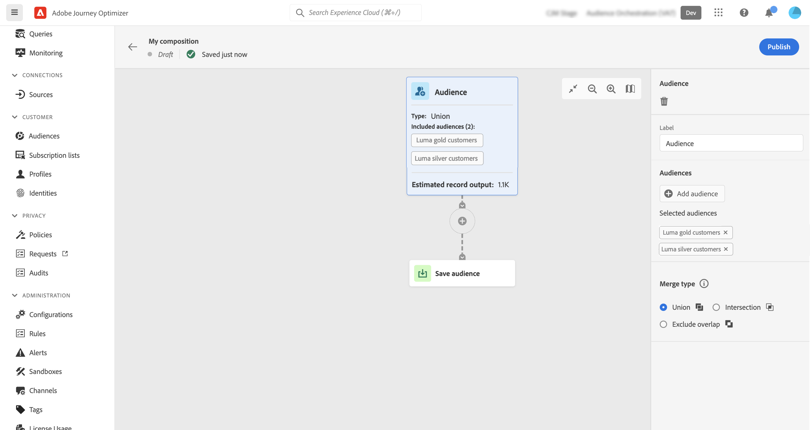

# Lavorare nell’area di lavoro per la composizione {#composition-canvas}

>[!BEGINSHADEBOX]

Questa documentazione fornisce informazioni dettagliate su come lavorare con la composizione del pubblico in Adobe Journey Optimizer. Se non utilizzi Adobe Journey Optimizer, [fai clic qui](https://experienceleague.adobe.com/docs/experience-platform/segmentation/ui/audience-composition.html?lang=it){target="_blank"}.

>[!ENDSHADEBOX]

La composizione del pubblico fornisce un’area di lavoro visiva che consente di creare tipi di pubblico e utilizzare varie attività (suddivisione, arricchimento, ecc.).

I passaggi per comporre un pubblico nell’area di lavoro sono i seguenti:

1. [Definisci i tipi di pubblico iniziali](#starting-audience)
1. [Aggiungi una o più attività](#action-activities)
1. [Salva i risultati in un nuovo pubblico](#save)

## Selezionare il pubblico iniziale {#starting-audience}

Il primo passaggio per creare una composizione consiste nel selezionare uno o più tipi di pubblico esistenti come base della composizione.

1. Seleziona l&#39;attività **[!UICONTROL Pubblico]** e fornisci un&#39;etichetta per l&#39;attività.

1. Scegli il pubblico di destinazione:

   * Fai clic sul pulsante **[!UICONTROL Aggiungi pubblico]** per selezionare uno o più tipi di pubblico esistenti.
   * Fai clic sul pulsante **[!UICONTROL Genera regola]** per creare una nuova definizione di pubblico utilizzando il [Servizio di segmentazione](https://experienceleague.adobe.com/docs/experience-platform/segmentation/ui/overview.html?lang=it).

   

1. Se sono selezionati più tipi di pubblico, specifica come unire i profili di tali tipi di pubblico:

* **[!UICONTROL Unione]**: includi tutti i profili dei tipi di pubblico selezionati,
* **[!UICONTROL Intersezione]**: include profili comuni a tutti i tipi di pubblico selezionati,
* **[!UICONTROL Escludi sovrapposizione]**: includi i profili che appartengono a uno solo dei tipi di pubblico. I profili appartenenti a più di un pubblico non verranno inclusi.

In questo esempio, vogliamo eseguire il targeting di tutti i profili appartenenti ai tipi di pubblico gold e silver.

Una volta selezionati i tipi di pubblico, il numero stimato di profili viene visualizzato nella parte inferiore dell’attività.

## Aggiungere attività {#action-activities}

Per perfezionare la selezione, aggiungi attività dopo aver selezionato il pubblico iniziale.

A questo scopo, fai clic sul pulsante + sul percorso della composizione, quindi seleziona l’attività desiderata. Si apre il riquadro a destra, che consente di configurare la nuova attività aggiunta.

Le attività disponibili sono:

* [Pubblico](#audience): includi profili aggiuntivi appartenenti a uno o più tipi di pubblico esistenti,
* [Escludi](#exclude): escludi i profili appartenenti a un pubblico esistente o escludi i profili basati su attributi specifici,
* [Arricchisci](#enrich): arricchisci il pubblico con attributi aggiuntivi provenienti dai set di dati di Adobe Experience Platform,
* [Classificazione](#rank): classifica i profili in base a un attributo specifico, specifica il numero di profili da mantenere e includerli nella composizione,
* [Dividi](#split): dividi la composizione in più percorsi in base a percentuali casuali o ad attributi.

Puoi aggiungere tutte le **[!UICONTROL attività Pubblico]** e **[!UICONTROL Escludi]** necessarie nella composizione. Tuttavia, non è possibile aggiungere altre attività dopo le attività **[!UICONTROL Classifica]** e **[!UICONTROL Dividi]**.

Puoi rimuovere un’attività dall’area di lavoro in qualsiasi momento facendo clic sul pulsante Elimina nel riquadro a destra.  Se l’attività che desideri eliminare è padre di altre attività nella composizione, viene visualizzato un messaggio che ti consente di specificare se desideri eliminare solo l’attività selezionata o tutte le relative attività figlio.

### Attività Pubblico {#audience}

>[!CONTEXTUALHELP]
>id="ajo_ao_audience"
>title="Attività Pubblico"
>abstract="L’attività Pubblico consente di includere nella composizione profili aggiuntivi appartenenti a un pubblico esistente."

>[!CONTEXTUALHELP]
>id="ajo_ao_merge_types"
>title="Tipi di unione"
>abstract="Specifica come devono essere uniti i profili dei tipi di pubblico selezionati."

L&#39;attività **[!UICONTROL Pubblico]** ti consente di includere nella composizione ulteriori profili appartenenti a un pubblico esistente.

La configurazione di questa attività è identica a quella della [attività Pubblico](#starting-audience) iniziale.

### Attività di esclusione {#exclude}

>[!CONTEXTUALHELP]
>id="ajo_ao_exclude_type"
>title="Tipo di esclusione"
>abstract="Utilizza il tipo Escludi pubblico per escludere i profili appartenenti a un pubblico esistente. Il tipo Escludi con attributo consente di escludere i profili in base a un attributo specifico."

>[!CONTEXTUALHELP]
>id="ajo_ao_exclude"
>title="Attività di esclusione"
>abstract="L’attività di esclusione consente di escludere i profili dalla composizione selezionando un pubblico esistente o utilizzando una regola."

L&#39;attività **[!UICONTROL Escludi]** ti consente di escludere i profili dalla composizione. Sono disponibili due tipi di esclusione:

* **[!UICONTROL Escludi pubblico]**: escludi i profili appartenenti a un pubblico esistente.

  Fai clic sul pulsante **[!UICONTROL Aggiungi pubblico]**, quindi seleziona il pubblico da escludere.

  

* **[!UICONTROL Escludi con attributo]**: escludi i profili in base a un attributo specifico.

  Seleziona l’attributo da cercare, quindi specifica il valore da escludere. In questo esempio, escludiamo dai profili di composizione il cui indirizzo principale è in Giappone.

  >[!NOTE]
  >
  >È possibile specificare un solo valore di esclusione.

  

### Attività Arricchisci {#enrich}

>[!CONTEXTUALHELP]
>id="ajo_ao_enrich"
>title="Attività Arricchisci"
>abstract="Utilizza l’attività Enrich per arricchire il pubblico con attributi aggiuntivi provenienti dai set di dati di Adobe Experience Platform. Ad esempio, puoi aggiungere informazioni relative al prodotto acquistato come nome, prezzo o ID produttore e sfruttarle per personalizzare le consegne inviate al pubblico."

>[!CONTEXTUALHELP]
>id="ajo_ao_enrich_dataset"
>title="Set di dati di arricchimento"
>abstract="Seleziona il set di dati di arricchimento contenente i dati che desideri associare al pubblico."

>[!CONTEXTUALHELP]
>id="ajo_ao_enrich_criteria"
>title="Criteri di arricchimento"
>abstract="Seleziona i campi da utilizzare come chiave di riconciliazione tra il set di dati di origine, ovvero il pubblico, e il set di dati di arricchimento."

>[!CONTEXTUALHELP]
>id="ajo_ao_enrich_attributes"
>title="Attributi di arricchimento"
>abstract="Seleziona uno o più attributi dal set di dati di arricchimento da associare al pubblico. Una volta pubblicata la composizione, questi attributi sono associati al pubblico e possono essere utilizzati nelle campagne Journey Optimizer per personalizzare le consegne."

L&#39;attività **[!UICONTROL Arricchisci]** ti consente di arricchire il pubblico con attributi aggiuntivi provenienti dai set di dati di Adobe Experience Platform. Ad esempio, puoi aggiungere informazioni relative al prodotto acquistato come nome, prezzo o ID produttore e sfruttarle per personalizzare le consegne inviate al pubblico.

Tieni presente le seguenti limitazioni quando utilizzi l&#39;attività **[!UICONTROL Arricchisci]**:

* **I set di dati** per l&#39;arricchimento devono essere di tipo record (anziché di tipo evento) e non possono essere un set di dati di sistema né contrassegnati per il profilo. Devono essere inferiori a 1 GB.
* **L&#39;arricchimento supporta un join 1:1**. Ciò significa che se le chiavi di join hanno più di una corrispondenza nel set di dati di arricchimento, il sistema seleziona una delle corrispondenze e la utilizza per il join 1:1.
* **I tipi di pubblico possono essere attivati nelle destinazioni RTCDP**, ma gli eventuali attributi di arricchimento non possono.
* Gli attributi di arricchimento non sono ancora integrati con il servizio di applicazione dei criteri. Pertanto, eventuali etichette di utilizzo dei dati applicate agli attributi di arricchimento non verranno applicate nelle campagne o nei percorsi Journey Optimizer.

Per configurare l’attività, effettua le seguenti operazioni:

1. Selezionare il **[!UICONTROL set di dati di arricchimento]** contenente i dati che si desidera associare al pubblico.

1. Nella sezione **[!UICONTROL Criteri di arricchimento]**, seleziona i campi da utilizzare come chiave di riconciliazione tra il set di dati di origine, ovvero il pubblico, e il set di dati di arricchimento. In questo esempio, utilizziamo l’ID del prodotto acquistato come chiave di riconciliazione.

1. Fai clic sul pulsante **[!UICONTROL Aggiungi attributi]**, quindi seleziona uno o più attributi dal set di dati di arricchimento da associare al pubblico.

   

Una volta pubblicata la composizione, gli attributi selezionati vengono associati al pubblico e possono essere utilizzati nelle campagne per personalizzare le consegne.

### Attività Classificazione {#rank}

>[!CONTEXTUALHELP]
>id="ajo_ao_ranking"
>title="Attività Classificazione"
>abstract="L’attività Classificazione consente di classificare i profili in base a un attributo specifico e di includerli nella composizione. Ad esempio, puoi includere i 50 profili con la maggiore quantità di punti fedeltà."

>[!CONTEXTUALHELP]
>id="ajo_ao_rank_profilelimit_text"
>title="Aggiungere un limite di profili"
>abstract="Attiva questa opzione per specificare un numero massimo di profili da includere nella composizione."

L&#39;attività **[!UICONTROL Classifica]** ti consente di classificare i profili in base a un attributo specifico e di includerli nella composizione. Ad esempio, puoi includere i 50 profili con il maggior numero di punti fedeltà.

1. Seleziona l’attributo da cercare e specifica un ordine di classificazione (crescente o decrescente).

   >[!NOTE]
   >
   >È possibile selezionare gli attributi con i seguenti tipi di dati: numero intero, numeri, <!--(other?)--> breve

1. Attiva l&#39;opzione **[!UICONTROL Aggiungi limite profilo]** e specifica un numero massimo di profili da includere nella composizione.

   

### Attività Dividi {#split}

<!-- [!CONTEXTUALHELP]
>id="ajo_ao_control_group_text"
>title="Control Group"
>abstract="Use control groups to isolate a portion of the profiles. This allows you to measure the impact of a marketing activity and make a comparison with the behavior of the rest of the population."-->

>[!CONTEXTUALHELP]
>id="ajo_ao_split"
>title="Attività Dividi"
>abstract="L’attività Dividi consente di dividere la composizione in più percorsi. Quando pubblichi la composizione, viene salvato un pubblico per ogni percorso in Adobe Experience Platform."

>[!CONTEXTUALHELP]
>id="ajo_ao_split_type"
>title="Tipo di divisione"
>abstract="Utilizza il tipo di divisione percentuale per dividere in modo casuale i profili in più percorsi. Il tipo di divisione per attributo consente invece di dividere i profili in base a un attributo specifico."

>[!CONTEXTUALHELP]
>id="ajo_ao_split_otherprofiles_text"
>title="Altri profili"
>abstract="Attiva questa opzione per creare un percorso aggiuntivo con i profili rimanenti che non corrispondono a nessuna delle condizioni specificate negli altri percorsi."

L&#39;attività **[!UICONTROL Dividi]** consente di dividere la composizione in più percorsi.

Questa operazione aggiunge automaticamente un&#39;attività **[!UICONTROL Salva]** alla fine di ogni percorso. Quando pubblichi la composizione, viene salvato un pubblico per ogni percorso in Adobe Experience Platform.

Sono disponibili due tipi di operazioni di suddivisione:

* **[!UICONTROL Percentuale divisa]**: dividi in modo casuale i profili in due o più percorsi. Ad esempio, puoi suddividere i profili in 2 percorsi distinti del 50% ciascuno. <!--and add an additional path for control group.-->

  

* **[!UICONTROL Suddivisione attributo]**: suddivisione dei profili in base a un attributo specifico. In questo esempio, i profili vengono suddivisi in base alle preferenze per il tipo di stanza.

  

  Per impostare un’attività di suddivisione basata su attributi, effettua le seguenti operazioni:

   1. Fai clic sul pulsante accanto al campo **[!UICONTROL Attributo]** per selezionare l&#39;attributo da utilizzare come criterio di suddivisione.
   1. Aggiungi tutti i percorsi necessari. Per ogni percorso, fornisci un’etichetta e specifica il valore da utilizzare per determinare quali profili includere in quel particolare percorso.

      >[!NOTE]
      >
      >È possibile specificare un solo valore per ciascun percorso.

   1. Attiva l&#39;opzione **[!UICONTROL Altri profili]** per creare un percorso aggiuntivo con i profili rimanenti che non corrispondono a nessuna delle condizioni specificate negli altri percorsi.

## Salvare i tipi di pubblico {#save}

Configura i tipi di pubblico risultanti che verranno salvati in Adobe Experience Platform.

A questo scopo, seleziona l&#39;attività **[!UICONTROL Salva pubblico]** alla fine di ogni percorso, quindi specifica il nome del nuovo pubblico da creare.

Quando la composizione è pronta, potete pubblicarla. [Scopri come creare le composizioni](create-compositions.md)
