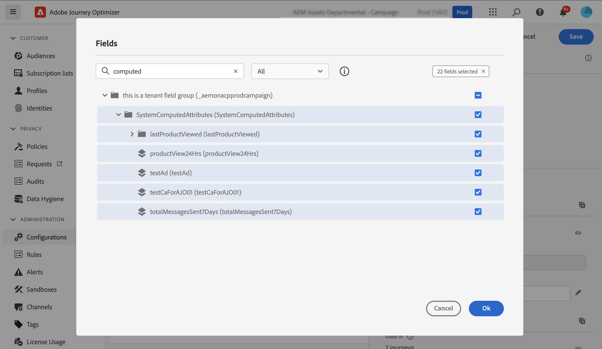

# Utilizzo di attributi con più valori {#computed-attributes}

>[!BEGINSHADEBOX]

**In questa pagina:** Scopri come creare attributi calcolati che aggregano eventi comportamentali in attributi di profilo e utilizzarli per la segmentazione, la personalizzazione e la logica di percorso in Adobe Journey Optimizer.

>[!ENDSHADEBOX]

Gli attributi calcolati riepilogano i singoli eventi comportamentali in attributi di profilo calcolati disponibili in Adobe Experience Platform. Questi attributi si basano sui set di dati Experience Event abilitati per il profilo acquisiti in Adobe Experience Platform e fungono da punti dati aggregati memorizzati nei profili dei clienti.

Ogni attributo calcolato è un attributo di profilo che puoi sfruttare per la segmentazione, la personalizzazione e l’attivazione in percorsi e campagne. Questa semplificazione migliora la capacità di fornire ai clienti esperienze personalizzate tempestive e significative.

>[!NOTE]
>
>Per accedere agli attributi calcolati, assicurati di disporre delle autorizzazioni appropriate (**Visualizza attributi calcolati** e **Gestisci attributi calcolati**).

## Creare attributi calcolati {#manage}

Per creare attributi calcolati, passare alla scheda **[!UICONTROL Attributi calcolati]** nel menu **[!UICONTROL Profili]** situato sul lato sinistro.

Da questa schermata, puoi creare attributi calcolati creando regole che combinano attributi evento, funzioni di aggregazione, insieme a un periodo di lookback specificato. Ad esempio, puoi calcolare la somma degli acquisti effettuati negli ultimi tre mesi, identificare l’articolo più recente visualizzato da un profilo che non ha effettuato un acquisto nell’ultima settimana o sommare il totale dei punti premio accumulati da ciascun profilo.

Quando la regola è pronta, pubblica l’attributo calcolato per renderlo disponibile in altri servizi a valle, incluso Journey Optimizer.

Informazioni dettagliate sulla creazione e la gestione degli attributi calcolati sono disponibili nella [documentazione relativa agli attributi calcolati](https://experienceleague.adobe.com/docs/experience-platform/profile/computed-attributes/overview.html?lang=it)

## Aggiungere attributi calcolati all&#39;origine dati Adobe Experience Platform {#source}

Per sfruttare gli attributi calcolati in Journey Optimizer, aggiungili all&#39;origine dati Journey Optimizer **Experience Platform**.

L’origine dati Adobe Experience Platform definisce la connessione ad Adobe Real-time Customer Profile. Questa origine dati recupera i dati del profilo e i dati di Experience Events da Real-time Customer Profile Service.

Per aggiungere attributi calcolati all&#39;origine dati, eseguire la procedura seguente:

1. Passa al menu a sinistra **[!UICONTROL Configurazioni]**, quindi fai clic sulla scheda **[!UICONTROL Origini dati]**.

1. Selezionare l&#39;origine dati **[!UICONTROL Experience Platform]**.

   

1. Aggiungi il gruppo di campi **[!UICONTROL SystemComputedAttributes]** contenente tutti gli attributi calcolati creati.

   

Gli attributi calcolati sono ora disponibili per l’utilizzo in Journey Optimizer. [Scopri come utilizzare gli attributi calcolati in Journey Optimizer](#use)

Informazioni dettagliate sull&#39;aggiunta di gruppi di campi all&#39;origine dati di Adobe Experience Platform sono disponibili in [questa sezione](../datasource/adobe-experience-platform-data-source.md).

## Utilizzare attributi calcolati in Journey Optimizer {#use}

>[!NOTE]
>
>Prima di iniziare, assicurati di aver aggiunto gli attributi calcolati all’origine dati Adobe Experience Platform. [Scopri come in questa sezione](#source).

Gli attributi calcolati forniscono funzionalità versatili in Journey Optimizer. Utilizzali per vari scopi, come personalizzare il contenuto dei messaggi, creare nuovi tipi di pubblico o suddividere i percorsi in base a uno specifico attributo calcolato. Ad esempio, dividi il percorso di un percorso in base agli acquisti totali di un profilo nelle ultime tre settimane aggiungendo un singolo attributo calcolato in un’attività Condizione. Puoi anche personalizzare un’e-mail visualizzando l’elemento visualizzato più di recente per ciascun profilo.

Poiché gli attributi calcolati sono campi di attributi di profilo creati nello schema di unione profili, puoi accedervi dall&#39;editor di personalizzazione nel gruppo di campi **SystemComputedAttributes**. A questo punto, aggiungi attributi calcolati nelle espressioni, trattandole come qualsiasi altro attributo di profilo per eseguire le operazioni desiderate.

+++Assistente IA — Contesto pagina

- **TL;DR:** Scopri come creare attributi calcolati in Adobe Experience Platform e sfruttarli in Journey Optimizer per la segmentazione, la personalizzazione e la logica di percorso.

**Intenti:**
- Scopri cosa sono gli attributi calcolati e come differiscono dagli attributi di profilo standard
- Creare attributi calcolati combinando attributi evento, funzioni di aggregazione e un periodo di lookback
- Aggiungere il gruppo di campi SystemComputedAttributes all&#39;origine dati di Experience Platform in AJO
- Utilizzare gli attributi calcolati nelle condizioni di percorso, nella creazione di tipi di pubblico e nella personalizzazione dei messaggi

**Glossario:**
- **Attributo calcolato**: un attributo di profilo derivato dai dati evento comportamentale aggregati, archiviato nei profili cliente *(specifico per prodotto)*
- **Periodo di lookback**: l&#39;intervallo di tempo applicato durante il calcolo della regola di aggregazione di un attributo calcolato (ad esempio, &quot;ultimi 3 mesi&quot;) *(specifico per prodotto)*
- **Gruppo di campi SystemComputedAttributes**: il gruppo di campi nell&#39;origine dati Experience Platform di AJO che espone tutti gli attributi calcolati pubblicati per l&#39;utilizzo nei percorsi e nella personalizzazione *(specifico per prodotto)*
- **Schema di unione profili**: lo schema unito che combina tutti i frammenti di profilo per una determinata identità, in cui sono memorizzati gli attributi calcolati

**Guardrail:**
- Richiede le autorizzazioni **Visualizza attributi calcolati** e **Gestisci attributi calcolati** per accedere alla funzione
- Gli attributi calcolati devono essere **pubblicati** in AEP prima che diventino disponibili a valle in Journey Optimizer
- Gli attributi calcolati devono essere aggiunti esplicitamente all&#39;origine dati **Experience Platform** in AJO prima di poter essere utilizzati nei percorsi o nella personalizzazione
- Gli attributi calcolati si basano sui set di dati Experience Event abilitati per il profilo acquisiti in Adobe Experience Platform

**Terminologia:**
- Nome canonico: Adobe Journey Optimizer — Acronimo: AJO — varianti: Journey Optimizer, A-JO
- Nome canonico: Adobe Experience Platform — Acronimo: AEP
- Sinonimi: &quot;attributi calcolati&quot; = &quot;attributi calcolati del profilo&quot;
- Non confondere: &quot;attributi calcolati&quot; (funzione aggregata specifica di AEP/AJO) ≠ &quot;attributi di profilo&quot; generici

**Domande frequenti:**
- **Q: cosa sono gli attributi calcolati?** — dati evento comportamentale aggregati (ad esempio, acquisti totali, ultimo articolo visualizzato) memorizzati come attributi di profilo su AEP e utilizzabili in AJO.
- **Q: sono necessarie autorizzazioni speciali?** — Sì: sono entrambi necessari i valori &quot;Visualizza attributi calcolati&quot; e &quot;Gestisci attributi calcolati&quot;.
- **D: come posso rendere disponibili gli attributi calcolati in Journey Optimizer?** — Aggiungere il gruppo di campi `SystemComputedAttributes` all&#39;origine dati di Experience Platform in Configurazioni > Origini dati.
- **Q: dove posso usare gli attributi calcolati in AJO?** — nelle attività Condition (Condizione) (suddivisione percorso), nella creazione di tipi di pubblico e nell&#39;editor di personalizzazione.
- **Q: cos&#39;è un periodo di lookback?** intervallo di tempo utilizzato per definire l&#39;ambito della regola di aggregazione, ad esempio &quot;somma degli acquisti effettuati nelle ultime 3 settimane&quot;.
- **Q: posso utilizzare attributi calcolati in percorsi in tempo reale?** — Sì, una volta pubblicati e aggiunti all’origine dati, sono accessibili come qualsiasi altro attributo di profilo.

+++
