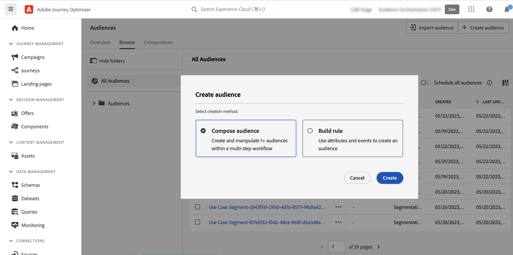

# Creare il primo flusso di lavoro per la composizione {#create-compositions}

## Creare un flusso di lavoro di composizione {#create}

Per creare un flusso di lavoro di composizione, effettuate le seguenti operazioni:

1. Accedere a **[!UICONTROL Tipi di pubblico]** menu e seleziona **[!UICONTROL Crea pubblico]**.

1. Seleziona **[!UICONTROL Componi pubblico]**.

   

   >[!NOTE]
   >
   >Il **[!UICONTROL Genera regola]** creazione consente di creare una nuova definizione di segmento utilizzando [Servizio di segmentazione](https://experienceleague.adobe.com/docs/experience-platform/segmentation/ui/overview.html).

1. L’area di lavoro della composizione viene visualizzata con due attività predefinite:

   * **[!UICONTROL Pubblico]**: il punto iniziale della composizione. Questa attività ti consente di selezionare uno o più tipi di pubblico come base per il flusso di lavoro,

   * **[!UICONTROL Salva]**: ultimo passaggio della composizione. Questa attività ti consente di salvare il risultato del flusso di lavoro in un nuovo pubblico.

   Per ulteriori informazioni su come configurare le attività nell’area di lavoro del flusso di lavoro di composizione, consulta [Utilizzare l’area di lavoro per la composizione](composition-canvas.md).

1. Aprite le proprietà di composizione per specificare un titolo e una descrizione.

   Se nelle proprietà non è definito alcun titolo, l&#39;etichetta della composizione viene impostata su &quot;Composizione&quot; seguita dalla data e dall&#39;ora di creazione.

   

1. Configura la composizione aggiungendo tutte le attività necessarie tra **[!UICONTROL Pubblico]** e **[!UICONTROL Salva]** attività. [Scopri come utilizzare l’area di lavoro della composizione](composition-canvas.md)

   

1. Una volta che la composizione è pronta, fai clic su **[!UICONTROL Pubblica]** per pubblicare la composizione e salvare i tipi di pubblico risultanti in Adobe Experience Platform.

   >[!IMPORTANT]
   >
   >Puoi pubblicare fino a 10 composizioni in una determinata sandbox. Se avete raggiunto questa soglia, dovete eliminare una composizione per liberare spazio e pubblicarne una nuova.

   Se si verifica un errore durante la pubblicazione, vengono visualizzati avvisi con informazioni su come risolvere il problema.

   

1. La composizione viene pubblicata. I tipi di pubblico risultanti vengono salvati in Adobe Experience Platform e sono pronti per essere indirizzati nelle campagne Journey Optimizer. [Scopri come utilizzare le campagne](../campaigns/get-started-with-campaigns.md)

## Accedere alle composizioni {#access}

>[!CONTEXTUALHELP]
>id="ajo_ao_publish"
>title="Pubblicare il pubblico"
>abstract="Pubblica la composizione per salvare i segmenti di pubblico risultanti in Adobe Experience Platform."

Tutte le composizioni create sono accessibili da **[!UICONTROL Composizioni]** scheda. Possono avere più stati:

* **[!UICONTROL Bozza]**: la composizione è in corso e non è stata pubblicata.
* **[!UICONTROL Pubblicato]**: la composizione è stata pubblicata, i tipi di pubblico risultanti sono stati salvati e sono disponibili per l’uso.

>[!NOTE]
>
>Potete duplicare o eliminare una composizione esistente in qualsiasi momento utilizzando il pulsante con i puntini di sospensione nell&#39;elenco.
