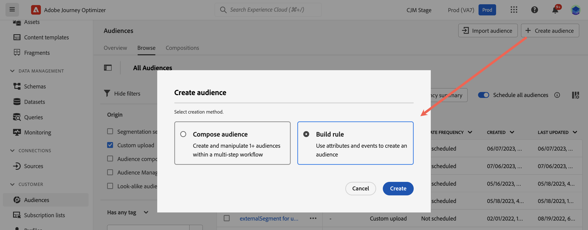
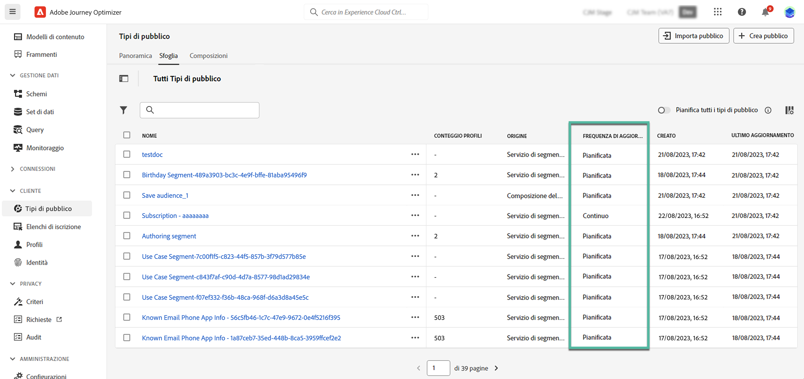

# Generare definizioni di segmento {#build-segments}

>[!CONTEXTUALHELP]
>id="ajo_ao_create_rule"
>title="Creare una regola"
>abstract="Il metodo di creazione delle regole consente di creare una nuova definizione di pubblico, utilizzando il servizio di segmentazione di Adobe Experience Platform."

## Creare una definizione di segmento {#create}

In questo esempio, puoi creare un pubblico per rivolgerti a tutti i clienti che vivono ad Atlanta, San Francisco o Seattle e sono nati dopo il 1980. Tutti questi clienti devono aver effettuato un acquisto negli ultimi 7 giorni.

➡️ [Scopri come creare tipi di pubblico in questo video](#video-segment)

1. Dal menu **[!UICONTROL Tipi di pubblico]**, fai clic sul pulsante **[!UICONTROL Crea pubblico]** e seleziona **[!UICONTROL Genera regola]**.

   

   La schermata di definizione del segmento ti consente di configurare tutti i campi obbligatori per definire il pubblico. Scopri come configurare i tipi di pubblico nella [documentazione del servizio di segmentazione](https://experienceleague.adobe.com/it/docs/experience-platform/segmentation/methods/overview){target="_blank"}.

   

1. Nel riquadro **[!UICONTROL Proprietà pubblico]**, fornisci un nome e una descrizione (facoltativa) per il pubblico.

   

1. Trascina e rilascia i campi desiderati dal riquadro di sinistra all’area di lavoro centrale, quindi configurali in base alle tue esigenze.

   I blocchi predefiniti di base delle definizioni dei segmenti sono **attributes** e **events**. Inoltre, gli attributi e gli eventi contenuti nei tipi di pubblico esistenti possono essere utilizzati come componenti per nuove definizioni. [Ulteriori informazioni sono disponibili nella documentazione del servizio di segmentazione](https://experienceleague.adobe.com/it/docs/experience-platform/segmentation/ui/segment-builder#building-blocks){target="_blank"}

   >[!NOTE]
   >
   >I campi disponibili nel riquadro a sinistra variano a seconda della configurazione degli schemi **XDM Individual Profile** e **XDM ExperienceEvent** per la tua organizzazione.  Ulteriori informazioni sono disponibili nella [documentazione di Experience Data Model (XDM)](https://experienceleague.adobe.com/docs/experience-platform/xdm/home.html?lang=it){target="_blank"}.

   

   In questo esempio, per creare il pubblico, è necessario basarsi sui campi **Attributi** e **Eventi**:

   * **Attributi**: profili che vivono ad Atlanta, San Francisco o Seattle nati dopo il 1980.

     

     >[!NOTE]
     >
     >L&#39;attributo `frequencyMap` non è supportato per l&#39;utilizzo nelle definizioni dei segmenti e non può essere utilizzato come parte dei criteri di segmentazione del pubblico. Per il targeting basato sulla frequenza, considera l’utilizzo delle regole di quota limite in base alle regole aziendali.

   * **Eventi**: profili che hanno effettuato un acquisto negli ultimi 7 giorni.

     

1. Durante l&#39;aggiunta e la configurazione di nuovi campi nell&#39;area di lavoro, il riquadro **[!UICONTROL Proprietà pubblico]** viene aggiornato automaticamente con informazioni sui profili stimati appartenenti al pubblico.

   

1. Quando il pubblico è pronto, fai clic su **[!UICONTROL Salva]**. Viene visualizzato nell’elenco del pubblico di Adobe Experience Platform. È disponibile una barra di ricerca che consente di eseguire ricerche in un pubblico specifico dell’elenco.

Il pubblico è ora pronto per essere utilizzato nei tuoi percorsi. Per ulteriori informazioni, consulta [questa sezione](../audience/about-audiences.md).

## Metodi di valutazione del pubblico {#evaluation-method-in-journey-optimizer}

In Adobe Journey Optimizer, i tipi di pubblico vengono generati dalle definizioni dei segmenti utilizzando uno dei tre metodi di valutazione seguenti.

+++ Segmentazione in streaming

L’elenco dei profili per il pubblico viene tenuto aggiornato in tempo reale man mano che nuovi dati fluiscono nel sistema.

La segmentazione in streaming è un processo continuo di selezione di dati che aggiorna i tipi di pubblico in risposta all’attività dell’utente. Una volta generata la definizione di un segmento e salvato il pubblico risultante, la definizione del segmento viene applicata ai dati in entrata in Journey Optimizer. Ciò significa che gli individui vengono aggiunti o rimossi dal pubblico con la modifica dei dati del loro profilo, garantendo che il pubblico di destinazione sia sempre rilevante. [Ulteriori informazioni nella documentazione di Adobe Experience Platform](https://experienceleague.adobe.com/docs/experience-platform/segmentation/ui/streaming-segmentation.html?lang=it){target="_blank"}.

>[!IMPORTANT]
>
>A partire dal 1° novembre 2024, la segmentazione in streaming non supporta più l&#39;utilizzo di **send** e **open** eventi dai set di dati di tracciamento e feedback di Journey Optimizer.
>
>* Questa modifica si applica a tutte le sandbox e organizzazioni del cliente.
>* Sono interessati solo gli eventi di invio e apertura: i clic e altri eventi di tracciamento rimangono disponibili per la segmentazione in streaming.
>* Questa modifica si applica solo alla segmentazione in streaming. Gli eventi di invio e apertura possono comunque essere utilizzati in segmenti batch, ma se inclusi in un segmento di streaming, vengono valutati in modo batch. Inoltre, questa modifica interessa anche gli eventi di esclusione e gli eventi di mancato recapito/ritardo risultanti da eventi di invio.
>* La raccolta dei dati di tracciamento non subisce modifiche. Gli eventi di invio e apertura continueranno a essere raccolti come di consueto.
>* Gli eventi di reazione nei percorsi non sono influenzati da questo cambiamento.

+++

+++ Segmentazione in batch

L’elenco dei profili per il pubblico viene valutato ogni 24 ore.

La segmentazione in batch elabora tutti i dati del profilo contemporaneamente tramite le definizioni dei segmenti, creando un’istantanea del pubblico che può essere salvata ed esportata per l’utilizzo. A differenza della segmentazione in streaming, la segmentazione batch non aggiorna continuamente l’elenco del pubblico in tempo reale. I nuovi dati che vengono inseriti dopo il processo batch non vengono rispecchiati nel pubblico fino al successivo processo batch. I tentativi di forzare un aggiornamento immediato non sovrascrivono il ciclo giornaliero. Per aggiornamenti incrementali immediati, considera l’utilizzo delle opzioni di segmentazione in streaming o on-demand.

Per ulteriori dettagli, consulta la [documentazione del servizio di segmentazione di Adobe Experience Platform](https://experienceleague.adobe.com/docs/experience-platform/segmentation/home.html?lang=it#batch){target="_blank"}

+++

+++ Segmentazione Edge

La segmentazione di Edge consente di valutare i segmenti in Adobe Experience Platform [istantaneamente al limite](https://experienceleague.adobe.com/docs/experience-platform/edge/home.html?lang=it){target="_blank"}, abilitando casi di utilizzo di personalizzazione della stessa pagina e della pagina successiva. Attualmente solo i tipi di query selezionati possono essere valutati con la segmentazione Edge. Per ulteriori dettagli, consulta la [documentazione del servizio di segmentazione di Adobe Experience Platform](https://experienceleague.adobe.com/docs/experience-platform/segmentation/ui/edge-segmentation.html?lang=it#query-types){target="_blank"}

+++

Se si conosce il metodo di valutazione da utilizzare, selezionarlo utilizzando l&#39;elenco a discesa. Per visualizzare un elenco dei metodi di valutazione delle definizioni dei segmenti disponibili, puoi anche fare clic sull’icona Sfoglia icona cartella con una lente di ingrandimento. Per ulteriori dettagli, consulta la [documentazione del servizio di segmentazione di Adobe Experience Platform](https://experienceleague.adobe.com/docs/experience-platform/segmentation/ui/segment-builder.html?lang=it#segment-properties){target="_blank"}.

<!--The determination between batch segmentation and streaming segmentation is made by the system for each audience, based on the complexity and the cost of evaluating the segment definition rule. You can view the evaluation method for each audience in the **[!UICONTROL Evaluation method]** column of the audience list.
    

>[!NOTE]
>
>If the **[!UICONTROL Evaluation method]** column does not display, you  need to add it using configuration button on the top right of the list.-->

Dopo aver definito per la prima volta un pubblico, i profili vengono aggiunti al pubblico quando sono idonei. Il recupero del pubblico dai dati precedenti può richiedere fino a 24 ore. Dopo il recupero, il pubblico viene aggionato costantemente ed è sempre pronto per il targeting.

## Valutazione flessibile del pubblico {#flexible}

Adobe Experience Platform Audience Portal consente di eseguire un processo di segmentazione su richiesta per i tipi di pubblico selezionati, garantendo di disporre sempre dei dati del pubblico più aggiornati prima di eseguirne il targeting nei percorsi e nelle campagne Journey Optimizer.

Con una valutazione flessibile del pubblico, puoi:

1. Crea un nuovo segmento in base ai dati più recenti.
1. Valuta il pubblico in tempo reale per assicurarne la precisione. Per farlo, scegli i tipi di pubblico da valutare e seleziona &quot;Valuta i tipi di pubblico&quot;, a condizione che soddisfino criteri specifici (ad esempio, persone basate, origine del servizio di segmentazione).
1. Utilizza il pubblico valutato nelle campagne o nei percorsi Adobe Journey Optimizer per un targeting preciso.

È possibile valutare fino a 20 tipi di pubblico alla volta e i tipi di pubblico non idonei vengono automaticamente esclusi. Per ulteriori dettagli, consulta la [documentazione del servizio di segmentazione di Adobe Experience Platform](https://experienceleague.adobe.com/it/docs/experience-platform/segmentation/ui/audience-portal#flexible-audience-evaluation).

## Video dimostrativo{#video-segment}

Scopri in che modo Journey Optimizer utilizza le regole per generare i tipi di pubblico e come utilizzare gli attributi, gli eventi e i tipi di pubblico esistenti per creare un pubblico.

>[!VIDEO](https://video.tv.adobe.com/v/3425020?quality=12)
