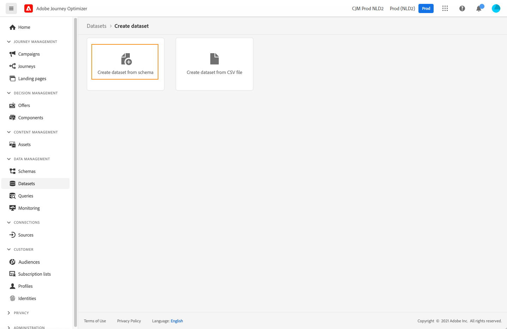

# Creare profili di test {#create-test-profiles}

I profili di test sono necessari quando si utilizza la [modalità di test](../building-journeys/testing-the-journey.md) in un percorso e per [visualizzare in anteprima e verificare il contenuto](../content-management/preview-test.md).


>[!NOTE]
>
>[!DNL Journey optimizer] consente di testare diverse varianti del contenuto visualizzandolo in anteprima e inviando bozze utilizzando dati di input di esempio caricati da un file CSV o JSON o aggiunti manualmente. [Scopri come verificare il contenuto utilizzando dati di input di esempio](../test-approve/simulate-sample-input.md)

Esistono diversi modi per creare profili di test. Puoi trovare in questa pagina i dettagli per:

* Trasforma un [profilo esistente](#turning-profile-into-test) in un profilo di test

* Crea profili di test caricando un [file CSV](#create-test-profiles-csv) o utilizzando [chiamate API](#create-test-profiles-api).

  Adobe Journey Optimizer fornisce anche un [caso d&#39;uso specifico nel prodotto](#use-case-1) per facilitare la creazione del profilo di test.

Puoi caricare un file JSON in un set di dati esistente. Per ulteriori informazioni, consulta la [documentazione sull&#39;acquisizione dei dati](https://experienceleague.adobe.com/docs/experience-platform/ingestion/tutorials/ingest-batch-data.html#add-data-to-dataset){target="_blank"}.

La creazione di un profilo di test è simile alla creazione di profili normali in Adobe Experience Platform. Per ulteriori informazioni, consulta la [documentazione del profilo cliente in tempo reale](https://experienceleague.adobe.com/docs/experience-platform/profile/home.html?lang=it){target="_blank"}.

➡️ [Scopri come creare profili di test in questo video](#video)

## Prerequisiti {#test-profile-prerequisites}

Per creare i profili, è innanzitutto necessario creare uno schema e un set di dati in Adobe [!DNL Journey Optimizer].

### Crea uno schema

Per **creare uno schema**, eseguire la procedura seguente:

1. Nella sezione del menu DATA MANAGEMENT, fare clic su **[!UICONTROL Schemi]**.
   
1. Fai clic su **[!UICONTROL Crea schema]**, in alto a destra, seleziona un tipo di schema, ad esempio **Profilo individuale**, quindi fai clic su **Avanti**.
   
1. Immetti un nome per lo schema e fai clic su **Fine**.
   
1. Nella sezione **Gruppi di campi**, a sinistra, fare clic su **Aggiungi** e selezionare i gruppi di campi appropriati. Assicurati di aggiungere il gruppo di campi **Dettagli test profilo**.
   
Al termine, fai clic su **[!UICONTROL Aggiungi gruppi di campi]**: l&#39;elenco dei gruppi di campi viene visualizzato nella schermata di panoramica dello schema.
   

   >[!NOTE]
   >
   >Fai clic sul nome dello schema per aggiornarne le proprietà.

1. Nell’elenco dei campi, fai clic sul campo che desideri definire come identità primaria.
   
1. Nel riquadro di destra **[!UICONTROL Proprietà campo]**, controllare le opzioni **[!UICONTROL Identità]** e **[!UICONTROL Identità primaria]** e selezionare uno spazio dei nomi. Se desideri che l&#39;identità primaria sia un indirizzo e-mail, scegli lo spazio dei nomi **[!UICONTROL E-mail]**. Fare clic su **[!UICONTROL Applica]**.
   
1. Selezionare lo schema e abilitare l&#39;opzione **[!UICONTROL Profilo]** nel riquadro **[!UICONTROL Proprietà schema]**.
   
1. Fai clic su **Salva**.

>[!NOTE]
>
>Per ulteriori informazioni sulla creazione dello schema, consulta la [documentazione XDM](https://experienceleague.adobe.com/docs/experience-platform/xdm/ui/resources/schemas.html#prerequisites){target="_blank"}.

### Creare un set di dati

Quindi devi **creare il set di dati** in cui verranno importati i profili. Segui questi passaggi:

1. Passa a **[!UICONTROL Set di dati]**, quindi fai clic su **[!UICONTROL Crea set di dati]**.
   
1. Scegli **[!UICONTROL Crea set di dati dallo schema]**.
   
1. Seleziona lo schema creato in precedenza e fai clic su **[!UICONTROL Avanti]**.
   
1. Scegli un nome e fai clic su **[!UICONTROL Fine]**.
   
1. Abilita l&#39;opzione **[!UICONTROL Profilo]**.
   

>[!NOTE]
>
> Per ulteriori informazioni sulla creazione di set di dati, consulta la [documentazione di Catalog Service](https://experienceleague.adobe.com/docs/experience-platform/catalog/datasets/user-guide.html#getting-started){target="_blank"}.

## Caso di utilizzo interno al prodotto{#use-case-1}

Dalla pagina Home di Adobe Journey Optimizer, puoi sfruttare il caso di utilizzo dei profili di test nel prodotto. Questo caso d’uso facilita la creazione di profili di test utilizzati per i percorsi di test prima della pubblicazione.


Per iniziare il caso d’uso, fai clic sul pulsante **[!UICONTROL Inizia]**.

Sono richieste le seguenti informazioni:

1. **Spazio dei nomi identità**: lo spazio dei nomi [identità](../audience/get-started-identity.md) utilizzato per identificare in modo univoco i profili di test. Ad esempio, se per identificare i profili di test si utilizza l&#39;e-mail, deve essere selezionato lo spazio dei nomi dell&#39;identità **E-mail**. Se l&#39;identificatore univoco è il numero di telefono, deve essere selezionato lo spazio dei nomi dell&#39;identità **Telefono**.

2. **File CSV**: file separato da virgole contenente l&#39;elenco dei profili di test da creare. Il caso d’uso prevede un formato predefinito per il file CSV che contiene l’elenco dei profili di test da creare. Ogni riga del file deve includere i campi seguenti nell’ordine corretto, come segue:

   1. **ID persona**: identificatore univoco del profilo di test. I valori di questo campo devono riflettere lo spazio dei nomi delle identità selezionato. Ad esempio, se per lo spazio dei nomi delle identità è selezionato **Telefono**, i valori di questo campo devono essere numeri di telefono. Analogamente, se è selezionato **E-mail**, i valori di questo campo devono essere e-mail)
   1. **Indirizzo e-mail**: indirizzo e-mail del profilo di test. (I campi **ID persona** e **Indirizzo e-mail** potrebbero contenere gli stessi valori se **E-mail** è selezionato come spazio dei nomi dell&#39;identità)
   1. **Nome**: nome del profilo di test.
   1. **Cognome**: cognome del profilo di test.
   1. **Città**: città di residenza del profilo di test
   1. **Paese**: paese di residenza del profilo di test
   1. **Genere**: genere del profilo di test. I valori disponibili sono **male**, **femmina** e **non_specificato**

Dopo aver selezionato lo spazio dei nomi dell&#39;identità e aver fornito il file CSV in base al formato indicato sopra, fai clic sul pulsante **[!UICONTROL Esegui]** in alto a destra. Il completamento del caso d’uso potrebbe richiedere alcuni minuti. Una volta completata l’elaborazione e la creazione dei profili di test, il caso d’uso invia una notifica per informare l’utente.

>[!NOTE]
>
>I profili di test possono ignorare quelli esistenti. Prima di eseguire il caso d’uso, assicurati che il file CSV contenga solo profili di test e che venga eseguito sulla sandbox corretta.

## Trasformare un profilo in un profilo di test{#turning-profile-into-test}

È possibile trasformare un profilo esistente in un profilo di test: è possibile aggiornare gli attributi dei profili nello stesso modo in cui si crea un profilo.

Un modo semplice per farlo è utilizzare un&#39;attività di azione **[!UICONTROL Aggiorna profilo]** in un percorso e modificare il campo booleano **testProfile** da false a true.

Il percorso sarà composto da un pubblico di **[!UICONTROL lettura]** e da un&#39;attività di **[!UICONTROL aggiornamento profilo]**. Devi innanzitutto creare un pubblico che punti ai profili da trasformare in profili di test.

>[!NOTE]
>
> Poiché si aggiornerà il campo **testProfile**, i profili scelti devono includere questo campo. Lo schema correlato deve avere il gruppo di campi **Dettagli test profilo**. Consulta [questa sezione](../audience/creating-test-profiles.md#test-profiles-prerequisites).

1. Passa a **Tipi di pubblico**, quindi **Crea pubblico**, in alto a destra.
   
1. Definisci un nome per il pubblico e crea il pubblico: scegli i campi e i valori per eseguire il targeting dei profili che desideri.
   
1. Fai clic su **Salva** e verifica che i profili siano correttamente targetizzati dal pubblico.
   

   >[!NOTE]
   >
   > Il calcolo del pubblico può richiedere del tempo. Per ulteriori informazioni sui tipi di pubblico, consulta [questa sezione](../audience/about-audiences.md).

1. Ora crea un nuovo percorso e inizia con un&#39;attività di orchestrazione **[!UICONTROL Read Audience]**.
1. Scegli il pubblico creato in precedenza e lo spazio dei nomi utilizzato dai profili.
   
1. Aggiungi un&#39;attività di azione **[!UICONTROL Aggiorna profilo]**.
1. Seleziona lo schema, il campo **testProfiles**, il set di dati e imposta il valore su **True**. Per eseguire questa operazione, nel campo **[!UICONTROL VALUE]**, fai clic sull&#39;icona **Pen** a destra, seleziona **[!UICONTROL Modalità avanzata]** e immetti **true**.
   
1. Fai clic su **[!UICONTROL Pubblica]**.
1. Nella sezione **[!UICONTROL Tipi di pubblico]**, verifica che i profili siano stati aggiornati correttamente.
   

   >[!NOTE]
   >
   > Per ulteriori informazioni sull&#39;attività **[!UICONTROL Aggiorna profilo]**, vedere [questa sezione](../building-journeys/update-profiles.md).

## Creare un profilo di test utilizzando un file CSV{#create-test-profiles-csv}

In Adobe Experience Platform, puoi creare profili caricando un file csv contenente i diversi campi del profilo nel set di dati. Questo è il metodo più semplice.

1. Creare un semplice file CSV utilizzando un software per fogli di calcolo.
1. Aggiungi una colonna per ogni campo richiesto. Assicurati di aggiungere il campo dell’identità primaria (&quot;personID&quot; nell’esempio precedente) e il campo &quot;testProfile&quot; impostato su &quot;true&quot;.
   
1. Aggiungi una riga per profilo e compila i valori per ciascun campo.
   
1. Salva il foglio di calcolo come file csv. Assicurati che le virgole siano utilizzate come separatori.
1. Passa a **Flussi di lavoro** di Adobe Experience Platform.
   
1. Scegli **Mappa CSV a schema XDM**, quindi fai clic su **Avvia**.
   
1. Seleziona il set di dati in cui desideri importare i profili. Fai clic su **Avanti**.
   
1. Fai clic su **Scegli i file** e seleziona il file CSV. Al caricamento del file, fare clic su **Avanti**.
   
1. Mappa i campi CSV di origine ai campi dello schema, quindi fai clic su **Fine**.
   
1. Viene avviata l’importazione dei dati. Lo stato passerà da **Elaborazione** a **Operazione completata**. Fai clic su **Anteprima set di dati**, in alto a destra.
   
1. Verifica che i profili di test siano stati aggiunti correttamente.
   

Vengono aggiunti i profili di test, che ora possono essere utilizzati durante il test di un percorso. Fai riferimento a [questa sezione](../building-journeys/testing-the-journey.md).


>[!NOTE]
>
>Per ulteriori informazioni sulle importazioni CSV, consulta la [documentazione sull&#39;acquisizione dei dati](https://experienceleague.adobe.com/docs/experience-platform/ingestion/tutorials/map-a-csv-file.html#tutorials){target="_blank"}.
>


## Creare profili di test tramite chiamate API{#create-test-profiles-api}

Puoi anche creare profili di test tramite chiamate API. Ulteriori informazioni sono disponibili nella [documentazione di Adobe Experience Platform](https://experienceleague.adobe.com/docs/experience-platform/profile/home.html?lang=it){target="_blank"}.

Devi utilizzare uno schema di profilo che contiene il gruppo di campi &quot;Dettagli test profilo&quot;. Il flag testProfile fa parte di questo gruppo di campi.
Quando crei un profilo, accertati di trasmettere il valore: testProfile = true.

Puoi anche aggiornare un profilo esistente per modificare il flag testProfile in &quot;true&quot;.

Di seguito è riportato un esempio di chiamata API per creare un profilo di test:

```
curl -X POST \
'https://dcs.adobedc.net/collection/xxxxxxxxxxxxxx' \
-H 'Cache-Control: no-cache' \
-H 'Content-Type: application/json' \
-H 'Postman-Token: xxxxx' \
-H 'cache-control: no-cache' \
-H 'x-api-key: xxxxx' \
-H 'x-gw-ims-org-id: xxxxx' \
-d '{
"header": {
"msgType": "xdmEntityCreate",
"msgId": "xxxxx",
"msgVersion": "xxxxx",
"xactionid":"xxxxx",
"datasetId": "xxxxx",
"imsOrgId": "xxxxx",
"source": {
"name": "Postman"
},
"schemaRef": {
"id": "https://example.adobe.com/mobile/schemas/xxxxx",
"contentType": "application/vnd.adobe.xed-full+json;version=1"
}
},
"body": {
"xdmMeta": {
"schemaRef": {
"contentType": "application/vnd.adobe.xed-full+json;version=1"
}
},
"xdmEntity": {
"_id": "xxxxx",
"_mobile":{
"ECID": "xxxxx"
},
"testProfile":true
}
}
}'
```

## Video dimostrativo {#video}

Scopri come creare profili di test.

>[!VIDEO](https://video.tv.adobe.com/v/334236?quality=12)
