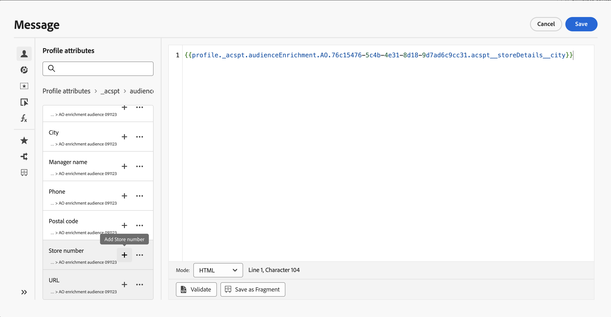

# Utilizzare gli attributi di arricchimento del pubblico {#enrichment}

Quando esegui il targeting di un pubblico generato utilizzando flussi di lavoro di composizione, un pubblico personalizzato (file CSV) o una composizione di pubblico federato, puoi utilizzare gli attributi di arricchimento di questi tipi di pubblico per creare il percorso e personalizzare i messaggi.

>[!NOTE]
>
>I tipi di pubblico creati tramite il caricamento personalizzato di file CSV prima del 1° ottobre 2024 non sono idonei alla personalizzazione. Per utilizzare gli attributi di questi tipi di pubblico e utilizzare completamente questa funzione, ricrea e carica nuovamente eventuali tipi di pubblico CSV esterno importati prima di tale data.
>
>I criteri di consenso non supportano gli attributi di arricchimento. Pertanto, eventuali regole dei criteri di consenso devono essere basate solo sugli attributi presenti nel profilo.

Di seguito sono elencate le azioni che puoi eseguire utilizzando gli attributi di arricchimento dei tipi di pubblico:

* **Crea più percorsi in un percorso** in base a regole che sfruttano gli attributi di arricchimento del pubblico di destinazione. A questo scopo, esegui il targeting del pubblico utilizzando un&#39;attività [Read audience](../building-journeys/read-audience.md), quindi crea regole in un&#39;attività [Condition](../building-journeys/condition-activity.md) in base agli attributi di arricchimento del pubblico.

  {width="70%" zoomable="yes"}

* **Personalizza i messaggi** in percorsi o campagne aggiungendo attributi di arricchimento dal pubblico di destinazione nell&#39;editor di personalizzazione. [Scopri come utilizzare l&#39;editor di personalizzazione](../personalization/personalization-build-expressions.md)

  {width="70%" zoomable="yes"}

>[!IMPORTANT]
>
>Per utilizzare gli attributi di arricchimento dei tipi di pubblico creati con flussi di lavoro di composizione, accertati che vengano aggiunti a un gruppo di campi nel Data Source di &quot;Experience Platform&quot;.
>
>+++ Scopri come aggiungere attributi di arricchimento a un gruppo di campi
>
>1. Passa a &quot;Amministrazione&quot; > &quot;Configurazione&quot; > &quot;Origini dati&quot;.
>1. Seleziona &quot;Experience Platform&quot; e crea o modifica un gruppo di campi.
>1. Nel selettore schema, seleziona lo schema appropriato. Il nome dello schema seguirà questo formato: &quot;Schema per audienceId:&quot; + l’ID del pubblico. Puoi trovare l’ID del pubblico nella schermata dei dettagli del pubblico nell’inventario del pubblico.
>1. Apri il selettore di campi, individua gli attributi di arricchimento che desideri aggiungere e seleziona la casella di controllo accanto a essi.
>1. Salva le modifiche.
>1. Una volta aggiunti gli attributi di arricchimento a un gruppo di campi, puoi utilizzarli in Journey Optimizer nelle posizioni elencate in precedenza.
>
>Informazioni dettagliate sulle origini dei dati sono disponibili in queste sezioni:
>
>* [Utilizzare l&#39;origine dati di Adobe Experience Platform](../datasource/adobe-experience-platform-data-source.md)
>* [Configurare un&#39;origine dati](../datasource/configure-data-sources.md)
>
>+++

## Domande frequenti {#faq-enrichment}

Di seguito sono riportate le domande frequenti sugli attributi di arricchimento.

Hai bisogno di ulteriori dettagli? Utilizza le opzioni di feedback nella parte inferiore di questa pagina per porre la tua domanda o connetterti alla [community Adobe Journey Optimizer](https://experienceleaguecommunities.adobe.com/t5/adobe-journey-optimizer/ct-p/journey-optimizer?profile.language=en){target="_blank"}.

+++ Cosa sono gli attributi di arricchimento?

Gli attributi di arricchimento sono attributi aggiuntivi contestuali e specifici di un pubblico. Non sono associate al profilo e vengono generalmente utilizzate a scopo di personalizzazione.

Gli attributi di arricchimento sono collegati a un pubblico tramite un’attività Arricchisci nella composizione del pubblico o il processo di caricamento personalizzato.

+++

+++ Dove posso utilizzare gli attributi di arricchimento in Journey Optimizer?

Gli attributi di arricchimento dalla composizione del pubblico possono essere utilizzati nelle seguenti aree. [Scopri come utilizzare gli attributi di arricchimento del pubblico](#enrichment)

* Attività condizione (Percorsi)
* Attributi azione personalizzati (Percorsi)
* Personalizzazione dei messaggi (Percorsi e campagne)

+++

+++ Come si abilitano gli attributi di arricchimento nei Percorsi?

Per utilizzare gli attributi di arricchimento dei tipi di pubblico creati con flussi di lavoro di composizione, assicurati che vengano aggiunti a un gruppo di campi nel Data Source di &quot;Experience Platform&quot;. Le informazioni su come aggiungere attributi di arricchimento a un gruppo di campi sono disponibili in [questa sezione](#enrichment)

+++

+++ I valori degli attributi di arricchimento vengono aggiornati dopo l’avvio di un percorso?

Attualmente, no. Anche dopo i nodi di attesa o evento, i valori degli attributi di arricchimento rimangono invariati rispetto a quando il percorso è iniziato.

+++
