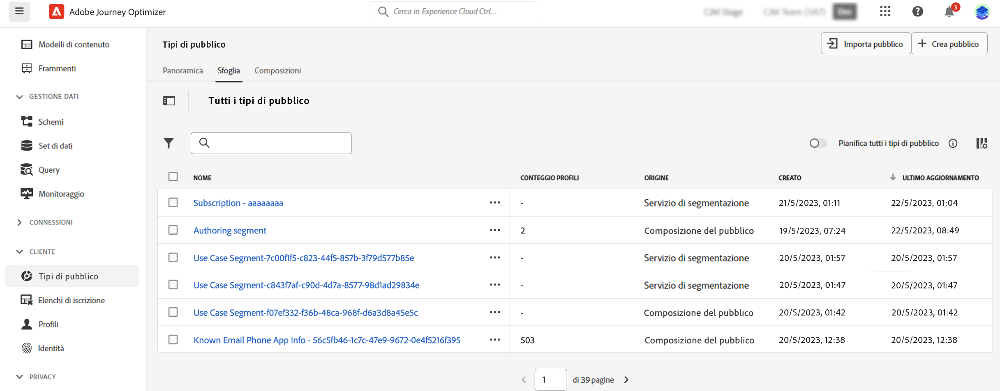

# Introduzione alla composizione dei tipi di pubblico {#get-start-audience-composition}

>[!CONTEXTUALHELP]
>id="ajo_ao_create_composition"
>title="Creare una composizione"
>abstract="Crea un flusso di lavoro di composizione per combinare i tipi di pubblico di Adobe Experience Platform esistenti in un’area di lavoro visiva e sfruttare le varie attività (divisione, esclusione...) per creare nuovi tipi di pubblico."

>[!BEGINSHADEBOX]

Questa documentazione fornisce informazioni dettagliate su come lavorare con la composizione del pubblico in Adobe Journey Optimizer. Se sei cliente solo con Profilo cliente in tempo reale e non utilizzi Adobe Journey Optimizer, [fai clic qui](https://experienceleague.adobe.com/docs/experience-platform/segmentation/ui/audience-composition.html?lang=it){target="_blank"}.

>[!ENDSHADEBOX]

La composizione del pubblico consente di creare **flussi di lavoro di composizione**, in cui puoi combinare i tipi di pubblico di Adobe Experience Platform esistenti in un’area di lavoro visiva e sfruttare varie attività (suddivisione, esclusione...) per creare nuovi tipi di pubblico.

Al termine, il **pubblico risultante** vengono salvati e inseriti in Adobe Experience Platform insieme ai tipi di pubblico esistenti e possono essere utilizzati nelle campagne e nei percorsi Journey Optimizer per eseguire il targeting dei clienti. [Scopri come eseguire il targeting dei tipi di pubblico in Journey Optimizer](../audience/about-audiences.md#segments-in-journey-optimizer)

>[!IMPORTANT]
>
>L’utilizzo di tipi di pubblico e attributi dalla composizione del pubblico e da tipi di pubblico di caricamento personalizzati non è attualmente disponibile per l’utilizzo con Healthcare Shield o Privacy and Security Shield.
>
>Gli attributi di arricchimento non sono ancora integrati con il servizio di applicazione dei criteri. Pertanto, eventuali etichette di utilizzo dei dati applicate agli attributi di arricchimento non verranno applicate nelle campagne o nei percorsi Journey Optimizer.

La composizione dei tipi di pubblico è accessibile dal menu **[!UICONTROL Tipi di pubblico]** di Adobe Journey Optimizer:

* La scheda **[!UICONTROL Panoramica]** fornisce una dashboard dedicata con una metrica chiave relativa ai dati di pubblico dell’organizzazione. Per ulteriori informazioni, consulta la [Guida alle dashboard di Adobe Experience Platform](https://experienceleague.adobe.com/docs/experience-platform/dashboards/guides/segments.html?lang=it).

* La scheda **[!UICONTROL Sfoglia]** elenca tutti i tipi di pubblico esistenti memorizzati in Adobe Experience Platform.

* La scheda **[!UICONTROL Composizioni]** consente di creare flussi di lavoro di composizione in cui è possibile combinare e organizzare i tipi di pubblico per crearne di nuovi.

Fai clic su ciascuna scheda per scoprire come utilizzare la composizione dei tipi di pubblico:

<table style="table-layout:fixed"><tr style="border: 0;">
<td>

<a href="create-compositions.md"><strong>Creare il primo flusso di lavoro di composizione</strong></a>
</td>
<td>

<a href="composition-canvas.md"><strong>Lavorare nell’area di lavoro per la composizione</strong></a>
</td>
<td>

<a href="access-audiences.md"><strong>Accesso e gestione dei tipi di pubblico</strong></a>
</td>
</tr></table>
