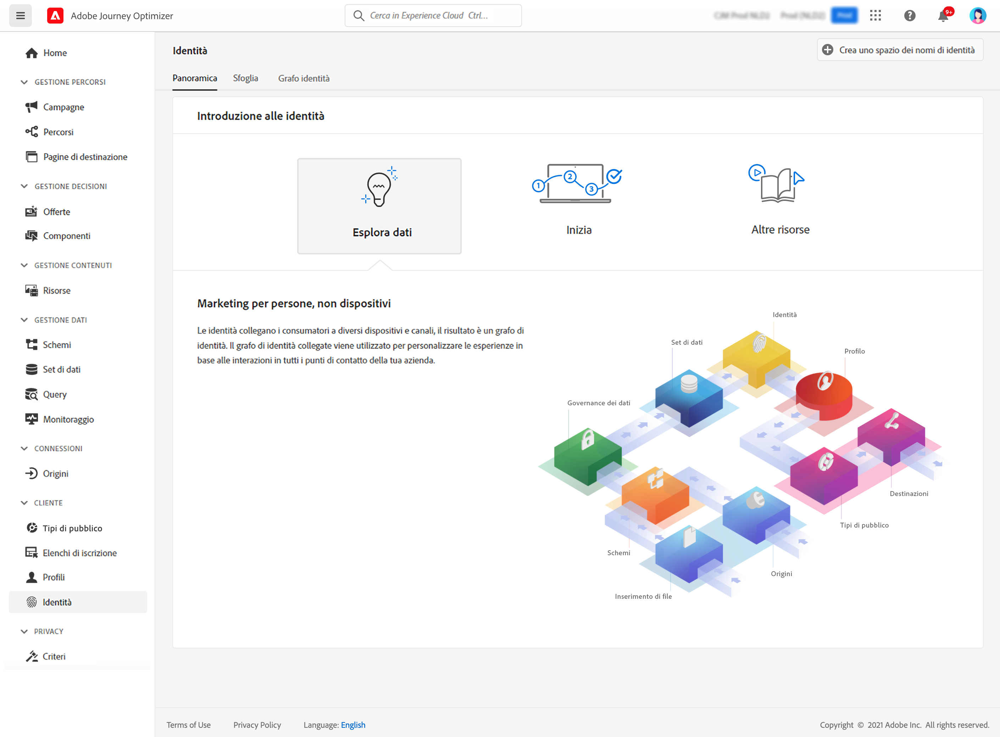

# Introduzione alle identità {#identities-gs}

Un’identità è un dato univoco per un’entità, in genere un oggetto reale, come una persona singola, un dispositivo hardware o un browser web. Un’identità completa è costituita da due elementi:

* Lo spazio dei nomi **identity** funge da indicatore del contesto a cui si riferisce un&#39;identità.
* Il **valore identità** è una stringa che rappresenta un&#39;entità.

Ad esempio, considera il numero di telefono 555-555-1234. In questo caso, la stringa &quot;555-555-1234&quot; è un **valore identità**, che potrebbe essere categorizzato in un &quot;Telefono&quot; **spazio dei nomi identità**.

Il menu **Identità** in [!DNL Adobe Journey Optimizer] consente agli utenti di sfogliare in modo efficiente i vari identificatori che compongono i clienti nel database.

Fornisce un **grafo identità**, che è una mappa delle relazioni tra identità diverse per un particolare cliente. Questo grafico offre una rappresentazione visiva del modo in cui un cliente interagisce con un brand su canali diversi. Tutti i grafici di identità del cliente sono gestiti e aggiornati collettivamente dal servizio Adobe Experience Platform Identity in risposta all’attività del cliente.

Informazioni dettagliate sull&#39;utilizzo delle identità sono disponibili nella [documentazione di Identity Service](https://experienceleague.adobe.com/docs/experience-platform/identity/home.html?lang=it){target="_blank"}.