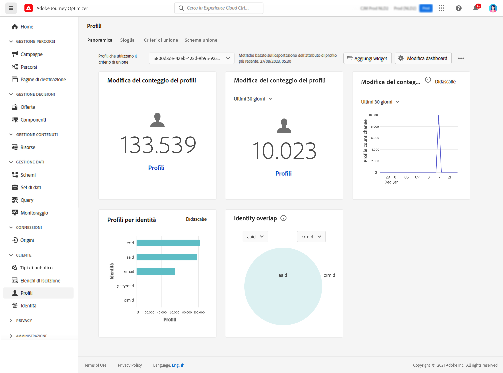

# Introduzione ai profili {#profiles-gs}

## Informazioni sui profili

Utilizza Profilo cliente in tempo reale su [!DNL Adobe Journey Optimizer] per avere una visione completa di ogni singolo cliente combinando dati provenienti da più canali, inclusi online, offline, CRM e di terze parti. I **profili** ti consentono di consolidare i dati dei clienti in una visualizzazione unificata che offre un account utilizzabile e con marca temporale per ogni interazione con il cliente.

➡️ [Scopri questa funzione nel video](#video)

**Profilo cliente in tempo reale&#x200B;** - Consente di integrare gli attributi e gli eventi del cliente da origini online, offline e pseudonime in un unico profilo unificato. &#x200B;Utilizza il profilo per coinvolgere i clienti con esperienze personalizzate in tempo reale su più punti di contatto. &#x200B;

**Acquisizione dei dati** - Connettiti a varie origini dati per acquisire dati comportamentali, transazionali, finanziari e operativi. Acquisisci i dati in tempo reale o tramite caricamenti batch per mantenere i profili costantemente aggiornati.

>[!NOTE]
>
>Durante l&#39;acquisizione dei dati, nelle e-mail viene fatta distinzione tra maiuscole e minuscole, il che significa che è possibile creare profili duplicati (ad esempio, un profilo per John.Greene@luma.com e un altro profilo per john.green@luma.com) e utilizzarli per il targeting di questi profili nei percorsi e nelle campagne [!DNL Journey Optimizer].

**Grafico identità** - Combina dati provenienti da origini diverse utilizzando le identità del cliente, ad esempio gli ID fedeltà o gli ID sistema CRM. &#x200B;Crea una visualizzazione completa del cliente mappando le relazioni tra identità diverse all’interno dei set di dati di un brand. &#x200B;

**Coinvolgimento del cliente**: utilizza il profilo cliente in tempo reale per fornire esperienze contestuali e personalizzate, ad esempio offerte e messaggi mirati. &#x200B;Coinvolgi i clienti su vari canali, tra cui campagne di marketing, supporto clienti e aggiornamenti transazionali. &#x200B;

**Condivisione dati** - Condividi i profili cliente con i principali provider di archiviazione cloud come Amazon Web Services, Microsoft Azure e Google Cloud. Utilizzo di profili condivisi per la generazione di rapporti, l&#39;archiviazione dei dati o analisi più approfondite con gli strumenti di business intelligence.

>[!MORELIKETHIS]
>
>* [Documentazione del Profilo cliente in tempo reale](https://experienceleague.adobe.com/docs/experience-platform/query/home.html?lang=it){target="_blank"}
>* [Guardrail predefiniti per dati e segmentazione del profilo cliente in tempo reale](https://experienceleague.adobe.com/it/docs/experience-platform/profile/guardrails){target="_blank"}
>* &#x200B;[Documentazione sull&#39;acquisizione dei dati](https://experienceleague.adobe.com/it/docs/experience-platform/ingestion/home){target="_blank"}

## Dashboard dei profili

Per accedere ai profili, passa al menu **[!UICONTROL Cliente]** / **[!UICONTROL Profili]** nel riquadro di navigazione a sinistra.

>[!NOTE]
>
>Se la tua organizzazione ha da poco iniziato a usare [!DNL Adobe Journey Optimizer] e non dispone ancora di set di dati di profilo attivi o di criteri di unione creati, la dashboard dei **profili** non è visibile. Nella scheda **Panoramica** sono invece visualizzati collegamenti alla documentazione di Adobe Experience Platform per aiutarti a iniziare a utilizzare Profilo cliente in tempo reale. Per informazioni su come utilizzare il **Dashboard dei profili** e informazioni dettagliate sulle metriche visualizzate nel dashboard, consulta [questa sezione](https://experienceleague.adobe.com/docs/experience-platform/profile/ui/user-guide.html?lang=it){target="_blank"}.

È possibile unire frammenti di dati da più origini e combinarli per ottenere una visualizzazione completa di ciascuno dei singoli clienti. Quando si riuniscono questi dati, i criteri di unione sono le regole utilizzate per determinare come assegnare la priorità ai dati e quali dati combinare per creare la vista unificata. Ulteriori informazioni sui **criteri di unione** sono disponibili in questa [documentazione](https://experienceleague.adobe.com/docs/experience-platform/profile/merge-policies/ui-guide.html?lang=it){target="_blank"}.

## Video dimostrativo {#video}

Scopri come Adobe Experience Platform assembla e aggiorna i profili cliente in tempo reale e come puoi accedere a tali profili e utilizzarli.

>[!VIDEO](https://video.tv.adobe.com/v/27251?quality=12)
