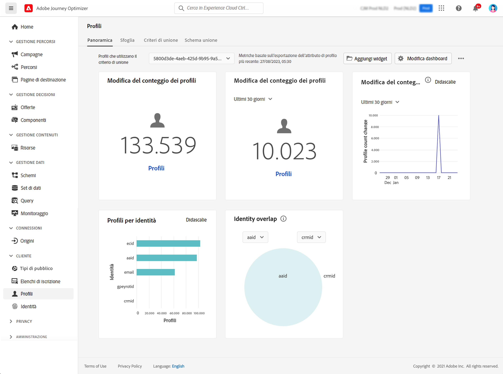

# Introduzione ai profili {#profiles-gs}

>[!BEGINSHADEBOX]

**In questa pagina:** scopri come Real-time Customer Profile in Adobe Journey Optimizer unisce i dati dei clienti provenienti da origini online, offline e di terze parti in un&#39;unica visualizzazione e come accedere alla dashboard dei profili.

>[!ENDSHADEBOX]

## Informazioni sui profili

Utilizza Profilo cliente in tempo reale su [!DNL Adobe Journey Optimizer] per avere una visione completa di ogni singolo cliente combinando dati provenienti da più canali, inclusi online, offline, CRM e di terze parti. I **profili** ti consentono di consolidare i dati dei clienti in una visualizzazione unificata che offre un account utilizzabile e con marca temporale per ogni interazione con il cliente.

➡️ [Scopri questa funzione nel video](#video)

**Profilo cliente in tempo reale&#x200B;** - Consente di integrare gli attributi e gli eventi del cliente da origini online, offline e pseudonime in un unico profilo unificato. &#x200B;Utilizza il profilo per coinvolgere i clienti con esperienze personalizzate in tempo reale su più punti di contatto. &#x200B;

**Acquisizione dei dati** - Connettiti a varie origini dati per acquisire dati comportamentali, transazionali, finanziari e operativi. Acquisisci i dati in tempo reale o tramite caricamenti batch per mantenere i profili costantemente aggiornati. I profili non vengono creati direttamente nell&#39;interfaccia [!DNL Journey Optimizer], ma vengono creati o aggiornati automaticamente in Adobe Experience Platform al momento dell&#39;acquisizione dei dati.

>[!NOTE]
>
>Durante l’acquisizione dei dati, negli indirizzi e-mail viene fatta distinzione tra maiuscole e minuscole. Ciò significa che è possibile creare profili duplicati (ad esempio, un profilo per John.Greene@luma.com e un altro profilo per john.greene@luma.com) e utilizzarli quando si esegue il targeting del destinatario corrispondente nei percorsi e nelle campagne [!DNL Journey Optimizer].

**Grafico identità** - Combina dati provenienti da origini diverse utilizzando le identità del cliente, ad esempio gli ID fedeltà o gli ID sistema CRM. &#x200B;Crea una visione completa del cliente mappando le relazioni tra identità diverse all’interno dei set di dati di un brand. &#x200B;

**Coinvolgimento del cliente**: utilizza il profilo cliente in tempo reale per fornire esperienze contestuali e personalizzate, ad esempio offerte e messaggi mirati. &#x200B;Coinvolgi i clienti su vari canali, tra cui campagne di marketing, assistenza clienti e aggiornamenti transazionali. &#x200B;

**Condivisione dati** - Condividi i profili dei clienti con i principali provider di archiviazione cloud come Amazon Web Services, Microsoft Azure e Google Cloud. Utilizzo di profili condivisi per la generazione di rapporti, l&#39;archiviazione dei dati o analisi più approfondite con gli strumenti di business intelligence.

## Profili coinvolgibili e utilizzo delle licenze {#engageable-profiles}

Un **profilo coinvolgibile** è un record di informazioni che rappresenta un individuo memorizzato nel servizio profili e che è stato coinvolto da percorsi o campagne. È la metrica di licenza chiave per [!DNL Adobe Journey Optimizer].

Caratteristiche principali:

* **Intervallo continuo di 12 mesi**: il conteggio riflette i profili univoci che hai tentato di coinvolgere negli ultimi 12 mesi utilizzando le funzionalità di authoring, decisione, consegna, sperimentazione o orchestrazione di Journey Optimizer.
* **Conteggiato una volta per sandbox**: un profilo che entra in più percorsi o campagne all&#39;interno di una sandbox conta come un singolo profilo Engageable per tale sandbox.
* **In base al pubblico indirizzabile**: i profili indirizzabili sono calcolati in base al pubblico indirizzabile. Il conteggio rappresenta il pubblico coinvolto negli ultimi 12 mesi utilizzando una qualsiasi delle funzionalità di Journey Optimizer, rispetto al totale del pubblico indirizzabile.
* **Comportamento della metrica**: conteggio dei profili associabili:
   * Può aumentare quando vengono coinvolti nuovi profili tramite percorsi o campagne
   * Non può diminuire a meno che non ci sia nessun coinvolgimento con alcuni profili per oltre 12 mesi
   * Può diminuire quando i profili pseudonimi sono uniti a profili noti

>[!TIP]
>
>Quando esegui il targeting di profili pseudonimi (visitatori non autenticati) con canali in entrata come web, in-app o esperienze basate su codice, puoi impostare un valore TTL (Time-To-Live) per l’eliminazione automatica dei profili, in modo da gestire il conteggio dei profili coinvolgibili e i costi associati. [Ulteriori informazioni sui guardrail dei canali in entrata](../start/guardrails.md#profile-management-inbound)

Monitora il conteggio dei profili coinvolgibili della tua organizzazione in qualsiasi momento da **[!UICONTROL Amministrazione]** > **[!UICONTROL Utilizzo licenze]**. Se osservi un picco improvviso nel conteggio, consulta la [sezione Risoluzione dei problemi](license-usage.md#troubleshooting-engageable-profiles) per indicazioni dettagliate. [Ulteriori informazioni sulla dashboard Utilizzo licenze](license-usage.md)

## Dashboard dei profili

Per accedere ai profili, passa al menu **[!UICONTROL Cliente]** / **[!UICONTROL Profili]** nel riquadro di navigazione a sinistra.

>[!NOTE]
>
>Se la tua organizzazione ha da poco iniziato a usare [!DNL Adobe Journey Optimizer] e non dispone ancora di set di dati di profilo attivi o di criteri di unione creati, la dashboard dei **profili** non è visibile. Nella scheda **Panoramica** sono invece visualizzati collegamenti alla documentazione di Adobe Experience Platform per aiutarti a iniziare a utilizzare Profilo cliente in tempo reale. Per informazioni su come utilizzare il **Dashboard dei profili** e informazioni dettagliate sulle metriche visualizzate nel dashboard, consulta [questa sezione](https://experienceleague.adobe.com/docs/experience-platform/profile/ui/user-guide.html?lang=it){target="_blank"}.

È possibile unire frammenti di dati da più origini e combinarli per ottenere una visualizzazione completa di ciascuno dei singoli clienti. Quando si riuniscono questi dati, i criteri di unione sono le regole utilizzate per determinare come assegnare la priorità ai dati e quali dati combinare per creare la vista unificata. Ulteriori informazioni sui **criteri di unione** sono disponibili in questa [documentazione](https://experienceleague.adobe.com/docs/experience-platform/profile/merge-policies/ui-guide.html?lang=it){target="_blank"}.

## Video introduttivo {#video}

Scopri come Adobe Experience Platform assembla e aggiorna i profili cliente in tempo reale e come puoi accedere a tali profili e utilizzarli.

>[!VIDEO](https://video.tv.adobe.com/v/27251?quality=12)

>[!MORELIKETHIS]
>
>* [Introduzione alla gestione dei dati in Journey Optimizer](../data/gs-data.md)
>* [Documentazione del Profilo cliente in tempo reale](https://experienceleague.adobe.com/docs/experience-platform/query/home.html?lang=it){target="_blank"}
>* [Guardrail predefiniti per dati e segmentazione del profilo cliente in tempo reale](https://experienceleague.adobe.com/it/docs/experience-platform/profile/guardrails){target="_blank"}
>* &#x200B;[Documentazione sull&#39;acquisizione dei dati](https://experienceleague.adobe.com/it/docs/experience-platform/ingestion/home){target="_blank"}
