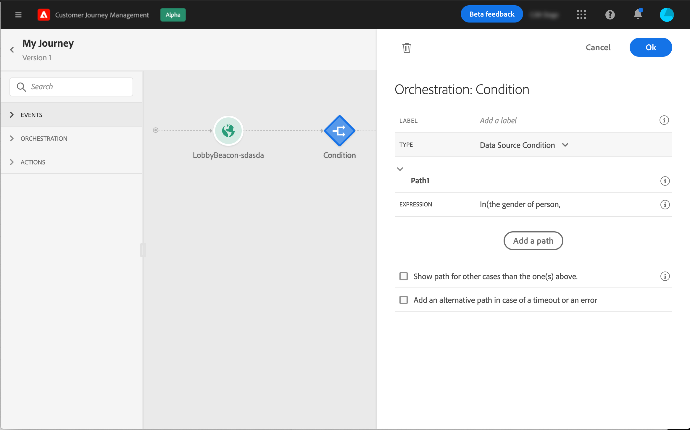

# Informazioni sulle attività del percorso {#about-journey-activities}

Combina le diverse attività relative a un evento, un percorso e un’azione in modo da creare scenari tra canali con più passaggi.

## Attività eventi {#event-activities}

Gli eventi configurati dall’utente tecnico (consulta [questa pagina](../event/about-events.md)) vengono tutti visualizzati nella prima categoria della palette, sul lato sinistro dello schermo. Sono disponibili le seguenti attività eventi:

* [Eventi generali](../building-journeys/general-events.md)
* [Reazione](../building-journeys/reaction-events.md)
* [Qualificazione del segmento](../building-journeys/segment-qualification-events.md)

Avvia il percorso trascinando e rilasciando un’attività evento. Puoi anche fare doppio clic su di esso.

## Attività di orchestrazione {#orchestration-activities}

Nella palette a sinistra dello schermo sono disponibili le seguenti attività di orchestrazione:

* [Condizione](../building-journeys/condition-activity.md)
* [Fine](../building-journeys/end-activity.md)
* [Attendi](../building-journeys/wait-activity.md)
* [Leggi segmento](../building-journeys/read-segment.md)

## Attività di azione {#action-activities}

Dalla palette, sul lato sinistro dello schermo, sotto **[!UICONTROL Events]** e **[!UICONTROL Orchestration]**, troverai la categoria **[!UICONTROL Actions]**. Sono disponibili le seguenti attività di azione:

* [Messaggio](../building-journeys/journeys-message.md)
* [Azioni personalizzate](../building-journeys/using-custom-actions.md)
* [Salta](../building-journeys/jump.md)

Queste attività rappresentano i diversi canali di comunicazione disponibili. Puoi combinarle per creare uno scenario cross-channel.

Se hai configurato azioni personalizzate, queste verranno visualizzate qui (consulta [questa pagina](../building-journeys/using-custom-actions.md)).

## Best practice {#best-practices}

La maggior parte delle attività ti consente di definire un **[!UICONTROL Label]**. Questo aggiunge un suffisso al nome che verrà visualizzato sotto l&#39;attività nell&#39;area di lavoro. Questa funzione è utile se utilizzi più volte la stessa attività nel percorso e desideri identificarla più facilmente. Semplifica inoltre il debug in caso di errori e faciliterà la lettura dei rapporti. È inoltre possibile aggiungere un **[!UICONTROL Description]** facoltativo.

Quando si verifica un errore in un’azione o in una condizione, il percorso di un singolo utente si arresta. L’unico modo per far sì che continui è selezionare la casella **[!UICONTROL Add an alternative path in case of a timeout or an error]** (Aggiungi percorso alternativo in caso di errore o timeout). Vedi [questa sezione](../building-journeys/using-the-journey-designer.md#paths).

