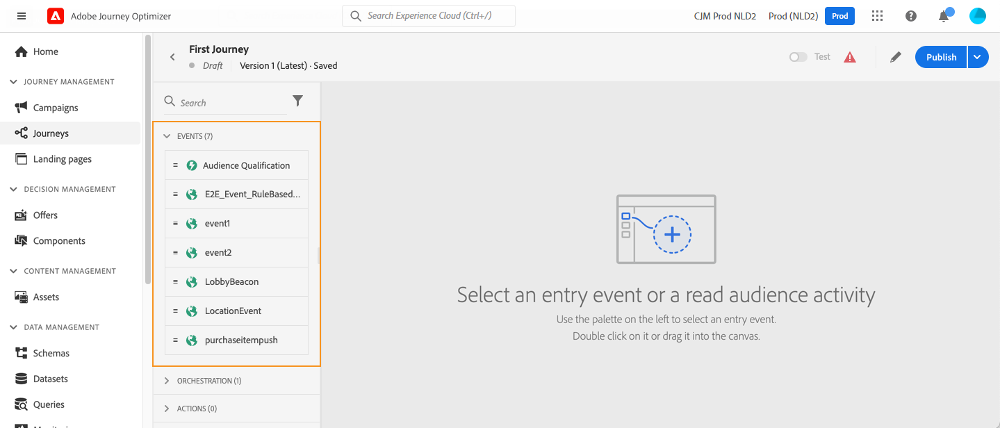
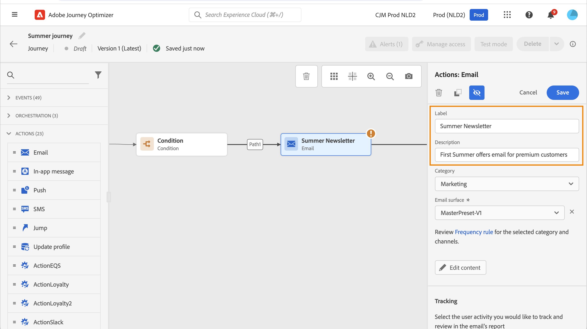

# Consulta le attività dei percorsi {#about-journey-activities}

Combina le diverse attività relative a eventi, orchestrazioni e azioni per creare scenari cross-channel con più passaggi.

## Attività di eventi {#event-activities}

I percorsi personalizzati vengono attivati da eventi, ad esempio un acquisto online. Una volta che un profilo entra in un percorso, si sposta come un individuo, e non ci sono due individui che si muovono lungo la stessa velocità o lungo lo stesso percorso. Quando si avvia il percorso con un evento, il percorso si attiva quando l’evento viene ricevuto. Ogni persona nel percorso segue quindi singolarmente i passaggi successivi definiti nel percorso.

Gli eventi configurati dall&#39;utente tecnico (vedere [questa pagina](../event/about-events.md)) sono tutti visualizzati nella prima categoria della palette, sul lato sinistro dello schermo. Sono disponibili le seguenti attività di evento:

* [Eventi generali](../building-journeys/general-events.md)
* [Reazione](../building-journeys/reaction-events.md)
* [Qualificazione del pubblico](../building-journeys/audience-qualification-events.md)

Per avviare il percorso, trascina e rilascia un’attività evento. Puoi anche fare doppio clic su di esso.

## Attività di orchestrazione {#orchestration-activities}

Le attività di orchestrazione sono condizioni diverse che consentono di determinare il passaggio successivo nel percorso. Queste condizioni possono includere se la persona ha un caso di supporto aperto, le previsioni del tempo nella posizione corrente, se ha completato un acquisto o se ha raggiunto 10.000 punti fedeltà.

Dalla palette, sul lato sinistro dello schermo, sono disponibili le seguenti attività di orchestrazione:

<!--* [Optimize](optimize.md)-->
* [Read Audience](read-audience.md)
* [Attendi](wait-activity.md)
* [Decisione sul contenuto](content-decision.md)
* [Ricerca nei set di dati](dataset-lookup.md)

## Attività di azione {#action-activities}

Le azioni sono ciò che si desidera che accada come risultato di un qualche tipo di trigger, ad esempio l’invio di un messaggio. È il pezzo del percorso che il cliente sperimenta.

Dalla palette, sul lato sinistro della schermata, sotto **[!UICONTROL Eventi]** e **[!UICONTROL Orchestrazione]**, puoi trovare la categoria **[!UICONTROL Azioni]**. Sono disponibili le seguenti attività di azione:

* [Azioni canale incorporate](../building-journeys/journeys-message.md)
* [Azioni personalizzate](../building-journeys/using-custom-actions.md)
* [Salta](../building-journeys/jump.md)

Queste attività rappresentano i diversi canali di comunicazione disponibili. Puoi combinarle per creare uno scenario cross-channel.

Puoi anche impostare azioni specifiche per l’invio di messaggi:

* Se per l’invio di messaggi utilizzi un sistema di terze parti, puoi creare un’azione personalizzata specifica. [Ulteriori informazioni](../action/action.md)

* Se utilizzi Campaign e Journey Optimizer, consulta le sezioni seguenti:

   * [[!DNL Journey Optimizer] e Campaign v7/v8](../action/acc-action.md)
   * [[!DNL Journey Optimizer] e Campaign Standard](../action/acs-action.md)
   * [[!DNL Journey Optimizer] e Marketo Engage](../action/marketo-engage.md)

## Best practice {#best-practices}

### Aggiungi un’etichetta

La maggior parte delle attività ti consentono di definire un **[!UICONTROL Etichetta]**. Questo aggiunge un suffisso al nome visualizzato sotto l’attività nell’area di lavoro. Questa funzione è utile se utilizzi la stessa attività più volte nel percorso e desideri identificarla più facilmente. Semplifica inoltre il debug in caso di errori e facilita la lettura dei rapporti. È inoltre possibile aggiungere una **[!UICONTROL Descrizione]** facoltativa.

>[!NOTE]
>
>Per alcune attività, il loro ID è visibile anche nel riquadro. Questo ID può essere utilizzato nel reporting come chiave più stabile dell’etichetta, che può cambiare.

### Gestire i parametri avanzati {#advanced-parameters}

La maggior parte delle attività visualizza una serie di parametri avanzati e/o tecnici che non è possibile modificare.

Per una migliore leggibilità, nascondi questi parametri utilizzando il pulsante **[!UICONTROL Nascondi campi di sola lettura]** nella parte superiore del riquadro di destra.

In alcuni contesti particolari, è possibile ignorare i valori di questi parametri per un uso specifico. Per forzare un valore, fai clic sul pulsante **[!UICONTROL Abilita sovrascrittura del parametro]** a destra del campo. [Ulteriori informazioni](../configuration/primary-email-addresses.md#override-execution-address-journey)

>[!NOTE]
>
>Se i parametri avanzati sono nascosti, fare clic sul pulsante **[!UICONTROL Mostra campi di sola lettura]**
>
>{width=60%}

### Aggiungi un percorso alternativo

Quando si verifica un errore in un’azione o in una condizione, il percorso di un singolo utente si interrompe. L&#39;unico modo per far sì che continui è selezionare la casella **[!UICONTROL Aggiungi un percorso alternativo in caso di timeout o errore]**. Consulta [questa sezione](../building-journeys/using-the-journey-designer.md#paths).

## Risoluzione dei problemi {#troubleshooting}

Prima di testare e pubblicare il percorso, controlla che tutte le attività siano state configurate correttamente. Non è possibile eseguire test o pubblicazioni se il sistema rileva ancora degli errori.

Scopri come risolvere gli errori nelle attività e nel percorso [in questa pagina](troubleshooting.md).

Vedi anche **[Monitoraggio e risoluzione dei problemi](/help/rp_landing_pages/troubleshoot-journey-landing-page.md)**.
