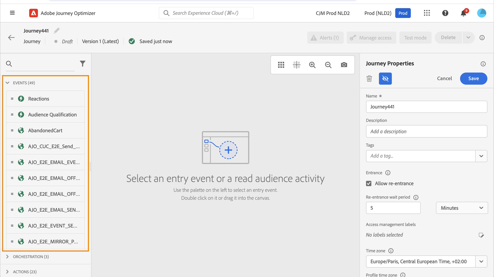
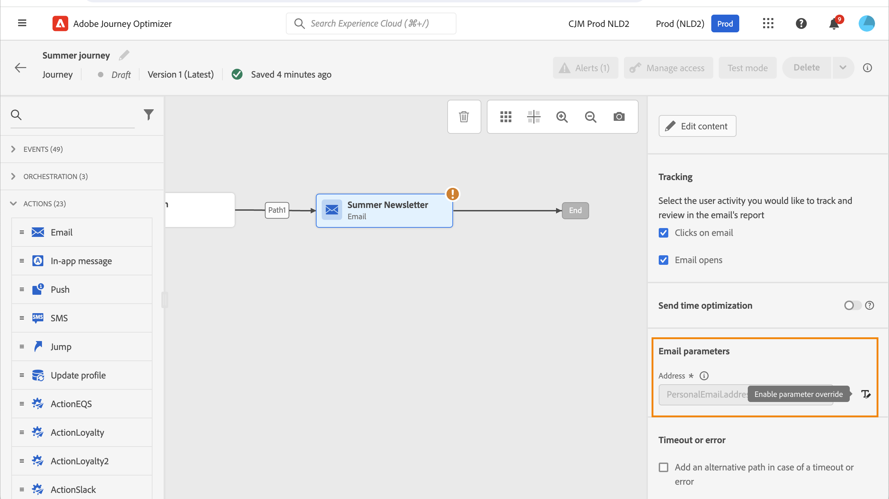

# Introduzione alle attività dei percorsi {#about-journey-activities}

Combina le diverse attività relative a eventi, orchestrazioni e azioni per creare scenari cross-channel con più passaggi.

## Attività eventi {#event-activities}

I percorsi personalizzati vengono attivati da eventi, ad esempio un acquisto online. Una volta che un profilo entra in un percorso, si sposta come un individuo, e non ci sono due individui che si muovono lungo la stessa velocità o lungo lo stesso percorso. Quando si avvia il percorso con un evento, il percorso viene attivato alla ricezione dell’evento. Ogni persona nel percorso segue quindi singolarmente i passaggi successivi definiti nel percorso.

Eventi configurati dall’utente tecnico (vedi [questa pagina](../event/about-events.md)) sono tutti visualizzati nella prima categoria della palette, sul lato sinistro dello schermo. Sono disponibili le seguenti attività di eventi:

* [Eventi generali](../building-journeys/general-events.md)
* [Reazione](../building-journeys/reaction-events.md)
* [Qualificazione del pubblico](../building-journeys/audience-qualification-events.md)

Per avviare il percorso, trascina e rilascia un’attività evento. Puoi anche fare doppio clic su di esso.

## Attività di orchestrazione {#orchestration-activities}

Le attività di orchestrazione sono condizioni diverse che consentono di determinare il passaggio successivo nel percorso. Può essere se la persona ha un caso di supporto aperto o no, le previsioni del tempo nella loro posizione attuale, se hanno completato un acquisto o no, o hanno raggiunto 10 000 punti fedeltà.

Dalla palette, sul lato sinistro dello schermo, sono disponibili le seguenti attività di orchestrazione:

* [Condizione](../building-journeys/condition-activity.md)
* [Attendere](../building-journeys/wait-activity.md)
* [Read Audience](../building-journeys/read-audience.md)

## Attività azione {#action-activities}

Le azioni sono ciò che desideri che accada come risultato di un qualche tipo di trigger, ad esempio l’invio di un messaggio. È il pezzo di percorso che il cliente sperimenta.

Dalla palette, sul lato sinistro dello schermo, sotto **[!UICONTROL Eventi]** e **[!UICONTROL Orchestrazione]**, è possibile trovare **[!UICONTROL Azioni]** categoria. Sono disponibili le seguenti attività di azione:

* [Messaggi e-mail, SMS e push](../building-journeys/journeys-message.md)
* [Azioni personalizzate](../building-journeys/using-custom-actions.md)
* [Salta](../building-journeys/jump.md)

Queste attività rappresentano i diversi canali di comunicazione disponibili. Puoi combinarle per creare uno scenario cross-channel.

Le azioni personalizzate eventualmente configurate vengono visualizzate anche qui. [Ulteriori informazioni](../building-journeys/using-custom-actions.md)).

## Best practice {#best-practices}

### Aggiungi un’etichetta

La maggior parte delle attività ti consentono di definire una **[!UICONTROL Etichetta]**. Questo aggiunge un suffisso al nome che verrà visualizzato sotto l’attività nell’area di lavoro. Questa funzione è utile se utilizzi la stessa attività più volte nel percorso e desideri identificarla più facilmente. Semplifica inoltre il debug in caso di errori e semplifica la lettura dei rapporti. È inoltre possibile aggiungere un&#39;opzione **[!UICONTROL Descrizione]**.

>[!NOTE]
>
>Per alcune attività, il loro ID è visibile anche nel riquadro. Questo ID può essere utilizzato nel reporting come chiave più stabile dell’etichetta, che può cambiare.

### Gestire i parametri avanzati {#advanced-parameters}

La maggior parte delle attività visualizza una serie di parametri avanzati e/o tecnici che non è possibile modificare.

Per una migliore leggibilità, è possibile nascondere questi parametri utilizzando **[!UICONTROL Nascondi campi di sola lettura]** pulsante.

In alcuni contesti particolari, è possibile ignorare i valori di questi parametri per un uso specifico. Per forzare un valore, fai clic sul pulsante **[!UICONTROL Abilita sovrascrittura del parametro]** a destra del campo. [Ulteriori informazioni](../configuration/primary-email-addresses.md#journey-parameters)

### Aggiungi un percorso alternativo

Quando si verifica un errore in un’azione o in una condizione, il percorso di un singolo utente si interrompe. L’unico modo per far sì che continui è selezionare la casella **[!UICONTROL Aggiungi un percorso alternativo in caso di timeout o errore]**. Consulta [questa sezione](../building-journeys/using-the-journey-designer.md#paths).

