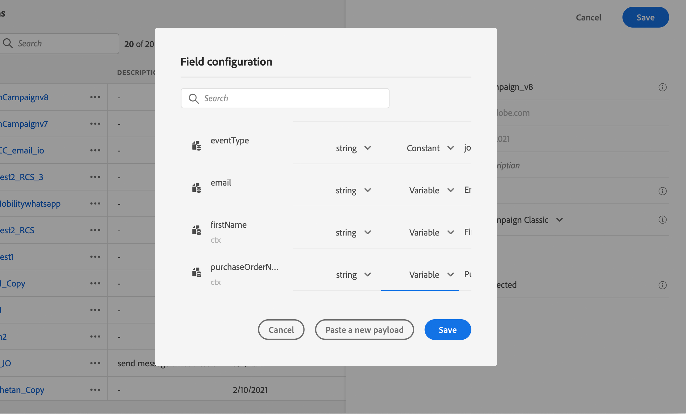
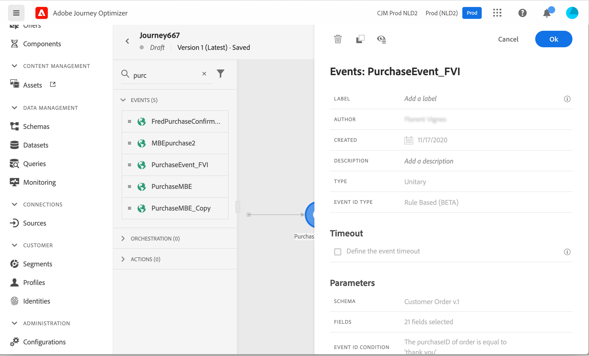
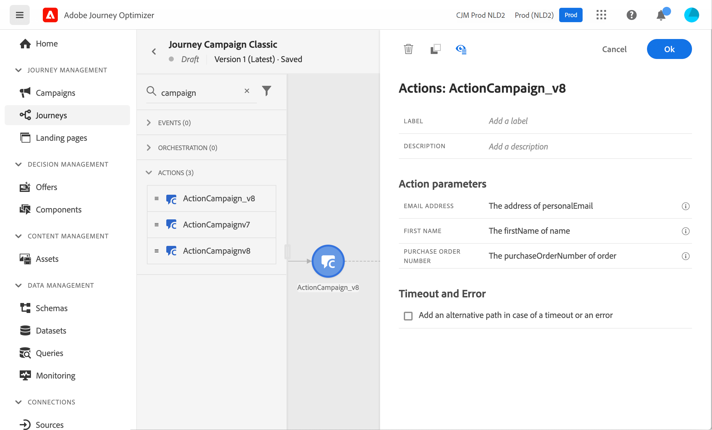

# Inviare un messaggio con Campaign v7/v8 {#campaign-v7-v8-use-case}

>[!BEGINSHADEBOX]

**In questa pagina:** scopri come inviare un messaggio e-mail da un percorso utilizzando l&#39;integrazione con Adobe Campaign v7 e v8, inclusa la creazione di modelli transazionali, eventi e azioni.

>[!ENDSHADEBOX]

Questo caso d&#39;uso descrive tutti i passaggi necessari per inviare un messaggio e-mail utilizzando l&#39;integrazione con [!DNL Adobe Campaign] v7 e [!DNL Adobe Campaign] v8.

>[!NOTE]
>
>Per utilizzare questa integrazione, è necessario disporre della build 9125 o successiva di Campaign v7/v8.

Innanzitutto, crea un modello e-mail transazionale in Campaign. Quindi in Journey Optimizer crea l’evento, l’azione e progetta il percorso.

Per ulteriori informazioni sull’integrazione di Campaign, consulta le seguenti pagine:

* [Creazione di un’azione Campaign](../action/acc-action.md)
* [Utilizzo dell&#39;azione in un percorso](../building-journeys/using-adobe-campaign-v7-v8.md).

**[!DNL Adobe Campaign]**

È necessario eseguire il provisioning della tua istanza di Campaign per questa integrazione. La funzione di messaggistica transazionale deve essere configurata.

1. Accedi all’istanza di controllo Campaign.

1. In **Amministrazione** > **Piattaforma** > **Enumerazioni**, selezionare l&#39;enumerazione **Tipo evento** (eventType). Crea un nuovo tipo di evento (&quot;percorsi-event&quot;, nel nostro esempio). Utilizza il nome interno del tipo di evento per scrivere il file JSON in un secondo momento.

   ![Configura un evento in [!DNL Adobe Journey Optimizer] con lo schema e la selezione del campo](assets/accintegration-uc-1.png)

1. Disconnettiti e riconnettiti all’istanza per rendere effettiva la creazione.

1. In **Centro messaggi** > **Modelli di messaggi transazionali**, crea un nuovo modello di e-mail in base al tipo di evento creato in precedenza.

   

1. Progetta il modello. In questo esempio, la personalizzazione viene applicata al nome del profilo e al numero dell’ordine. Il nome si trova nell&#39;origine dati [!DNL Adobe Experience Platform] e il numero di ordine è un campo dell&#39;evento Journey Optimizer. Assicurati di utilizzare i nomi di campo corretti in Campaign.

   

1. Pubblica il modello transazionale.

   

1. Scrivi il payload JSON corrispondente al modello.

```
{
     "channel": "email",
     "eventType": "journey-event",
     "email": "Email address",
     "ctx": {
          "firstName": "First name", "purchaseOrderNumber": "Purchase order number"
     }
}
```

* Per il canale, devi digitare &quot;email&quot;.
* Per eventType, utilizza il nome interno del tipo di evento creato in precedenza.
* L’indirizzo e-mail sarà una variabile e potrai quindi digitare qualsiasi etichetta.
* In ctx, i campi di personalizzazione sono anche variabili.

**Journey Optimizer**

1. Crea un evento. Includere il campo &quot;purchaseOrderNumber&quot;.

   ![Schermata di configurazione azione personalizzata per l&#39;integrazione [!DNL Adobe Campaign] classica](assets/accintegration-uc-5.png)

1. Crea in Journey Optimizer un’azione corrispondente al modello Campaign. Nel menu a discesa **Tipo azione**, selezionare **[!DNL Adobe Campaign]Classic**.

   ![Selezione del tipo di azione con [!DNL Adobe Campaign] opzione classica](assets/accintegration-uc-6.png)

1. Fai clic sul campo **Payload** e incolla il JSON creato in precedenza.

   

1. Per l&#39;indirizzo e-mail e i due campi di personalizzazione, modifica **Costante** in **Variabile**.

   

1. Ora crea un nuovo percorso e inizia con l’evento creato in precedenza.

   

1. Aggiungi l’azione e mappa ogni campo sul campo corretto in Journey Optimizer.

   

1. Verifica il tuo percorso.

   

1. Ora puoi pubblicare il percorso.

+++ Guida di riferimento della Knowledge Base di AI

Questa sezione contiene informazioni strutturate che supportano l&#39;interpretazione, il recupero e la risposta alle domande relative a questo argomento.

Per una comprensione completa, queste informazioni devono essere unite alla documentazione su questa pagina. Nessuna delle due origini è progettata per essere indipendente; la pagina descrive la funzione, mentre questa sezione fornisce un contesto aggiuntivo che aiuta a non ambiguare la terminologia, le finalità, l’applicabilità e i vincoli.

* **TL;DR:** Questa pagina fornisce un caso d&#39;uso dettagliato per l&#39;invio di un&#39;e-mail transazionale da Adobe Journey Optimizer tramite l&#39;integrazione con Adobe Campaign v7/v8, che include la creazione di modelli di Campaign, la configurazione di eventi e azioni e la progettazione di percorsi.

**Intenti:**
* Configurare un modello e-mail transazionale in Adobe Campaign v7/v8 per l’utilizzo con Journey Optimizer
* Creare un evento in Journey Optimizer che includa campi personalizzati come un numero di ordine di acquisto
* Creare e configurare un’azione Campaign Classic in Journey Optimizer con un payload JSON
* Mappa i campi evento di percorso alle variabili di personalizzazione Campaign nella configurazione delle azioni
* Creare e pubblicare un percorso che attivi un’e-mail transazionale di Campaign

**Glossario:**
* **Messaggistica transazionale**: una funzionalità di Campaign che invia e-mail attivate in tempo reale in base agli eventi; deve essere configurata prima di poter utilizzare questa integrazione *(specifica per prodotto)*
* **Tipo evento (eventType)**: un valore di enumerazione definito in Campaign che identifica il tipo di evento transazionale; al suo nome interno si fa riferimento nel payload JSON *(specifico per prodotto)*
* **Azione Campaign Classic**: tipo di azione Journey Optimizer che si connette a Adobe Campaign v7/v8 per inviare messaggi transazionali *(specifico per prodotto)*
* **Campo payload**: la struttura JSON incollata in un&#39;azione Journey Optimizer che definisce i campi dati inviati alla campagna *(specifico per prodotto)*

**Guardrail:**
* Per questa integrazione è richiesta la build 9125 o successiva di Campaign v7/v8
* La funzione di messaggistica transazionale deve essere configurata nell’istanza Campaign prima dell’utilizzo
* Dopo aver creato un nuovo tipo di evento in Campaign, è necessario disconnettersi e riconnettersi all’istanza affinché diventi effettiva
* I valori del campo Personalization impostati come &quot;Costante&quot; nell’azione devono essere modificati in &quot;Variabile&quot; per consentire la popolazione dinamica in fase di esecuzione

**Terminologia:**
* Nome canonico: Adobe Campaign v7/v8 — Acronimo: ACC — varianti: Campaign Classic, Campaign v7, Campaign v8
* Sinonimi: &quot;eventType&quot; = &quot;nome interno del tipo di evento&quot;
* Da non confondere: &quot;Azione Campaign Classic&quot; ≠ &quot;Azione personalizzata&quot; (l’azione Campaign Classic è un tipo di azione predefinito specifico per l’integrazione ACC)

**Domande frequenti:**
* **D: quale versione di Campaign è richiesta per questa integrazione?** — È richiesto Campaign v7/v8 build 9125 o successiva.
* **D: cosa deve essere configurato in Campaign prima di iniziare?** — La funzione di messaggistica transazionale deve essere configurata e deve essere creato un modello e-mail transazionale in base al tipo di evento.
* **D: come posso rendere dinamici i campi di personalizzazione nell&#39;azione Journey Optimizer?** — Nella configurazione del payload dell’azione, modifica la configurazione del campo da &quot;Costante&quot; a &quot;Variabile&quot; per i campi che verranno compilati in fase di esecuzione.
* **Q: da dove provengono i dati di personalizzazione del nome in questo caso d&#39;uso?** — il nome proviene dall&#39;origine dati Adobe Experience Platform, mentre il numero d&#39;ordine proviene dal payload dell&#39;evento Journey Optimizer.
* **D: come posso collegare l&#39;azione Journey Optimizer al modello Campaign?** — Seleziona &quot;Adobe Campaign Classic&quot; come tipo di azione, quindi incolla il payload JSON che corrisponde alla struttura del modello di messaggio transazionale.

+++
