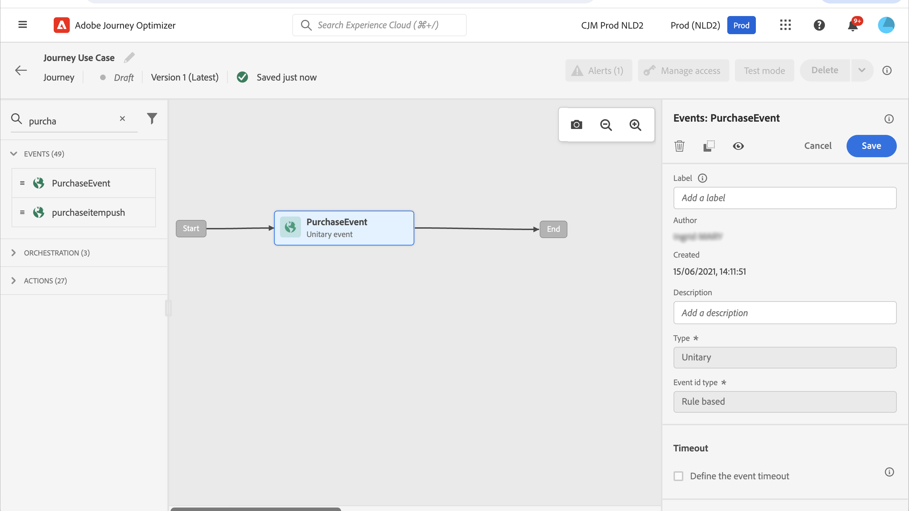

# Inviare un messaggio con Campaign v7/v8 {#campaign-v7-v8-use-case}

Questo caso d’uso illustra tutti i passaggi necessari per inviare un’e-mail utilizzando l’integrazione con Adobe Campaign v7 e Adobe Campaign v8.

>[!NOTE]
>
>Per utilizzare questa integrazione, è necessario disporre della build 9125 o successiva di Campaign v7/v8.

Innanzitutto, crea un modello e-mail transazionale in Campaign. Quindi in Journey Optimizer crea l’evento, l’azione e progetta il percorso.

Per ulteriori informazioni sull’integrazione di Campaign, consulta le seguenti pagine:

* [Creazione di un’azione Campaign](../action/acc-action.md)
* [Utilizzo dell&#39;azione in un percorso](../building-journeys/using-adobe-campaign-v7-v8.md).

**Adobe Campaign**

È necessario eseguire il provisioning della tua istanza di Campaign per questa integrazione. La funzione di messaggistica transazionale deve essere configurata.

1. Accedi all’istanza di controllo Campaign.

1. In **Amministrazione** > **Piattaforma** > **Enumerazioni**, selezionare l&#39;enumerazione **Tipo evento** (eventType). Crea un nuovo tipo di evento (&quot;percorsi-event&quot;, nel nostro esempio). Utilizza il nome interno del tipo di evento per scrivere il file JSON in un secondo momento.

   

1. Disconnettiti e riconnettiti all’istanza per rendere effettiva la creazione.

1. In **Centro messaggi** > **Modelli di messaggi transazionali**, crea un nuovo modello di e-mail in base al tipo di evento creato in precedenza.

   

1. Progetta il modello. In questo esempio, la personalizzazione viene applicata al nome del profilo e al numero dell’ordine. Il nome si trova nell&#39;origine dati Adobe Experience Platform e il numero di ordine è un campo dell&#39;evento Journey Optimizer. Assicurati di utilizzare i nomi di campo corretti in Campaign.

   

1. Pubblica il modello transazionale.

   

1. Scrivi il payload JSON corrispondente al modello.

```
{
     "channel": "email",
     "eventType": "journey-event",
     "email": "Email address",
     "ctx": {
          "firstName": "First name", "purchaseOrderNumber": "Purchase order number"
     }
}
```

* Per il canale, devi digitare &quot;email&quot;.
* Per eventType, utilizza il nome interno del tipo di evento creato in precedenza.
* L’indirizzo e-mail sarà una variabile e potrai quindi digitare qualsiasi etichetta.
* In ctx, i campi di personalizzazione sono anche variabili.

**Journey Optimizer**

1. Crea un evento. Includere il campo &quot;purchaseOrderNumber&quot;.

   

1. Crea in Journey Optimizer un’azione corrispondente al modello Campaign. Nell&#39;elenco a discesa **Tipo azione**, selezionare **Adobe Campaign Classic**.

   

1. Fai clic sul campo **Payload** e incolla il JSON creato in precedenza.

   

1. Per l&#39;indirizzo e-mail e i due campi di personalizzazione, modifica **Costante** in **Variabile**.

   

1. Ora crea un nuovo percorso e inizia con l’evento creato in precedenza.

   

1. Aggiungi l’azione e mappa ogni campo sul campo corretto in Journey Optimizer.

   

1. Verifica il tuo percorso.

   

1. Ora puoi pubblicare il percorso.
