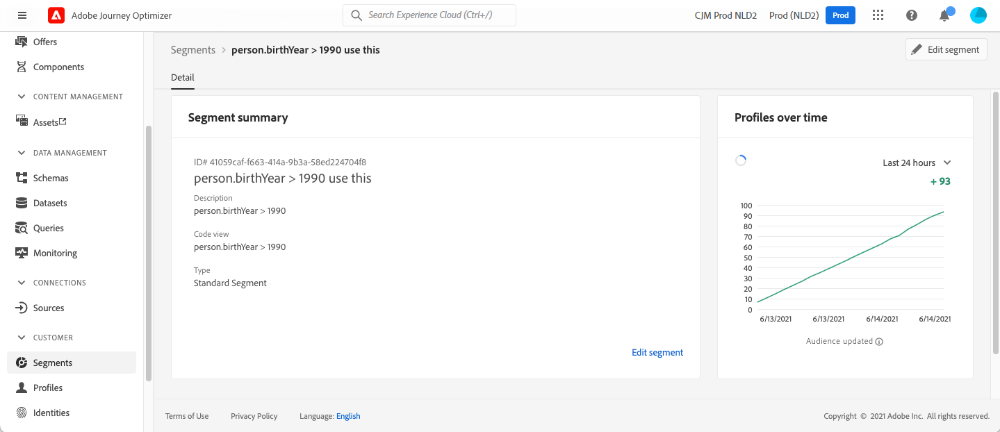

# Eventi di qualificazione del pubblico {#segment-qualification}

## Informazioni sugli eventi di qualificazione del pubblico{#about-segment-qualification}

>[!CONTEXTUALHELP]
>id="ajo_journey_event_segment_qualification"
>title="Eventi di qualificazione del pubblico"
>abstract="Questa attività consente al percorso di monitorare gli ingressi e le uscite dei profili nei tipi di pubblico di Adobe Experience Platform, per consentire a singoli utenti di entrare o proseguire in un percorso."

Questa attività consente al percorso di ascoltare le entrate e le uscite dei profili nei tipi di pubblico di Adobe Experience Platform per consentire a singoli utenti di entrare o proseguire in un percorso. Per ulteriori informazioni sulla creazione di tipi di pubblico, consulta questa [sezione](../audience/about-audiences.md).

Supponiamo che tu abbia un pubblico di tipo “cliente silver”. Con questa attività, puoi fare in modo che tutti i nuovi clienti silver entrino in un percorso e inviino loro una serie di messaggi personalizzati.

Questo tipo di evento può essere posizionato come primo passaggio o successivamente nel percorso.

➡️ [Scopri questa funzione nel video](#video)

### Note importanti{#important-notes-segment-qualification}

* Tieni presente che i tipi di pubblico di Adobe Experience Platform vengono calcolati una volta al giorno (**batch** tipi di pubblico) o in tempo reale (per **flussi di pubblico**, utilizzando l&#39;opzione Tipi di pubblico ad alta frequenza di Adobe Experience Platform).

   * Se il pubblico selezionato viene inviato in streaming, gli utenti appartenenti a questo pubblico potrebbero entrare nel percorso in tempo reale.
   * Se il pubblico è batch, le persone appena qualificate per questo pubblico entreranno potenzialmente nel percorso quando il calcolo del pubblico viene eseguito su Adobe Experience Platform.

  Come best practice, consigliamo quindi di utilizzare solo tipi di pubblico in streaming in un&#39;attività di **qualificazione del pubblico**. Per i casi di utilizzo in batch, utilizza un&#39;attività **[Read audience](read-audience.md)**.

  >[!NOTE]
  >
  >A causa della natura batch dei tipi di pubblico creati utilizzando flussi di lavoro di composizione e caricamento personalizzato, non puoi indirizzarli a un’attività &quot;Qualificazione del pubblico&quot;. Solo i tipi di pubblico creati utilizzando le definizioni dei segmenti possono essere utilizzati in questa attività.

* I gruppi di campo di evento esperienza non possono essere utilizzati in percorsi che iniziano con un’attività Read audience, Audience Qualification o Business Event.

* Quando si utilizza la qualificazione del pubblico in un percorso, questa può richiedere fino a 10 minuti prima di essere attiva e poter ascoltare i profili che entrano o escono dal pubblico.

### Configurare l’attività {#configure-segment-qualification}

Per configurare l&#39;attività **[!UICONTROL Qualificazione del pubblico]**, eseguire la procedura seguente:

1. Espandi la categoria **[!UICONTROL Eventi]** e rilascia un&#39;attività **[!UICONTROL Qualifica pubblico]** nell&#39;area di lavoro.

   

1. Aggiungi un&#39;etichetta **[!UICONTROL Label]** all&#39;attività. Questo passaggio è facoltativo.

1. Fai clic nel campo **[!UICONTROL Pubblico]** e seleziona i tipi di pubblico che desideri sfruttare.

   >[!NOTE]
   >
   >Si noti che è possibile personalizzare le colonne visualizzate nell&#39;elenco e ordinarle.

   

   Una volta aggiunto il pubblico, il pulsante **[!UICONTROL Copia]** ti consente di copiarne il nome e l&#39;ID:

   `{"name":"Loyalty membership","id":"8597c5dc-70e3-4b05-8fb9-7e938f5c07a3"}`

   

1. Nel campo **[!UICONTROL Comportamento]**, scegli se desideri ascoltare le entrate del pubblico, le uscite o entrambe.

   >[!NOTE]
   >
   >Tieni presente che **[!UICONTROL Invio]** e **[!UICONTROL Uscita]** corrispondono agli stati di partecipazione al pubblico **Realizzato** e **Uscito** da Adobe Experience Platform. Per ulteriori informazioni su come valutare un pubblico, consulta la [documentazione del servizio di segmentazione](https://experienceleague.adobe.com/docs/experience-platform/segmentation/tutorials/evaluate-a-segment.html#interpret-segment-results){target="_blank"}.

1. Seleziona uno spazio dei nomi. Questa opzione è necessaria solo se l’evento è posizionato come primo passaggio del percorso. Per impostazione predefinita, il campo è precompilato con l’ultimo spazio dei nomi utilizzato.

   >[!NOTE]
   >
   >È possibile selezionare solo uno spazio dei nomi delle identità basato su persone. Se è stato definito uno spazio dei nomi per una tabella di ricerca (ad esempio, Spazio dei nomi ProductID per una ricerca di prodotti), questo non sarà disponibile nell&#39;elenco a discesa **Spazio dei nomi**.

   

Il payload contiene le seguenti informazioni contestuali, che è possibile utilizzare in condizioni e azioni:

* il comportamento (entrata, uscita)
* il timestamp della qualifica
* l’id del pubblico

Quando utilizzi l&#39;editor espressioni in una condizione o in un&#39;azione che segue un&#39;attività **[!UICONTROL AudienceQualification]**, puoi accedere al nodo **[!UICONTROL AudienceQualification]**. Puoi scegliere tra **[!UICONTROL Ora ultima qualifica]** e **[!UICONTROL stato]** (entrata o uscita).

Vedi [Attività condizione](../building-journeys/condition-activity.md#about_condition).

Un nuovo percorso che include un evento di qualificazione del pubblico è operativo dieci minuti dopo la pubblicazione. Questo intervallo di tempo corrisponde all&#39;intervallo di aggiornamento della cache del servizio dedicato. Pertanto, è necessario attendere dieci minuti prima di utilizzare questo percorso.

## Best practice {#best-practices-segments}

L&#39;attività **[!UICONTROL Audience Qualification]** consente l&#39;ingresso immediato in percorsi di persone qualificate o squalificate da un pubblico Adobe Experience Platform.

La velocità di ricezione di queste informazioni è elevata. Le misurazioni effettuate mostrano una velocità di 10.000 eventi ricevuti al secondo. Di conseguenza, è necessario assicurarsi di capire come possono verificarsi picchi di ingresso, come evitarli e come rendere il percorso pronto per loro.

### Pubblico in batch{#batch-speed-segment-qualification}

Quando utilizzi la qualificazione del pubblico per un pubblico batch, tieni presente che un picco di ingresso si verificherà al momento del calcolo giornaliero. La dimensione del picco dipenderà dal numero di individui che entrano (o escono) dal pubblico ogni giorno.

Inoltre, se il pubblico batch è stato appena creato e immediatamente utilizzato in un percorso, il primo batch di calcolo potrebbe fare entrare nel percorso un numero molto elevato di individui.

### Tipi di pubblico in streaming{#streamed-speed-segment-qualification}

Quando si utilizza la qualificazione del pubblico per i tipi di pubblico in streaming, vi è meno rischio di ottenere picchi di entrate/uscite a causa della valutazione continua del pubblico. Tuttavia, se la definizione del pubblico porta a rendere un grande volume di clienti idonei allo stesso tempo, potrebbe esserci anche un picco.

Evita di utilizzare eventi di apertura e invio con segmentazione in streaming. Utilizza invece segnali reali di attività dell’utente come clic, acquisti o dati beacon. Per la logica di frequenza o eliminazione, utilizza le regole di business anziché inviare eventi. [Ulteriori informazioni](../audience/about-audiences.md#open-and-send-event-guardrails)

Per ulteriori informazioni sulla segmentazione in streaming, consulta la [documentazione di Adobe Experience Platform](https://experienceleague.adobe.com/docs/experience-platform/segmentation/api/streaming-segmentation.html#api).

### Come evitare gli overload{#overloads-speed-segment-qualification}

Di seguito sono riportate alcune best practice che aiuteranno a evitare il sovraccarico dei sistemi utilizzati nei percorsi (origini dati, azioni personalizzate, attività di azione del canale).

Non utilizzare, in un&#39;attività **[!UICONTROL Qualificazione del pubblico]**, un pubblico batch immediatamente dopo la sua creazione. Eviterà il picco del primo calcolo. Se stai per utilizzare un pubblico che non è mai stato calcolato, nell’area di lavoro di percorso verrà visualizzato un avviso giallo.

Inserisci una regola di limite per le origini dati e le azioni utilizzate nei percorsi per evitare di sovraccaricarle. Ulteriori informazioni nella [documentazione di Journey Orchestration](https://experienceleague.adobe.com/docs/journeys/using/working-with-apis/capping.html){target="_blank"}. La regola di limite non ha alcun nuovo tentativo. Se devi riprovare, devi utilizzare un percorso alternativo nel percorso selezionando la casella **[!UICONTROL Aggiungi un percorso alternativo in caso di timeout o errore]** in condizioni o azioni.

Prima di utilizzare il pubblico in un percorso di produzione, valuta sempre per primo il volume di persone qualificate per questo pubblico ogni giorno. A tale scopo, puoi controllare il menu **[!UICONTROL Pubblico]**, aprire il pubblico e quindi esaminare il grafico **[!UICONTROL Profili nel tempo]**.

## Video introduttivo {#video}

Comprendi i casi d’uso applicabili ai percorsi di qualificazione di un pubblico. Scopri come creare un percorso con qualificazione di un pubblico e quali best practice applicare.

>[!VIDEO](https://video.tv.adobe.com/v/3425028?quality=12)
