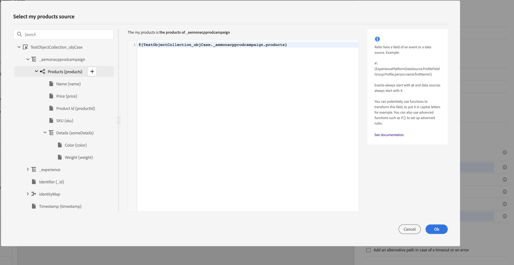
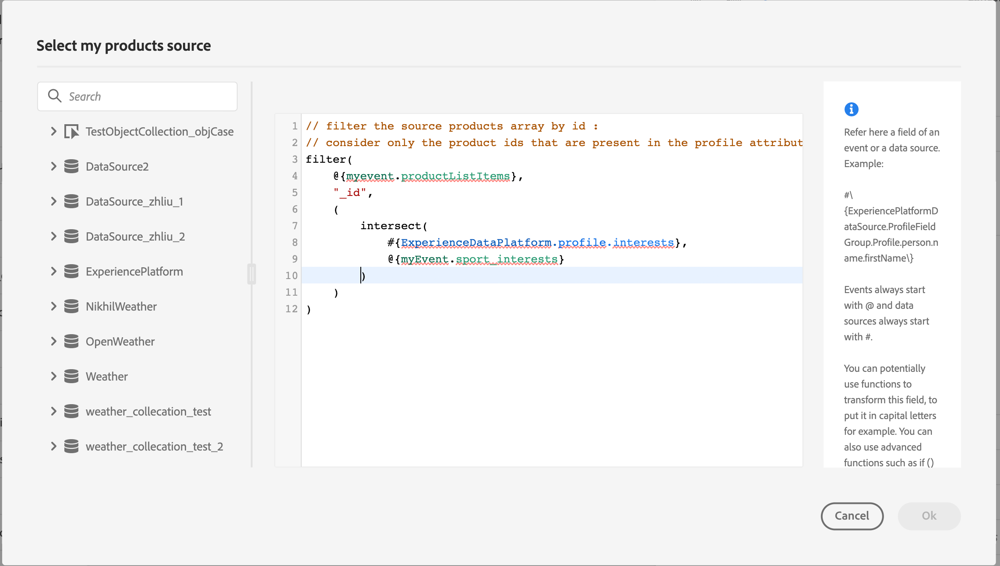

# Trasmettere le raccolte nei parametri delle azioni personalizzate {#passing-collection}

>[!BEGINSHADEBOX]

**In questa pagina:** Scopri come passare raccolte semplici e di oggetti in parametri di azione personalizzati in modo che vengano compilati in modo dinamico in fase di esecuzione.

>[!ENDSHADEBOX]

Puoi trasmettere una raccolta nei parametri delle azioni personalizzate che viene compilata dinamicamente in fase di esecuzione.

Sono supportati due tipi di raccolte:

* **Raccolte semplici**

  Utilizzare raccolte semplici per elenchi di valori di base, ad esempio stringhe, numeri o booleani. Queste proprietà sono utili solo se devi trasmettere un elenco di elementi senza proprietà aggiuntive.

  Ad esempio, un elenco di tipi di dispositivi:

  ```json
  {
   "deviceTypes": [
       "android",
       "ios"
   ]
  }
  ```

* **Raccolte oggetti**

  Utilizzare gli insiemi di oggetti quando ogni elemento include più campi o proprietà. In genere vengono utilizzati per trasmettere dati strutturati, ad esempio dettagli di prodotto, record di eventi o attributi di elementi.

  Ad esempio:

  ```json
  {
  "products":[
     {
        "id":"productA",
        "name":"A",
        "price":20.1
     },
     {
        "id":"productB",
        "name":"B",
        "price":10.0
     },
     {
        "id":"productC",
        "name":"C",
        "price":5.99
     }
   ]
  }
  ```

>[!NOTE]
>
>Gli array nidificati all’interno delle raccolte sono supportati solo parzialmente nei payload di richieste di azioni personalizzate. Per ulteriori dettagli, vedere [Limitazioni](#limitations).

## Procedura generale {#general-procedure}

In questa sezione viene utilizzato il seguente esempio di payload JSON. Si tratta di un array di oggetti con un campo che è un insieme semplice.

```json
{
  "ctxt": {
    "products": [
      {
        "id": "productA",
        "name": "A",
        "price": 20.1,
        "color":"blue",
        "locations": [
          "Paris",
          "London"
        ]
      },
      {
        "id": "productB",
        "name": "B",
        "price": 10.99
      }
    ]
  }
}
```

`products` è un array di due oggetti. Devi avere almeno un oggetto.

1. Crea l’azione personalizzata. Ulteriori informazioni sono disponibili in [questa pagina](../action/about-custom-action-configuration.md).

1. Nella sezione **[!UICONTROL Parametri azione]**, incolla l&#39;esempio JSON. La struttura visualizzata è statica: quando si incolla il payload, tutti i campi sono definiti come costanti.

   

1. Se necessario, regola i tipi di campo. Per gli insiemi sono supportati i tipi di campo seguenti: listString, listInteger, listDecimal, listBoolean, listDateTime, listDateTimeOnly, listDateOnly, listObject

   >[!NOTE]
   >
   >Il tipo di campo viene dedotto automaticamente in base all’esempio di payload.

1. Se si desidera passare gli oggetti in modo dinamico, è necessario impostarli come variabili. In questo esempio `products` è stato impostato come variabile. Tutti i campi oggetto inclusi nell&#39;oggetto vengono impostati automaticamente su variabili.

   >[!NOTE]
   >
   >Il primo oggetto dell’esempio di payload viene utilizzato per definire i campi.

1. Per ogni campo, definisci l’etichetta che verrà visualizzata nell’area di lavoro del percorso.

   {width="70%"}

1. Crea il percorso e aggiungi l’azione personalizzata creata. Ulteriori informazioni sono disponibili in [questa pagina](../building-journeys/using-custom-actions.md).

1. Nella sezione **[!UICONTROL Parametri azione]**, definisci il parametro dell&#39;array (`products` nel nostro esempio) utilizzando l&#39;editor di espressioni avanzate.

   

1. Per ciascuno dei seguenti campi oggetto, digita il nome del campo corrispondente dallo schema XDM di origine. Se i nomi sono identici, non è necessario. Nel nostro esempio, è sufficiente definire `product id` e &quot;color&quot;.

   {width="50%"}

Per il campo array, puoi anche utilizzare l’editor di espressioni avanzate per eseguire la manipolazione dei dati. Nell&#39;esempio seguente vengono utilizzate le funzioni [filter](functions/list-functions.md#filter) e [intersect](functions/list-functions.md#intersect):



## Limitazioni {#limitations}

Sebbene le raccolte nelle azioni personalizzate forniscano flessibilità per il passaggio dei dati dinamici, esistono alcuni vincoli strutturali di cui tenere conto:

* **Supporto per array nidificati nelle azioni personalizzate**

  [!DNL Adobe Journey Optimizer] supporta array nidificati di oggetti nei payload di risposta **dell&#39;azione personalizzata** ma questo supporto è limitato nei **payload di richiesta**.

  Nei payload delle richieste, gli array nidificati sono supportati solo se contengono un numero fisso di elementi, come definito nella configurazione dell’azione personalizzata. Ad esempio, se un array nidificato include sempre esattamente tre elementi, può essere configurato come costante. Quando il numero di elementi deve essere dinamico, solo gli array non nidificati (array al livello inferiore) possono essere definiti come variabili.

  Esempio:

   1. L&#39;esempio seguente illustra un **caso d&#39;uso non supportato**.

      In questo esempio, l&#39;array prodotti include un array nidificato (`locations`) con un numero dinamico di elementi, che non è supportato nei payload delle richieste.

      ```json
      {
      "products": [
         {
            "id": "productA",
            "name": "A",
            "price": 20,
            "locations": [
            { "name": "Paris" },
            { "name": "London" }
            ]
         }
      ]
      }
      ```

   2. Esempio supportato, con elementi fissi definiti come costanti.

      In questo caso, le posizioni nidificate vengono sostituite da campi fissi (`location1`, `location2`), consentendo al payload di rimanere valido all&#39;interno della configurazione supportata.

      ```json
      {
      "products": [
         {
            "id": "productA",
            "name": "A",
            "price": 20,
            "location1": { "name": "Paris" },
            "location2": { "name": "London" }
         }
      ]
      }
      ```


* **Test delle raccolte**: per testare le raccolte utilizzando la modalità di test, è necessario utilizzare la modalità di visualizzazione del codice. La modalità di visualizzazione del codice non è supportata per gli eventi di business, pertanto in questo caso è possibile inviare solo una raccolta contenente un singolo elemento.


## Casi particolari{#examples}

Per tipi e array di array eterogenei, l’array è definito con il tipo listAny. È possibile mappare solo singoli elementi, ma non è possibile modificare la matrice in variabile.

{width="70%"}

Esempio di tipo eterogeneo:

```json
{
    "data_mixed-types": [
        "test",
        "test2",
        null,
        0
    ]
}
```

Esempio di array:

```json
{
    "data_multiple-arrays": [
        [
            "test",
            "test1",
            "test2"
        ]
    ]
}
```

## Risorse aggiuntive

Consulta le sezioni seguenti per ulteriori informazioni sulla configurazione, l’utilizzo e la risoluzione dei problemi delle azioni personalizzate:

* [Introduzione alle azioni personalizzate](../action/action.md): scopri cos&#39;è un&#39;azione personalizzata e come ti aiuta a connetterti ai sistemi di terze parti
* [Configura le azioni personalizzate](../action/about-custom-action-configuration.md) - Scopri come creare e configurare un&#39;azione personalizzata
* [Usa azioni personalizzate](../building-journeys/using-custom-actions.md) - Scopri come utilizzare le azioni personalizzate nei tuoi percorsi
* [Risoluzione dei problemi relativi alle azioni personalizzate](../action/troubleshoot-custom-action.md) - Scopri come risolvere i problemi relativi a un&#39;azione personalizzata
* [Eseguire iterazioni sui dati contestuali](../personalization/iterate-contextual-data.md#arrays-in-journeys): scopri come utilizzare gli array nelle espressioni di Percorso e iterare le risposte alle azioni personalizzate, i dati evento e le ricerche di set di dati nella personalizzazione dei messaggi.

+++ Guida di riferimento della Knowledge Base di AI

Questa sezione contiene informazioni strutturate che supportano l&#39;interpretazione, il recupero e la risposta alle domande relative a questo argomento.

Per una comprensione completa, queste informazioni devono essere unite alla documentazione su questa pagina. Nessuna delle due origini è progettata per essere indipendente; la pagina descrive la funzione, mentre questa sezione fornisce un contesto aggiuntivo che aiuta a non ambiguare la terminologia, le finalità, l’applicabilità e i vincoli.

* **TL;DR:** In questa pagina viene illustrato come passare dinamicamente raccolte semplici e di oggetti nei parametri delle azioni personalizzate in Journey Optimizer, inclusi i tipi di campo supportati, la procedura di configurazione e le limitazioni note relative agli array nidificati.

**Intenti:**
* Configurare un&#39;azione personalizzata per accettare una raccolta (semplice o oggetto) come parametro dinamico
* Definisci i parametri dell’array come variabili nell’editor di espressioni avanzate durante la creazione di un percorso
* Applicare funzioni di filtro e di intersezione per manipolare i dati dell’array nell’editor di espressioni
* Comprendere e lavorare all’interno delle limitazioni dell’array nidificato per i payload di richieste di azioni personalizzate
* Test dei parametri della raccolta tramite la modalità di visualizzazione del codice in modalità di test percorso

**Glossario:**
* **Raccolta semplice**: elenco di valori scalari di base (stringhe, numeri, booleani) passati come parametro azione personalizzato *(specifico per prodotto)*
* **Raccolta oggetti**: elenco di oggetti strutturati, ciascuno con più campi, passati come parametro azione personalizzato *(specifico per prodotto)*
* **listObject**: tipo di campo utilizzato nella configurazione delle azioni personalizzate per rappresentare un array di oggetti *(specifici del prodotto)*
* **listAny**: il tipo di campo utilizzato per array eterogenei o array di array in cui gli elementi hanno tipi misti *(specifico per prodotto)*
* **Variabile (rispetto a costante)**: nella configurazione dei parametri di azione, un campo impostato su &quot;variabile&quot; viene popolato dinamicamente in fase di runtime dal contesto di percorso, mentre una &quot;costante&quot; è un valore fisso impostato al momento della configurazione *(specifico per prodotto)*

**Guardrail:**
* Gli array nidificati nei payload delle richieste sono supportati solo se contengono un numero fisso di elementi (definiti come costanti); gli array nidificati dinamici non sono supportati
* La modalità di visualizzazione codice è necessaria per testare le raccolte in modalità di test; la visualizzazione codice non è supportata per gli eventi di business, pertanto in tal caso è possibile inviare solo raccolte a elemento singolo
* Nell&#39;esempio di payload utilizzato per definire i campi di raccolta deve essere presente almeno un oggetto
* Il primo oggetto dell&#39;esempio di payload definisce i campi per l&#39;intera raccolta

**Terminologia:**
* Nome canonico: Collection — Acronimo: none — varianti: array, list, dynamic collection
* Sinonimi: &quot;raccolta semplice&quot; = &quot;elenco di valori scalari&quot; ; &quot;raccolta oggetti&quot; = &quot;array di oggetti&quot;
* Da non confondere: &quot;listAny&quot; ≠ &quot;listObject&quot; (listAny gestisce array eterogenei o nidificati; listObject gestisce array uniformi di oggetti strutturati)

**Domande frequenti:**
* **D: Qual è la differenza tra una raccolta semplice e una raccolta di oggetti?** — Un insieme semplice contiene valori scalari di base (stringhe, numeri, booleani), mentre un insieme di oggetti contiene oggetti strutturati ognuno con più campi denominati.
* **D: come si rende dinamico un parametro di raccolta in fase di esecuzione?** — Nella sezione Parametri azione dell&#39;azione personalizzata, impostare il campo array su &quot;variable&quot;; tutti i campi oggetto al suo interno vengono quindi impostati automaticamente su variables.
* **Q: gli array nidificati sono supportati nei payload di richieste di azioni personalizzate?** — Solo parzialmente. Gli array nidificati con un numero fisso noto di elementi possono essere definiti come costanti. Gli array nidificati con un numero dinamico di elementi non sono supportati nei payload delle richieste.
* **Q: come si esegue il test di una raccolta in modalità di test percorso?** — Utilizza la modalità di visualizzazione del codice nell&#39;interfaccia di test. Gli eventi di business non supportano la visualizzazione del codice, pertanto in tale contesto è possibile testare solo le raccolte a elemento singolo.
* **D: quali tipi di campi sono supportati per le raccolte?** sono supportati listString, listInteger, listDecimal, listBoolean, listDateTime, listDateTimeOnly, listDateOnly e listObject.

+++
