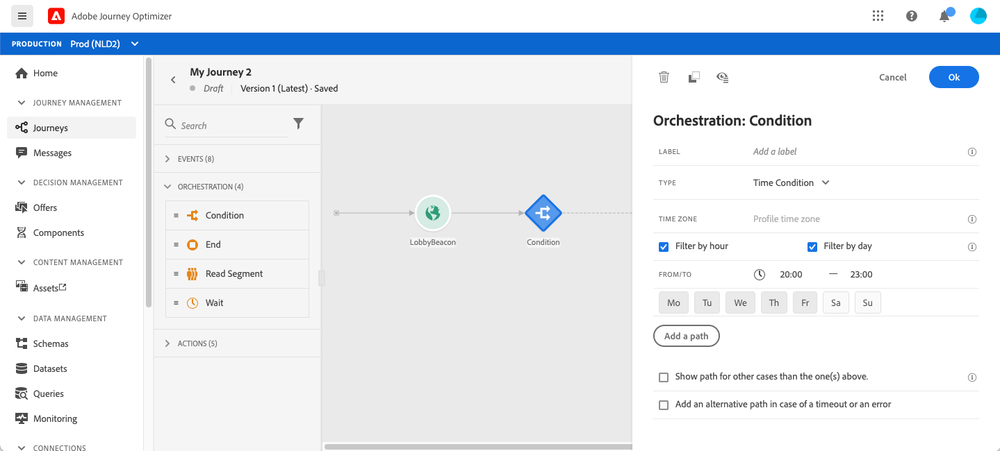
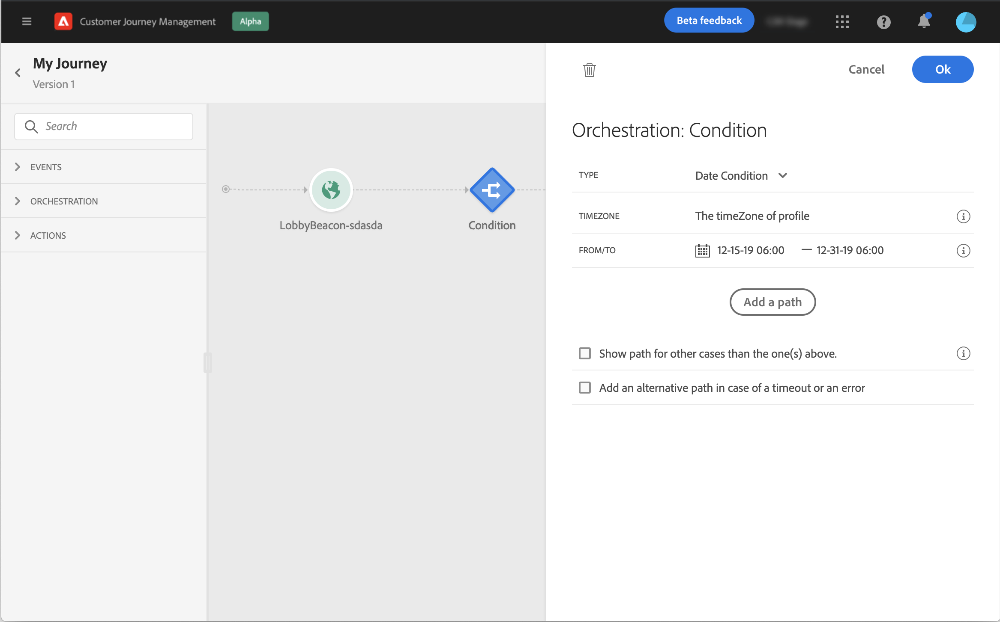
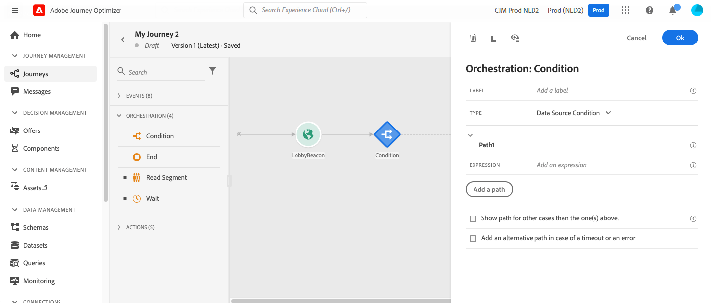

# Attività condizione{#section_e2n_pft_dgb}

Sono disponibili quattro tipi di condizioni:

* [Condizione Origine dati](#data_source_condition)
* [Condizione di tempo](#time_condition)
* [Divisione percentuale](#percentage_split)
* [Condizione data](#date_condition)

## Informazioni sull’attività Condizione {#about_condition}

Quando utilizzi più condizioni in un percorso, puoi definire etichette per ognuna di esse per identificarle più facilmente.

Fai clic su **[!UICONTROL Add a path]** per definire più condizioni. Per ogni condizione, dopo l’attività viene aggiunto un nuovo percorso nell’area di lavoro.

La progettazione dei percorsi ha effetti funzionali. Quando più percorsi sono definiti dopo una condizione, viene eseguito solo il primo percorso idoneo. Significa che puoi variare la definizione delle priorità dei percorsi posizionandoli uno sopra l’altro o sotto l’altro.

Prendiamo ad esempio la condizione di un primo percorso &quot;La persona è un VIP&quot; e la condizione di un secondo percorso &quot;La persona è un maschio&quot;. Se una persona che soddisfa entrambe le condizioni (un maschio che è un VIP) passa questo passaggio, il primo percorso sarà scelto anche se questa persona è anche idoneo al secondo, perché il primo percorso è &quot;sopra&quot;. Per modificare questa priorità, sposta le attività in un altro ordine verticale.

Puoi creare un altro percorso per tipi di pubblico non idonei alle condizioni definite selezionando **[!UICONTROL Show path for other cases than the one(s) above]**. Questa opzione non è disponibile in condizioni di suddivisione. Vedi [Divisione percentuale](#percentage_split).

La modalità semplice consente di eseguire query semplici basate su una combinazione di campi. Tutti i campi disponibili vengono visualizzati sul lato sinistro dello schermo. Trascina i campi nella zona principale. Per combinare i diversi elementi, collegali tra loro per creare diversi gruppi e/o livelli di gruppo. Puoi quindi selezionare un operatore logico per combinare elementi sullo stesso livello:

* E: un’intersezione di due criteri. Vengono presi in considerazione solo gli elementi che corrispondono a tutti i criteri.
* OPPURE: un&#39;unione di due criteri. Vengono considerati gli elementi che corrispondono ad almeno uno dei due criteri.

Se utilizzi il [Servizio di segmentazione di Adobe Experience Platform](https://experienceleague.adobe.com/docs/experience-platform/segmentation/home.html){target=&quot;_blank&quot;} per creare i segmenti, puoi sfruttarli nelle condizioni del percorso. Fai riferimento a [Utilizzo di segmenti nelle condizioni](../building-journeys/condition-activity.md#using-a-segment).

>[!NOTE]
>
>Non è possibile eseguire query su serie temporali (ad esempio un elenco di acquisti, clic passati sui messaggi) con il semplice editor. A questo scopo, devi utilizzare l’editor avanzato. Vedi [Documentazione di Adobe Journey Orchestration](expression/expressionadvanced.md).

Quando si verifica un errore in un’azione o in una condizione, il percorso di un singolo utente si arresta. L’unico modo per far sì che continui è selezionare la casella **[!UICONTROL Add an alternative path in case of a timeout or an error]** (Aggiungi percorso alternativo in caso di errore o timeout). Vedi [questa sezione](../building-journeys/using-the-journey-designer.md#paths).

Nell’editor semplice, trovi anche la categoria Proprietà Percorso , sotto le categorie di eventi e origine dati. Questa categoria contiene campi tecnici relativi al percorso per un determinato profilo. Si tratta delle informazioni recuperate dal sistema dai percorsi in tempo reale, ad esempio l’ID percorso o gli errori specifici rilevati. Per ulteriori informazioni, consulta [Documentazione di Adobe Journey Orchestration](expression/journey-properties.md)

## Condizione Origine dati {#data_source_condition}

Ciò ti consente di definire una condizione basata sui campi delle origini dati o degli eventi precedentemente posizionati nel percorso. Per informazioni sull’utilizzo dell’editor di espressioni, consulta [Documentazione di Adobe Journey Orchestration](expression/expressionadvanced.md). Utilizzando l’editor di espressioni avanzate, puoi impostare condizioni più avanzate che manipolano le raccolte o utilizzano origini dati che richiedono il passaggio di parametri. Consulta [questa pagina](../datasource/external-data-sources.md).

## Condizione di tempo{#time_condition}

Questo consente di eseguire azioni diverse in base all’ora del giorno e/o al giorno della settimana. Ad esempio, puoi decidere di inviare messaggi SMS durante il giorno e e-mail di notte nei giorni feriali.

>[!NOTE]
>
>Il fuso orario non è più specifico per una condizione e ora è definito a livello di percorso nelle proprietà del percorso. Consulta [questa pagina](../building-journeys/timezone-management.md).

## Divisione percentuale {#percentage_split}

Questa opzione ti consente di suddividere il pubblico in modo casuale per definire un’azione diversa per ciascun gruppo. Definire il numero di suddivisioni e la partizione per ciascun percorso. Il calcolo della suddivisione è statistico, in quanto il sistema non è in grado di prevedere quante persone fluiranno in questa attività del percorso. Di conseguenza, la suddivisione presenta un margine di errore molto basso. Questa funzione è basata su un meccanismo casuale Java (vedi questo [page](https://docs.oracle.com/javase/7/docs/api/java/util/Random.html)).

In modalità di test, quando si raggiunge una suddivisione, viene sempre scelto il ramo superiore. Potete riorganizzare la posizione dei rami divisi se desiderate che il test scelga un percorso diverso. Consulta [questa pagina](../building-journeys/testing-the-journey.md)

>[!NOTE]
>
>Tieni presente che non esiste un pulsante per aggiungere un percorso nella condizione di suddivisione in percentuale. Il numero di percorsi dipenderà dal numero di suddivisioni. In condizioni di suddivisione, non è possibile aggiungere un percorso per altri casi in quanto non può accadere. Le persone entreranno sempre in uno dei percorsi divisi.

## Condizione data {#date_condition}

Questo ti consente di definire un flusso diverso in base alla data. Ad esempio, se la persona inserisce il passaggio durante il periodo &quot;vendite&quot;, gli invierai un messaggio specifico. Il resto dell&#39;anno, manderà un altro messaggio.

>[!NOTE]
>
>Il fuso orario non è più specifico per una condizione e ora è definito a livello di percorso nelle proprietà del percorso. Consulta [questa pagina](../building-journeys/timezone-management.md).

<!--
## Profile cap {#profile_cap}

Use this condition type to set a maximum number of profiles for a journey path. When this limit is reached, the selected profiles take a second path.

You can use this condition type to ramp up the volume of your deliveries. For example, you might have recently moved to another email service provider, IP address, or email domain or subdomain. Using this feature, you can establish your reputation as a sender and avoid that your deliveries be blocked or moved to the spam folder of the recipients' mailbox. Learn more with this [use case](ramp-up-deliveries-uc.md).

The default cap is 1000. You must set an integer value that is greater than or equal to 1.

The counter applies only to the selected journey version. By default, the counter is reset to zero after 180 days. After a reset, the selected profiles take the first path again until the counter limit is reached. You can gradually increase this limit up to the total number of your subscribers. After your IP has warmed up, you can remove this condition.

The first path always has priority over the second path, even if you move the second path above the first path on the journey canvas.

-->

## Utilizzo di segmenti nelle condizioni {#using-a-segment}

Questa sezione spiega come utilizzare un segmento in una condizione di percorso. Per ulteriori informazioni sui segmenti e su come generarli, consulta [questa sezione](../segment/about-segments.md).

Per utilizzare un segmento in una condizione di percorso, effettua le seguenti operazioni:

1. Apri un percorso, rilascia una **[!UICONTROL Condition]** e scegli la **Condizione origine dati**.
   

1. Fai clic su **[!UICONTROL Add a path]** per ogni percorso aggiuntivo necessario. Per ogni percorso, fai clic sul pulsante **[!UICONTROL Expression]** campo .

   

1. Sul lato sinistro, svolgersi **[!UICONTROL Segments]** nodo. Trascina e rilascia il segmento da utilizzare per la condizione. Per impostazione predefinita, la condizione sul segmento è vera.

   

   >[!NOTE]
   >
   >Tieni presente che solo gli individui con il **Realizzato** e **Esistente** gli stati di partecipazione al segmento saranno considerati membri del segmento. Per ulteriori informazioni su come valutare un segmento, consulta [Documentazione del servizio di segmentazione](https://experienceleague.adobe.com/docs/experience-platform/segmentation/tutorials/evaluate-a-segment.html#interpret-segment-results){target=&quot;_blank&quot;}.
