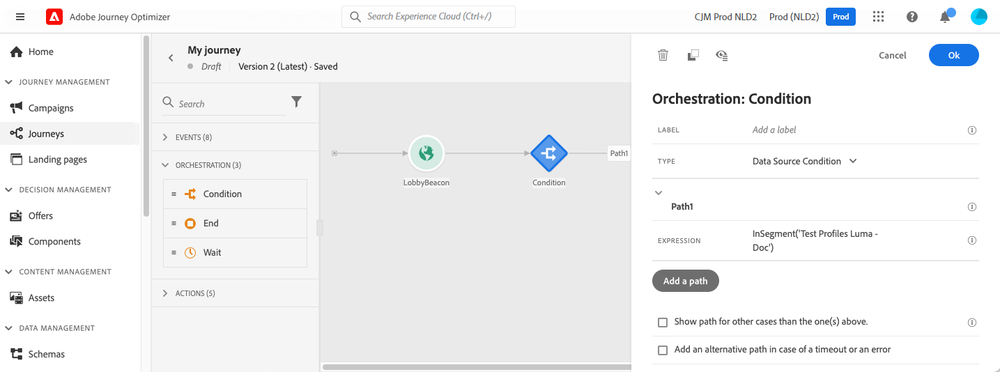
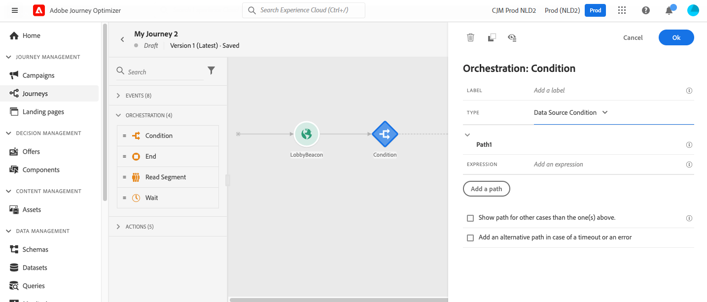
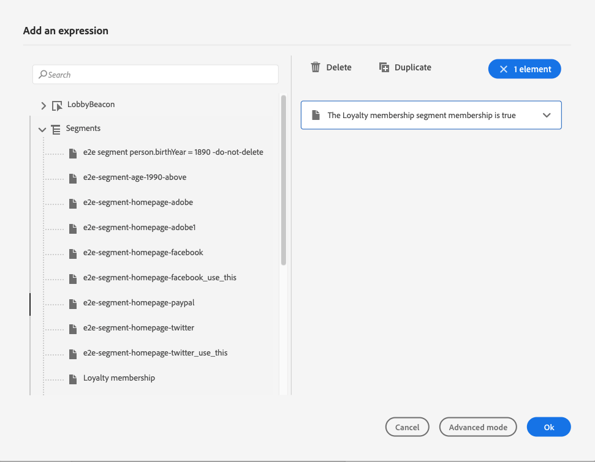

# Attività Condizione {#condition-activity}

>[!BEGINSHADEBOX]

**In questa pagina:** scopri come utilizzare l&#39;attività Condizione per instradare i profili in percorsi di percorso diversi in base a regole, dati e appartenenza a un pubblico.

>[!ENDSHADEBOX]

Utilizza l’attività condizione per indirizzare i profili a percorsi diversi in base a regole e dati.

## Aggiungi un’attività Condizione. {#add-condition-activity}

>[!CONTEXTUALHELP]
>id="ajo_journey_condition"
>title="Attività Condizione"
>abstract="L’attività **Condizione** ti consente di definire il modo in cui i singoli utenti avanzano nel percorso creando più percorsi in base a criteri specifici. Puoi anche configurare un percorso alternativo per gestire timeout o errori, per un’esperienza sempre fluida."

L’attività **Condizione** ti consente di definire il modo in cui i singoli utenti avanzano nel percorso creando più percorsi in base a criteri specifici. Puoi anche configurare un percorso alternativo per gestire timeout o errori, per un’esperienza sempre fluida.

Sono disponibili i seguenti tipi di condizioni:

* [Condizione Data Source](#data_source_condition)
* [Condizione temporale](#time_condition)
* [Divisione percentuale](#percentage_split)
* [Condizione data](#date_condition)
* [Limite del profilo](#profile_cap)

Puoi anche basare una condizione sull’iscrizione al pubblico. Consulta le sezioni seguenti:

* [Utilizzare un pubblico in una condizione](#using-a-segment) - Aggiungere percorsi in base all&#39;appartenenza o meno dei profili a un pubblico.
* [Genera e rivolgiti a tipi di pubblico](../audience/about-audiences.md) - Crea e gestisci i tipi di pubblico nel menu Tipi di pubblico.
* [Targeting del pubblico nei percorsi](read-audience.md#audience-targeting-in-journeys) - Dopo un&#39;attività di lettura del pubblico, segmenta, escludi o unisci rami utilizzando delle condizioni.

>[!NOTE]
>
>La valutazione della condizione non riuscirà per i profili che includono più di due identità multi-dispositivo nell&#39;[archivio profili](https://experienceleague.adobe.com/docs/experience-platform/profile/home.html#profile-data-store){target="_blank"}.

## Aggiungere e gestire i percorsi Condizione {#about_condition}

>[!CONTEXTUALHELP]
>id="ajo_journey_expression_simple"
>title="Editor di espressioni semplici"
>abstract="La modalità editor di espressioni semplici consente di eseguire query semplici basate su una combinazione di campi. Tutti i campi disponibili sono visualizzati a sinistra. I campi vengono trascinati nella zona principale. Per combinare i diversi elementi, essi sono interconnessi tra loro per creare diversi gruppi e/o livelli di gruppo. Un operatore logico combina quindi elementi sullo stesso livello."

Quando utilizzi più condizioni in un percorso, puoi definire le etichette per ciascuna di esse in modo da identificarle più facilmente.

Fare clic su **[!UICONTROL Aggiungi un percorso]** se si desidera definire più condizioni. Per ogni condizione, nell’area di lavoro viene aggiunto un nuovo percorso dopo l’attività.

Si noti che la progettazione dei percorsi ha un impatto funzionale. Quando più percorsi vengono definiti dopo una condizione, verrà eseguito solo il primo percorso idoneo. Ciò significa che puoi variare la priorità dei percorsi posizionandoli uno sopra l’altro o al di sotto di esso.

Prendiamo due condizioni di percorso: &quot;La persona è un VIP&quot; e &quot;La persona è un maschio&quot;. Se una persona soddisfa entrambe le condizioni, viene scelto il primo percorso perché è al di sopra del secondo. Per modificare questa priorità, sposta le attività in un ordine verticale diverso.

Puoi creare un altro percorso per i tipi di pubblico non idonei alle condizioni definite selezionando **[!UICONTROL Mostra percorso per casi diversi da quelli sopra]**. Questa opzione non è disponibile in condizioni di suddivisione. Vedi [Divisione percentuale](#percentage_split).

La modalità semplice consente di eseguire query semplici basate su una combinazione di campi. Tutti i campi disponibili sono visualizzati a sinistra. Trascina i campi nell’area principale. Per combinare i diversi elementi, puoi unirli per creare diversi gruppi e/o livelli di gruppo. Puoi quindi selezionare un operatore logico per combinare elementi sullo stesso livello:

* AND: un&#39;intersezione di due criteri. Vengono presi in considerazione solo gli elementi che corrispondono a tutti i criteri.
* OR: un’unione di due criteri. Vengono considerati gli elementi che corrispondono ad almeno uno dei due criteri.

Se utilizzi il [[!DNL Adobe Experience Platform] Servizio di segmentazione](https://experienceleague.adobe.com/docs/experience-platform/segmentation/home.html?lang=it){target="_blank"} per creare i tuoi tipi di pubblico, puoi sfruttarli nelle condizioni del percorso. Consulta [Utilizzo del pubblico in condizioni](../building-journeys/condition-activity.md#using-a-segment). Per ulteriori informazioni su come generare e indirizzare i tipi di pubblico in Journey Optimizer, consulta [questa sezione](../audience/about-audiences.md).

>[!NOTE]
>
>Non è possibile eseguire query sulle serie temporali (ad esempio un elenco di acquisti, clic sui messaggi passati) con l’editor semplice. A questo scopo, dovrai utilizzare l’editor avanzato. Consulta [questa pagina](expression/expressionadvanced.md).

Quando si verifica un errore in un’azione o in una condizione, il percorso di un singolo utente si interrompe. L&#39;unico modo per far sì che continui è selezionare la casella **[!UICONTROL Aggiungi un percorso alternativo in caso di timeout o errore]**. Vedi [questa sezione](../building-journeys/using-the-journey-designer.md#paths).

Nell’editor semplice, trovi anche la categoria Proprietà Percorso, sotto le categorie evento e origine dati. Questa categoria contiene campi tecnici relativi al percorso per un determinato profilo. Si tratta delle informazioni che il sistema recupera dai percorsi in tempo reale, ad esempio l’ID percorso o specifici errori rilevati. [Ulteriori informazioni](expression/journey-properties.md)

## Condizione Data Source {#data_source_condition}

Utilizzare una **[!UICONTROL condizione Data Source]** per definire una condizione basata sui campi delle origini dati o degli eventi precedentemente posizionati nel percorso. Questo tipo di condizione viene definito con l’editor di espressioni. Scopri come utilizzare l’editor di espressioni in [questa sezione](expression/expressionadvanced.md).

Ad esempio, se esegui il targeting di un pubblico con attributi di arricchimento generati utilizzando un flusso di lavoro di composizione o un caricamento personalizzato (file CSV), puoi sfruttare questi attributi di arricchimento per creare la condizione.

>[!IMPORTANT]
>
>**Gestione di attributi mancanti o non acquisiti**
>
>Se nello schema del profilo è definito un campo schema ma non sono stati acquisiti dati per tale campo, Journey Optimizer e il profilo cliente in tempo reale sottostante interpretano il campo come `null`. Di conseguenza, le condizioni che verificano per `isEmpty()`, `isNull()` o funzioni simili restituiranno `true` anche se l&#39;attributo non è mai stato acquisito. Questo può causare un comportamento di percorso imprevisto se non si è consapevoli che il campo non contiene dati.
>
>Per evitare confusione, assicurati che gli attributi utilizzati nelle espressioni di condizione siano stati acquisiti con i dati effettivi prima che il profilo entri nel percorso. Puoi verificare i valori degli attributi nel [Profilo cliente in tempo reale](https://experienceleague.adobe.com/docs/experience-platform/profile/home.html?lang=it){target="_blank"} per verificare se esistono dati per i campi utilizzati nelle tue condizioni.

Utilizzando l’editor di espressioni avanzate, puoi impostare condizioni più avanzate per la manipolazione delle raccolte o l’utilizzo di origini dati che richiedono il trasferimento di parametri. [Ulteriori informazioni](../datasource/external-data-sources.md).

## Condizione temporale {#time_condition}

Utilizza una **[!UICONTROL Condizione temporale]** per eseguire azioni diverse in base all&#39;ora del giorno e/o al giorno della settimana. Ad esempio, puoi decidere di inviare notifiche push durante il giorno e e-mail di notte nei giorni feriali.

>[!NOTE]
>
>* Il fuso orario non è specifico di una condizione ed è definito a livello di percorso nelle proprietà del percorso. Ulteriori informazioni sono disponibili in [questa pagina](../building-journeys/timezone-management.md).
>
>* Per impostazione predefinita, la **[!UICONTROL condizione temporale]** è impostata per ora, da 00:00 a 12:00.

Sono disponibili tre opzioni di filtro dell’ora:

* Ora: consente di impostare una condizione in base all’ora del giorno. Vengono quindi definiti gli orari di inizio e di fine. I singoli utenti immetteranno il percorso solo durante l&#39;intervallo di ore definito.
* Giorno della settimana: consente di impostare una condizione in base al giorno della settimana. Selezionare quindi i giorni in cui si desidera che i singoli utenti immettano il percorso.
* Giorno della settimana e ora: questa opzione combina le prime due opzioni.

## Suddivisione percentuale {#percentage_split}

Questa opzione consente di suddividere in modo casuale il pubblico per definire un’azione diversa per ciascun gruppo. Definisci il numero di divisioni e la partizione per ciascun percorso. Il calcolo della suddivisione è statistico in quanto il sistema non è in grado di prevedere quante persone scorreranno in questa attività del percorso. Di conseguenza, la suddivisione presenta un margine di errore molto basso. Questa funzione si basa su un meccanismo casuale Java (vedi questa [pagina](https://docs.oracle.com/javase/7/docs/api/java/util/Random.html){target="_blank"}).

In modalità di test, quando si raggiunge una suddivisione, viene sempre scelto il ramo superiore. Se vuoi che il test scelga un percorso diverso, puoi riorganizzare la posizione dei rami divisi. Consulta [questa pagina](../building-journeys/testing-the-journey.md)

>[!NOTE]
>
>Non è presente alcun pulsante per aggiungere un percorso nella condizione di suddivisione percentuale. Il numero di percorsi dipende dal numero di divisioni. Nelle condizioni di [PROD143]e non è possibile aggiungere un percorso per altri casi in quanto non può verificarsi. Le persone andranno sempre in uno dei percorsi divisi.

## Condizione data {#date_condition}

Ciò ti consente di definire un flusso diverso in base alla data. Ad esempio, se la persona entra nel passaggio durante il periodo &quot;vendite&quot;, gli invierai un messaggio specifico. Per il resto dell&#39;anno, invierai un altro messaggio.

>[!NOTE]
>
>Il fuso orario non è più specifico di una condizione ed è ora definito a livello di percorso nelle proprietà del percorso. Consulta [questa pagina](../building-journeys/timezone-management.md).

## Limite del profilo {#profile_cap}

Utilizza questo tipo di condizione per impostare un numero massimo di profili per un percorso di percorso. Una volta raggiunto tale limite, i profili partecipanti seguono un percorso alternativo. In questo modo i percorsi non supereranno mai il limite definito.

>[!NOTE]
>
>È consigliabile definire un limite di profili di valore elevato. La precisione e la probabilità che una popolazione raggiunga il numero esatto del limite aumenta solo con l’aumento del limite. Per i numeri piccoli (ad esempio un limite di 50), i numeri non sempre corrispondono in quanto il limite potrebbe non essere raggiunto prima che i profili seguano un percorso alternativo.

<!--You can use this condition type to ramp up the volume of your deliveries. See this [use case](ramp-up-deliveries-uc.md).-->

Il limite predefinito è 1.000.

Il contatore si applica solo alla versione del percorso selezionata. Il contatore viene azzerato quando il percorso viene duplicato o viene creata una nuova versione. Dopo un ripristino, i profili in ingresso riprendono il percorso nominale fino al raggiungimento del limite del contatore.

Quando il limite del profilo è definito in un percorso ricorrente, il contatore non viene reimpostato dopo ogni ricorrenza.

Il percorso nominale ha sempre la priorità sul percorso alternativo, anche se si sposta il percorso alternativo al di sopra del percorso nominale nell&#39;area di lavoro del percorso.

Per i percorsi live, le soglie da considerare per garantire il raggiungimento del limite sono le seguenti:

* Per un tappo superiore a 10,000, il numero di profili distinti da iniettare deve essere almeno 1,3 volte il tappo.
* Per un cappuccio inferiore a 10,000, il numero di profili distinti da iniettare deve essere 1000 più il cappuccio.

Il limite del profilo non viene preso in considerazione nella modalità di test.

## Utilizzo dei tipi di pubblico nelle condizioni {#using-a-segment}

Questa sezione spiega come utilizzare un pubblico in una condizione di percorso. Per ulteriori informazioni sui tipi di pubblico e su come generarli, consulta [questa sezione](../audience/about-audiences.md).

Per utilizzare un pubblico in una condizione di percorso, effettua le seguenti operazioni:

1. Apri un percorso, rilascia un&#39;attività **[!UICONTROL Condizione]** e scegli la **Condizione Source dati**.

   

1. Fai clic su **[!UICONTROL Aggiungi un percorso]** per ogni percorso aggiuntivo necessario. Per ogni percorso, fare clic sul campo **[!UICONTROL Espressione]**.

1. Sul lato sinistro, apri il nodo **[!UICONTROL Tipi di pubblico]**. Trascina e rilascia il pubblico da utilizzare per la condizione. Per impostazione predefinita, la condizione sul pubblico è true.

   

   >[!NOTE]
   >
   >Solo i singoli utenti con lo stato di partecipazione al pubblico **Realizzato** verranno considerati membri del pubblico. Per ulteriori informazioni su come valutare un pubblico, consulta la [documentazione del servizio di segmentazione](https://experienceleague.adobe.com/docs/experience-platform/segmentation/tutorials/evaluate-a-segment.html#interpret-segment-results){target="_blank"}.

+++ Guida di riferimento della Knowledge Base di AI

Questa sezione contiene informazioni strutturate che supportano l&#39;interpretazione, il recupero e la risposta alle domande relative a questo argomento.

Per una comprensione completa, queste informazioni devono essere unite alla documentazione su questa pagina. Nessuna delle due origini è progettata per essere indipendente; la pagina descrive la funzione, mentre questa sezione fornisce un contesto aggiuntivo che aiuta a non ambiguare la terminologia, le finalità, l’applicabilità e i vincoli.

* **TL;DR:** In questa pagina viene descritta l&#39;attività Condizione in Journey Optimizer, che include i cinque tipi di condizioni disponibili, ovvero Data Source, Ora, Divisione percentuale, Data e Limite profilo, e viene illustrato come indirizzare i profili a percorsi di percorso diversi in base a regole, dati o appartenenza a un pubblico.

**Intenti:**
* Aggiungere un’attività Condizione a un percorso e creare più percorsi di diramazione
* Configurare una condizione di Data Source utilizzando l’editor espressioni per valutare gli attributi di profilo o evento
* Imposta una condizione di tempo per instradare i profili in base all’ora del giorno o del giorno della settimana
* Utilizzare una suddivisione percentuale per distribuire in modo casuale i profili tra i percorsi
* Applica un limite di profili per limitare il numero di profili che assumono un percorso di percorso specifico
* Utilizzare un controllo di appartenenza a un pubblico come condizione in un percorso di percorso

**Glossario:**
* **Attività condizione**: attività di percorso che valuta le regole e indirizza i profili a percorsi diversi in base al risultato *(specifico per prodotto)*
* **Condizione Data Source**: tipo di condizione che valuta i campi dalle origini dati o dagli eventi di percorso utilizzando l&#39;editor espressioni *(specifico per prodotto)*
* **Condizione temporale**: tipo di condizione che filtra i profili in base all&#39;ora del giorno, al giorno della settimana o a una combinazione di entrambi *(specifici del prodotto)*
* **Divisione percentuale**: tipo di condizione che distribuisce in modo casuale i profili tra percorsi utilizzando un meccanismo casuale Java statistico *(specifico per prodotto)*
* **Limite di profili**: tipo di condizione che limita il numero di profili che possono accettare un percorso specifico; i profili aggiuntivi vengono indirizzati a un percorso alternativo *(specifico per prodotto)*
* **Percorso alternativo**: un percorso di fallback attivato quando viene raggiunto il limite di errore, timeout o limite massimo del profilo *(specifico per prodotto)*

**Guardrail:**
* La valutazione della condizione non riesce per i profili con più di due identità multi-dispositivo nell’archivio profili
* I campi dello schema senza dati acquisiti vengono interpretati come null; isEmpty() e isNull() restituiscono true per tali campi, causando un comportamento imprevisto
* Il fuso orario è definito a livello di percorso, non a livello di singola condizione
* L’opzione &quot;Mostra percorso per altri casi&quot; non è disponibile in Condizioni di suddivisione percentuale
* Il valore predefinito del limite del profilo è 1.000; il contatore viene ripristinato quando il percorso viene duplicato o viene creata una nuova versione, ma non tra le ricorrenze di un percorso ricorrente
* Se il cappuccio è superiore a 10,000, iniettare almeno 1,3 volte il numero di profili del cappuccio; se il cappuccio è inferiore a 10,000, iniettare almeno 1,000 più il cappuccio
* Il limite del profilo non viene applicato in modalità di test
* Le query di serie temporali (ad esempio, elenco di acquisti, clic passati) non sono supportate nell’editor di espressioni semplici; è necessario utilizzare l’editor avanzato

**Terminologia:**
* Nome canonico: attività condizione — Acronimo: none — varianti: nodo condizione, fase condizione
* Sinonimi: &quot;Data Source condition&quot; = &quot;expression-based condition&quot; ; &quot;Percentage split&quot; = &quot;random split&quot;
* Non confondere: &quot;Divisione percentuale&quot; ≠ &quot;Limite profilo&quot; (la suddivisione percentuale distribuisce in modo casuale tutti i profili; il limite profilo interrompe il routing a un percorso una volta raggiunta la soglia di conteggio)

**Domande frequenti:**
* **D: cosa succede quando vengono definiti più percorsi e un profilo soddisfa più di una condizione?** — viene eseguito solo il primo percorso idoneo (dall&#39;alto verso il basso nell&#39;area di lavoro); l&#39;ordine dei percorsi determina la priorità.
* **D: posso aggiungere un percorso di fallback per profili che non corrispondono ad alcuna condizione?** — Sì, abilita &quot;Mostra percorso per casi diversi da quelli sopra&quot;, tranne nelle condizioni di suddivisione percentuale, in cui tutti i profili entrano sempre in uno dei percorsi suddivisi.
* **Q: perché la condizione isEmpty() restituisce true per un campo per il quale si prevede la presenza di dati?** — Se il campo schema esiste ma non sono stati acquisiti dati per esso, Journey Optimizer e Real-Time Customer Profile lo interpretano come null, quindi isEmpty() e isNull() restituiscono true.
* **Q: il contatore del limite del profilo viene reimpostato in un percorso ricorrente?** — No, il contatore non viene reimpostato tra le ricorrenze, ma solo quando il percorso viene duplicato o viene creata una nuova versione.
* **Q: come funziona la suddivisione percentuale in modalità di test?** — In modalità di test, il ramo superiore viene sempre scelto indipendentemente dalle percentuali di suddivisione configurate.

+++
