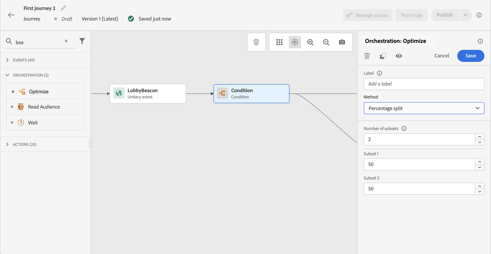

# Attività condizione{#condition-activity}

>[!CONTEXTUALHELP]
>id="ajo_journey_condition"
>title="Attività condizione"
>abstract="Questa attività ti consente di definire il flusso dell’individuo nel percorso. Verranno creati diversi percorsi in base a vari criteri. Puoi anche creare un percorso alternativo in caso di timeout o errore."

Sono disponibili i seguenti tipi di condizioni:

* [Condizione Origine dati](#data_source_condition)
* [Condizione di tempo](#time_condition)
* [Divisione percentuale](#percentage_split)
* [Condizione data](#date_condition)
* [Limite del profilo](#profile_cap)

## Informazioni sull’attività Condizione {#about_condition}

>[!CONTEXTUALHELP]
>id="ajo_journey_expression_simple"
>title="Informazioni sull’editor di espressioni semplici"
>abstract="La modalità editor di espressioni semplici consente di eseguire query semplici basate su una combinazione di campi. Tutti i campi disponibili vengono visualizzati sul lato sinistro dello schermo. Trascina i campi nella zona principale. Per combinare i diversi elementi, collegali tra loro per creare diversi gruppi e/o livelli di gruppo. Puoi quindi selezionare un operatore logico per combinare elementi sullo stesso livello."

Quando utilizzi più condizioni in un percorso, puoi definire etichette per ognuna di esse per identificarle più facilmente.

Fai clic su **[!UICONTROL Aggiungere un percorso]** per definire più condizioni. Per ogni condizione, dopo l’attività viene aggiunto un nuovo percorso nell’area di lavoro.

La progettazione dei percorsi ha effetti funzionali. Quando più percorsi sono definiti dopo una condizione, viene eseguito solo il primo percorso idoneo. Significa che puoi variare la definizione delle priorità dei percorsi posizionandoli uno sopra l’altro o sotto l’altro.

Prendiamo ad esempio la condizione di un primo percorso &quot;La persona è un VIP&quot; e la condizione di un secondo percorso &quot;La persona è un maschio&quot;. Se una persona che soddisfa entrambe le condizioni (un maschio che è un VIP) passa questo passaggio, il primo percorso sarà scelto anche se questa persona è anche idoneo al secondo, perché il primo percorso è &quot;sopra&quot;. Per modificare questa priorità, sposta le attività in un altro ordine verticale.

Puoi creare un altro percorso per tipi di pubblico non idonei alle condizioni definite selezionando **[!UICONTROL Mostra percorso per casi diversi da quelli sopra indicati]**. Questa opzione non è disponibile in condizioni di suddivisione. Vedi [Divisione percentuale](#percentage_split).

La modalità semplice consente di eseguire query semplici basate su una combinazione di campi. Tutti i campi disponibili vengono visualizzati sul lato sinistro dello schermo. Trascina i campi nella zona principale. Per combinare i diversi elementi, collegali tra loro per creare diversi gruppi e/o livelli di gruppo. Puoi quindi selezionare un operatore logico per combinare elementi sullo stesso livello:

* E: un’intersezione di due criteri. Vengono presi in considerazione solo gli elementi che corrispondono a tutti i criteri.
* OPPURE: un&#39;unione di due criteri. Vengono considerati gli elementi che corrispondono ad almeno uno dei due criteri.

Se utilizzi il [Servizio di segmentazione di Adobe Experience Platform](https://experienceleague.adobe.com/docs/experience-platform/segmentation/home.html){target=&quot;_blank&quot;} per creare i segmenti, puoi sfruttarli nelle condizioni del percorso. Fai riferimento a [Utilizzo di segmenti nelle condizioni](../building-journeys/condition-activity.md#using-a-segment).

>[!NOTE]
>
>Non è possibile eseguire query su serie temporali (ad esempio un elenco di acquisti, clic passati sui messaggi) con il semplice editor. A questo scopo, devi utilizzare l’editor avanzato. Consulta [questa pagina](expression/expressionadvanced.md).

Quando si verifica un errore in un’azione o in una condizione, il percorso di un singolo utente si arresta. L’unico modo per far sì che continui è selezionare la casella . **[!UICONTROL Aggiungi un percorso alternativo in caso di timeout o di errore]**. Vedi [questa sezione](../building-journeys/using-the-journey-designer.md#paths).

Nell’editor semplice, trovi anche la categoria Proprietà Percorso , sotto le categorie di eventi e di origine dati. Questa categoria contiene campi tecnici relativi al percorso per un determinato profilo. Si tratta delle informazioni che il sistema recupera dai percorsi in tempo reale, ad esempio l’ID percorso o specifici errori rilevati. [Ulteriori informazioni](expression/journey-properties.md)

## Condizione Origine dati {#data_source_condition}

Ciò ti consente di definire una condizione basata sui campi delle origini dati o degli eventi precedentemente posizionati nel percorso. Scopri come utilizzare l’editor di espressioni in [questa sezione](expression/expressionadvanced.md).

Utilizzando l’editor di espressioni avanzate, puoi impostare condizioni più avanzate che manipolano le raccolte o utilizzano origini dati che richiedono il passaggio di parametri. [Maggiori informazioni](../datasource/external-data-sources.md).

## Condizione di tempo{#time_condition}

Questo consente di eseguire azioni diverse in base all’ora del giorno e/o al giorno della settimana. Ad esempio, puoi decidere di inviare notifiche push durante il giorno e e-mail di notte nei giorni feriali.

>[!NOTE]
>
>Il fuso orario non è specifico per una condizione e viene definito a livello di percorso nelle proprietà del percorso. Consulta [questa pagina](../building-journeys/timezone-management.md).

Sono disponibili tre opzioni di filtro:

* Ora: consente di impostare una condizione in base all’ora del giorno. Poi definisci gli orari di inizio e di fine. Gli individui immetteranno il percorso solo durante l’intervallo di ore definito.
* Giorno della settimana: consente di impostare una condizione in base al giorno della settimana. Quindi selezionate i giorni in cui gli utenti dovranno accedere al percorso.
* Giorno della settimana e ora: questa opzione combina le prime due opzioni.

## Divisione percentuale {#percentage_split}

Questa opzione ti consente di suddividere il pubblico in modo casuale per definire un’azione diversa per ciascun gruppo. Definire il numero di suddivisioni e la partizione per ciascun percorso. Il calcolo della suddivisione è statistico, in quanto il sistema non è in grado di prevedere quante persone fluiranno in questa attività del percorso. Di conseguenza, la suddivisione presenta un margine di errore molto basso. Questa funzione è basata su un meccanismo casuale Java (vedi questo [page](https://docs.oracle.com/javase/7/docs/api/java/util/Random.html)).

In modalità di test, quando si raggiunge una suddivisione, viene sempre scelto il ramo superiore. Potete riorganizzare la posizione dei rami divisi se desiderate che il test scelga un percorso diverso. Consulta [questa pagina](../building-journeys/testing-the-journey.md)

>[!NOTE]
>
>Tieni presente che non esiste un pulsante per aggiungere un percorso nella condizione di suddivisione in percentuale. Il numero di percorsi dipenderà dal numero di suddivisioni. In condizioni di suddivisione, non è possibile aggiungere un percorso per altri casi in quanto non può accadere. Le persone entreranno sempre in uno dei percorsi divisi.

## Condizione data {#date_condition}

Questo ti consente di definire un flusso diverso in base alla data. Ad esempio, se la persona inserisce il passaggio durante il periodo &quot;vendite&quot;, gli invierai un messaggio specifico. Il resto dell&#39;anno, manderà un altro messaggio.

>[!NOTE]
>
>Il fuso orario non è più specifico per una condizione e ora è definito a livello di percorso nelle proprietà del percorso. Consulta [questa pagina](../building-journeys/timezone-management.md).

## Limite del profilo {#profile_cap}

Utilizza questo tipo di condizione per impostare un numero massimo di profili per un percorso percorso. Una volta raggiunto tale limite, i profili partecipanti seguono un percorso alternativo. In questo modo i percorsi non supereranno mai il limite definito.

>[!NOTE]
>
>È consigliabile definire un limite massimo per i profili di alto valore. La precisione e la probabilità che una popolazione raggiunga l&#39;esatto numero di cap aumenta solo con l&#39;aumento della cap. Per i numeri di piccole dimensioni (ad esempio un limite massimo di 50), i numeri non corrispondono sempre, in quanto il limite potrebbe non essere raggiunto prima che i profili seguano un percorso alternativo.

Puoi utilizzare questo tipo di condizione per aumentare il volume delle consegne. Vedi questo [caso d&#39;uso](ramp-up-deliveries-uc.md).

Il limite predefinito è 1000.

Il contatore si applica solo alla versione del percorso selezionata. Il contatore viene reimpostato su zero dopo un mese. Dopo una reimpostazione, i profili in entrata riprendono il percorso nominale fino a raggiungere il limite del contatore.

Il percorso nominale ha sempre la priorità sul percorso alternativo, anche se si sposta il percorso alternativo sopra il percorso nominale sull&#39;area di lavoro del percorso.

Per i percorsi vivi, le soglie da considerare per garantire il raggiungimento del limite sono le seguenti:

* Per un massimale superiore a 10000, il numero di profili distinti da inserire deve essere almeno 1,3 volte superiore al massimale.
* Per un massimale inferiore a 10000, il numero di profili distinti da inserire deve essere 1000 più il massimale.

Il limite del profilo non viene preso in considerazione in modalità di test.

## Utilizzo di segmenti nelle condizioni {#using-a-segment}

Questa sezione spiega come utilizzare un segmento in una condizione di percorso. Per ulteriori informazioni sui segmenti e su come generarli, consulta [questa sezione](../segment/about-segments.md).

Per utilizzare un segmento in una condizione di percorso, effettua le seguenti operazioni:

1. Apri un percorso, rilascia una **[!UICONTROL Condizione]** e scegli la **Condizione origine dati**.
   

1. Fai clic su **[!UICONTROL Aggiungere un percorso]** per ogni percorso aggiuntivo necessario. Per ogni percorso, fai clic sul pulsante **[!UICONTROL Espressione]** campo .

   

1. Sul lato sinistro, svolgersi **[!UICONTROL Segmenti]** nodo. Trascina e rilascia il segmento da utilizzare per la condizione. Per impostazione predefinita, la condizione sul segmento è vera.

   

   >[!NOTE]
   >
   >Tieni presente che solo gli individui con il **Realizzato** e **Esistente** gli stati di partecipazione al segmento saranno considerati membri del segmento. Per ulteriori informazioni su come valutare un segmento, consulta [Documentazione del servizio di segmentazione](https://experienceleague.adobe.com/docs/experience-platform/segmentation/tutorials/evaluate-a-segment.html#interpret-segment-results){target=&quot;_blank&quot;}.
