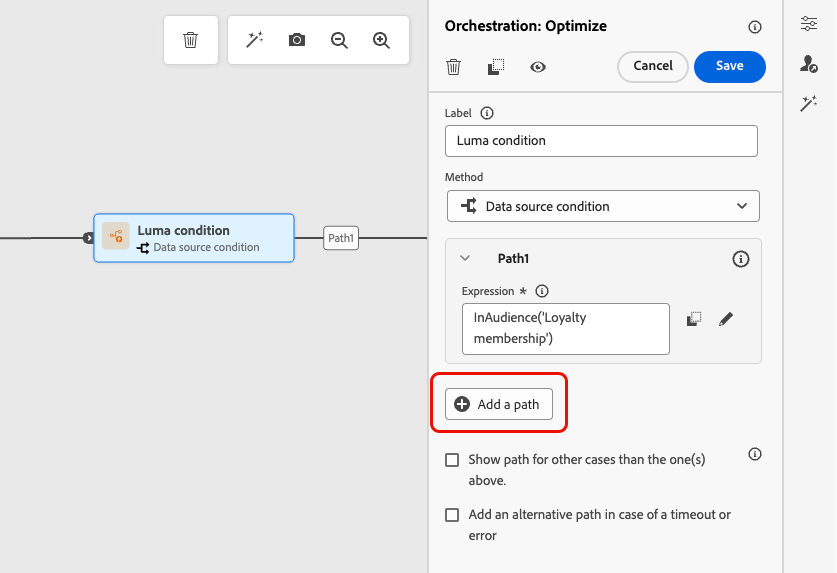
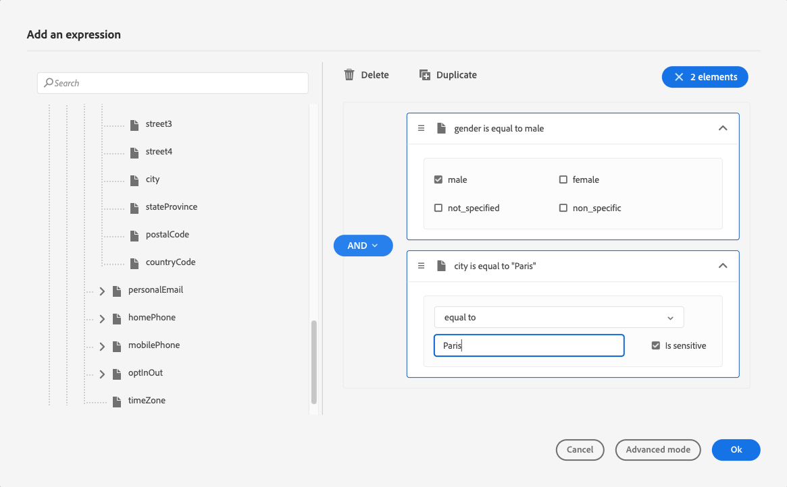
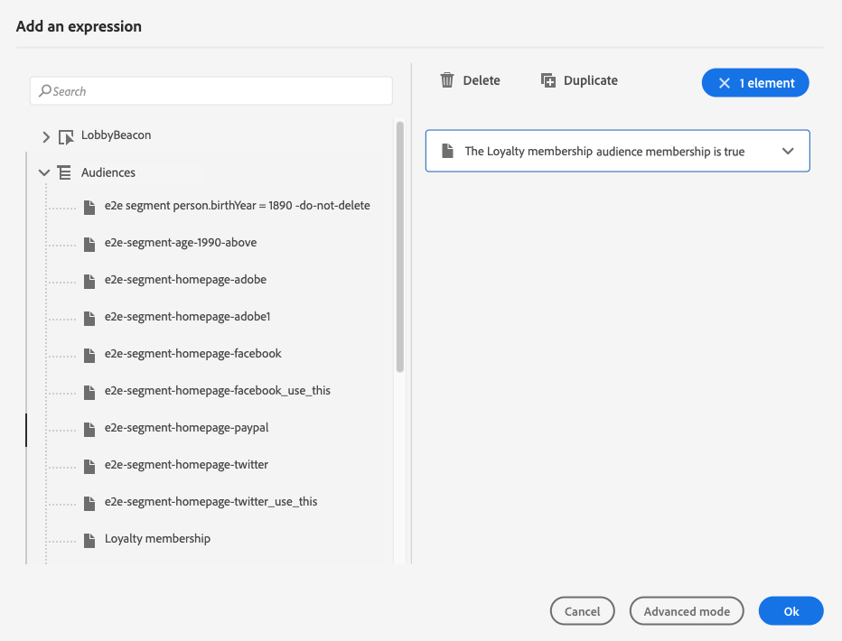

# Condizioni {#conditions}

>[!CONTEXTUALHELP]
>id="ajo_journey_conditions"
>title="Condizioni"
>abstract="Le condizioni consentono di definire il modo in cui i singoli utenti avanzano nel percorso, mediante la creazione di più percorsi in base a criteri specifici. Puoi anche configurare un percorso alternativo per gestire timeout o errori, per un’esperienza sempre fluida."

Con **condizioni** puoi definire il modo in cui i singoli utenti avanzano nel tuo percorso creando più percorsi in base a criteri specifici. Puoi anche configurare un percorso alternativo per gestire timeout o errori, per un’esperienza sempre fluida.

>[!AVAILABILITY]
>
>Queste condizioni sono disponibili tramite l&#39;attività **Ottimizza**, a cui è possibile accedere su richiesta in Disponibilità limitata. Per ottenere l’accesso, contatta il tuo rappresentante Adobe.
>
>Se non hai accesso a questa capacità, puoi comunque utilizzare l&#39;[attività Condizione](condition-activity.md) legacy.

## Aggiungere una condizione {#add-condition-activity}

Per aggiungere una condizione al percorso, attieniti alla procedura seguente.

1. Rilascia l&#39;attività **[!UICONTROL Ottimizza]** nell&#39;area di lavoro del percorso. [Ulteriori informazioni](optimize.md)

1. Aggiungi un’etichetta opzionale per identificare l’attività nei rapporti e nei registri in modalità di test.

1. Selezionare una condizione dall&#39;elenco a discesa **[!UICONTROL Metodo]**.

   {width=80%}

   Sono disponibili i seguenti tipi di condizioni:

   * [Condizione origine dati](#data_source_condition)
   * [Condizione temporale](#time_condition)
   * [Divisione percentuale](#percentage_split)
   * [Condizione data](#date_condition)
   * [Limite del profilo](#profile_cap)
   * È inoltre possibile utilizzare un pubblico in una condizione di percorso. [Ulteriori informazioni](#using-a-segment)

## Gestire i percorsi con condizioni {#condition_paths}

>[!CONTEXTUALHELP]
>id="ajo_journey_expression_simple2"
>title="Editor di espressioni semplici"
>abstract="La modalità editor di espressioni semplici consente di eseguire query semplici basate su una combinazione di campi. Tutti i campi disponibili sono visualizzati a sinistra. Trascina i campi nell’area principale. Per combinare i diversi elementi, puoi unirli per creare diversi gruppi e/o livelli di gruppo. Puoi quindi selezionare un operatore logico per combinare elementi sullo stesso livello."

Quando utilizzi più condizioni in un percorso, puoi definire le etichette per ciascuna di esse in modo da identificarle più facilmente.

Fare clic su **[!UICONTROL Aggiungi un percorso]** se si desidera definire più condizioni. Per ogni condizione, nell’area di lavoro viene aggiunto un nuovo percorso dopo l’attività.

{width=80%}

Si noti che la progettazione dei percorsi ha un impatto funzionale. Quando più percorsi vengono definiti dopo una condizione, verrà eseguito solo il primo percorso idoneo. Ciò significa che puoi variare la priorità dei percorsi posizionandoli uno sopra l’altro o al di sotto di esso.

Prendiamo l’esempio di una condizione del primo percorso &quot;La persona è un VIP&quot; e di una condizione del secondo percorso &quot;La persona è un maschio&quot;. Se una persona che soddisfa entrambe le condizioni (un maschio che è un VIP) supera questo passaggio, il primo percorso verrà scelto anche se questa persona è idonea anche al secondo, perché il primo percorso è &quot;superiore&quot;. Per modificare questa priorità, sposta le attività in un altro ordine verticale.

Puoi creare un altro percorso per i tipi di pubblico non idonei alle condizioni definite selezionando **[!UICONTROL Mostra percorso per casi diversi da quelli sopra]**.

>[!NOTE]
>
>Questa opzione non è disponibile in condizioni di suddivisione. [Ulteriori informazioni](#percentage_split)

La modalità semplice consente di eseguire query semplici basate su una combinazione di campi. Tutti i campi disponibili sono visualizzati a sinistra. Trascina i campi nell’area principale. Per combinare i diversi elementi, puoi unirli per creare diversi gruppi e/o livelli di gruppo. Puoi quindi selezionare un operatore logico per combinare elementi sullo stesso livello:

* **AND** - Intersezione di due criteri. Vengono presi in considerazione solo gli elementi che corrispondono a tutti i criteri.
* **OR** - Unione di due criteri. Vengono considerati gli elementi che corrispondono ad almeno uno dei due criteri.

{width=80%}

Se utilizzi il [Servizio di segmentazione di Adobe Experience Platform](https://experienceleague.adobe.com/docs/experience-platform/segmentation/home.html?lang=it){target="_blank"} per creare i tuoi tipi di pubblico, puoi sfruttarli nelle condizioni del percorso. Consulta [Utilizzo del pubblico in condizioni](../building-journeys/condition-activity.md#using-a-segment).

>[!NOTE]
>
>Non è possibile eseguire query sulle serie temporali (ad esempio un elenco di acquisti, clic sui messaggi passati) con l’editor semplice. A questo scopo, dovrai utilizzare l’editor avanzato. Consulta [questa pagina](expression/expressionadvanced.md).

Quando si verifica un errore in un’azione o in una condizione, il percorso di un singolo utente si interrompe. L&#39;unico modo per far sì che continui è selezionare la casella **[!UICONTROL Aggiungi un percorso alternativo in caso di timeout o errore]**. [Ulteriori informazioni](../building-journeys/using-the-journey-designer.md#paths)

Nell’editor semplice, trovi anche la categoria Proprietà Percorso, sotto le categorie evento e origine dati. Questa categoria contiene campi tecnici relativi al percorso per un determinato profilo. Si tratta delle informazioni che il sistema recupera dai percorsi in tempo reale, ad esempio l’ID percorso o specifici errori rilevati. [Ulteriori informazioni](expression/journey-properties.md)

## Condizione origine dati {#data_source_condition}

Utilizzare una **[!UICONTROL condizione origine dati]** per definire una condizione basata sui campi delle origini dati o degli eventi precedentemente posizionati nel percorso. Questo tipo di condizione viene definito con l’editor di espressioni. [Scopri come utilizzare l&#39;editor espressioni](expression/expressionadvanced.md)

Ad esempio, se esegui il targeting di un pubblico con attributi di arricchimento generati utilizzando un flusso di lavoro di composizione o un caricamento personalizzato (file CSV), puoi sfruttare questi attributi di arricchimento per creare la condizione.

Utilizzando l’editor di espressioni avanzate, puoi impostare condizioni più avanzate per la manipolazione delle raccolte o l’utilizzo di origini dati che richiedono il trasferimento di parametri. [Ulteriori informazioni](../datasource/external-data-sources.md)

{width=80%}

## Condizione data {#date_condition}

Ciò ti consente di definire un flusso diverso in base alla data. Ad esempio, se la persona entra nel passaggio durante il periodo &quot;vendite&quot;, gli invierai un messaggio specifico. Per il resto dell&#39;anno, invierai un altro messaggio.

>[!NOTE]
>
>Il fuso orario non è più specifico di una condizione ed è ora definito a livello di percorso nelle proprietà del percorso. [Ulteriori informazioni](../building-journeys/timezone-management.md)

## Suddivisione percentuale {#percentage_split}

Questa opzione consente di suddividere in modo casuale il pubblico per definire un’azione diversa per ciascun gruppo. Definisci il numero di divisioni e la partizione per ciascun percorso. Il calcolo della suddivisione è statistico in quanto il sistema non è in grado di prevedere quante persone scorreranno in questa attività del percorso. Di conseguenza, la suddivisione presenta un margine di errore molto basso. Questa funzione si basa su un [meccanismo casuale Java](https://docs.oracle.com/javase/7/docs/api/java/util/Random.html){target="_blank"}.

In modalità di test, quando si raggiunge una suddivisione, viene sempre scelto il ramo superiore. Se vuoi che il test scelga un percorso diverso, puoi riorganizzare la posizione dei rami divisi. [Ulteriori informazioni](../building-journeys/testing-the-journey.md)

>[!NOTE]
>
>Non è presente alcun pulsante per aggiungere un percorso nella condizione di suddivisione percentuale. Il numero di percorsi dipende dal numero di divisioni. Nelle condizioni di [PROD143]e non è possibile aggiungere un percorso per altri casi in quanto non può verificarsi. Le persone andranno sempre in uno dei percorsi divisi.

## Condizione temporale {#time_condition}

Utilizza una **[!UICONTROL Condizione temporale]** per eseguire azioni diverse in base all&#39;ora del giorno e/o al giorno della settimana. Ad esempio, puoi decidere di inviare notifiche push durante il giorno e e-mail di notte nei giorni feriali.

>[!NOTE]
>
>* Il fuso orario non è specifico di una condizione ed è definito a livello di percorso nelle proprietà del percorso. [Ulteriori informazioni](../building-journeys/timezone-management.md)
>
>* Per impostazione predefinita, la **[!UICONTROL condizione temporale]** è impostata per ora, da 00:00 a 12:00.

Sono disponibili tre opzioni di filtro dell’ora:

* **Ora** - Consente di impostare una condizione in base all&#39;ora del giorno. Vengono quindi definiti gli orari di inizio e di fine. I singoli utenti immetteranno il percorso solo durante l&#39;intervallo di ore definito.
* **Giorno della settimana** - Consente di impostare una condizione in base al giorno della settimana. Selezionare quindi i giorni in cui si desidera che i singoli utenti immettano il percorso.
* **Giorno della settimana e ora** - Questa opzione combina le prime due opzioni.

## Limite del profilo {#profile_cap}

Utilizza questo tipo di condizione per impostare un numero massimo di profili per un percorso di percorso. Una volta raggiunto tale limite, i profili partecipanti seguono un percorso alternativo. In questo modo i percorsi non supereranno mai il limite definito.

>[!NOTE]
>
>È consigliabile definire un limite di profili di valore elevato. La precisione e la probabilità che una popolazione raggiunga il numero esatto del limite aumenta solo con l’aumento del limite. Per i numeri piccoli (ad esempio un limite di 50), i numeri non sempre corrispondono in quanto il limite potrebbe non essere raggiunto prima che i profili seguano un percorso alternativo.

<!--You can use this condition type to ramp up the volume of your deliveries. See this [use case](ramp-up-deliveries-uc.md).-->

Il limite predefinito è 1.000.

Il contatore si applica solo alla versione del percorso selezionata. Il contatore viene azzerato quando il percorso viene duplicato o viene creata una nuova versione. Dopo un ripristino, i profili in ingresso riprendono il percorso nominale fino al raggiungimento del limite del contatore.

Quando il limite del profilo è definito in un percorso ricorrente, il contatore non viene reimpostato dopo ogni ricorrenza.

Il percorso nominale ha sempre la priorità sul percorso alternativo, anche se si sposta il percorso alternativo al di sopra del percorso nominale nell&#39;area di lavoro del percorso.

Per i percorsi live, le soglie da considerare per garantire il raggiungimento del limite sono le seguenti:

* Per un tappo superiore a 10,000, il numero di profili distinti da iniettare deve essere almeno 1,3 volte il tappo.
* Per un cappuccio inferiore a 10,000, il numero di profili distinti da iniettare deve essere 1000 più il cappuccio.

Il limite del profilo non viene preso in considerazione nella modalità di test.

## Utilizzare i tipi di pubblico nelle condizioni {#using-a-segment}

Questa sezione spiega come utilizzare un pubblico in una condizione di percorso. Per ulteriori informazioni sui tipi di pubblico e su come generarli, consulta [questa sezione](../audience/about-audiences.md).

Per utilizzare un pubblico in una condizione di percorso, effettua le seguenti operazioni:

1. Apri un percorso, rilascia un&#39;attività **[!UICONTROL Ottimizza]** e scegli la **[!UICONTROL condizione origine dati]**.

   

1. Fai clic su **[!UICONTROL Aggiungi un percorso]** per ogni percorso aggiuntivo necessario. Per ogni percorso, fare clic sul campo **[!UICONTROL Espressione]**.

1. Sul lato sinistro, apri il nodo **[!UICONTROL Tipi di pubblico]**. Trascina e rilascia il pubblico da utilizzare per la condizione. Per impostazione predefinita, la condizione sul pubblico è true.

   {width=80%}

   >[!NOTE]
   >
   >Solo i singoli utenti con lo stato di partecipazione al pubblico **Realizzato** verranno considerati membri del pubblico. Per ulteriori informazioni su come valutare un pubblico, consulta la [documentazione del servizio di segmentazione](https://experienceleague.adobe.com/docs/experience-platform/segmentation/tutorials/evaluate-a-segment.html?lang=it#interpret-segment-results){target="_blank"}.
