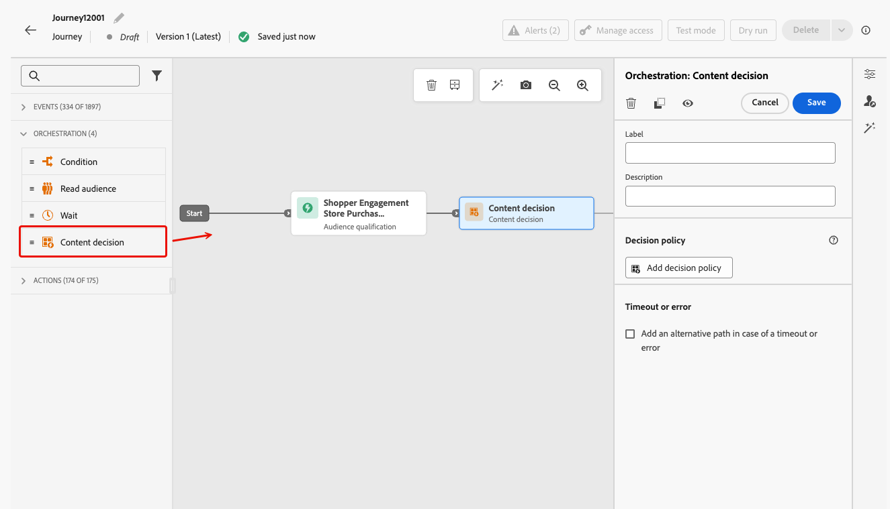
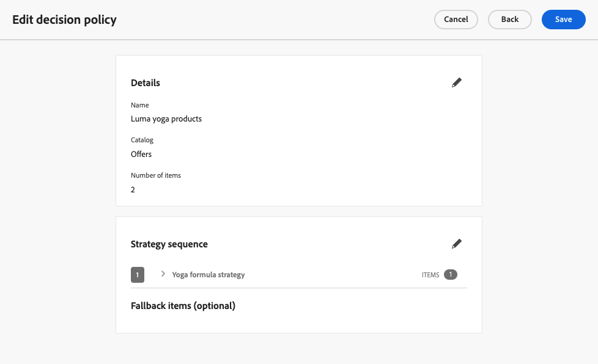
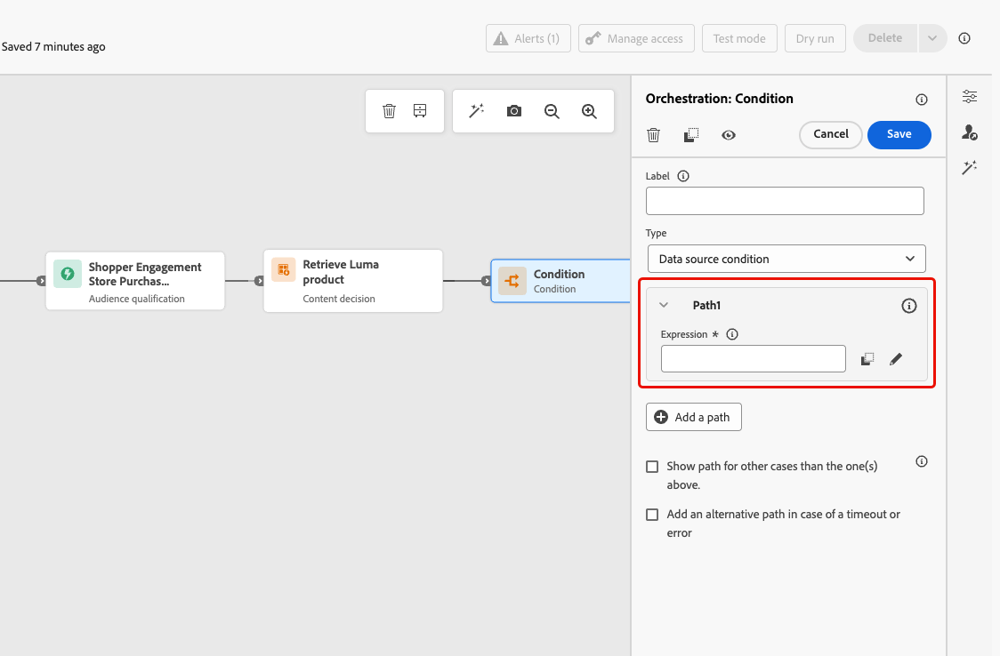
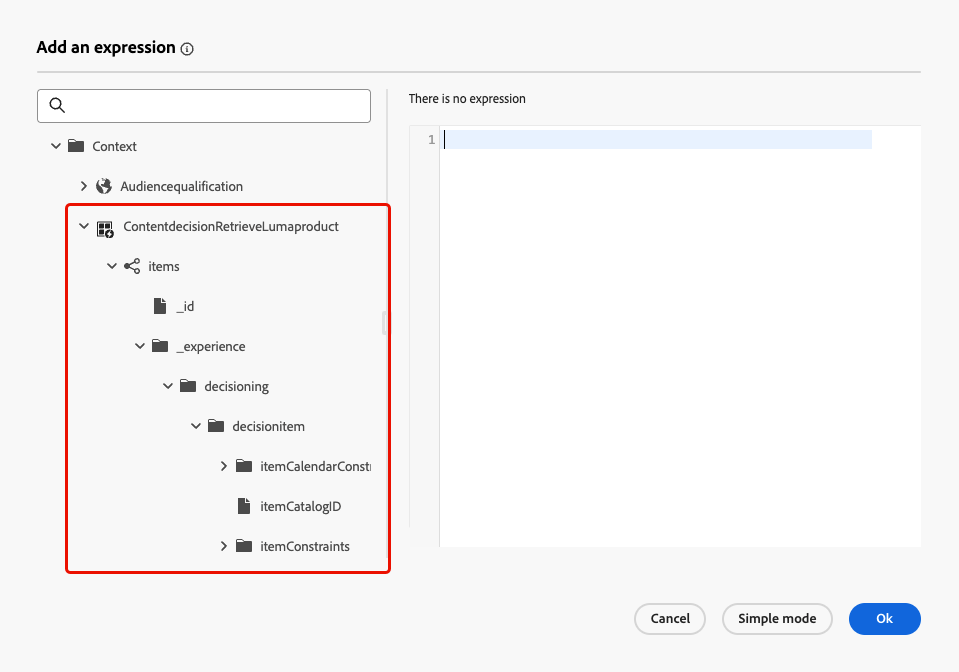
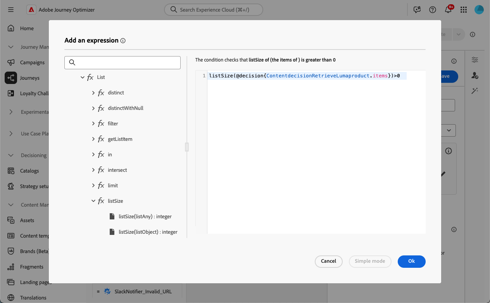
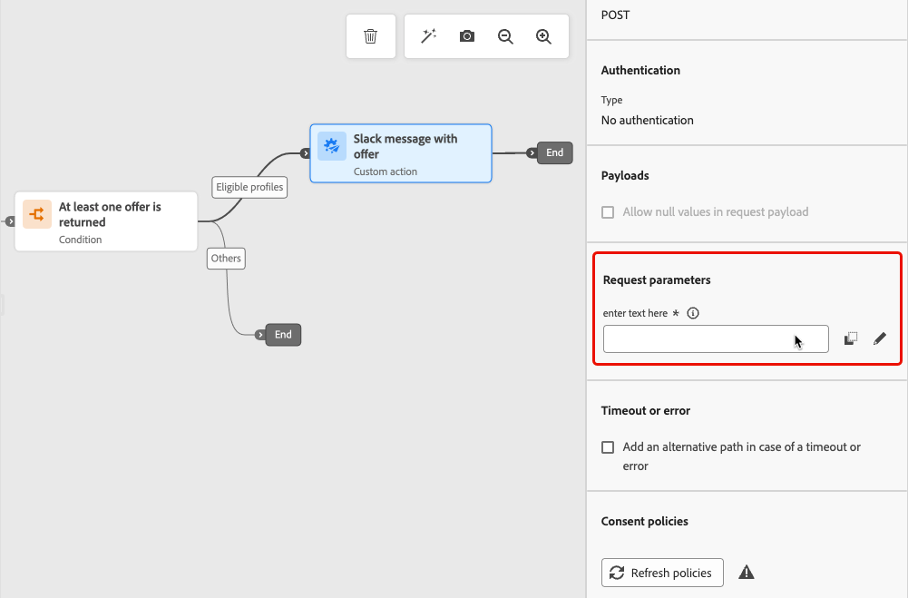
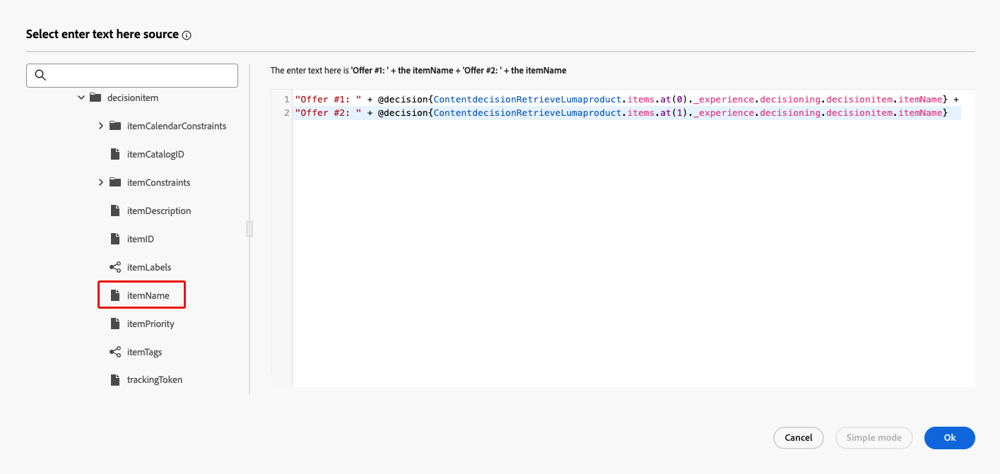
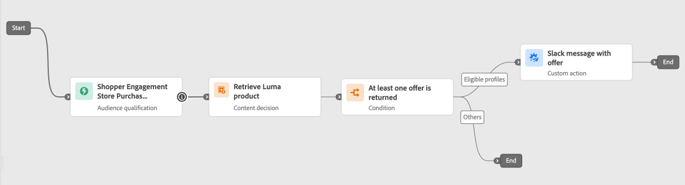

# Attività di decisione sui contenuti {#content-decision}

>[!BEGINSHADEBOX]

**In questa pagina:** scopri come utilizzare l&#39;attività di decisione sui contenuti per includere offerte personalizzate nei tuoi percorsi e distribuirle ai profili idonei.

>[!ENDSHADEBOX]

[!DNL Journey Optimizer] consente di includere le offerte nei percorsi tramite l&#39;attività **Content decision** dedicata nell&#39;area di lavoro del percorso. Puoi quindi aggiungere altre attività (come [azioni personalizzate](../action/about-custom-action-configuration.md)) ai tuoi percorsi per indirizzare i tuoi tipi di pubblico con queste offerte personalizzate.

>[!NOTE]
>
>L’output di un’attività di decisione sui contenuti non può essere utilizzato nelle attività dei canali nativi.

Per sfruttare questa funzionalità, crea un percorso in cui aggiungi un&#39;[attività di decisione sui contenuti](#add-content-decision-activity) per definire le offerte da presentare ai profili idonei.

Puoi quindi utilizzare l’output dell’attività di decisione sui contenuti in:

* un&#39;attività [Ottimizza con una condizione](#add-condition-activity), per spostare i profili in percorsi specifici in base alle offerte recuperate;

* una [azione personalizzata](#add-custom-action), in cui puoi inviare tali offerte a sistemi esterni.

## Configurare un’attività di decisione sui contenuti {#add-content-decision-activity}

Utilizzando l&#39;attività di decisione del contenuto, puoi definire un criterio di decisione che ti consenta di scegliere gli elementi migliori da [!DNL Journey Optimizer] Decisioning e distribuirli al pubblico giusto.

<!--Their goal is to select the best offers for each profile, while the campaign/journey authoring allows you to indicate how the selected decision items should be presented, including which item attributes to be included in the message.-->

Per configurare l&#39;attività **[!UICONTROL Decisione contenuto]**, eseguire la procedura seguente.

1. Espandi la categoria **[!UICONTROL Orchestrazione]** e rilascia un&#39;attività **[!UICONTROL Decisione contenuto]** nell&#39;area di lavoro.

   {width=100%}

1. Facoltativamente, aggiungi un’etichetta e una descrizione all’attività.

1. Fare clic su **[!UICONTROL Aggiungi criterio di decisione]**. [Ulteriori informazioni sui criteri di decisione](../experience-decisioning/create-decision.md)

   >[!NOTE]
   >
   >Le autorizzazioni di decisione sono necessarie per creare un criterio di decisione. [Ulteriori informazioni](../experience-decisioning/gs-experience-decisioning.md#steps)

1. Selezionare il numero di elementi che si desidera restituire. Ad esempio, se selezioni 2, verranno presentate le 2 offerte idonee migliori. Fai clic su **[!UICONTROL Avanti]**.

1. Nella sezione **[!UICONTROL Sequenza strategica]** selezionare gli elementi di decisione e/o le strategie di selezione da presentare con il criterio di decisione. [Ulteriori informazioni](../experience-decisioning/create-decision.md#create-decision)

1. Disporre l&#39;ordine di valutazione in base alle esigenze.

   Quando si aggiungono più elementi decisionali e/o strategie, questi vengono valutati in ordine sequenziale, indicato da numeri a sinistra di ciascun oggetto o gruppo di oggetti. Per modificare la sequenza predefinita, è possibile trascinare e rilasciare gli oggetti e/o i gruppi per riordinarli in base alle esigenze. [Ulteriori informazioni](../experience-decisioning/create-decision.md#create-decision)

1. (facoltativo) aggiungi un’offerta di fallback. [Ulteriori informazioni](../experience-decisioning/create-decision.md#create-decision)

1. Rivedi e salva il criterio decisionale.

   {width=70%}<!--reshoot or change screen-->

Ora puoi sfruttare l’output di questa attività di decisione sui contenuti nel tuo percorso.

## Guardrail e limitazioni {#guardrails}

**Criteri di consenso**

* L’entrata in vigore degli aggiornamenti ai criteri di consenso richiede fino a 48 ore. Se un criterio di decisione fa riferimento a un attributo associato a un criterio di consenso aggiornato di recente, le modifiche non verranno applicate immediatamente.

* Analogamente, se a un criterio di decisione vengono aggiunti nuovi attributi di profilo soggetti a un criterio di consenso, questi saranno utilizzabili, ma il criterio di consenso associato a essi non verrà applicato fino a quando il ritardo non sarà passato.

* I criteri di consenso sono disponibili solo per le organizzazioni con il componente aggiuntivo Adobe Healthcare Shield o Privacy and Security Shield.

## Utilizzare l’output dell’attività di decisione sui contenuti {#use-content-decision-output}

L’output di una decisione sui contenuti può essere utilizzato in più attività di percorso. È possibile, ad esempio, utilizzare un&#39;attività [Ottimizza con una condizione](#add-condition-activity) per spostare i profili in rami specifici del percorso, in base al numero di offerte recuperate.

Puoi anche aggiungere una [azione personalizzata](#add-custom-action) al tuo percorso per condividere le offerte dall&#39;attività di decisione sui contenuti a un sistema esterno.

### In un’attività di ottimizzazione (metodo di condizione) {#add-condition-activity}

Per sfruttare l&#39;output di un&#39;attività di decisione sui contenuti, aggiungere un&#39;attività **[!UICONTROL Ottimizza]**, scegliere il metodo **[!UICONTROL Condizione]** e definire le espressioni per spostare i profili in percorsi specifici utilizzando i dati di tali offerte. Segui i passaggi seguenti. Per ulteriori tipi di condizioni e opzioni, vedere [Condizioni](conditions.md).

1. Dalla categoria **[!UICONTROL Orchestrazione]**, rilascia un&#39;attività **[!UICONTROL Ottimizza]** nell&#39;area di lavoro. [Ulteriori informazioni](optimize.md)

1. (facoltativo) Rinomina **[!UICONTROL Percorso1]**, che corrisponde alla prima espressione definita, in un&#39;etichetta più rilevante.

1. Per questo primo percorso, fare clic all&#39;interno del campo **[!UICONTROL Espressione]** oppure utilizzare l&#39;icona Modifica per aggiungere un&#39;espressione.

   {width=80%}

1. Nella finestra popup visualizzata, passa alla **[!UICONTROL modalità avanzata]** per utilizzare l&#39;[editor di espressioni avanzate](expression/expressionadvanced.md).

   >[!CAUTION]
   >
   >L&#39;output di un nodo di decisione del contenuto è disponibile solo nella **[!UICONTROL modalità avanzata]**.

1. Espandi il nodo **[!UICONTROL Contesto]** e passa al criterio di decisione per visualizzare tutti gli attributi disponibili nello schema del catalogo [offerte](../experience-decisioning/catalogs.md#access-catalog-schema).

   

   >[!NOTE]
   >
   >Qualsiasi etichetta limitata definita su un attributo può causare una violazione dei criteri per DULE o consenso. Questo vale per gli eventi di esperienza di percorso utilizzati in una regola di decisione e per lo schema [offerte](../experience-decisioning/catalogs.md#access-catalog-schema). Ulteriori informazioni sui criteri di governance dei dati in [questa sezione](../action/action-privacy.md).

1. Per verificare se è stata restituita un&#39;offerta per i profili che entrano nel percorso, utilizzare la funzione [listSize](functions/list-functions.md#listSize) con la seguente sintassi: `listSize(@decision{ContentdecisionName.items})>0`

   >[!NOTE]
   >
   >In questo esempio, `Name` è l&#39;etichetta della decisione sul contenuto aggiunta al percorso.

   

1. Fare clic su **[!UICONTROL Ok]**.

1. Aggiungi altri percorsi per definire altre condizioni in base alle esigenze.

   Puoi anche creare un altro percorso per i profili che non soddisfano la prima condizione selezionando **[!UICONTROL Mostra percorso per casi diversi da quelli sopra]**. <!--These profiles will then exit the journey if no other activity is added in that path.-->

1. Salva l’attività della condizione.

### In un’azione personalizzata {#add-custom-action}

Per sfruttare l’output di un’attività di decisione sui contenuti, puoi aggiungere al percorso un’azione personalizzata in cui condividere le offerte definite con un sistema esterno. Segui i passaggi seguenti.

1. Aggiungi un&#39;azione personalizzata al percorso. [Ulteriori informazioni](../action/about-custom-action-configuration.md)

1. Immetti un’etichetta per l’azione.

1. Nella sezione **[!UICONTROL Parametri richiesta]**, seleziona il parametro che desideri mappare agli attributi delle offerte recuperate.

   Fai clic all’interno del campo di testo modificabile e seleziona qualsiasi parametro che desideri mappare agli attributi delle offerte recuperate.

   

1. Passa alla **[!UICONTROL modalità avanzata]** nella finestra popup visualizzata. Nell&#39;editor di espressioni avanzate [](expression/expressionadvanced.md), apri il nodo **[!UICONTROL Contesto]** per visualizzare tutti gli elementi dei criteri di decisione.

   >[!CAUTION]
   >
   >L&#39;output di un nodo di decisione del contenuto è disponibile solo nella **[!UICONTROL modalità avanzata]**.

1. Sfoglia lo schema del catalogo [offerte](../experience-decisioning/catalogs.md#access-catalog-schema) utilizzando l&#39;array `items`. Ad esempio, utilizza `itemName` della prima offerta recuperata e `itemName` della seconda offerta recuperata.

   

1. Fai clic su **[!UICONTROL Ok]** per salvare l&#39;espressione.

1. **[!UICONTROL Salva]** la configurazione azione personalizzata.

### Esempio completo {#use-case}

Di seguito è riportato l’esempio completo di un percorso che utilizza un’attività di decisione sui contenuti combinata a un’attività condizione e a un’azione personalizzata, come descritto in precedenza.



<!--When all activities are properly configured and saved, [publish](publish-journey.md) your journey.-->

Una volta attivato il percorso [](publish-journey.md):

<!--
* Profiles who enter the journey and are eligible for at least one offer are targeted by the custom action.

* If no offer is returned for a profile, they are excluded from the custom action.
-->

1. Ogni volta che un profilo si qualifica per quel pubblico, entra nel percorso.

1. Tramite l&#39;attività di decisione del contenuto, [!DNL Journey Optimizer] recupera le offerte rilevanti per ogni profilo.

1. Solo i profili per i quali viene recuperata almeno un’offerta continuano il percorso (tramite il percorso &quot;Profili idonei&quot;).

1. Se la condizione viene soddisfatta, le offerte corrispondenti vengono inviate a un sistema esterno tramite l’azione personalizzata.

## Decisioning dei dati negli eventi dei passaggi {#decisioning-step-events}

Quando un’attività di decisione sui contenuti viene eseguita in un percorso, i dati decisionali sono resi disponibili negli eventi delle fasi del percorso. Questi dati forniscono informazioni dettagliate sugli elementi recuperati e su come sono state prese le decisioni.

Per ogni attività di decisione sui contenuti, l&#39;evento del passaggio include i dati decisionali al livello principale (ad esempio **exdRequestID** e **propositionEventType**) e un array di **propositions**. Ogni proposta ha un **id**, **scopeDetails** (inclusi il provider di decisioni, l&#39;ID di correlazione e il criterio di decisione) e un array **items**. Ogni elemento contiene:

* **id**: identificatore univoco dell&#39;elemento
* **name**: nome dell&#39;elemento
* **score**: punteggio assegnato all&#39;elemento
* **itemSelection**: dati relativi al modo in cui è stata presa la decisione e recuperata l&#39;elemento, inclusi:
   * **selectionDetail**: informazioni sulla strategia di selezione utilizzata
   * **rankingDetail**: informazioni sul processo di classificazione (strategia, algoritmo, passaggio, tipo di traffico)

**Esempio di dati decisionali in un evento del passaggio:**

```json
"decisioning": {
  "exdRequestID": "8079d2bb-a8b2-4ecf-b9e7-32923dd6ad4e",
  "propositions": [
    {
      "id": "f475cb21-0842-44da-b0eb-70766ba53464",
      "scopeDetails": {
        "decisionProvider": "EXD",
        "correlationID": "6940d1c46208f3c00dae2ab94f3cd31c601461b47bf6d29ff8af0d0806a9c204",
        "decisionPolicy": {
          "id": "b913f724-3747-447b-a51e-8a2f9178f0db"
        }
      },
      "items": [
        {
          "id": "dps:14c7468e7f6271ff8023748a1146d11f05f77b7fc1368081:1bebbf0b7e0f1374",
          "name": "My item name",
          "score": 0.93,
          "itemSelection": {
            "selectionDetail": {
              "strategyID": "dps:selection-strategy:1bebbfc9245cb35e",
              "strategyName": "My selection strategy",
              "selectionType": "selectionStrategy",
              "version": "latest"
            },
            "rankingDetail": {
              "strategyID": "4FyRZTmpjrbzuL7rX7gvmu",
              "algorithmID": "RANDOM",
              "step": "aiModel",
              "trafficType": "random"
            }
          }
        }
      ]
    }
  ],
  "propositionEventType": {
    "decision": 1
  }
}
```

+++ Guida di riferimento della Knowledge Base di AI

Questa sezione contiene informazioni strutturate che supportano l&#39;interpretazione, il recupero e la risposta alle domande relative a questo argomento.

Per una comprensione completa, queste informazioni devono essere unite alla documentazione su questa pagina. Nessuna delle due origini è progettata per essere indipendente; la pagina descrive la funzione, mentre questa sezione fornisce un contesto aggiuntivo che aiuta a non ambiguare la terminologia, le finalità, l’applicabilità e i vincoli.

* **TL;DR:** In questa pagina viene illustrato come configurare e utilizzare l&#39;attività Content Decision nei percorsi Journey Optimizer per recuperare le offerte personalizzate tramite un criterio decisionale e inoltrarle utilizzando condizioni e azioni personalizzate.

**Intenti:**
* Aggiungere un’attività Content Decision a un percorso e configurare un criterio di decisione
* Selezionare e sequenziare gli elementi e le strategie di selezione all’interno di un criterio di decisione
* Utilizzare l’output delle decisioni sui contenuti in una condizione di attività Ottimizza per diramare i profili in base alle offerte recuperate
* Inoltrare le offerte recuperate a un sistema esterno utilizzando un’azione personalizzata
* Ispezionare i dati decisionali negli eventi delle fasi del percorso per scopi di controllo e risoluzione dei problemi

**Glossario:**
* **Attività decisione contenuto**: attività di orchestrazione del percorso che valuta un criterio di decisione e recupera le migliori offerte idonee per ogni profilo *(specifico per prodotto)*
* **Criterio di decisione**: configurazione che specifica quali elementi di decisione e strategie di selezione valutare e quanti elementi restituire *(specifico per prodotto)*
* **Strategia di selezione**: metodo di valutazione classificato utilizzato all&#39;interno di un criterio di decisione per determinare quali offerte sono idonee e come sono valutate *(specifiche per prodotto)*
* **Proposta**: l&#39;unità di output di un&#39;esecuzione dei criteri di decisione, contenente gli elementi selezionati e l&#39;ambito associato e i metadati di classificazione *(specifico per prodotto)*
* **funzione listSize**: funzione dell&#39;editor di espressioni utilizzata per contare il numero di elementi restituiti da una decisione di contenuto, ad esempio `listSize(@decision{Name.items})>0` *(specifico per prodotto)*
* **Schema del catalogo offerte**: lo schema che definisce gli attributi disponibili sugli elementi decisionali; accessibile tramite il nodo Contesto in modalità editor di espressioni avanzate *(specifico per prodotto)*

**Guardrail:**
* L’output di un’attività Content Decision non può essere utilizzato nelle attività del canale nativo (e-mail, push, SMS, ecc.)
* L’output delle decisioni sui contenuti è accessibile solo in modalità avanzata dell’editor di espressioni; non è disponibile in modalità semplice
* Le autorizzazioni per le decisioni sono necessarie per creare un criterio di decisione
* Gli aggiornamenti dei criteri di consenso richiedono fino a 48 ore per essere effettivi per gli attributi a cui si fa riferimento in un criterio decisionale
* I criteri di consenso sono disponibili solo per le organizzazioni con il componente aggiuntivo Adobe Healthcare Shield o Privacy and Security Shield
* Le etichette di utilizzo dei dati (DULE) limitate sugli attributi dello schema dell’offerta possono causare violazioni dei criteri di governance

**Terminologia:**
* Nome canonico: attività di decisione del contenuto — Acronimo: none — varianti: nodo di decisione del contenuto, attività di decisione
* Sinonimi: &quot;criterio di decisione&quot; = &quot;criterio di selezione dell’offerta&quot; ; &quot;proposta&quot; = &quot;output di decisione&quot;
* Non confondere: &quot;Attività di decisione sul contenuto&quot; ≠ &quot;Azione sul canale nativo&quot; (la decisione sul contenuto recupera le offerte ma non le consegna direttamente; è necessaria un’azione o una condizione personalizzata per agire sull’output)

**Domande frequenti:**
* **D: posso utilizzare le offerte restituite da un&#39;attività Content Decision direttamente in un messaggio e-mail?** — No, l’output di un’attività di decisione sui contenuti non può essere utilizzato nelle attività dei canali nativi; è necessario passare le offerte a un’azione personalizzata per inviarle a un sistema esterno.
* **D: come posso verificare se sono state restituite offerte per un profilo?** — Utilizzare la funzione listSize nell&#39;editor di espressioni avanzate: `listSize(@decision{ContentdecisionName.items})>0`.
* **Q: dove posso accedere all&#39;output delle decisioni sui contenuti nell&#39;editor espressioni?** — Passa alla modalità avanzata, apri il nodo Contesto e passa al criterio di decisione per visualizzare tutti gli attributi dello schema del catalogo delle offerte disponibili.
* **D: quanto tempo ci vuole affinché un aggiornamento dei criteri di consenso venga applicato a un criterio di decisione?** — Fino a 48 ore dopo l’aggiornamento della policy di consenso.
* **D: quali dati decisionali sono disponibili negli eventi dei passaggi del percorso?** — Ogni evento di passaggio include exdRequestID, propositionEventType e un array di proposte, ciascuno contenente un ID, scopeDetails (provider di decisioni, correlationID, criteri di decisioni) e un array di elementi con dettagli di ID, nome, punteggio e itemSelection.

+++
