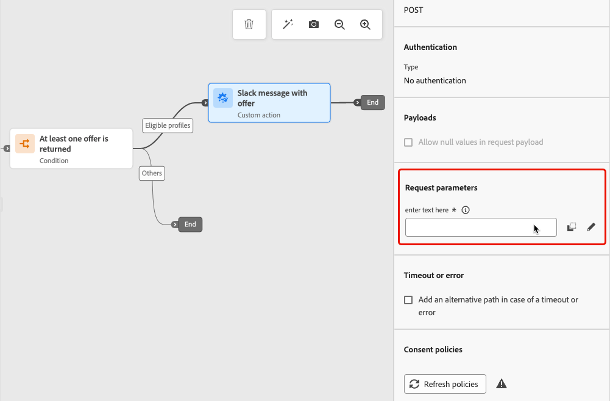

# Attività di decisione sui contenuti {#content-decision}

>[!AVAILABILITY]
>
>Questa funzionalità è disponibile solo per un set di organizzazioni (disponibilità limitata) e verrà introdotta a livello globale in una versione futura.

[!DNL Journey Optimizer] consente di includere le offerte nei percorsi tramite l&#39;attività **content decision** dedicata nell&#39;area di lavoro del percorso. Puoi quindi aggiungere altre attività (come [azioni personalizzate](../action/about-custom-action-configuration.md)) ai tuoi percorsi per indirizzare i tuoi tipi di pubblico con queste offerte personalizzate.

>[!NOTE]
>
>L’output di un’attività di decisione sui contenuti non può essere utilizzato nelle attività dei canali nativi.

Per sfruttare questa funzionalità, crea un percorso in cui aggiungi un&#39;[attività di decisione sui contenuti](#add-content-decision-activity) per definire le offerte da presentare ai profili idonei.

Puoi quindi utilizzare l’output dell’attività di decisione sui contenuti in:

* un&#39;attività [condizione](#add-condition-activity), per spostare i profili in percorsi specifici in base alle offerte recuperate;

* una [azione personalizzata](#add-custom-action), in cui puoi inviare tali offerte a sistemi esterni.

## Configurare un’attività di decisione sui contenuti {#add-content-decision-activity}

Utilizzando l&#39;attività di decisione del contenuto, puoi definire un criterio di decisione che ti consenta di scegliere gli elementi migliori da [!DNL Journey Optimizer] Decisioning e distribuirli al pubblico giusto.

<!--Their goal is to select the best offers for each profile, while the campaign/journey authoring allows you to indicate how the selected decision items should be presented, including which item attributes to be included in the message.-->

Per configurare l&#39;attività **[!UICONTROL Decisione contenuto]**, eseguire la procedura seguente.

1. Espandi la categoria **[!UICONTROL Orchestrazione]** e rilascia un&#39;attività **[!UICONTROL Decisione contenuto]** nell&#39;area di lavoro.

   {width=100%}

1. Facoltativamente, aggiungi un’etichetta e una descrizione all’attività.

1. Fare clic su **[!UICONTROL Aggiungi criterio di decisione]**. [Ulteriori informazioni sui criteri di decisione](../experience-decisioning/create-decision.md)

   >[!NOTE]
   >
   >Le autorizzazioni di decisione sono necessarie per creare un criterio di decisione. [Ulteriori informazioni](../experience-decisioning/gs-experience-decisioning.md#steps)

1. Selezionare il numero di elementi che si desidera restituire. Ad esempio, se selezioni 2, verranno presentate le 2 offerte idonee migliori. Fai clic su **[!UICONTROL Avanti]**.

1. Nella sezione **[!UICONTROL Sequenza strategica]** selezionare gli elementi di decisione e/o le strategie di selezione da presentare con il criterio di decisione. [Ulteriori informazioni](../experience-decisioning/create-decision.md#select)

1. Disporre l&#39;ordine di valutazione in base alle esigenze.

   Quando si aggiungono più elementi decisionali e/o strategie, questi vengono valutati in ordine sequenziale, indicato da numeri a sinistra di ciascun oggetto o gruppo di oggetti. Per modificare la sequenza predefinita, è possibile trascinare e rilasciare gli oggetti e/o i gruppi per riordinarli in base alle esigenze. [Ulteriori informazioni](../experience-decisioning/create-decision.md#evaluation-order)

1. (facoltativo) aggiungi un’offerta di fallback. [Ulteriori informazioni](../experience-decisioning/create-decision.md#fallback)

1. Rivedi e salva il criterio decisionale.

   {width=70%}<!--reshoot or change screen-->

Ora puoi sfruttare l’output di questa attività di decisione sui contenuti nel tuo percorso.

## Guardrail e limitazioni {#guardrails}

**Criteri di consenso**

L’entrata in vigore degli aggiornamenti ai criteri di consenso richiede fino a 48 ore. Se un criterio di decisione fa riferimento a un attributo associato a un criterio di consenso aggiornato di recente, le modifiche non verranno applicate immediatamente.

Analogamente, se a un criterio di decisione vengono aggiunti nuovi attributi di profilo soggetti a un criterio di consenso, questi saranno utilizzabili, ma il criterio di consenso associato a essi non verrà applicato fino a quando il ritardo non sarà passato.

I criteri di consenso sono disponibili solo per le organizzazioni con il componente aggiuntivo Adobe Healthcare Shield o Privacy and Security Shield.

## Utilizzare l’output dell’attività di decisione sui contenuti {#use-content-decision-output}

L’output di una decisione sui contenuti può essere utilizzato in più attività di percorso. Ad esempio, puoi utilizzare un&#39;attività [condizione](#add-condition-activity) per spostare i profili in rami specifici del percorso, in base al numero di offerte recuperate per loro.

Puoi anche aggiungere una [azione personalizzata](#add-custom-action) al tuo percorso per condividere le offerte dall&#39;attività di decisione sui contenuti a un sistema esterno.

### In un’attività di condizione {#add-condition-activity}

Per sfruttare l’output di un’attività di decisione sui contenuti, puoi aggiungere al percorso una condizione in cui definire espressioni per spostare i profili in percorsi specifici, utilizzando i dati di tali offerte. Segui i passaggi seguenti.

1. Dalla categoria **[!UICONTROL Orchestrazione]**, rilascia un&#39;attività **[!UICONTROL Condizione]** nell&#39;area di lavoro. [Ulteriori informazioni](condition-activity.md#add-condition-activity)

1. (facoltativo) Rinomina **[!UICONTROL Percorso1]**, che corrisponde alla prima espressione definita, in un&#39;etichetta più rilevante.

1. Per questo primo percorso, fare clic all&#39;interno del campo **[!UICONTROL Espressione]** oppure utilizzare l&#39;icona Modifica per aggiungere un&#39;espressione.

   {width=80%}

1. Nella finestra popup visualizzata, passa alla **[!UICONTROL modalità avanzata]** per utilizzare l&#39;[editor di espressioni avanzate](expression/expressionadvanced.md).

   >[!CAUTION]
   >
   >L&#39;output di un nodo di decisione del contenuto è disponibile solo nella **[!UICONTROL modalità avanzata]**.

1. Espandi il nodo **[!UICONTROL Contesto]** e passa al criterio di decisione per visualizzare tutti gli attributi disponibili nello schema del catalogo [offerte](../experience-decisioning/catalogs.md#access-catalog-schema).

   

   >[!NOTE]
   >
   >Qualsiasi etichetta limitata definita su un attributo, in un evento esperienza di percorso utilizzato in una regola di decisione (come dati contestuali) o nello schema [offerte](../experience-decisioning/catalogs.md#access-catalog-schema), genera una violazione dei criteri per DULE o consenso. Ulteriori informazioni sui criteri di governance dei dati in [questa sezione](../action/action-privacy.md)

1. Per verificare se è stata restituita un&#39;offerta per i profili che entrano nel percorso, utilizzare la funzione [listSize](functions/list-functions.md#listSize) con la seguente sintassi: `listSize(@decision{ContentdecisionName.items})>0`

   >[!NOTE]
   >
   >In questo esempio, `Name` è l&#39;etichetta della decisione sul contenuto aggiunta al percorso.

   

1. Fare clic su **[!UICONTROL Ok]**.

1. Aggiungi altri percorsi per definire altre condizioni in base alle esigenze.

   Puoi anche creare un altro percorso per i profili che non soddisfano la prima condizione selezionando **[!UICONTROL Mostra percorso per casi diversi da quelli sopra]**. <!--These profiles will then exit the journey if no other activity is added in that path.-->

1. Salva l’attività della condizione.

### In un’azione personalizzata {#add-custom-action}

Per sfruttare l’output di un’attività di decisione sui contenuti, puoi aggiungere al percorso un’azione personalizzata in cui condividere le offerte definite con un sistema esterno. Segui i passaggi seguenti.

1. Aggiungi un&#39;azione personalizzata al percorso. [Ulteriori informazioni](../action/about-custom-action-configuration.md)

1. Immetti un’etichetta per l’azione.

1. Nella sezione **[!UICONTROL Parametri richiesta]**, seleziona il parametro che desideri mappare agli attributi delle offerte recuperate.

   Fai clic all’interno del campo di testo modificabile e seleziona qualsiasi parametro che desideri mappare agli attributi delle offerte recuperate.

   

1. Passa alla **[!UICONTROL modalità avanzata]** nella finestra popup visualizzata. Nell&#39;editor di espressioni avanzate [&#128279;](expression/expressionadvanced.md), apri il nodo **[!UICONTROL Contesto]** per visualizzare tutti gli elementi dei criteri di decisione.

   >[!CAUTION]
   >
   >L&#39;output di un nodo di decisione del contenuto è disponibile solo nella **[!UICONTROL modalità avanzata]**.

1. Sfoglia lo schema del catalogo [offerte](../experience-decisioning/catalogs.md#access-catalog-schema) utilizzando l&#39;array `items`. Ad esempio, utilizza `itemName` della prima offerta recuperata e `itemName` della seconda offerta recuperata.

   

1. Fai clic su **[!UICONTROL Ok]** per salvare l&#39;espressione.

1. **[!UICONTROL Salva]** la configurazione azione personalizzata.

### Esempio completo {#use-case}

Di seguito è riportato l’esempio completo di un percorso che utilizza un’attività di decisione sui contenuti combinata a un’attività condizione e a un’azione personalizzata, come descritto in precedenza.

<!--When all activities are properly configured and saved, [publish](publish-journey.md) your journey.-->

Una volta attivato il percorso [&#128279;](publish-journey.md):

<!--* Profiles who enter the journey and are eligible for at least one offer are targeted by the custom action.

* If no offer is returned for a profile, they are excluded from the custom action.-->

1. Ogni volta che un profilo si qualifica per quel pubblico, entra nel percorso.

1. Tramite l&#39;attività di decisione del contenuto, [!DNL Journey Optimizer] recupera le offerte rilevanti per ogni profilo.

1. Solo i profili per i quali viene recuperata almeno un’offerta continuano il percorso (tramite il percorso &quot;Profili idonei&quot;).

1. Se la condizione viene soddisfatta, le offerte corrispondenti vengono inviate a un sistema esterno tramite l’azione personalizzata.
